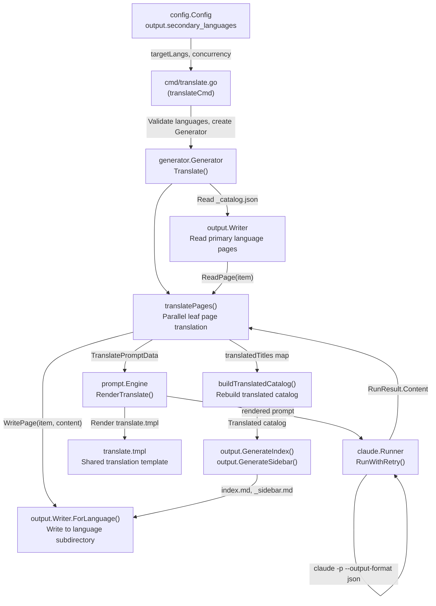
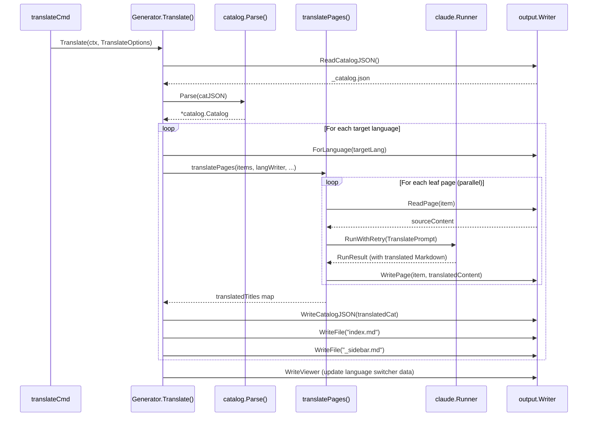

# Translation Workflow

The `selfmd translate` command takes the primary language output files as the source of truth, automatically translates them into one or more secondary languages via the Claude CLI, and writes the results into separate language subdirectories.

## Overview

The translation workflow is the core mechanism for selfmd's multilingual support. After configuring `output.secondary_languages` in `selfmd.yaml`, running `selfmd translate` will translate all generated primary language documents into every configured secondary language.

**Key Concepts:**

- **Primary Language**: Configured via `output.language`, this is the original language of all content pages and the **source language** for translation.
- **Secondary Languages**: The list of languages configured in `output.secondary_languages`. Each language corresponds to a separate output subdirectory.
- **Shared Translation Template**: Translation uses `translate.tmpl`, a shared template independent of language — not a language-specific template folder.
- **Incremental Skipping**: By default, existing translated pages are skipped. Use `--force` to force re-translation.

The translation workflow is decoupled from the primary document generation workflow — `selfmd generate` must complete before `selfmd translate` can be run.

## Architecture



## Configuration

### Relevant Fields in selfmd.yaml

```yaml
output:
  language: "zh-TW"               # Primary language (translation source)
  secondary_languages:             # Target languages for translation
    - "en-US"
    - "ja-JP"
```

> Source: `internal/config/config.go#L31-L36`

### Supported Language Codes

`config.KnownLanguages` defines the mapping of known language codes to their native names:

```go
var KnownLanguages = map[string]string{
    "zh-TW": "繁體中文",
    "zh-CN": "简体中文",
    "en-US": "English",
    "ja-JP": "日本語",
    "ko-KR": "한국어",
    "fr-FR": "Français",
    "de-DE": "Deutsch",
    "es-ES": "Español",
    "pt-BR": "Português",
    "th-TH": "ไทย",
    "vi-VN": "Tiếng Việt",
}
```

> Source: `internal/config/config.go#L39-L51`

Language codes not in the table above can still be used — `GetLangNativeName()` returns the language code itself when no matching native name is found.

### Prompt Template Language Fallback

The translation prompt uses the **shared template** `translate.tmpl`, which is unaffected by the `output.language` template language fallback logic. This template is written in English and explicitly specifies both the source and target languages:

```go
// SupportedTemplateLangs lists language codes that have built-in prompt template folders.
var SupportedTemplateLangs = []string{"zh-TW", "en-US"}
```

> Source: `internal/config/config.go#L54`

## CLI Command

```
selfmd translate [flags]
```

| Flag | Description |
|------|-------------|
| `--lang` | Translate only the specified language (can be used multiple times; default: all secondary languages) |
| `--force` | Force re-translation of existing files |
| `--concurrency` | Concurrency level (overrides the `claude.max_concurrent` setting) |

`cmd/translate.go` validates that specified languages exist in the `secondary_languages` list before starting translation:

```go
for _, l := range translateLangs {
    if !validLangs[l] {
        return fmt.Errorf("語言 %s 不在 secondary_languages 列表中（可用：%s）",
            l, strings.Join(cfg.Output.SecondaryLanguages, ", "))
    }
}
```

> Source: `cmd/translate.go#L61-L65`

## Core Workflow

### Translation Pipeline Overview



### Page Translation Details

`translatePages()` only translates **leaf nodes** (`HasChildren == false`). Category index pages are regenerated in the target language by `output.GenerateCategoryIndex()`.

**Skip Logic:**

```go
if !opts.Force && langWriter.PageExists(item) {
    skipped.Add(1)
    // Extract title from existing translation (for catalog rebuild)
    if content, err := langWriter.ReadPage(item); err == nil {
        if title := extractTitle(content); title != "" {
            titlesMu.Lock()
            translatedTitles[item.Path] = title
            titlesMu.Unlock()
        }
    }
    fmt.Printf("      [skipped] %s (already exists)\n", item.Title)
    return nil
}
```

> Source: `internal/generator/translate_phase.go#L157-L168`

**Concurrency Control:**

Bounded concurrency is implemented using `errgroup` and a buffered channel (semaphore):

```go
eg, ctx := errgroup.WithContext(ctx)
sem := make(chan struct{}, opts.Concurrency)

for _, item := range leafItems {
    item := item
    eg.Go(func() error {
        sem <- struct{}{}
        defer func() { <-sem }()
        // ... translation logic
    })
}
eg.Wait()
```

> Source: `internal/generator/translate_phase.go#L150-L249`

### Translated Catalog Rebuild

After translation completes, the system rebuilds the catalog (`_catalog.json`) using the translated page titles. `extractTitle()` extracts the title from the first `#` heading in the translated Markdown:

```go
func extractTitle(content string) string {
    re := regexp.MustCompile(`(?m)^#\s+(.+)$`)
    match := re.FindStringSubmatch(content)
    if len(match) >= 2 {
        return strings.TrimSpace(match[1])
    }
    return ""
}
```

> Source: `internal/generator/translate_phase.go#L267-L274`

## Translation Prompt Rules

`internal/prompt/templates/translate.tmpl` is the shared template, written in English, that instructs Claude to follow these rules when translating documents:

| Rule | Description |
|------|-------------|
| Preserve Markdown formatting | Headings, links, code blocks, tables, Mermaid diagrams |
| Do not translate code | Identifiers, file paths, variable names, and code blocks remain as-is |
| Translate section headings | Use natural expressions in the target language |
| Preserve relative link paths | `[text](../path/index.md)` — only translate display text, keep paths unchanged |
| Preserve Mermaid diagrams | Translate diagram labels, keep syntax unchanged |
| Preserve source annotations | `> Source: path/to/file#L10-L25` format stays unchanged |
| Natural translation | Produce fluent target-language text, not word-by-word translation |
| Preserve reference file tables | Translate column headers, keep file paths as-is |

> Source: `internal/prompt/templates/translate.tmpl#L1-L35`

## Output Directory Structure

Primary language documents are placed in `.doc-build/`, and each secondary language's translations are placed in the corresponding subdirectory:

```
.doc-build/
├── _catalog.json          # Primary language catalog
├── index.md               # Primary language home page
├── _sidebar.md            # Primary language sidebar
├── {section}/{page}/
│   └── index.md           # Primary language content page
├── en-US/                 # English translation
│   ├── _catalog.json
│   ├── index.md
│   ├── _sidebar.md
│   └── {section}/{page}/
│       └── index.md
└── ja-JP/                 # Japanese translation
    └── ...
```

`Writer.ForLanguage(targetLang)` creates a new Writer instance with the language subdirectory as its `BaseDir`:

```go
func (w *Writer) ForLanguage(lang string) *Writer {
    return &Writer{
        BaseDir: filepath.Join(w.BaseDir, lang),
    }
}
```

> Source: `internal/output/writer.go#L138-L143`

## Browser Multilingual Integration

After translation completes, `Translate()` calls `buildDocMeta()` to regenerate the static browser (`index.html`), injecting all language information into the browser's language switcher. The `DocMeta` struct describes the primary and secondary languages:

```go
type DocMeta struct {
    DefaultLanguage    string     `json:"default_language"`
    AvailableLanguages []LangInfo `json:"available_languages"`
}

type LangInfo struct {
    Code       string `json:"code"`
    NativeName string `json:"native_name"`
    IsDefault  bool   `json:"is_default"`
}
```

> Source: `internal/output/writer.go#L13-L23`

## UI String Localization

`output.UIStrings` defines the UI strings used in category index pages, home pages, and other navigation pages. Currently `zh-TW` and `en-US` are built in; other languages fall back to `en-US`:

```go
var UIStrings = map[string]map[string]string{
    "zh-TW": {
        "techDocs":        "技術文件",
        "sectionContains": "本章節包含以下內容：",
        // ...
    },
    "en-US": {
        "techDocs":        "Technical Documentation",
        "sectionContains": "This section contains the following:",
        // ...
    },
}
```

> Source: `internal/output/navigation.go#L12-L27`

## Related Links

- [Supported Languages and Templates](../supported-languages/index.md)
- [Multilingual Support](../index.md)
- [Translation Phase](../../core-modules/generator/translate-phase/index.md)
- [Claude CLI Runner](../../core-modules/claude-runner/index.md)
- [Prompt Template Engine](../../core-modules/prompt-engine/index.md)
- [selfmd translate](../../cli/cmd-translate/index.md)
- [Output and Language Configuration](../../configuration/output-language/index.md)
- [Static Document Viewer](../../core-modules/static-viewer/index.md)

## Reference Files

| File Path | Description |
|-----------|-------------|
| `internal/generator/translate_phase.go` | Core translation pipeline logic: `Translate()`, `translatePages()`, `buildTranslatedCatalog()` |
| `cmd/translate.go` | `selfmd translate` CLI command implementation, language validation and option parsing |
| `internal/config/config.go` | `OutputConfig`, `KnownLanguages`, `SupportedTemplateLangs`, `GetLangNativeName()` |
| `internal/prompt/templates/translate.tmpl` | Shared prompt template for translation |
| `internal/prompt/engine.go` | `TranslatePromptData` struct, `RenderTranslate()` method |
| `internal/output/writer.go` | `Writer.ForLanguage()`, `ReadPage()`, `WritePage()`, `DocMeta` |
| `internal/output/navigation.go` | `UIStrings`, `GenerateIndex()`, `GenerateSidebar()`, `GenerateCategoryIndex()` |
| `internal/catalog/catalog.go` | `Catalog`, `FlatItem`, `Flatten()` |
| `internal/generator/pipeline.go` | `Generator` struct, `buildDocMeta()` |
| `internal/claude/runner.go` | `Runner.RunWithRetry()` translation call execution |