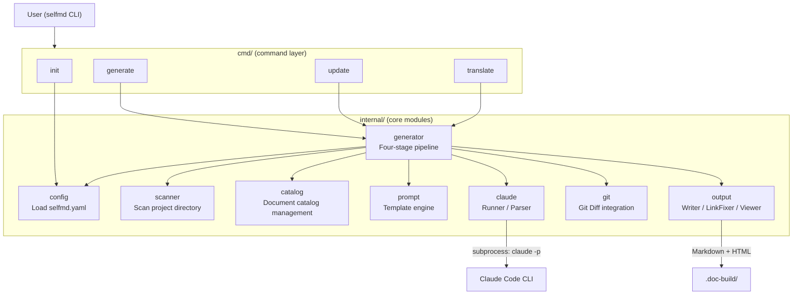
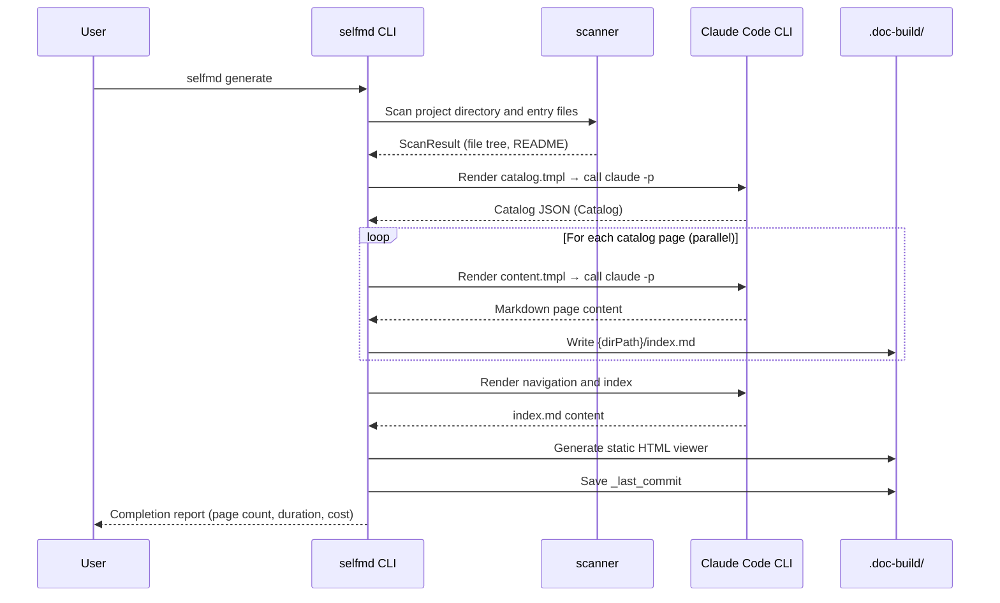

# Project Overview & Features

`selfmd` is a CLI tool written in Go that automatically scans source code directories of any project and generates structured, Wiki-style technical documentation — using a locally running Claude Code CLI as the AI backend.

## Overview

The core problem `selfmd` solves is that technical documentation tends to become outdated quickly due to high maintenance costs. By combining Claude Code CLI's code comprehension capabilities with an automated pipeline, `selfmd` continuously generates high-quality Markdown technical documentation for software projects without requiring manual authoring.

### Positioning

| Attribute | Description |
|-----------|-------------|
| **AI Backend** | Local Claude Code CLI (`claude` command), no remote API calls |
| **Document Format** | Markdown, with support for Mermaid diagrams and source code annotations |
| **Default Language** | Traditional Chinese (zh-TW), configurable to any language |
| **Output Location** | `.doc-build/` folder under the project root |
| **Target Projects** | Software projects in any language (Go, Rust, Python, Node.js, etc.) |

### Core Concepts

- **Catalog**: A hierarchical document outline automatically planned by AI after analyzing the project structure, defining the path and title of each page
- **Pipeline**: Four sequentially executed stages, from scanning to output in one continuous flow
- **Runner**: Wraps `claude` subprocess calls into retryable, timeout-capable asynchronous work units
- **Incremental Update**: Detects source code changes via git diff and only regenerates affected documentation pages

---

## Architecture

The diagram below shows `selfmd`'s main modules and data flow.



---

## Features

### 1. Four-Stage Automated Documentation Pipeline

When `selfmd generate` is executed, the pipeline completes the following four stages in sequence:

```go
// Phase 1: Scan
fmt.Println("[1/4] 掃描專案結構...")
scan, err := scanner.Scan(g.Config, g.RootDir)

// Phase 2: Generate Catalog
fmt.Println("[2/4] 產生文件目錄...")
cat, err = g.GenerateCatalog(ctx, scan)

// Phase 3: Generate Content（並行）
fmt.Printf("[3/4] 產生內容頁面（並行度：%d）...\n", concurrency)
if err := g.GenerateContent(ctx, scan, cat, concurrency, !clean); err != nil { ... }

// Phase 4: Generate Index & Navigation
fmt.Println("[4/4] 產生導航與索引...")
if err := g.GenerateIndex(ctx, cat); err != nil { ... }
```

> Source: `internal/generator/pipeline.go#L86-L143`

After the four stages complete, the system automatically generates a static HTML documentation site (`index.html`) that can be browsed directly, and records the current commit in the Git repository for use by the next incremental update.

---

### 2. Claude Code CLI Integration

`selfmd` does not call the Anthropic API directly — all AI tasks are executed via the locally installed `claude` CLI as a subprocess. Each invocation:

- Passes the rendered prompt via `stdin`
- Retrieves structured responses using `--output-format json`
- Allows `Read`, `Glob`, and `Grep` tools by default so Claude can read source code
- Automatically blocks `Write` and `Edit` tools to prevent AI from accidentally modifying source code

```go
args := []string{
    "-p",
    "--output-format", "json",
}
// ...
args = append(args, "--disallowedTools", "Write", "--disallowedTools", "Edit")
cmd := exec.CommandContext(ctx, "claude", args...)
cmd.Stdin = strings.NewReader(opts.Prompt)
```

> Source: `internal/claude/runner.go#L32-L76`

---

### 3. Automatic Project Type Detection

`selfmd init` scans the current directory and automatically determines the project type based on configuration files (`go.mod`, `package.json`, `Cargo.toml`, etc.), then generates `selfmd.yaml`:

| Detected File | Project Type |
|--------------|--------------|
| `go.mod` | `backend` |
| `package.json` | `frontend` (or `fullstack` if `go.mod` is also present) |
| `Cargo.toml` | `backend` |
| `requirements.txt` / `pyproject.toml` | `backend` |
| `pom.xml` / `build.gradle` | `backend` |
| `Gemfile` | `backend` |
| None matched | `library` |

> Source: `cmd/init.go#L60-L98`

---

### 4. Git Integration & Incremental Updates

When source code changes, there is no need to regenerate all documentation. `selfmd update` will:

1. Read the commit hash recorded during the last `generate` run (stored in `.doc-build/_last_commit`)
2. Call `git diff --name-status` to get the list of changed files
3. Apply include/exclude filter rules to select target files
4. Regenerate only the affected documentation pages

```go
changedFiles, err := git.GetChangedFiles(rootDir, previousCommit, currentCommit)
changedFiles = git.FilterChangedFiles(changedFiles, cfg.Targets.Include, cfg.Targets.Exclude)
```

> Source: `cmd/update.go#L89-L94`

---

### 5. Multi-Language Documentation Support

`selfmd` natively supports multi-language documentation. After configuring `secondary_languages` in `selfmd.yaml`, running `selfmd translate` translates the primary language documentation into other languages. Translation results are stored in `.doc-build/{language-code}/` subdirectories.

Built-in prompt templates currently support `zh-TW` and `en-US`; documentation output supports 11 languages:

```go
var KnownLanguages = map[string]string{
    "zh-TW": "繁體中文",
    "zh-CN": "简体中文",
    "en-US": "English",
    "ja-JP": "日本語",
    "ko-KR": "한국어",
    "fr-FR": "Français",
    "de-DE": "Deutsch",
    "es-ES": "Español",
    "pt-BR": "Português",
    "th-TH": "ไทย",
    "vi-VN": "Tiếng Việt",
}
```

> Source: `internal/config/config.go#L39-L51`

---

### 6. Parallel Page Generation

To reduce documentation generation time for large projects, `selfmd` supports parallel Claude invocations. The default concurrency is 3, adjustable via the configuration file or the `--concurrency` flag:

```go
Claude: ClaudeConfig{
    Model:         "sonnet",
    MaxConcurrent: 3,
    TimeoutSeconds: 300,
    MaxRetries:    2,
    AllowedTools:  []string{"Read", "Glob", "Grep"},
},
```

> Source: `internal/config/config.go#L116-L123`

---

### 7. Static HTML Documentation Viewer

After documentation generation is complete, `selfmd` produces a static documentation site at `.doc-build/index.html` that can be opened directly in a browser with no server required. The viewer includes a language switcher for navigating multi-language documentation.

---

## Core Workflow



---

## CLI Command Reference

| Command | Description |
|---------|-------------|
| `selfmd init` | Detect project type and generate `selfmd.yaml` configuration file |
| `selfmd generate` | Run the full four-stage documentation generation pipeline |
| `selfmd generate --dry-run` | Display scan results only, without calling Claude |
| `selfmd generate --clean` | Clear the output directory and regenerate from scratch |
| `selfmd update` | Incrementally update affected documentation pages based on git diff |
| `selfmd translate` | Translate primary language documentation into secondary languages |

Global flags shared by all commands:

| Flag | Description |
|------|-------------|
| `-c, --config` | Configuration file path (default: `selfmd.yaml`) |
| `-v, --verbose` | Show detailed debug output |
| `-q, --quiet` | Show error messages only |

> Source: `cmd/root.go#L30-L33`

---

## Related Links

- [Tech Stack & Dependencies](../tech-stack/index.md) — Learn about the languages, frameworks, and external packages used by `selfmd`
- [Output Structure](../output-structure/index.md) — Complete structure of the `.doc-build/` directory
- [Installation & Build](../../getting-started/installation/index.md) — How to install and run `selfmd` locally
- [Initialization](../../getting-started/init/index.md) — Detailed usage guide for `selfmd init`
- [selfmd generate](../../cli/cmd-generate/index.md) — Full parameter reference for the generate command
- [selfmd update](../../cli/cmd-update/index.md) — Full parameter reference for the update command
- [selfmd translate](../../cli/cmd-translate/index.md) — Full parameter reference for the translate command
- [Overall Flow & Four-Stage Pipeline](../../architecture/pipeline/index.md) — Deep dive into the pipeline architecture design
- [Claude CLI Runner](../../core-modules/claude-runner/index.md) — Implementation details of the Runner module
- [Multi-Language Support](../../i18n/index.md) — Configuration and translation workflow for multi-language documentation
- [Git Integration & Incremental Updates](../../git-integration/index.md) — How incremental updates work

---

## Reference Files

| File Path | Description |
|-----------|-------------|
| `cmd/root.go` | CLI root command definition, global flag configuration |
| `cmd/generate.go` | `generate` command implementation, pipeline entry point |
| `cmd/init.go` | `init` command implementation, project type detection logic |
| `cmd/update.go` | `update` command implementation, incremental update flow |
| `cmd/translate.go` | `translate` command implementation, multi-language translation flow |
| `internal/config/config.go` | `Config` struct definition, default values, known languages list |
| `internal/generator/pipeline.go` | `Generator` struct, four-stage pipeline implementation |
| `internal/scanner/scanner.go` | Project directory scanner implementation |
| `internal/claude/runner.go` | Claude CLI subprocess execution wrapper |
| `internal/prompt/engine.go` | Prompt template engine, PromptData type definitions |
| `internal/output/writer.go` | Output directory writer, Catalog JSON management |
| `internal/git/git.go` | Git diff integration, changed file filtering |