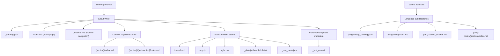

# Output Structure

After `selfmd` finishes running, all generated files, static browser assets, and metadata are stored in the output directory (default: `.doc-build/`). This page describes the complete file structure of that directory and the purpose of each file.

## Overview

The output directory is managed entirely by `output.Writer`. The four generation phases each handle a distinct responsibility, writing different types of files to the output directory in sequence:

- **Catalog phase**: writes `_catalog.json` (catalog index JSON)
- **Content phase**: writes `{dir}/index.md` content pages for each section
- **Index & navigation phase**: writes `index.md`, `_sidebar.md`, and category index pages
- **Static browser**: writes `index.html`, `app.js`, `style.css`, `_data.js`, `_doc_meta.json`
- **Translation phase** (optional): writes translated versions under `{lang-code}/` subdirectories

The root path of the output directory is determined by the `output.dir` field in `selfmd.yaml`, with a default value of `.doc-build`.

## Architecture



## Full Directory Structure

After running `selfmd generate` with translation enabled, a typical output directory looks like this:

```
.doc-build/
├── index.html          # Static documentation browser entry page
├── app.js              # Browser frontend JavaScript
├── style.css           # Browser stylesheet
├── _data.js            # Bundled data for all Markdown content (loaded by the browser)
├── _doc_meta.json      # Multilingual metadata
├── _catalog.json       # Document catalog structure (JSON, used for incremental updates)
├── _last_commit        # Git commit hash from the last generation run
├── index.md            # Documentation homepage (table of contents)
├── _sidebar.md         # Docsify/browser sidebar navigation
│
├── {section}/
│   └── index.md        # Section content page
├── {section}/
│   ├── index.md        # Category index page (auto-generated when subsections exist)
│   └── {subsection}/
│       └── index.md    # Subsection content page
│
└── {lang-code}/        # Secondary language directory (e.g. en-US/)
    ├── _catalog.json   # Translated catalog structure
    ├── index.md        # Translated homepage
    ├── _sidebar.md     # Translated sidebar navigation
    └── {section}/
        └── index.md    # Translated content page
```

## File Descriptions by Type

### System Files (Underscore-prefixed)

Files beginning with an underscore (`_`) are for internal system use. They are excluded from the static browser's page routing and do not appear in the documentation table of contents.

| File | Description |
|------|-------------|
| `_catalog.json` | JSON serialization of the document catalog, reused by incremental updates (`selfmd update`) to avoid re-calling Claude |
| `_last_commit` | Records the Git commit hash from the last generation run; used by `selfmd update` to determine which pages need regeneration |
| `_data.js` | Bundles all `.md` files and the catalog structure into a single JavaScript data object for client-side rendering in the static browser |
| `_doc_meta.json` | Records the primary language and all secondary languages with their codes and native names, used by the language-switching feature |
| `_sidebar.md` | Navigation sidebar, automatically generated by `GenerateSidebar` from the catalog structure |

### Static Browser Assets

```go
// viewer.go writes three embedded static assets to the output directory
if err := w.WriteFile("index.html", html); err != nil { ... }
if err := w.WriteFile("app.js", viewerJS); err != nil { ... }
if err := w.WriteFile("style.css", viewerCSS); err != nil { ... }
```

> Source: `internal/output/viewer.go#L34-L44`

`index.html` is the browser's entry page. The `{{PROJECT_NAME}}` and `{{LANG}}` placeholders are replaced with the actual project name and language code at write time.

### Content Pages

Each documentation item (`catalog.FlatItem`) is written as an `index.md` file under its corresponding directory path:

```go
// writer.go: WritePage uses FlatItem.DirPath to determine the directory location
func (w *Writer) WritePage(item catalog.FlatItem, content string) error {
    dir := filepath.Join(w.BaseDir, item.DirPath)
    path := filepath.Join(dir, "index.md")
    // ...
}
```

> Source: `internal/output/writer.go#L50-L61`

Path mapping rule: the `DirPath` from the catalog structure (e.g. `core-modules/scanner`) maps directly to the filesystem path, producing `core-modules/scanner/index.md`.

### Homepage and Category Indexes

- **`index.md`** (homepage): generated by `GenerateIndex`, contains a full linked table of contents
- **`{section}/index.md`** (category index): when a section has subsections, its `index.md` is automatically generated by `GenerateCategoryIndex`, listing links to its direct children

```go
// index_phase.go: category indexes are only generated for items with children
for _, item := range items {
    if !item.HasChildren {
        continue
    }
    // ...
    categoryContent := output.GenerateCategoryIndex(item, children, lang)
    if err := g.Writer.WritePage(item, categoryContent); err != nil { ... }
}
```

> Source: `internal/generator/index_phase.go#L34-L53`

### `_data.js` Data Bundle

The static browser does not rely on server-side routing. Instead, it loads all content on the client side via `_data.js`. The bundling logic scans all `.md` files, excludes underscore-prefixed files and secondary language directories, and embeds the content as JSON:

```go
// viewer.go: data structure for _data.js
data := map[string]interface{}{
    "catalog": catalogObj,
    "pages":   pages,
}
// For multilingual builds, add meta and per-language data
if docMeta != nil {
    data["meta"] = docMeta
    // ... add languages object
}

content := "window.DOC_DATA = " + string(jsonBytes) + ";\n"
return w.WriteFile("_data.js", content)
```

> Source: `internal/output/viewer.go#L128-L195`

## Multilingual Directory Structure

When multilingual translation is enabled (via `selfmd translate`), each secondary language gets its own subdirectory under the output directory, mirroring the structure of the primary language exactly:

```
.doc-build/
├── (primary language content, directly at root)
└── en-US/              # Secondary language (en-US as example)
    ├── _catalog.json   # Translated catalog
    ├── index.md        # Translated homepage
    ├── _sidebar.md     # Translated sidebar
    └── core-modules/
        └── scanner/
            └── index.md
```

The `Writer.ForLanguage` method creates a writer scoped to the language subdirectory:

```go
// writer.go: creates a Writer for a language subdirectory
func (w *Writer) ForLanguage(lang string) *Writer {
    return &Writer{
        BaseDir: filepath.Join(w.BaseDir, lang),
    }
}
```

> Source: `internal/output/writer.go#L139-L144`

## Output Directory Configuration

Output directory settings are found in the `output` section of `selfmd.yaml`:

```go
// config.go: OutputConfig struct
type OutputConfig struct {
    Dir                 string   `yaml:"dir"`
    Language            string   `yaml:"language"`
    SecondaryLanguages  []string `yaml:"secondary_languages"`
    CleanBeforeGenerate bool     `yaml:"clean_before_generate"`
}
```

> Source: `internal/config/config.go#L31-L36`

Default values:

| Setting | Default | Description |
|---------|---------|-------------|
| `output.dir` | `.doc-build` | Output directory path |
| `output.language` | `zh-TW` | Primary language (content placed directly at root) |
| `output.secondary_languages` | `[]` (empty) | List of secondary languages, each gets its own subdirectory |
| `output.clean_before_generate` | `false` | Whether to clear the previous output before generating |

## Incremental Update Files

`_catalog.json` and `_last_commit` are the core of the incremental update mechanism:

```go
// writer.go: saves metadata needed for incremental updates
func (w *Writer) WriteCatalogJSON(cat *catalog.Catalog) error {
    data, err := cat.ToJSON()
    return w.WriteFile("_catalog.json", data)
}

func (w *Writer) SaveLastCommit(commit string) error {
    return w.WriteFile("_last_commit", commit)
}
```

> Source: `internal/output/writer.go#L77-L137`

When `selfmd update` runs, it reads these two files, compares the current Git commit against the commit from the last generation run, and regenerates only the affected pages.

## Related Links

- [Overall Pipeline and Four-Phase Architecture](../../architecture/pipeline/index.md)
- [Output Writing and Link Fixing](../../core-modules/output-writer/index.md)
- [Static Documentation Browser](../../core-modules/static-viewer/index.md)
- [Multilingual Support](../../i18n/index.md)
- [Output and Language Configuration](../../configuration/output-language/index.md)
- [Incremental Updates](../../core-modules/incremental-update/index.md)

## Reference Files

| File Path | Description |
|-----------|-------------|
| `internal/output/writer.go` | `Writer` struct and all file-writing methods |
| `internal/output/viewer.go` | Static browser asset writing and `_data.js` bundling logic |
| `internal/output/navigation.go` | Generation logic for `index.md`, `_sidebar.md`, and category index pages |
| `internal/output/linkfixer.go` | Link fixer that ensures relative links between pages are correct |
| `internal/generator/pipeline.go` | Overall coordination of the four-phase pipeline and generation order for each output type |
| `internal/generator/index_phase.go` | Index and navigation phase implementation |
| `internal/generator/translate_phase.go` | Translation phase and language subdirectory writing logic |
| `internal/catalog/catalog.go` | `Catalog` and `FlatItem` structs, `DirPath` path mapping rules |
| `internal/config/config.go` | `OutputConfig` struct definition and default values |