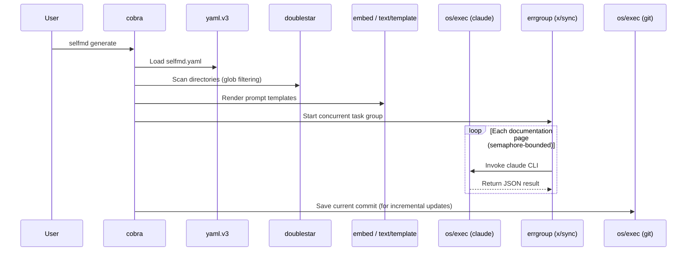

# Tech Stack & Dependencies

selfmd is implemented in pure Go with a minimal set of dependencies — only four direct external packages are used, with the remainder of functionality relying on the Go standard library.

## Overview

One of selfmd's design goals is to remain lightweight and easy to install. Beyond the Go runtime itself, the tool requires two external CLI tools at runtime:

- **Claude Code CLI** (`claude`): The AI backend, responsible for analyzing source code and generating documentation content
- **Git CLI** (`git`): Used during incremental updates to detect changes in source code

These external tools are not managed through Go's package system — they are invoked via `os/exec` by calling binaries already installed on the system.

## Architecture

```mermaid
graph TD
    subgraph GoStdLib["Go Standard Library"]
        embed["embed\n(embed templates)"]
        slog["log/slog\n(structured logging)"]
        exec["os/exec\n(subprocess execution)"]
        tmpl["text/template\n(template rendering)"]
        json["encoding/json\n(JSON serialization)"]
        ctx["context\n(timeout control)"]
        sync_pkg["sync / sync/atomic\n(concurrency primitives)"]
    end

    subgraph ExternalDeps["External Dependencies"]
        cobra["cobra v1.10.2\n(CLI framework)"]
        pflag["pflag v1.0.9\n(flag parsing, indirect)"]
        doublestar["doublestar v4.10.0\n(glob matching)"]
        errgroup["x/sync v0.19.0\n(errgroup concurrency)"]
        yaml["yaml.v3 v3.0.1\n(YAML parsing)"]
        mousetrap["mousetrap v1.1.0\n(Windows compat, indirect)"]
    end

    subgraph ExternalTools["External Runtime Tools (non-Go packages)"]
        claude_cli["Claude Code CLI\n(claude command)"]
        git_cli["Git CLI\n(git command)"]
    end

    cobra --> pflag
    cobra --> mousetrap

    cmd_pkg["cmd/*"] --> cobra
    scanner_pkg["internal/scanner"] --> doublestar
    git_pkg["internal/git"] --> doublestar
    config_pkg["internal/config"] --> yaml
    prompt_pkg["internal/prompt"] --> embed
    prompt_pkg --> tmpl
    claude_pkg["internal/claude"] --> exec
    claude_pkg --> json
    claude_pkg --> slog
    claude_pkg --> ctx
    git_pkg --> exec
    generator_pkg["internal/generator"] --> errgroup
    generator_pkg --> sync_pkg
    output_pkg["internal/output"] --> json

    claude_pkg --> claude_cli
    git_pkg --> git_cli
```



## Dependency Details

### Direct Dependencies

| Package | Version | Purpose | Used In |
|---------|---------|---------|---------|
| `github.com/spf13/cobra` | v1.10.2 | CLI command framework | `cmd/root.go`, all command files |
| `github.com/bmatcuk/doublestar/v4` | v4.10.0 | Double-star (`**`) glob pattern matching | `internal/scanner/scanner.go`, `internal/git/git.go` |
| `golang.org/x/sync` | v0.19.0 | `errgroup` concurrent task groups | `internal/generator/content_phase.go`, `translate_phase.go` |
| `gopkg.in/yaml.v3` | v3.0.1 | YAML config file parsing and serialization | `internal/config/config.go` |

### Indirect Dependencies

| Package | Version | Description |
|---------|---------|-------------|
| `github.com/spf13/pflag` | v1.0.9 | Underlying flag parsing implementation for cobra |
| `github.com/inconshreveable/mousetrap` | v1.1.0 | Windows platform compatibility support for cobra |

> Source: `go.mod#L1-L15`

```go
module github.com/monkenwu/selfmd

go 1.25.7

require (
	github.com/bmatcuk/doublestar/v4 v4.10.0
	github.com/spf13/cobra v1.10.2
	golang.org/x/sync v0.19.0
	gopkg.in/yaml.v3 v3.0.1
)

require (
	github.com/inconshreveable/mousetrap v1.1.0 // indirect
	github.com/spf13/pflag v1.0.9 // indirect
)
```

> Source: `go.mod#L1-L15`

---

### cobra — CLI Framework

`cobra` handles the routing structure for all subcommands (`init`, `generate`, `update`, `translate`), flag definitions, and automatic help text generation.

```go
var rootCmd = &cobra.Command{
	Use:   "selfmd",
	Short: "selfmd — 專案文件自動產生器",
	Long: `selfmd 是一個 CLI 工具，透過本地 Claude Code CLI 作為 AI 後端，
自動掃描專案目錄並產生結構化的 Wiki 風格繁體中文技術文件。`,
}
```

> Source: `cmd/root.go#L17-L25`

---

### doublestar — Glob Pattern Matching

Go's standard library `filepath.Match` does not support `**` double-star patterns (recursive directory matching). `doublestar` fills this gap, allowing users to specify patterns like `internal/**` or `**/*.pb.go` in `selfmd.yaml`.

```go
// check excludes
for _, pattern := range cfg.Targets.Exclude {
    matched, _ := doublestar.Match(pattern, rel)
    if matched {
        if d.IsDir() {
            return filepath.SkipDir
        }
        return nil
    }
}
```

> Source: `internal/scanner/scanner.go#L33-L41`

---

### golang.org/x/sync (errgroup) — Concurrent Task Management

`errgroup.WithContext` combined with a channel as a semaphore controls the number of concurrent Claude CLI invocations, preventing them from exceeding the configured `max_concurrent` limit.

```go
eg, ctx := errgroup.WithContext(ctx)
sem := make(chan struct{}, concurrency)

for _, item := range items {
    item := item
    eg.Go(func() error {
        sem <- struct{}{}
        defer func() { <-sem }()
        // ... generate page
        return nil
    })
}
```

> Source: `internal/generator/content_phase.go#L37-L50`

---

### yaml.v3 — Config File Parsing

Both reading and writing of the `selfmd.yaml` config file are handled through `yaml.v3`. The `Load` function first constructs a `Config` object with default values, then uses YAML Unmarshal to override with user-defined fields.

```go
func Load(path string) (*Config, error) {
	data, err := os.ReadFile(path)
	// ...
	cfg := DefaultConfig()
	if err := yaml.Unmarshal(data, cfg); err != nil {
		return nil, fmt.Errorf("設定檔格式錯誤: %w", err)
	}
	// ...
}
```

> Source: `internal/config/config.go#L131-L147`

---

## Go Standard Library — Key Usage

| Package | Purpose | Used In |
|---------|---------|---------|
| `embed` | Compile-time embedding of prompt templates (`.tmpl` files) | `internal/prompt/engine.go` |
| `text/template` | Renders prompt templates by injecting data into text | `internal/prompt/engine.go` |
| `os/exec` | Invokes `claude` and `git` subprocesses | `internal/claude/runner.go`, `internal/git/git.go` |
| `log/slog` | Structured logging (built-in since Go 1.21) | `internal/claude/runner.go`, `internal/generator/pipeline.go` |
| `encoding/json` | JSON serialization for the catalog | `internal/catalog/catalog.go`, `internal/claude/parser.go` |
| `context` | Subprocess timeout control and cancellation | `internal/claude/runner.go` |
| `sync` / `sync/atomic` | Concurrency counters (completed, failed, skipped) | `internal/generator/content_phase.go` |
| `path/filepath` | Cross-platform path operations | Multiple locations |

### embed — Compile-Time Template Embedding

The `//go:embed` directive bundles all `.tmpl` files under the `templates/` directory into the binary at compile time, so users do not need to deploy template files separately.

```go
//go:embed templates/*/*.tmpl templates/*.tmpl
var templateFS embed.FS
```

> Source: `internal/prompt/engine.go#L10-L11`

### log/slog — Structured Logging

`slog` is the structured logging package introduced in Go 1.21, replacing the third-party logging libraries that were previously common. selfmd uses `slog.Logger` as its internal logging interface, passing it uniformly into each module.

```go
r.logger.Debug("claude completed",
    "duration", elapsed.Round(time.Millisecond),
    "cost_usd", result.CostUSD,
    "is_error", result.IsError,
)
```

> Source: `internal/claude/runner.go#L103-L108`

---

## External Runtime Tool Dependencies

### Claude Code CLI

selfmd's AI capabilities come from invoking the locally installed `claude` CLI, rather than directly integrating the Anthropic API SDK. This design lets users reuse their existing Claude Code license and configuration.

```go
cmd := exec.CommandContext(ctx, "claude", args...)
// ...
cmd.Stdin = strings.NewReader(opts.Prompt)
```

> Source: `internal/claude/runner.go#L69-L75`

Before startup, availability of the `claude` binary is verified:

```go
func CheckAvailable() error {
	_, err := exec.LookPath("claude")
	if err != nil {
		return fmt.Errorf("找不到 claude CLI。請先安裝 Claude Code：https://docs.anthropic.com/en/docs/claude-code")
	}
	return nil
}
```

> Source: `internal/claude/runner.go#L146-L152`

### Git CLI

The incremental update feature detects source code changes by running commands such as `git diff` and `git rev-parse`, without relying on any Go Git library:

```go
func runGit(dir string, args ...string) (string, error) {
	cmd := exec.Command("git", args...)
	cmd.Dir = dir
	// ...
}
```

> Source: `internal/git/git.go#L124-L141`

---

## Core Flow



---

## Related Links

- [Overall Flow & Four-Phase Pipeline](../../architecture/pipeline/index.md)
- [Claude CLI Runner](../../core-modules/claude-runner/index.md)
- [Project Scanner](../../core-modules/scanner/index.md)
- [Prompt Template Engine](../../core-modules/prompt-engine/index.md)
- [Configuration Reference](../../configuration/index.md)
- [Git Integration Configuration](../../configuration/git-config/index.md)

---

## Reference Files

| File Path | Description |
|-----------|-------------|
| `go.mod` | Go module definition, including all direct and indirect dependencies |
| `cmd/root.go` | cobra root command definition, demonstrating CLI framework usage |
| `internal/config/config.go` | yaml.v3 implementation for config file parsing |
| `internal/scanner/scanner.go` | doublestar usage for include/exclude pattern matching |
| `internal/git/git.go` | os/exec implementation for invoking the git CLI |
| `internal/claude/runner.go` | os/exec for invoking the claude CLI, with log/slog usage examples |
| `internal/claude/types.go` | JSON type definitions for Claude CLI responses |
| `internal/prompt/engine.go` | embed + text/template for embedding and rendering templates |
| `internal/generator/content_phase.go` | errgroup + channel semaphore for concurrency control |
| `internal/generator/pipeline.go` | Overall pipeline, showing how modules integrate |
| `internal/catalog/catalog.go` | encoding/json for catalog serialization |
| `internal/output/writer.go` | Output writing, demonstrating standard os package usage |
| `internal/output/navigation.go` | Navigation page generation implementation |
| `internal/scanner/filetree.go` | File tree data structure definitions (ScanResult, FileNode) |