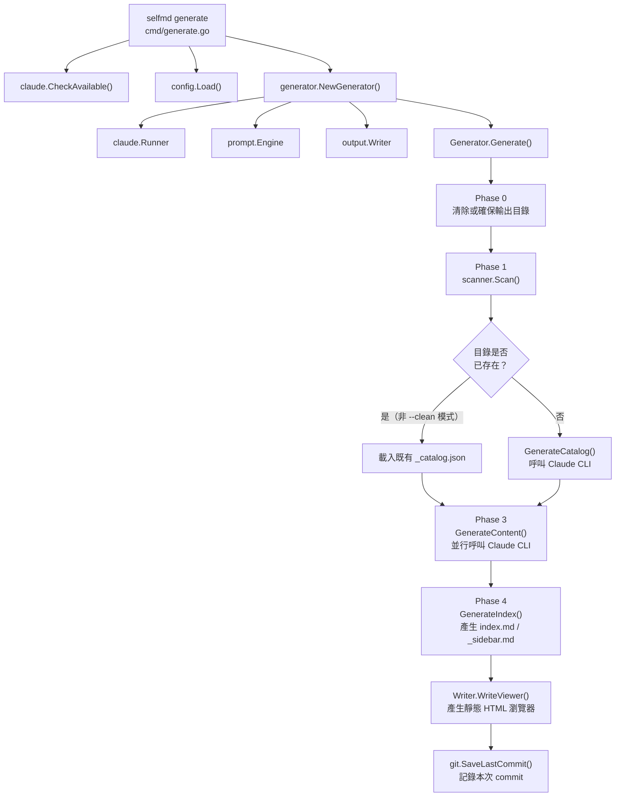

# 產生第一份文件

完成初始化設定後，執行 `selfmd generate` 即可啟動四階段文件產生管線，自動掃描專案、呼叫 Claude CLI 撰寫文件並輸出靜態網站。

## 概述

`selfmd generate` 是 selfmd 的核心指令。它讀取 `selfmd.yaml` 的設定，依序執行以下流程：

1. **掃描**專案目錄結構與原始碼
2. **呼叫 Claude CLI** 產生文件目錄（Catalog）
3. **並行呼叫 Claude CLI** 產生每一頁文件內容
4. **產生**索引、側邊欄與靜態瀏覽器

整個過程完全自動化，結束後在輸出目錄（預設 `.doc-build/`）中即可找到完整的文件網站，直接開啟 `index.html` 瀏覽。

---

## 前置條件

在執行 `generate` 之前，請確認：

| 條件 | 說明 |
|------|------|
| `selfmd.yaml` 已存在 | 執行 `selfmd init` 建立，或手動建立 |
| Claude CLI 已安裝並可呼叫 | 程式啟動時會自動呼叫 `claude.CheckAvailable()` 驗證 |
| 當前目錄為專案根目錄 | selfmd 以執行目錄為 `rootDir` |

---

## 快速執行

```bash
# 最基本的使用方式
selfmd generate

# 強制清除輸出目錄後重新產生
selfmd generate --clean

# 先預覽將掃描哪些檔案，不實際呼叫 Claude
selfmd generate --dry-run

# 提高並行度以加快產生速度
selfmd generate --concurrency 5
```

---

## 架構



---

## 四個執行階段詳解

### Phase 0：初始化輸出目錄

程式先判斷是否需要清除輸出目錄：

```go
clean := opts.Clean || g.Config.Output.CleanBeforeGenerate
if clean {
    fmt.Println(ui.T("[0/4] 清除輸出目錄...", "[0/4] Cleaning output directory..."))
    if !opts.DryRun {
        if err := g.Writer.Clean(); err != nil {
            return err
        }
    }
} else {
    if err := g.Writer.EnsureDir(); err != nil {
        return err
    }
}
```

> 來源：`internal/generator/pipeline.go#L73-L85`

`--clean` 旗標或設定檔中的 `clean_before_generate: true` 都會觸發清除行為；否則只確保目錄存在。

---

### Phase 1：掃描專案結構

呼叫 `scanner.Scan()` 遍歷專案目錄：

```go
fmt.Println(ui.T("[1/4] 掃描專案結構...", "[1/4] Scanning project structure..."))
scan, err := scanner.Scan(g.Config, g.RootDir)
```

> 來源：`internal/generator/pipeline.go#L88-L93`

掃描器依照 `selfmd.yaml` 中的 `targets.include` 與 `targets.exclude` 篩選檔案，同時讀取：
- `README.md`（作為 Claude 的背景知識）
- `entry_points` 中指定的入口檔案內容

若使用 `--dry-run`，程式在此階段印出檔案樹後即結束，不會呼叫 Claude。

---

### Phase 2：產生文件目錄（Catalog）

這是第一次呼叫 Claude CLI 的時機。若輸出目錄中已有 `_catalog.json`（即非 `--clean` 模式），selfmd 會優先載入既有目錄以節省費用：

```go
if !clean {
    catJSON, readErr := g.Writer.ReadCatalogJSON()
    if readErr == nil {
        cat, err = catalog.Parse(catJSON)
    }
    if cat != nil {
        items := cat.Flatten()
        fmt.Printf(ui.T("[2/4] 載入已存目錄（%d 個章節，%d 個項目）\n", ...))
    }
}
if cat == nil {
    fmt.Println(ui.T("[2/4] 產生文件目錄...", "[2/4] Generating catalog..."))
    cat, err = g.GenerateCatalog(ctx, scan)
    // ...
    if err := g.Writer.WriteCatalogJSON(cat); err != nil { ... }
}
```

> 來源：`internal/generator/pipeline.go#L103-L128`

產生的目錄 JSON 儲存至 `.doc-build/_catalog.json`，供後續增量更新使用。

---

### Phase 3：並行產生內容頁面

這是最耗時的階段。selfmd 使用 `errgroup` 與 semaphore（信號量）控制並行度：

```go
concurrency := g.Config.Claude.MaxConcurrent
if opts.Concurrency > 0 {
    concurrency = opts.Concurrency
}
fmt.Printf(ui.T("[3/4] 產生內容頁面（並行度：%d）...\n", ...), concurrency)
if err := g.GenerateContent(ctx, scan, cat, concurrency, !clean); err != nil {
    g.Logger.Warn(ui.T("部分頁面產生失敗", "some pages failed to generate"), "error", err)
}
```

> 來源：`internal/generator/pipeline.go#L131-L138`

每個文件頁面對應一次 Claude CLI 呼叫。若頁面已存在（非 `--clean` 模式），會自動跳過：

```go
if skipExisting && g.Writer.PageExists(item) {
    skipped.Add(1)
    fmt.Printf(ui.T("      [跳過] %s（已存在）\n", ...), item.Title)
    return nil
}
```

> 來源：`internal/generator/content_phase.go#L44-L48`

若某頁面產生失敗，selfmd **不會中止整個流程**，而是寫入佔位頁面並繼續其他頁面。

---

### Phase 4：產生索引與導航

最後階段產生三類輸出：

```go
// 主索引頁
indexContent := output.GenerateIndex(...)
g.Writer.WriteFile("index.md", indexContent)

// 側邊欄導航
sidebarContent := output.GenerateSidebar(...)
g.Writer.WriteFile("_sidebar.md", sidebarContent)

// 有子頁面的分類索引
for _, item := range items {
    if !item.HasChildren { continue }
    categoryContent := output.GenerateCategoryIndex(item, children, lang)
    g.Writer.WritePage(item, categoryContent)
}
```

> 來源：`internal/generator/index_phase.go#L14-L53`

---

## 指令旗標

| 旗標 | 預設值 | 說明 |
|------|--------|------|
| `--clean` | `false` | 強制清除輸出目錄後重新產生 |
| `--no-clean` | `false` | 忽略設定檔中的 `clean_before_generate`，保留現有文件 |
| `--dry-run` | `false` | 只掃描並印出檔案樹，不呼叫 Claude |
| `--concurrency N` | `0`（使用設定檔值） | 覆蓋 `claude.max_concurrent`，指定並行數量 |

```go
generateCmd.Flags().BoolVar(&cleanFlag, "clean", false, "強制清除輸出目錄")
generateCmd.Flags().BoolVar(&noCleanFlag, "no-clean", false, "不清除輸出目錄")
generateCmd.Flags().BoolVar(&dryRun, "dry-run", false, "只顯示計畫，不實際執行")
generateCmd.Flags().IntVar(&concurrencyNum, "concurrency", 0, "並行度（覆蓋設定檔）")
```

> 來源：`cmd/generate.go#L34-L39`

---

## 輸出結構

完成後，`.doc-build/` 目錄結構如下：

```
.doc-build/
├── index.md              ← 主索引（Phase 4）
├── index.html            ← 靜態 HTML 瀏覽器入口
├── _sidebar.md           ← 側邊欄導航（Phase 4）
├── _catalog.json         ← 文件目錄快取（供增量更新使用）
├── _last_commit          ← Git commit 記錄（供增量更新使用）
├── _data.js              ← 靜態瀏覽器的資料 bundle
├── <section>/
│   └── <page>/
│       └── index.md      ← 各文件頁面（Phase 3）
└── ...
```

---

## 完成摘要

產生成功後，終端機顯示類似以下的摘要：

```
========================================
文件產生完成！
  輸出目錄：.doc-build
  頁面數量：42 成功
  總耗時：3m25s
  總費用：$0.1234 USD
========================================
```

> 來源：`internal/generator/pipeline.go#L168-L180`

開啟 `.doc-build/index.html` 即可在瀏覽器中瀏覽完整文件。

---

## 常見問題

**Q：執行後部分頁面顯示「此頁面產生失敗」**

這是正常的保護機制，失敗的頁面會寫入佔位內容。重新執行 `selfmd generate`（不加 `--clean`），程式會自動跳過已完成的頁面，只重新產生失敗的頁面。

**Q：想要完全重新產生所有頁面**

執行 `selfmd generate --clean`，清除輸出目錄後從頭重新產生。

**Q：如何加快產生速度**

增加 `--concurrency` 的數值（例如 `--concurrency 8`）可以提高並行度，但需留意 Claude CLI 的 API 速率限制。

---

## 相關連結

- [安裝與建置](../installation/index.md)
- [初始化設定](../init/index.md)
- [selfmd generate 指令完整參考](../../cli/cmd-generate/index.md)
- [selfmd.yaml 結構總覽](../../configuration/config-overview/index.md)
- [整體流程與四階段管線](../../architecture/pipeline/index.md)
- [輸出結構說明](../../overview/output-structure/index.md)
- [增量更新](../../core-modules/incremental-update/index.md)

---

## 參考檔案

| 檔案路徑 | 說明 |
|----------|------|
| `cmd/generate.go` | `generate` 指令定義、旗標宣告、`runGenerate` 進入點 |
| `internal/generator/pipeline.go` | `Generator` 結構、`Generate()` 四階段主流程 |
| `internal/generator/catalog_phase.go` | Phase 2：呼叫 Claude 產生文件目錄 |
| `internal/generator/content_phase.go` | Phase 3：並行產生內容頁面 |
| `internal/generator/index_phase.go` | Phase 4：產生索引、側邊欄與分類索引 |
| `internal/config/config.go` | `Config` 結構定義、預設值與 `Load()` 邏輯 |
| `internal/scanner/scanner.go` | 專案目錄掃描邏輯 |
| `internal/output/writer.go` | `Writer` 結構、頁面寫入與狀態儲存 |
| `cmd/init.go` | `init` 指令，了解前置條件 |