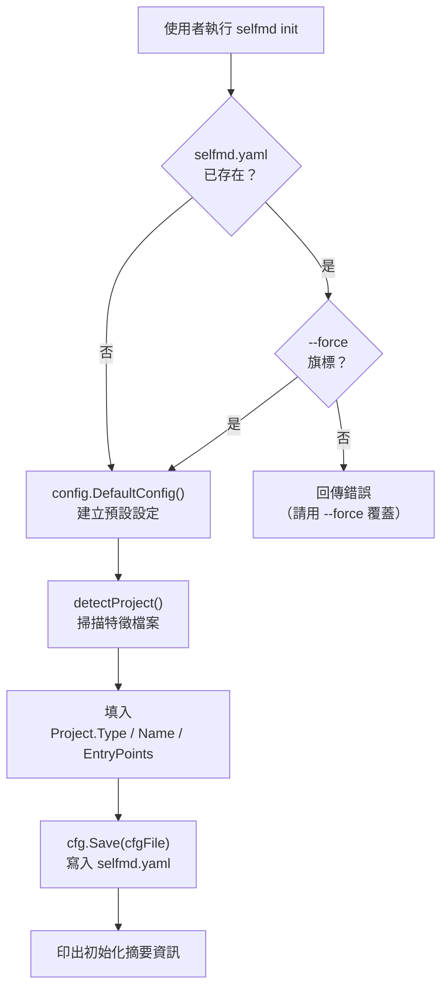
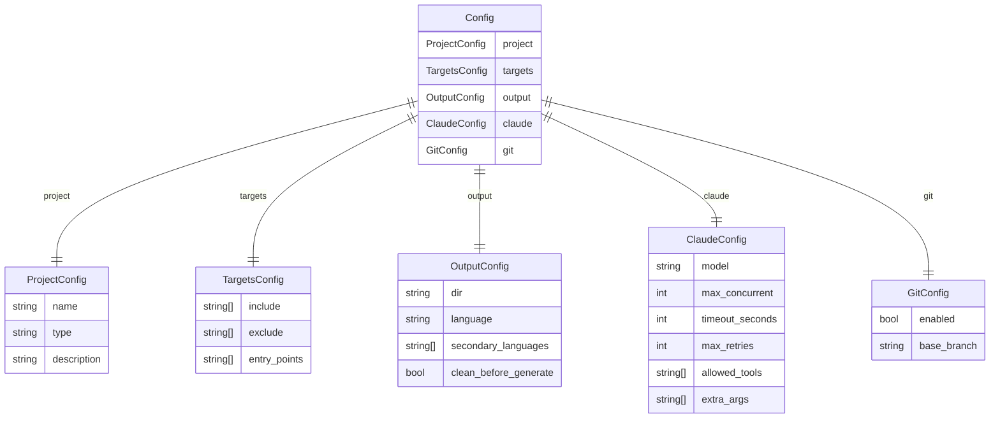
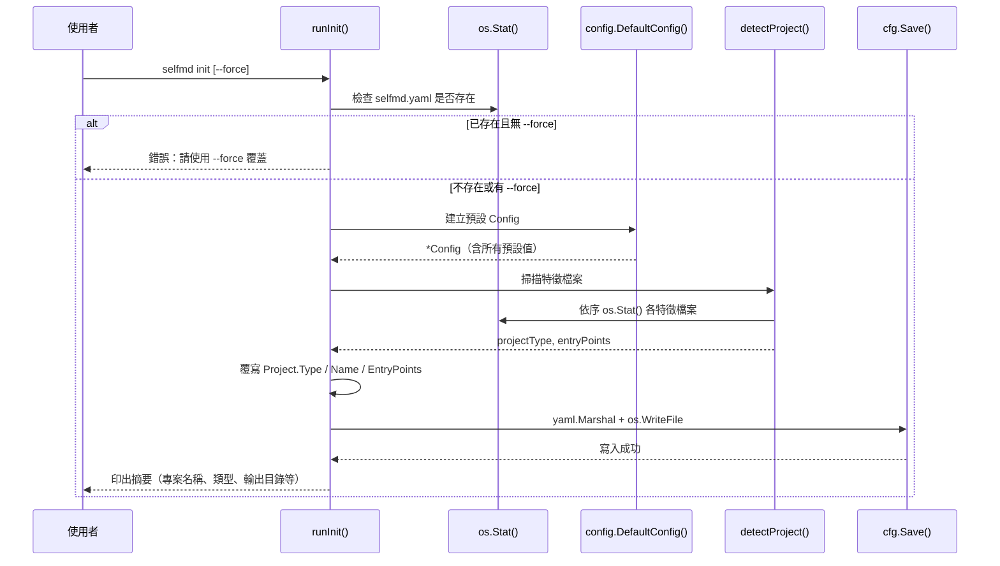

# 初始化設定

執行 `selfmd init` 指令，自動掃描當前目錄、偵測專案類型，並產生 `selfmd.yaml` 設定檔，為後續文件產生流程建立基礎設定。

## 概述

`selfmd init` 是使用 selfmd 的第一個步驟。它透過分析目錄中的特徵檔案（如 `go.mod`、`package.json`、`requirements.txt` 等）來自動判斷專案類型，並產生一份預填好合理預設值的 `selfmd.yaml` 設定檔。

初始化完成後，使用者只需根據需求微調設定檔，即可執行 `selfmd generate` 開始產生文件。

**核心職責：**
- 偵測專案類型（`backend`、`frontend`、`fullstack`、`library`）
- 推斷常見的入口點檔案路徑（entry points）
- 以預設值填充完整的 `Config` 結構並序列化為 YAML

## 架構



## 專案類型偵測

`detectProject()` 函式依序檢查目錄中是否存在以下特徵檔案，並對應到專案類型與建議的入口點清單：

| 特徵檔案 | 專案類型 | 建議入口點 |
|----------|----------|------------|
| `go.mod` | `backend` | `main.go`, `cmd/root.go` |
| `Cargo.toml` | `backend` | `src/main.rs`, `src/lib.rs` |
| `package.json` | `frontend` | `src/index.ts`, `src/index.js`, `src/main.ts`, `src/App.tsx` |
| `pom.xml` | `backend` | `src/main/java` |
| `build.gradle` | `backend` | `src/main/java` |
| `requirements.txt` | `backend` | `main.py`, `app.py`, `src/main.py` |
| `pyproject.toml` | `backend` | `src/main.py`, `main.py` |
| `composer.json` | `backend` | `public/index.php`, `src/Kernel.php` |
| `Gemfile` | `backend` | `config/application.rb`, `app/` |
| （無符合） | `library` | （空） |

**fullstack 特例：** 若偵測到 `package.json`（frontend），但同時存在 `go.mod` 或 `server/` 目錄，則自動升級為 `fullstack` 類型。

```go
// check if frontend project also has backend
if c.pType == "frontend" {
    if _, err := os.Stat("go.mod"); err == nil {
        return "fullstack", found
    }
    if _, err := os.Stat("server"); err == nil {
        return "fullstack", found
    }
}
```

> 來源：cmd/init.go#L87-L94

偵測到特徵檔案後，函式只保留**實際存在於磁碟上**的入口點檔案，不會寫入不存在的路徑。

## 預設設定值

`config.DefaultConfig()` 產生的初始設定包含以下預設值：

```go
func DefaultConfig() *Config {
    return &Config{
        Project: ProjectConfig{
            Name: filepath.Base(mustGetwd()),
            Type: "backend",
        },
        Targets: TargetsConfig{
            Include: []string{"src/**", "pkg/**", "cmd/**", "internal/**", "lib/**", "app/**"},
            Exclude: []string{
                "vendor/**", "node_modules/**", ".git/**", ".doc-build/**",
                "**/*.pb.go", "**/generated/**", "dist/**", "build/**",
            },
            EntryPoints: []string{},
        },
        Output: OutputConfig{
            Dir:                 ".doc-build",
            Language:            "zh-TW",
            SecondaryLanguages:  []string{},
            CleanBeforeGenerate: false,
        },
        Claude: ClaudeConfig{
            Model:          "sonnet",
            MaxConcurrent:  3,
            TimeoutSeconds: 300,
            MaxRetries:     2,
            AllowedTools:   []string{"Read", "Glob", "Grep"},
            ExtraArgs:      []string{},
        },
        Git: GitConfig{
            Enabled:    true,
            BaseBranch: "main",
        },
    }
}
```

> 來源：internal/config/config.go#L96-L129

## 設定檔結構

`selfmd.yaml` 由五個頂層區塊組成，對應 `Config` 結構體的欄位：



## 核心流程



## 指令用法

### 基本初始化

```bash
selfmd init
```

在當前目錄產生 `selfmd.yaml`。若檔案已存在，指令會中止並提示錯誤。

### 強制覆蓋

```bash
selfmd init --force
```

使用 `--force` 旗標可覆蓋已存在的設定檔。

> 來源：cmd/init.go#L23-L26

### 指定設定檔路徑

```bash
selfmd init --config path/to/custom.yaml
```

透過全域 `--config`（或 `-c`）旗標可指定輸出路徑，預設為 `selfmd.yaml`。

> 來源：cmd/root.go#L33

## 初始化後的設定調整

產生的 `selfmd.yaml` 包含合理的預設值，常見需要調整的設定包括：

| 設定項目 | 預設值 | 說明 |
|----------|--------|------|
| `project.description` | （空） | 加入專案描述以改善 AI 文件品質 |
| `targets.include` | 常見目錄 glob | 根據實際專案結構調整掃描範圍 |
| `output.language` | `zh-TW` | 主要文件語言 |
| `output.secondary_languages` | `[]` | 加入多語言輸出，如 `["en-US"]` |
| `claude.max_concurrent` | `3` | 調整並發數以平衡速度與資源消耗 |
| `git.base_branch` | `main` | 依專案實際主分支名稱調整 |

設定說明請參考「[selfmd.yaml 結構總覽](../../configuration/config-overview/index.md)」。

## 設定驗證規則

載入設定時，`validate()` 函式會強制執行以下規則：

```go
func (c *Config) validate() error {
    if c.Output.Dir == "" {
        return fmt.Errorf("output.dir 不可為空")
    }
    if c.Output.Language == "" {
        return fmt.Errorf("output.language 不可為空")
    }
    if c.Claude.MaxConcurrent < 1 {
        c.Claude.MaxConcurrent = 1
    }
    if c.Claude.TimeoutSeconds < 30 {
        c.Claude.TimeoutSeconds = 30
    }
    if c.Claude.MaxRetries < 0 {
        c.Claude.MaxRetries = 0
    }
    return nil
}
```

> 來源：internal/config/config.go#L157-L174

- `output.dir` 與 `output.language` 為必填欄位
- `claude.max_concurrent` 最小值為 `1`
- `claude.timeout_seconds` 最小值為 `30`
- `claude.max_retries` 不可為負數

## 相關連結

- [安裝與建置](../installation/index.md) — 執行 `selfmd init` 前的安裝步驟
- [產生第一份文件](../first-run/index.md) — 初始化完成後的下一步
- [selfmd init 指令參考](../../cli/cmd-init/index.md) — 完整的指令參數說明
- [selfmd.yaml 結構總覽](../../configuration/config-overview/index.md) — 各設定欄位的詳細說明
- [專案與掃描目標設定](../../configuration/project-targets/index.md) — `targets` 區塊的進階設定
- [輸出與多語言設定](../../configuration/output-language/index.md) — `output` 區塊的語言設定

## 參考檔案

| 檔案路徑 | 說明 |
|----------|------|
| `cmd/init.go` | `selfmd init` 指令實作，含 `runInit()` 與 `detectProject()` 函式 |
| `cmd/root.go` | 根指令定義，全域旗標（`--config`、`--force` 等）宣告 |
| `internal/config/config.go` | `Config` 結構體定義、`DefaultConfig()`、`Load()`、`Save()`、`validate()` 實作 |