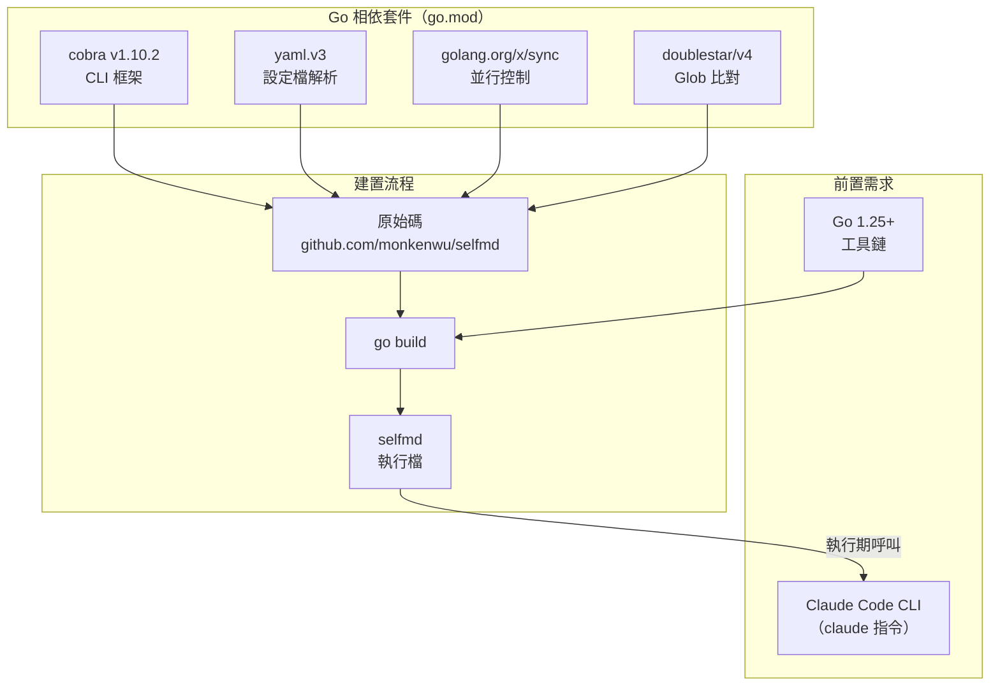
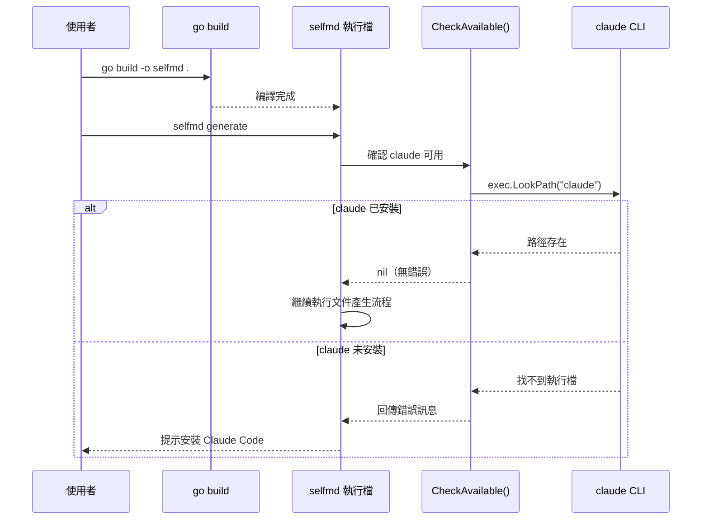

# 安裝與建置

本頁說明如何取得 selfmd 的原始碼、編譯執行檔，以及確認執行環境的前置需求。

## 概述

selfmd 是以 Go 語言撰寫的 CLI 工具，需要在本機自行編譯後使用。由於 selfmd 以本地 Claude Code CLI 作為 AI 後端，因此**同時需要 Go 工具鏈與 Claude Code CLI** 兩項前置需求才能正常運作。

核心術語說明：
- **Claude Code CLI**：Anthropic 官方提供的本地 AI 代理程式，selfmd 透過子行程（subprocess）方式呼叫其 `claude` 指令
- **交叉編譯（Cross-compilation）**：在一個平台上編譯出其他平台可執行的二進位檔案

## 前置需求

| 需求 | 最低版本 | 說明 |
|------|---------|------|
| Go 工具鏈 | 1.25+ | 用於編譯 selfmd 原始碼 |
| Claude Code CLI | 最新版 | selfmd 於執行期透過 `claude` 指令呼叫 |

### Claude Code CLI 的驗證機制

selfmd 在每次執行 `generate`、`update`、`translate` 等指令時，會先呼叫 `CheckAvailable()` 確認 `claude` 已安裝並可在 `PATH` 中找到：

```go
// CheckAvailable verifies that the claude CLI is installed and accessible.
func CheckAvailable() error {
	_, err := exec.LookPath("claude")
	if err != nil {
		return fmt.Errorf("找不到 claude CLI。請先安裝 Claude Code：https://docs.anthropic.com/en/docs/claude-code")
	}
	return nil
}
```

> 來源：`internal/claude/runner.go#L146-L152`

## 架構

以下圖表說明 selfmd 的安裝組成及各元件間的依賴關係：



## Go 相依套件說明

selfmd 的相依套件定義於 `go.mod`，共四個直接相依：

```
module github.com/monkenwu/selfmd

go 1.25.7

require (
	github.com/bmatcuk/doublestar/v4 v4.10.0
	github.com/spf13/cobra v1.10.2
	golang.org/x/sync v0.19.0
	gopkg.in/yaml.v3 v3.0.1
)
```

> 來源：`go.mod#L1-L10`

| 套件 | 版本 | 用途 |
|------|------|------|
| `github.com/spf13/cobra` | v1.10.2 | CLI 指令框架，管理所有子指令（init、generate、update、translate） |
| `gopkg.in/yaml.v3` | v3.0.1 | 解析與寫入 `selfmd.yaml` 設定檔 |
| `golang.org/x/sync` | v0.19.0 | 並行文件產生時的協程同步控制 |
| `github.com/bmatcuk/doublestar/v4` | v4.10.0 | 支援 `**` 萬用字元的 Glob 路徑比對，用於掃描目標設定 |

## 編譯步驟

### 取得原始碼

```bash
git clone https://github.com/monkenwu/selfmd.git
cd selfmd
```

### 編譯當前平台

```bash
go build -o selfmd .
```

> 來源：`README.md#L18-L19`

### 交叉編譯（Cross-compilation）

selfmd 支援交叉編譯至多個平台，只需設定 `GOOS` 與 `GOARCH` 環境變數：

```bash
# Linux arm64
GOOS=linux GOARCH=arm64 go build -o ./bin/selfmd-linux-arm64

# Linux amd64
GOOS=linux GOARCH=amd64 go build -o ./bin/selfmd-linux-amd64

# macOS arm64（Apple Silicon）
GOOS=darwin GOARCH=arm64 go build -o ./bin/selfmd-macos-arm64

# macOS amd64（Intel）
GOOS=darwin GOARCH=amd64 go build -o ./bin/selfmd-macos-amd64

# Windows amd64
GOOS=windows GOARCH=amd64 go build -o ./bin/selfmd-windows-amd64.exe

# Windows arm64
GOOS=windows GOARCH=arm64 go build -o ./bin/selfmd-windows-arm64.exe
```

> 來源：`README.md#L21-L31`

## 核心流程



## 使用範例

### 驗證安裝

編譯完成後，可使用以下指令確認 selfmd 正常運作：

```bash
./selfmd --help
```

輸出應顯示：

```
selfmd — 專案文件自動產生器

selfmd 是一個 CLI 工具，透過本地 Claude Code CLI 作為 AI 後端，
自動掃描專案目錄並產生結構化的 Wiki 風格繁體中文技術文件。
...
```

> 來源：`cmd/root.go#L17-L25`

### 全域旗標

selfmd 提供三個全域旗標，可與任何子指令搭配使用：

```go
rootCmd.PersistentFlags().StringVarP(&cfgFile, "config", "c", "selfmd.yaml", "設定檔路徑")
rootCmd.PersistentFlags().BoolVarP(&verbose, "verbose", "v", false, "顯示詳細輸出")
rootCmd.PersistentFlags().BoolVarP(&quiet, "quiet", "q", false, "僅顯示錯誤訊息")
```

> 來源：`cmd/root.go#L33-L35`

| 旗標 | 簡寫 | 預設值 | 說明 |
|------|------|--------|------|
| `--config` | `-c` | `selfmd.yaml` | 指定設定檔路徑 |
| `--verbose` | `-v` | `false` | 顯示詳細的 debug 輸出 |
| `--quiet` | `-q` | `false` | 僅顯示錯誤訊息，抑制一般輸出 |

## 程式進入點

selfmd 的程式進入點位於根目錄的 `main.go`，直接委派給 `cmd.Execute()`：

```go
package main

import (
	"os"

	"github.com/monkenwu/selfmd/cmd"
)

func main() {
	if err := cmd.Execute(); err != nil {
		os.Exit(1)
	}
}
```

> 來源：`main.go#L1-L13`

## 相關連結

- [快速開始](../index.md) — 快速開始總覽
- [初始化設定](../init/index.md) — 編譯完成後，執行 `selfmd init` 建立設定檔的步驟說明
- [產生第一份文件](../first-run/index.md) — 完成安裝後產生第一份文件的完整流程
- [selfmd init 指令參考](../../cli/cmd-init/index.md) — init 指令的完整旗標與行為說明
- [selfmd generate 指令參考](../../cli/cmd-generate/index.md) — generate 指令的完整旗標與行為說明
- [selfmd.yaml 結構總覽](../../configuration/config-overview/index.md) — 設定檔各欄位的詳細說明
- [Claude CLI 整合設定](../../configuration/claude-config/index.md) — 設定 Claude 模型、並行度、逾時等參數

## 參考檔案

| 檔案路徑 | 說明 |
|----------|------|
| `main.go` | 程式進入點，委派給 `cmd.Execute()` |
| `go.mod` | Go 模組定義與相依套件版本 |
| `README.md` | 專案說明文件，包含安裝與建置指令 |
| `cmd/root.go` | 根指令定義、全域旗標與 `Execute()` 函式 |
| `cmd/init.go` | `init` 子指令實作，包含專案類型偵測邏輯 |
| `cmd/generate.go` | `generate` 子指令實作，呼叫 `CheckAvailable()` 驗證 Claude CLI |
| `internal/claude/runner.go` | `CheckAvailable()` 函式，驗證 `claude` 指令是否存在於 PATH |
| `internal/config/config.go` | `Config` 結構定義、預設值與 `Load()`/`Save()` 函式 |