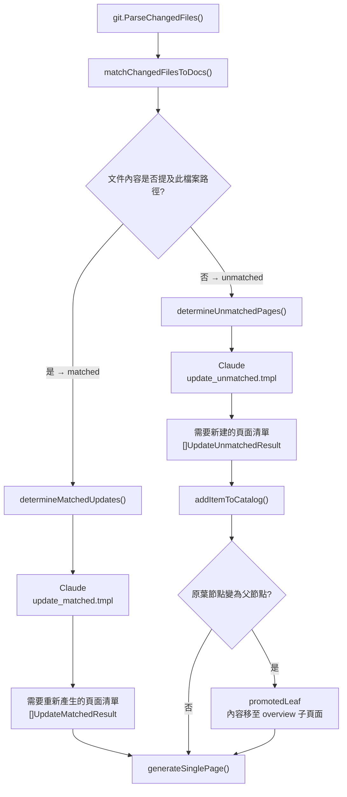
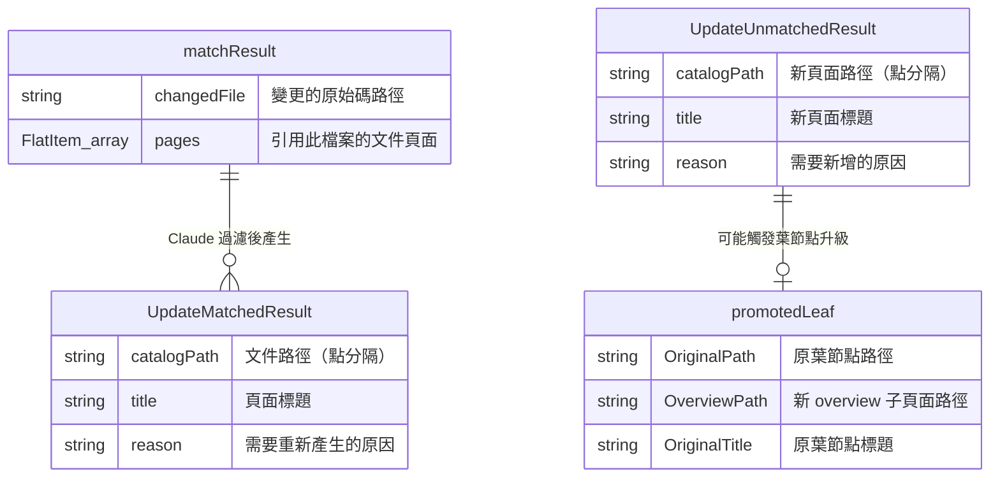
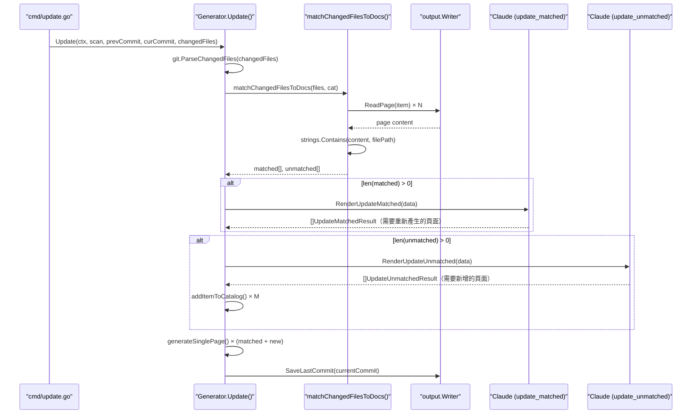

# 受影響頁面判斷邏輯

在 `selfmd update` 執行過程中，系統需要分兩條路徑判斷哪些文件頁面應被更新，以及哪些新頁面需要建立。本頁面說明這套判斷邏輯的實作原理與流程。

## 概述

當 git diff 回傳一批變更檔案後，`Update()` 函式並不會盲目地重新產生所有文件，而是採用**兩階段判斷策略**：

1. **文字比對（精確匹配）**：先搜尋現有文件內容中是否直接提及變更的原始碼檔案路徑，將變更檔案分為「已匹配」與「未匹配」兩類。
2. **Claude AI 語意判斷**：對兩類檔案分別呼叫 Claude，由 AI 閱讀實際變更並做出最終決策——哪些已匹配頁面真正需要更新？哪些未匹配檔案需要建立新頁面？

這套設計的核心原則是「保守更新」：只有在程式碼變更確實影響文件所描述的行為、架構或 API 時，才觸發重新產生。

---

## 架構

### 整體判斷流程



### 資料型別關係



---

## 第一階段：文字比對（matchChangedFilesToDocs）

`matchChangedFilesToDocs()` 透過搜尋現有文件頁面內容是否包含變更檔案的路徑字串，進行初步過濾。

```go
// For each changed file, find which pages reference it
for _, f := range files {
    var matchedPages []catalog.FlatItem
    for _, item := range items {
        content, ok := pageContents[item.Path]
        if !ok {
            continue
        }
        if strings.Contains(content, f.Path) {
            matchedPages = append(matchedPages, item)
        }
    }

    if len(matchedPages) > 0 {
        matched = append(matched, matchResult{
            changedFile: f.Path,
            pages:       matchedPages,
        })
    } else {
        unmatched = append(unmatched, f.Path)
    }
}
```

> 來源：internal/generator/updater.go#L191-L213

**關鍵設計決策**：

- 使用 `strings.Contains(content, f.Path)` 做字串匹配，而非 glob 或正規表達式，簡單可靠
- 預先讀取所有頁面內容到 `pageContents` map，避免重複 I/O
- 一個變更檔案可對應多個文件頁面；相同頁面也可被多個變更檔案匹配（後續去重）

---

## 第二階段 A：判斷已匹配頁面是否需要更新（determineMatchedUpdates）

針對「已匹配」的檔案，`determineMatchedUpdates()` 建構包含變更檔案清單與受影響頁面摘要的 prompt，傳給 Claude 判斷。

### Prompt 資料組裝

```go
data := prompt.UpdateMatchedPromptData{
    RepositoryName: g.Config.Project.Name,
    Language:       g.Config.Output.Language,
    ChangedFiles:   changedFilesList.String(),
    AffectedPages:  affectedPagesInfo.String(),
}

rendered, err := g.Engine.RenderUpdateMatched(data)
```

> 來源：internal/generator/updater.go#L257-L265

`AffectedPages` 包含每個可能受影響頁面的標題、catalogPath，以及頁面內容的前 500 字摘要（`content[:500] + "..."`），供 Claude 理解當前文件的描述範圍。

### Claude 的判斷標準

`update_matched.tmpl` 明確告知 Claude 以下判斷規則：

| 需要重新產生 | 不需要重新產生 |
|------------|-------------|
| 函式簽名或 API 介面變更 | 純粹的程式碼風格調整 |
| 新增或刪除重要功能 | 不影響對外行為的內部重構 |
| 架構或流程變更 | 錯誤修正但行為未改變 |
| 設定格式或選項變更 | 註解或文件字串變更 |

> 來源：internal/prompt/templates/zh-TW/update_matched.tmpl#L40-L46

### Claude 回傳格式

Claude 以 JSON 陣列回傳需要重新產生的頁面：

```go
type UpdateMatchedResult struct {
    CatalogPath string `json:"catalogPath"`
    Title       string `json:"title"`
    Reason      string `json:"reason"`
}
```

> 來源：internal/generator/updater.go#L18-L22

系統接著將 `CatalogPath` 對應回 `catalog.FlatItem`，若 Claude 回傳了不存在的路徑，會記錄警告並跳過：

```go
for _, r := range results {
    if item, ok := itemMap[r.CatalogPath]; ok {
        fmt.Printf("      → %s：%s\n", item.Title, r.Reason)
        pagesToRegen = append(pagesToRegen, item)
    } else {
        g.Logger.Warn("Claude 回傳的 catalogPath 不存在", "path", r.CatalogPath)
    }
}
```

> 來源：internal/generator/updater.go#L296-L303

---

## 第二階段 B：判斷未匹配檔案是否需要新頁面（determineUnmatchedPages）

針對「未匹配」（現有文件中沒有提及）的變更檔案，`determineUnmatchedPages()` 問 Claude：這些新增或修改的檔案是否代表需要建立新文件頁面的功能？

### Prompt 資料組裝

```go
data := prompt.UpdateUnmatchedPromptData{
    RepositoryName:  g.Config.Project.Name,
    Language:        g.Config.Output.Language,
    UnmatchedFiles:  fileList.String(),
    ExistingCatalog: existingCatalog,
    CatalogTable:    cat.BuildLinkTable(),
}
```

> 來源：internal/generator/updater.go#L320-L327

`ExistingCatalog` 是完整的目錄 JSON，`CatalogTable` 則是格式化後的頁面列表（用於 prompt 展示），讓 Claude 了解現有文件結構以決定新頁面的位置。

### Claude 的判斷標準

| 需要新頁面 | 不需要新頁面 |
|-----------|------------|
| 實作了全新的功能模組或子系統 | 現有模組的輔助檔案（helper、utility）|
| 新增了重要的 API 端點群組 | 測試檔案 |
| 引入了新的架構元件或設計模式 | 小型的 bug 修正 |
| 新增了重要的設定或部署機制 | 邏輯上屬於現有頁面範疇的變更 |

> 來源：internal/prompt/templates/zh-TW/update_unmatched.tmpl#L41-L51

---

## 葉節點升級（Leaf Node Promotion）

當 Claude 決定在現有葉節點（leaf node，即沒有子頁面的文件節點）下新增子頁面時，原葉節點必須轉變為父節點。系統透過 `addItemToCatalog()` 處理這個情況。

### 升級邏輯

```go
if len(item.Children) == 0 {
    // This is a leaf node that needs to become a parent.
    // Add an "overview" child to preserve the original content.
    (*children)[i].Children = append((*children)[i].Children, catalog.CatalogItem{
        Title: item.Title,
        Path:  "overview",
        Order: 0,
    })
    *promoted = &promotedLeaf{
        OriginalPath:  currentDotPath,
        OverviewPath:  currentDotPath + ".overview",
        OriginalTitle: item.Title,
    }
}
```

> 來源：internal/generator/updater.go#L402-L415

升級後，原葉節點的現有內容會被搬移至新建的 `overview` 子頁面：

```go
if content, err := g.Writer.ReadPage(origItem); err == nil && content != "" {
    if err := g.Writer.WritePage(overviewItem, content); err != nil {
        g.Logger.Warn("搬移頁面至 overview 失敗", "from", promoted.OriginalPath, "error", err)
    } else {
        fmt.Printf("      → 頁面升級：%s 原內容移至 %s\n", promoted.OriginalPath, promoted.OverviewPath)
    }
}
```

> 來源：internal/generator/updater.go#L109-L116

---

## 核心流程



---

## 使用範例

### 執行 update 指令

```bash
# 使用上次 generate/update 記錄的 commit 作為基準
selfmd update

# 指定起始 commit
selfmd update --since abc1234
```

### commit 基準選取邏輯

```go
previousCommit := sinceCommit
if previousCommit == "" {
    // Try reading saved commit from last generate/update
    saved, readErr := gen.Writer.ReadLastCommit()
    if readErr == nil && saved != "" {
        previousCommit = saved
    } else {
        // Fallback to merge-base
        base, err := git.GetMergeBase(rootDir, cfg.Git.BaseBranch)
        // ...
        previousCommit = base
    }
}
```

> 來源：cmd/update.go#L68-L82

優先順序：`--since` 參數 → 上次 generate/update 儲存的 commit → merge-base

### 變更檔案篩選

```go
changedFiles = git.FilterChangedFiles(changedFiles, cfg.Targets.Include, cfg.Targets.Exclude)
```

> 來源：cmd/update.go#L94

`FilterChangedFiles()` 使用 doublestar glob 模式對 git diff 輸出進行 include/exclude 篩選，確保只有設定中指定的目標檔案才會觸發文件更新。

---

## 相關連結

- [Git Diff 變更偵測](../change-detection/index.md)
- [Git 整合與增量更新](../index.md)
- [增量更新](../../core-modules/incremental-update/index.md)
- [文件產生管線](../../core-modules/generator/index.md)
- [Git 整合設定](../../configuration/git-config/index.md)
- [Prompt 模板引擎](../../core-modules/prompt-engine/index.md)

---

## 參考檔案

| 檔案路徑 | 說明 |
|----------|------|
| `internal/generator/updater.go` | 受影響頁面判斷核心邏輯（`matchChangedFilesToDocs`、`determineMatchedUpdates`、`determineUnmatchedPages`、`addItemToCatalog`）|
| `internal/git/git.go` | Git 操作封裝，包含 `ParseChangedFiles`、`FilterChangedFiles` |
| `cmd/update.go` | `selfmd update` 指令實作，負責 commit 基準選取與呼叫 `Generator.Update()` |
| `internal/catalog/catalog.go` | `Catalog`、`FlatItem`、`CatalogItem` 資料結構定義 |
| `internal/prompt/engine.go` | `UpdateMatchedPromptData`、`UpdateUnmatchedPromptData` 資料結構及 `RenderUpdateMatched`、`RenderUpdateUnmatched` |
| `internal/prompt/templates/zh-TW/update_matched.tmpl` | Claude 判斷「已匹配頁面是否需要重新產生」的 prompt 模板 |
| `internal/prompt/templates/zh-TW/update_unmatched.tmpl` | Claude 判斷「未匹配檔案是否需要新頁面」的 prompt 模板 |