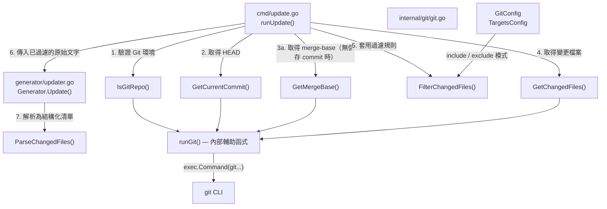
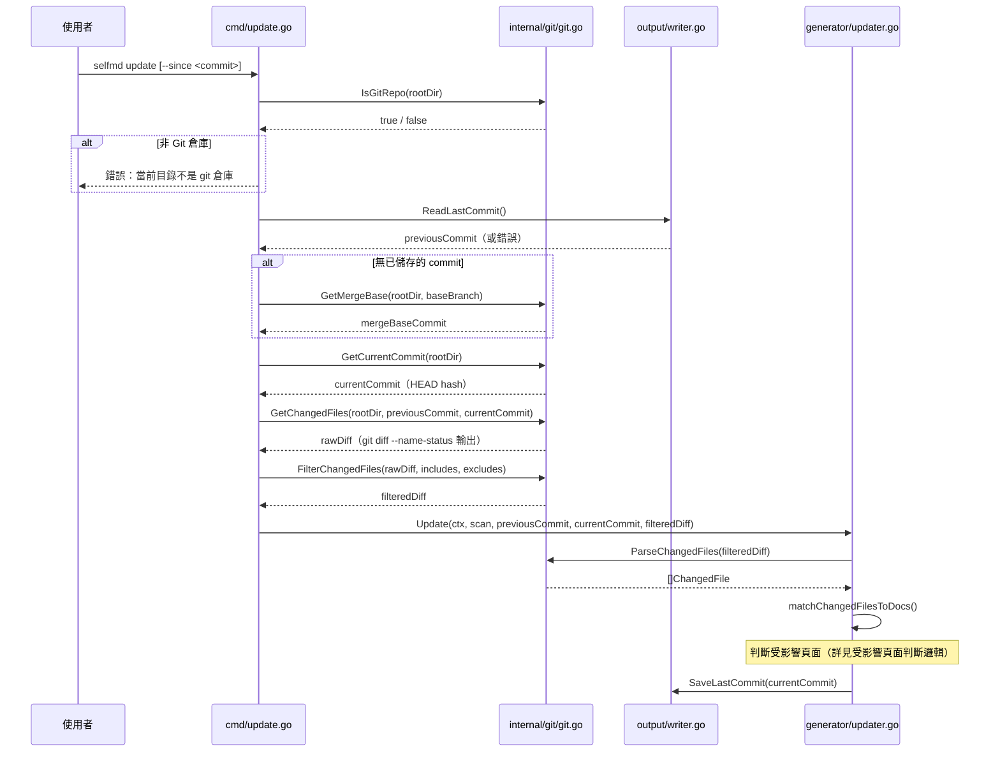
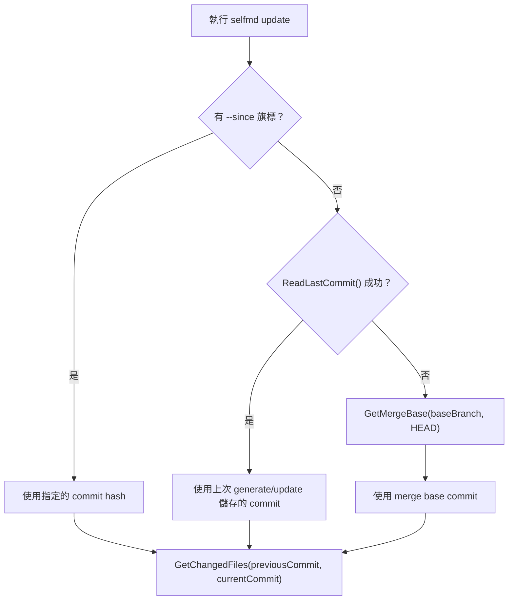

# Git Diff 變更偵測

`internal/git` 套件提供與 Git 版本控制系統互動的底層功能，負責偵測兩個提交（commit）之間的檔案變更，並將原始 `git diff` 輸出解析、過濾為結構化資料，供增量更新流程使用。

## 概述

當執行 `selfmd update` 時，系統需要知道「哪些原始碼檔案自上次文件產生以來發生了變更」。這項工作由 `internal/git` 套件全權負責：

- **偵測 Git 環境**：確認當前目錄是否為有效的 Git 倉庫
- **比對提交範圍**：取得兩個 commit 之間的差異檔案清單
- **解析原始輸出**：將 `git diff --name-status` 的文字輸出轉換為結構化的 `ChangedFile` 清單
- **套用過濾規則**：依照設定檔的 `targets.include` 與 `targets.exclude` glob 模式篩選無關檔案
- **提供 commit 查詢**：取得 HEAD commit hash、merge base 等版本資訊

此套件刻意保持純粹，僅封裝 Git CLI 呼叫，不涉及任何文件產生邏輯。所有複雜的「哪些文件頁面受影響」判斷邏輯，則由上層的 `generator` 套件（`updater.go`）處理。

---

## 架構



---

## 核心資料結構

### `ChangedFile`

代表一筆來自 `git diff --name-status` 的檔案變更記錄。

```go
// ChangedFile represents a single file from git diff --name-status output.
type ChangedFile struct {
	Status string // "M", "A", "D", "R"
	Path   string
}
```

> 來源：internal/git/git.go#L47-L51

| 欄位 | 說明 |
|------|------|
| `Status` | 變更狀態。`M`＝修改、`A`＝新增、`D`＝刪除、`R`＝重新命名 |
| `Path` | 相對於工作目錄的檔案路徑；若為重新命名，則為**目標路徑** |

---

## 公開函式說明

### `IsGitRepo(dir string) bool`

確認指定目錄是否位於 Git 倉庫內。執行 `git rev-parse --is-inside-work-tree` 並以指令是否成功作為判斷依據。

```go
func IsGitRepo(dir string) bool {
	cmd := exec.Command("git", "rev-parse", "--is-inside-work-tree")
	cmd.Dir = dir
	err := cmd.Run()
	return err == nil
}
```

> 來源：internal/git/git.go#L13-L18

---

### `GetCurrentCommit(dir string) (string, error)`

回傳當前 `HEAD` 的完整 commit hash（40 位十六進位字元）。

```go
func GetCurrentCommit(dir string) (string, error) {
	return runGit(dir, "rev-parse", "HEAD")
}
```

> 來源：internal/git/git.go#L21-L23

---

### `GetMergeBase(dir, baseBranch string) (string, error)`

找出當前分支與指定基底分支（`baseBranch`）的最近共同祖先 commit。當沒有已儲存的上次 commit 時，此函式作為比對起點的回退方案。

```go
func GetMergeBase(dir, baseBranch string) (string, error) {
	return runGit(dir, "merge-base", baseBranch, "HEAD")
}
```

> 來源：internal/git/git.go#L26-L28

---

### `GetChangedFiles(dir, fromCommit, toCommit string) (string, error)`

取得兩個 commit 之間所有變更檔案的原始文字輸出（`git diff --relative --name-status fromCommit..toCommit`）。

使用 `--relative` 旗標確保路徑相對於工作目錄而非 Git 倉庫根目錄，這在子目錄專案中尤為重要。

```go
func GetChangedFiles(dir, fromCommit, toCommit string) (string, error) {
	return runGit(dir, "diff", "--relative", "--name-status", fromCommit+".."+toCommit)
}
```

> 來源：internal/git/git.go#L32-L34

**輸出範例：**

```
M	internal/git/git.go
A	internal/scanner/scanner.go
D	cmd/old.go
R100	cmd/old_name.go	cmd/new_name.go
```

---

### `GetChangedFilesSince(dir, sinceCommit string) (string, error)`

取得指定 commit 至 `HEAD` 之間的所有變更。是 `GetChangedFiles` 的便利包裝，固定將 `HEAD` 作為結束點。

```go
func GetChangedFilesSince(dir, sinceCommit string) (string, error) {
	return runGit(dir, "diff", "--relative", "--name-status", sinceCommit+"..HEAD")
}
```

> 來源：internal/git/git.go#L38-L40

---

### `ParseChangedFiles(changedFiles string) []ChangedFile`

將 `git diff --name-status` 的原始文字輸出解析為 `[]ChangedFile` 結構化清單。

```go
func ParseChangedFiles(changedFiles string) []ChangedFile {
	var result []ChangedFile
	for _, line := range strings.Split(changedFiles, "\n") {
		line = strings.TrimSpace(line)
		if line == "" {
			continue
		}
		parts := strings.SplitN(line, "\t", 3)
		if len(parts) < 2 {
			continue
		}
		status := string(parts[0][0]) // "M", "A", "D", or "R" (R100 → R)
		path := parts[len(parts)-1]   // for renames, use destination path
		result = append(result, ChangedFile{Status: status, Path: path})
	}
	return result
}
```

> 來源：internal/git/git.go#L54-L70

**解析規則：**

- 每行以 Tab（`\t`）分隔，最多切成 3 部分（處理重新命名格式 `R100\told\tnew`）
- 狀態碼取第一個字元（`R100` → `R`）
- 路徑取最後一個欄位（重新命名時為目標路徑）

---

### `FilterChangedFiles(changedFiles string, includes, excludes []string) string`

依照 `targets.include` 與 `targets.exclude` 設定的 glob 模式，過濾 `git diff --name-status` 的原始文字輸出，回傳符合條件的原始文字（保持相同格式）。

```go
func FilterChangedFiles(changedFiles string, includes, excludes []string) string {
	lines := strings.Split(changedFiles, "\n")
	var filtered []string

	for _, line := range lines {
		// ...
		// Check excludes
		excluded := false
		for _, pattern := range excludes {
			if matched, _ := doublestar.Match(pattern, filePath); matched {
				excluded = true
				break
			}
		}
		// Check includes (if configured)
		if len(includes) > 0 {
			included := false
			for _, pattern := range includes {
				if matched, _ := doublestar.Match(pattern, filePath); matched {
					included = true
					break
				}
			}
			if !included {
				continue
			}
		}
		filtered = append(filtered, line)
	}
	return strings.Join(filtered, "\n")
}
```

> 來源：internal/git/git.go#L73-L122

**過濾優先順序：**

1. 先套用 `excludes`：命中任何 exclude 模式即排除
2. 再套用 `includes`：若有設定，未命中任何 include 模式則排除
3. 若 `includes` 為空，則不限制（允許所有非 excluded 的檔案）

Glob 模式比對使用 [`doublestar`](https://github.com/bmatcuk/doublestar) 套件，支援 `**` 雙星號萬用字元。

---

## 核心流程

以下為 `selfmd update` 執行時，Git 變更偵測的完整運作序列：



---

## 比對起點的選取邏輯

`selfmd update` 的增量比對起點按以下優先順序決定：



| 情境 | 比對起點來源 |
|------|-------------|
| 首次更新，已執行過 `generate` | `.doc-build/.last-commit` 中儲存的 commit |
| 使用 `--since` 旗標 | 使用者指定的 commit hash |
| 無儲存記錄（回退方案） | `git merge-base <baseBranch> HEAD` |

---

## 設定參數

Git 變更偵測的行為由 `selfmd.yaml` 中的以下區段控制：

```yaml
git:
  enabled: true
  base_branch: main   # GetMergeBase() 的基底分支名稱

targets:
  include:
    - "src/**"
    - "internal/**"
  exclude:
    - "vendor/**"
    - "**/*.pb.go"
    - ".doc-build/**"
```

對應的 Go 結構：

```go
type GitConfig struct {
	Enabled    bool   `yaml:"enabled"`
	BaseBranch string `yaml:"base_branch"`
}
```

> 來源：internal/config/config.go#L91-L94

---

## 使用範例

以下為 `cmd/update.go` 中呼叫整個 Git 偵測流程的完整片段：

```go
if !git.IsGitRepo(rootDir) {
    return fmt.Errorf("當前目錄不是 git 倉庫，無法執行增量更新")
}

// Determine comparison commit
previousCommit := sinceCommit
if previousCommit == "" {
    saved, readErr := gen.Writer.ReadLastCommit()
    if readErr == nil && saved != "" {
        previousCommit = saved
    } else {
        base, err := git.GetMergeBase(rootDir, cfg.Git.BaseBranch)
        if err != nil {
            return fmt.Errorf("無法取得基準 commit: %w\n提示：先執行 selfmd generate 或使用 --since 指定 commit", err)
        }
        previousCommit = base
    }
}

currentCommit, err := git.GetCurrentCommit(rootDir)
// ...

changedFiles, err := git.GetChangedFiles(rootDir, previousCommit, currentCommit)
// ...

changedFiles = git.FilterChangedFiles(changedFiles, cfg.Targets.Include, cfg.Targets.Exclude)
```

> 來源：cmd/update.go#L49-L99

---

## 相關連結

- [Git 整合與增量更新](../index.md)
- [受影響頁面判斷邏輯](../affected-pages/index.md)
- [增量更新](../../core-modules/incremental-update/index.md)
- [selfmd update 指令](../../cli/cmd-update/index.md)
- [Git 整合設定](../../configuration/git-config/index.md)

---

## 參考檔案

| 檔案路徑 | 說明 |
|----------|------|
| `internal/git/git.go` | Git 套件全部實作：IsGitRepo、GetCurrentCommit、GetMergeBase、GetChangedFiles、GetChangedFilesSince、ParseChangedFiles、FilterChangedFiles、runGit |
| `cmd/update.go` | `selfmd update` 指令實作，展示 Git 套件的完整呼叫流程 |
| `internal/config/config.go` | `GitConfig`、`TargetsConfig` 結構定義，控制變更偵測行為的設定參數 |
| `internal/generator/updater.go` | `Generator.Update()` 與 `ParseChangedFiles()` 的使用端，負責將變更檔案清單轉換為受影響文件頁面 |