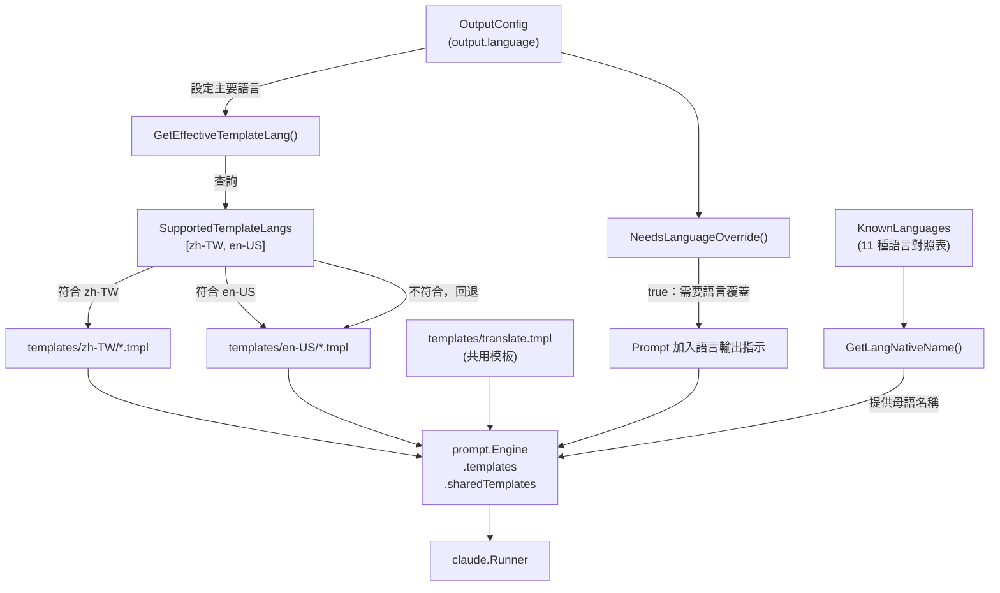
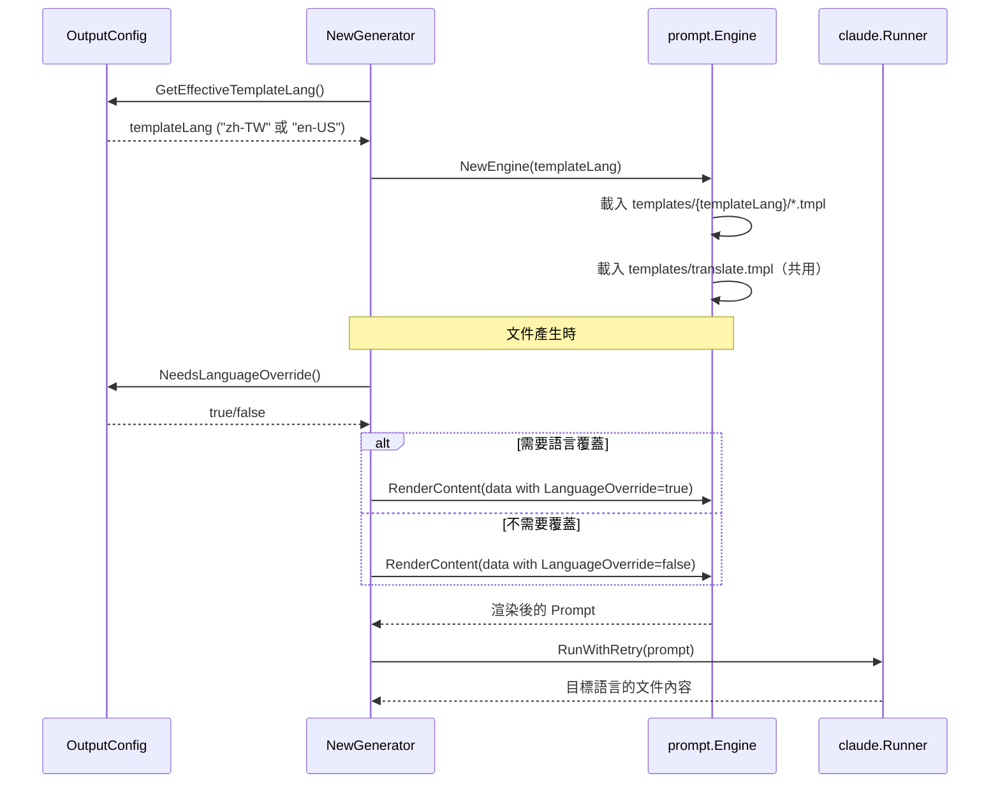

# 支援的語言與模板

selfmd 透過雙層語言架構支援多語言文件產生：**輸出語言**（11 種）決定文件內容的語言，**模板語言**（2 種）決定 Prompt 指令所使用的語言。

## 概述

selfmd 的多語言支援分為兩個層次：

- **輸出語言（Output Language）**：文件最終呈現的語言。透過 `selfmd.yaml` 中的 `output.language`（主要語言）與 `output.secondary_languages`（次要語言列表）設定。目前系統定義了 11 種已知語言。
- **模板語言（Template Language）**：Claude CLI 所接收到的 Prompt 指令所用的語言。目前只有 `zh-TW` 與 `en-US` 兩種語言擁有內建模板資料夾；其他語言會自動回退到 `en-US` 模板，並透過 **LanguageOverride** 機制在 Prompt 中加入明確的語言輸出指示。

這種設計讓 selfmd 能支援遠超過模板數量的輸出語言，同時不需要為每種語言維護完整的 Prompt 模板集合。

## 架構



## 已知語言清單

系統在 `KnownLanguages` 對照表中定義了 11 種語言代碼及其母語名稱：

```go
var KnownLanguages = map[string]string{
    "zh-TW": "繁體中文",
    "zh-CN": "简体中文",
    "en-US": "English",
    "ja-JP": "日本語",
    "ko-KR": "한국어",
    "fr-FR": "Français",
    "de-DE": "Deutsch",
    "es-ES": "Español",
    "pt-BR": "Português",
    "th-TH": "ไทย",
    "vi-VN": "Tiếng Việt",
}
```

> 來源：internal/config/config.go#L39-L51

| 語言代碼 | 母語名稱 | 有內建模板 | 備註 |
|---------|---------|-----------|------|
| `zh-TW` | 繁體中文 | ✅ | 預設主要語言 |
| `en-US` | English | ✅ | 模板回退語言 |
| `zh-CN` | 简体中文 | ❌ | 使用 en-US 模板 + LanguageOverride |
| `ja-JP` | 日本語 | ❌ | 使用 en-US 模板 + LanguageOverride |
| `ko-KR` | 한국어 | ❌ | 使用 en-US 模板 + LanguageOverride |
| `fr-FR` | Français | ❌ | 使用 en-US 模板 + LanguageOverride |
| `de-DE` | Deutsch | ❌ | 使用 en-US 模板 + LanguageOverride |
| `es-ES` | Español | ❌ | 使用 en-US 模板 + LanguageOverride |
| `pt-BR` | Português | ❌ | 使用 en-US 模板 + LanguageOverride |
| `th-TH` | ไทย | ❌ | 使用 en-US 模板 + LanguageOverride |
| `vi-VN` | Tiếng Việt | ❌ | 使用 en-US 模板 + LanguageOverride |

## 內建模板資料夾

目前只有 `zh-TW` 與 `en-US` 兩種語言擁有完整的模板資料夾：

```go
var SupportedTemplateLangs = []string{"zh-TW", "en-US"}
```

> 來源：internal/config/config.go#L54

每個語言資料夾包含以下模板檔案：

```
internal/prompt/templates/
├── zh-TW/
│   ├── catalog.tmpl          # 文件目錄產生 Prompt
│   ├── content.tmpl          # 內容頁面產生 Prompt
│   ├── updater.tmpl          # 增量更新 Prompt（舊版）
│   ├── update_matched.tmpl   # 判斷受影響頁面 Prompt
│   └── update_unmatched.tmpl # 判斷是否新增頁面 Prompt
├── en-US/
│   ├── catalog.tmpl
│   ├── content.tmpl
│   ├── updater.tmpl
│   ├── update_matched.tmpl
│   └── update_unmatched.tmpl
└── translate.tmpl            # 翻譯 Prompt（所有語言共用）
```

### 模板用途說明

| 模板檔案 | 對應方法 | 用途 |
|---------|---------|------|
| `catalog.tmpl` | `Engine.RenderCatalog()` | 指示 Claude 分析專案並產生文件目錄結構 |
| `content.tmpl` | `Engine.RenderContent()` | 指示 Claude 為特定目錄條目撰寫 Wiki 頁面 |
| `updater.tmpl` | `Engine.RenderUpdater()` | 增量更新（舊版，保留作為參考） |
| `update_matched.tmpl` | `Engine.RenderUpdateMatched()` | 判斷哪些現有頁面需因程式碼變更而重新產生 |
| `update_unmatched.tmpl` | `Engine.RenderUpdateUnmatched()` | 判斷未被現有文件提及的變更檔案是否需要新增頁面 |
| `translate.tmpl` | `Engine.RenderTranslate()` | 翻譯文件頁面（所有語言共用，不分模板語言） |

### 共用模板：translate.tmpl

翻譯模板是唯一的共用模板（不依賴語言資料夾），以英文撰寫，並透過 `TranslatePromptData` 動態注入來源語言與目標語言資訊：

```go
type TranslatePromptData struct {
    SourceLanguage     string // e.g., "zh-TW"
    SourceLanguageName string // e.g., "繁體中文"
    TargetLanguage     string // e.g., "en-US"
    TargetLanguageName string // e.g., "English"
    SourceContent      string // 要翻譯的完整 Markdown 內容
}
```

> 來源：internal/prompt/engine.go#L97-L104

## 模板語言選取機制

### GetEffectiveTemplateLang()

當系統初始化 `prompt.Engine` 時，會呼叫此方法決定要載入哪個語言資料夾的模板。若設定的主要語言有對應模板，則使用該語言；否則回退至 `en-US`：

```go
func (o *OutputConfig) GetEffectiveTemplateLang() string {
    for _, lang := range SupportedTemplateLangs {
        if o.Language == lang {
            return o.Language
        }
    }
    return "en-US"
}
```

> 來源：internal/config/config.go#L58-L65

### NeedsLanguageOverride()

當模板語言（`en-US`）與實際設定的輸出語言（例如 `ja-JP`）不一致時，此方法回傳 `true`，系統會在 Prompt 中注入明確的語言輸出指示：

```go
func (o *OutputConfig) NeedsLanguageOverride() bool {
    return o.GetEffectiveTemplateLang() != o.Language
}
```

> 來源：internal/config/config.go#L69-L71

### LanguageOverride 在 Prompt 中的效果

以 `content.tmpl`（en-US 版本）為例，當 `LanguageOverride` 為 `true` 時，模板會在專案資訊區段加入強制語言指示：

```
{{- if .LanguageOverride}}
- **Document Language**: {{.LanguageOverrideName}} ({{.Language}})
- **IMPORTANT**: All documentation content MUST be written in **{{.LanguageOverrideName}}** ({{.Language}}).
{{- else}}
- **Document Language**: {{.LanguageName}} ({{.Language}})
{{- end}}
```

> 來源：internal/prompt/templates/en-US/content.tmpl#L20-L27

## 導航頁面本地化

除了 Prompt 模板之外，系統產生導航頁面（首頁、側欄、分類索引）時，也依據語言顯示對應的 UI 字串。目前 `UIStrings` 直接支援 `zh-TW` 與 `en-US`，其他語言則回退至 `en-US`：

```go
var UIStrings = map[string]map[string]string{
    "zh-TW": {
        "techDocs":        "技術文件",
        "catalog":         "目錄",
        "home":            "首頁",
        "sectionContains": "本章節包含以下內容：",
        "autoGenerated":   "本文件由 [selfmd](https://github.com/monkenwu/selfmd) 自動產生",
    },
    "en-US": {
        "techDocs":        "Technical Documentation",
        "catalog":         "Table of Contents",
        "home":            "Home",
        "sectionContains": "This section contains the following:",
        "autoGenerated":   "This documentation was automatically generated by [selfmd](https://github.com/monkenwu/selfmd)",
    },
}
```

> 來源：internal/output/navigation.go#L12-L27

## 核心流程



## 使用範例

### 設定主要語言為日文（無內建模板）

```yaml
output:
  language: ja-JP
  secondary_languages:
    - en-US
    - zh-TW
```

系統行為：
1. `GetEffectiveTemplateLang()` 回傳 `"en-US"`（回退）
2. `NeedsLanguageOverride()` 回傳 `true`
3. Prompt 中注入：「所有文件內容必須以日本語（ja-JP）撰寫」
4. `GetLangNativeName("ja-JP")` 回傳 `"日本語"` 供 Prompt 使用

### 取得語言母語名稱

```go
func GetLangNativeName(code string) string {
    if name, ok := KnownLanguages[code]; ok {
        return name
    }
    return code
}
```

> 來源：internal/config/config.go#L75-L80

若傳入未知語言代碼（如 `"ru-RU"`），函式直接回傳代碼本身（`"ru-RU"`），不會出錯。

### 翻譯指令使用範例

```go
data := prompt.TranslatePromptData{
    SourceLanguage:     sourceLang,
    SourceLanguageName: sourceLangName,
    TargetLanguage:     targetLang,
    TargetLanguageName: targetLangName,
    SourceContent:      sourceContent,
}
rendered, err := g.Engine.RenderTranslate(data)
```

> 來源：internal/generator/translate_phase.go#L186-L194

## 相關連結

- [多語言支援（概覽）](../index.md)
- [翻譯工作流程](../translation-workflow/index.md)
- [輸出與多語言設定](../../configuration/output-language/index.md)
- [selfmd translate 指令](../../cli/cmd-translate/index.md)
- [Prompt 模板引擎](../../core-modules/prompt-engine/index.md)
- [翻譯階段](../../core-modules/generator/translate-phase/index.md)

## 參考檔案

| 檔案路徑 | 說明 |
|----------|------|
| `internal/config/config.go` | `KnownLanguages`、`SupportedTemplateLangs`、`GetEffectiveTemplateLang()`、`NeedsLanguageOverride()`、`GetLangNativeName()` 定義 |
| `internal/prompt/engine.go` | `Engine` 結構、`NewEngine()`、所有 `Render*()` 方法、`TranslatePromptData` 定義 |
| `internal/prompt/templates/zh-TW/catalog.tmpl` | 繁體中文目錄產生 Prompt 模板 |
| `internal/prompt/templates/zh-TW/content.tmpl` | 繁體中文內容頁面產生 Prompt 模板 |
| `internal/prompt/templates/zh-TW/update_matched.tmpl` | 繁體中文受影響頁面判斷 Prompt 模板 |
| `internal/prompt/templates/zh-TW/update_unmatched.tmpl` | 繁體中文新增頁面判斷 Prompt 模板 |
| `internal/prompt/templates/zh-TW/updater.tmpl` | 繁體中文增量更新 Prompt 模板（舊版） |
| `internal/prompt/templates/en-US/catalog.tmpl` | 英文目錄產生 Prompt 模板 |
| `internal/prompt/templates/en-US/content.tmpl` | 英文內容頁面產生 Prompt 模板（含 LanguageOverride 邏輯） |
| `internal/prompt/templates/translate.tmpl` | 翻譯 Prompt 共用模板（所有語言） |
| `internal/output/navigation.go` | `UIStrings` 導航頁面本地化字串、`getUIStrings()` 回退邏輯 |
| `internal/generator/pipeline.go` | `NewGenerator()` 中的 `GetEffectiveTemplateLang()` 呼叫 |
| `internal/generator/translate_phase.go` | 翻譯管線、`TranslateOptions`、`translatePages()` |
| `cmd/translate.go` | `selfmd translate` 指令實作與目標語言驗證邏輯 |