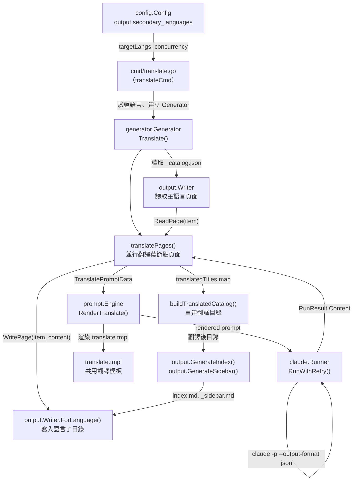
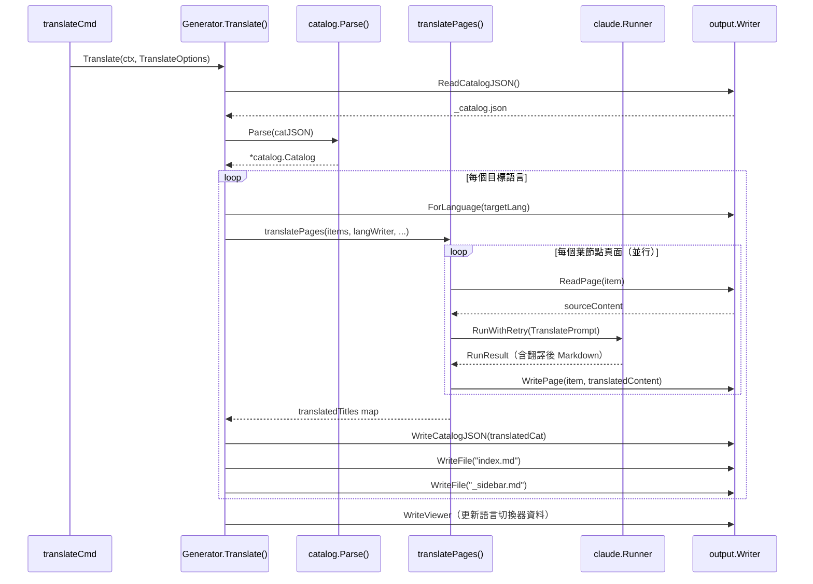

# 翻譯工作流程

`selfmd translate` 指令以主要語言的產出文件為基準，透過 Claude CLI 自動翻譯為一或多個次要語言，並將結果寫入獨立的語言子目錄。

## 概述

翻譯工作流程是 selfmd 多語言支援的核心機制。使用者在 `selfmd.yaml` 中設定 `output.secondary_languages` 後，執行 `selfmd translate` 即可將已產生的主要語言文件翻譯為所有次要語言。

**關鍵概念：**

- **主要語言（Primary Language）**：`output.language` 設定，是所有內容頁面的原始語言，也是翻譯的**來源語言**。
- **次要語言（Secondary Languages）**：`output.secondary_languages` 設定的語言列表，每個語言對應一個獨立的輸出子目錄。
- **共用翻譯模板**：翻譯使用 `translate.tmpl`，為不分語言的共用模板，而非語言特定模板資料夾下的模板。
- **增量跳過**：預設情況下已存在的翻譯頁面會被跳過，使用 `--force` 強制重新翻譯。

翻譯流程與主要文件產生流程解耦——必須先完成 `selfmd generate`，才能執行 `selfmd translate`。

## 架構



## 設定

### selfmd.yaml 相關欄位

```yaml
output:
  language: "zh-TW"               # 主要語言（翻譯來源）
  secondary_languages:             # 翻譯目標語言列表
    - "en-US"
    - "ja-JP"
```

> 來源：`internal/config/config.go#L31-L36`

### 支援的語言代碼

`config.KnownLanguages` 定義了系統已知的語言代碼與原生名稱對照：

```go
var KnownLanguages = map[string]string{
    "zh-TW": "繁體中文",
    "zh-CN": "简体中文",
    "en-US": "English",
    "ja-JP": "日本語",
    "ko-KR": "한국어",
    "fr-FR": "Français",
    "de-DE": "Deutsch",
    "es-ES": "Español",
    "pt-BR": "Português",
    "th-TH": "ไทย",
    "vi-VN": "Tiếng Việt",
}
```

> 來源：`internal/config/config.go#L39-L51`

不在上表中的語言代碼也可使用，`GetLangNativeName()` 函式在找不到對應名稱時會直接返回語言代碼本身。

### Prompt 模板語言回退

翻譯 Prompt 使用的是**共用模板** `translate.tmpl`，不受 `output.language` 的模板語言回退邏輯影響。此模板以英文撰寫，明確指定來源語言與目標語言：

```go
// SupportedTemplateLangs lists language codes that have built-in prompt template folders.
var SupportedTemplateLangs = []string{"zh-TW", "en-US"}
```

> 來源：`internal/config/config.go#L54`

## CLI 指令

```
selfmd translate [flags]
```

| 旗標 | 說明 |
|------|------|
| `--lang` | 只翻譯指定語言（可多次使用，預設：所有次要語言） |
| `--force` | 強制重新翻譯已存在的檔案 |
| `--concurrency` | 並行度（覆蓋 `claude.max_concurrent` 設定） |

`cmd/translate.go` 在啟動翻譯前會驗證指定語言是否存在於 `secondary_languages` 清單中：

```go
for _, l := range translateLangs {
    if !validLangs[l] {
        return fmt.Errorf("語言 %s 不在 secondary_languages 列表中（可用：%s）",
            l, strings.Join(cfg.Output.SecondaryLanguages, ", "))
    }
}
```

> 來源：`cmd/translate.go#L61-L65`

## 核心流程

### 翻譯管線總覽



### 頁面翻譯細節

`translatePages()` 只翻譯**葉節點**（`HasChildren == false`）頁面，分類索引頁面由 `output.GenerateCategoryIndex()` 重新以目標語言生成。

**跳過邏輯：**

```go
if !opts.Force && langWriter.PageExists(item) {
    skipped.Add(1)
    // 從已存在的翻譯中提取標題（供目錄重建用）
    if content, err := langWriter.ReadPage(item); err == nil {
        if title := extractTitle(content); title != "" {
            titlesMu.Lock()
            translatedTitles[item.Path] = title
            titlesMu.Unlock()
        }
    }
    fmt.Printf("      [跳過] %s（已存在）\n", item.Title)
    return nil
}
```

> 來源：`internal/generator/translate_phase.go#L157-L168`

**並行控制：**

使用 `errgroup` + 緩衝通道（semaphore）實現有界並行：

```go
eg, ctx := errgroup.WithContext(ctx)
sem := make(chan struct{}, opts.Concurrency)

for _, item := range leafItems {
    item := item
    eg.Go(func() error {
        sem <- struct{}{}
        defer func() { <-sem }()
        // ... 翻譯邏輯
    })
}
eg.Wait()
```

> 來源：`internal/generator/translate_phase.go#L150-L249`

### 翻譯目錄重建

翻譯完成後，系統會以翻譯後的頁面標題重建目錄（`_catalog.json`）。`extractTitle()` 從翻譯後 Markdown 的第一個 `#` 標題中提取標題：

```go
func extractTitle(content string) string {
    re := regexp.MustCompile(`(?m)^#\s+(.+)$`)
    match := re.FindStringSubmatch(content)
    if len(match) >= 2 {
        return strings.TrimSpace(match[1])
    }
    return ""
}
```

> 來源：`internal/generator/translate_phase.go#L267-L274`

## 翻譯 Prompt 規則

`internal/prompt/templates/translate.tmpl` 是共用模板，以英文撰寫，指示 Claude 翻譯文件時必須遵守以下規則：

| 規則 | 說明 |
|------|------|
| 保留 Markdown 格式 | 標題、連結、程式碼區塊、表格、Mermaid 圖表 |
| 不翻譯程式碼 | 識別符、檔案路徑、變數名稱、程式碼區塊保持原文 |
| 翻譯章節標題 | 使用目標語言的自然表達 |
| 保留相對連結路徑 | `[text](../path/index.md)` 只翻譯顯示文字，路徑不變 |
| 保留 Mermaid 圖表 | 翻譯圖表標籤，語法不變 |
| 保留來源標註 | `> Source: path/to/file#L10-L25` 格式不變 |
| 自然翻譯 | 產出流暢的目標語言文字，非逐字翻譯 |
| 保留參考檔案表 | 翻譯表頭，檔案路徑不變 |

> 來源：`internal/prompt/templates/translate.tmpl#L1-L35`

## 輸出目錄結構

主要語言文件置於 `.doc-build/`，每個次要語言的翻譯置於對應的子目錄：

```
.doc-build/
├── _catalog.json          # 主要語言目錄
├── index.md               # 主要語言首頁
├── _sidebar.md            # 主要語言側欄
├── {section}/{page}/
│   └── index.md           # 主要語言內容頁面
├── en-US/                 # 英文翻譯
│   ├── _catalog.json
│   ├── index.md
│   ├── _sidebar.md
│   └── {section}/{page}/
│       └── index.md
└── ja-JP/                 # 日文翻譯
    └── ...
```

`Writer.ForLanguage(targetLang)` 建立一個以語言子目錄為 `BaseDir` 的新 Writer 實例：

```go
func (w *Writer) ForLanguage(lang string) *Writer {
    return &Writer{
        BaseDir: filepath.Join(w.BaseDir, lang),
    }
}
```

> 來源：`internal/output/writer.go#L138-L143`

## 瀏覽器多語言整合

翻譯完成後，`Translate()` 會呼叫 `buildDocMeta()` 重新產生靜態瀏覽器（`index.html`），將所有語言資訊注入瀏覽器的語言切換器。`DocMeta` 結構描述主要與次要語言：

```go
type DocMeta struct {
    DefaultLanguage    string     `json:"default_language"`
    AvailableLanguages []LangInfo `json:"available_languages"`
}

type LangInfo struct {
    Code       string `json:"code"`
    NativeName string `json:"native_name"`
    IsDefault  bool   `json:"is_default"`
}
```

> 來源：`internal/output/writer.go#L13-L23`

## UI 字串本地化

`output.UIStrings` 定義了分類索引頁、首頁等導航頁面中使用的 UI 字串。目前內建 `zh-TW` 與 `en-US` 兩組，其他語言回退至 `en-US`：

```go
var UIStrings = map[string]map[string]string{
    "zh-TW": {
        "techDocs":        "技術文件",
        "sectionContains": "本章節包含以下內容：",
        // ...
    },
    "en-US": {
        "techDocs":        "Technical Documentation",
        "sectionContains": "This section contains the following:",
        // ...
    },
}
```

> 來源：`internal/output/navigation.go#L12-L27`

## 相關連結

- [支援的語言與模板](../supported-languages/index.md)
- [多語言支援](../index.md)
- [翻譯階段](../../core-modules/generator/translate-phase/index.md)
- [Claude CLI 執行器](../../core-modules/claude-runner/index.md)
- [Prompt 模板引擎](../../core-modules/prompt-engine/index.md)
- [selfmd translate](../../cli/cmd-translate/index.md)
- [輸出與多語言設定](../../configuration/output-language/index.md)
- [靜態文件瀏覽器](../../core-modules/static-viewer/index.md)

## 參考檔案

| 檔案路徑 | 說明 |
|----------|------|
| `internal/generator/translate_phase.go` | 翻譯管線核心邏輯：`Translate()`、`translatePages()`、`buildTranslatedCatalog()` |
| `cmd/translate.go` | `selfmd translate` CLI 指令實作，語言驗證與選項解析 |
| `internal/config/config.go` | `OutputConfig`、`KnownLanguages`、`SupportedTemplateLangs`、`GetLangNativeName()` |
| `internal/prompt/templates/translate.tmpl` | 翻譯用共用 Prompt 模板 |
| `internal/prompt/engine.go` | `TranslatePromptData` 結構、`RenderTranslate()` 方法 |
| `internal/output/writer.go` | `Writer.ForLanguage()`、`ReadPage()`、`WritePage()`、`DocMeta` |
| `internal/output/navigation.go` | `UIStrings`、`GenerateIndex()`、`GenerateSidebar()`、`GenerateCategoryIndex()` |
| `internal/catalog/catalog.go` | `Catalog`、`FlatItem`、`Flatten()` |
| `internal/generator/pipeline.go` | `Generator` 結構、`buildDocMeta()` |
| `internal/claude/runner.go` | `Runner.RunWithRetry()` 翻譯呼叫執行 |