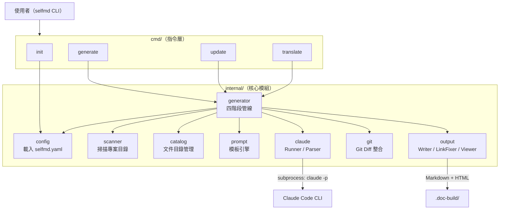
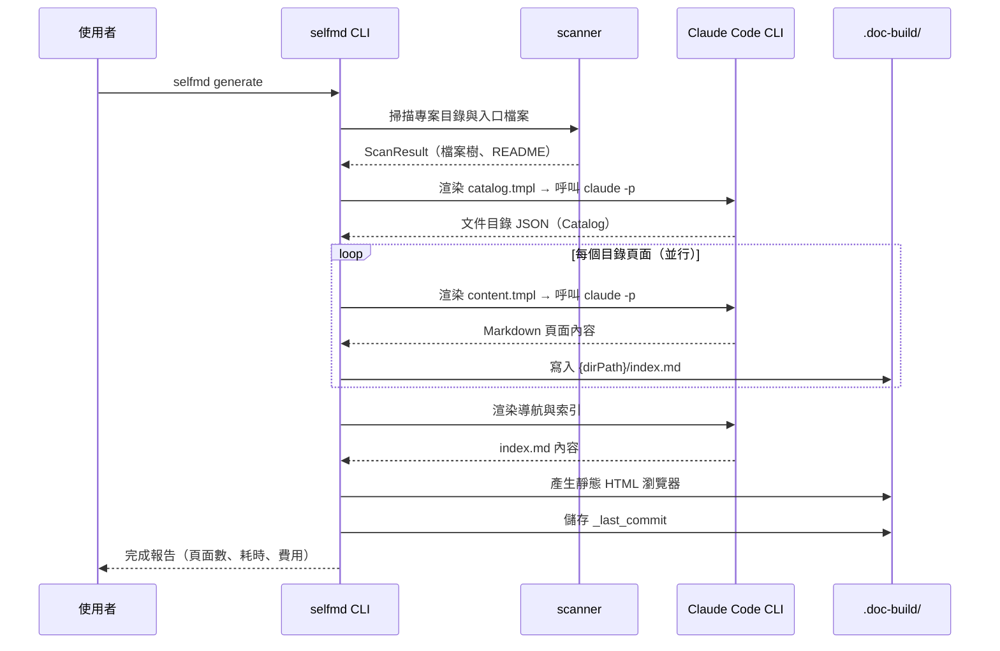

# 專案介紹與功能特色

`selfmd` 是一款 Go 語言撰寫的 CLI 工具，透過在本地端執行 Claude Code CLI 作為 AI 後端，自動掃描任意專案的原始碼目錄，並產生結構化的 Wiki 風格技術文件。

## 概述

`selfmd` 解決的核心問題是：技術文件往往因維護成本高而快速老化。透過將 Claude Code CLI 的程式碼理解能力與自動化管線結合，`selfmd` 能夠在不需要人工撰寫的情況下，持續為軟體專案產生高品質的 Markdown 技術文件。

### 主要定位

| 特性 | 說明 |
|------|------|
| **AI 後端** | 本地 Claude Code CLI（`claude` 指令），不透過遠端 API |
| **文件格式** | Markdown，支援 Mermaid 圖表與程式碼來源標註 |
| **預設語言** | 繁體中文（zh-TW），可透過設定切換任意語言 |
| **輸出位置** | 專案根目錄下的 `.doc-build/` 資料夾 |
| **適用對象** | 任意語言的軟體專案（Go、Rust、Python、Node.js 等） |

### 核心概念

- **Catalog（文件目錄）**：由 AI 分析專案結構後自動規劃的階層式文件大綱，定義每個頁面的路徑與標題
- **Pipeline（管線）**：四個有序執行的階段，從掃描到輸出一氣呵成
- **Runner（執行器）**：將 `claude` 子行程的呼叫封裝為可重試、可超時的非同步工作單元
- **Incremental Update（增量更新）**：透過 git diff 偵測原始碼變更，只重新產生受影響的文件頁面

---

## 架構

下圖展示 `selfmd` 的主要模組與資料流向。



---

## 功能特色

### 1. 四階段自動化文件產生管線

執行 `selfmd generate` 時，管線依序完成以下四個階段：

```go
// Phase 1: Scan
fmt.Println("[1/4] 掃描專案結構...")
scan, err := scanner.Scan(g.Config, g.RootDir)

// Phase 2: Generate Catalog
fmt.Println("[2/4] 產生文件目錄...")
cat, err = g.GenerateCatalog(ctx, scan)

// Phase 3: Generate Content（並行）
fmt.Printf("[3/4] 產生內容頁面（並行度：%d）...\n", concurrency)
if err := g.GenerateContent(ctx, scan, cat, concurrency, !clean); err != nil { ... }

// Phase 4: Generate Index & Navigation
fmt.Println("[4/4] 產生導航與索引...")
if err := g.GenerateIndex(ctx, cat); err != nil { ... }
```

> 來源：`internal/generator/pipeline.go#L86-L143`

四個階段完成後，系統會自動產生可直接瀏覽的靜態 HTML 文件站台（`index.html`），並在 Git 倉庫中記錄本次 commit，供下次增量更新使用。

---

### 2. Claude Code CLI 整合

`selfmd` 不直接呼叫 Anthropic API，而是透過本地安裝的 `claude` CLI 子行程執行所有 AI 任務。每次呼叫會：

- 透過 `stdin` 傳入渲染後的 Prompt
- 以 `--output-format json` 取得結構化回應
- 預設允許 `Read`、`Glob`、`Grep` 工具讓 Claude 讀取原始碼
- 自動封鎖 `Write`、`Edit` 工具，防止 AI 意外修改原始碼

```go
args := []string{
    "-p",
    "--output-format", "json",
}
// ...
args = append(args, "--disallowedTools", "Write", "--disallowedTools", "Edit")
cmd := exec.CommandContext(ctx, "claude", args...)
cmd.Stdin = strings.NewReader(opts.Prompt)
```

> 來源：`internal/claude/runner.go#L32-L76`

---

### 3. 自動偵測專案類型

`selfmd init` 會掃描當前目錄，依據設定檔（`go.mod`、`package.json`、`Cargo.toml` 等）自動判斷專案類型並產生 `selfmd.yaml`：

| 偵測檔案 | 專案類型 |
|---------|---------|
| `go.mod` | `backend` |
| `package.json` | `frontend`（若同時有 `go.mod` 則為 `fullstack`） |
| `Cargo.toml` | `backend` |
| `requirements.txt` / `pyproject.toml` | `backend` |
| `pom.xml` / `build.gradle` | `backend` |
| `Gemfile` | `backend` |
| 無符合 | `library` |

> 來源：`cmd/init.go#L60-L98`

---

### 4. Git 整合與增量更新

當原始碼發生變更時，無需重新產生全部文件。`selfmd update` 會：

1. 讀取上次 `generate` 時記錄的 commit hash（儲存於 `.doc-build/_last_commit`）
2. 呼叫 `git diff --name-status` 取得變更檔案清單
3. 套用 include/exclude 過濾規則，篩選出目標檔案
4. 僅重新產生受影響的文件頁面

```go
changedFiles, err := git.GetChangedFiles(rootDir, previousCommit, currentCommit)
changedFiles = git.FilterChangedFiles(changedFiles, cfg.Targets.Include, cfg.Targets.Exclude)
```

> 來源：`cmd/update.go#L89-L94`

---

### 5. 多語言文件支援

`selfmd` 原生支援多語言文件。透過 `selfmd.yaml` 設定 `secondary_languages` 後，執行 `selfmd translate` 即可將主要語言的文件翻譯為其他語言。翻譯結果存放於 `.doc-build/{語言代碼}/` 子目錄。

目前內建 Prompt 模板語言支援 `zh-TW` 與 `en-US`；文件輸出則支援 11 種語言：

```go
var KnownLanguages = map[string]string{
    "zh-TW": "繁體中文",
    "zh-CN": "简体中文",
    "en-US": "English",
    "ja-JP": "日本語",
    "ko-KR": "한국어",
    "fr-FR": "Français",
    "de-DE": "Deutsch",
    "es-ES": "Español",
    "pt-BR": "Português",
    "th-TH": "ไทย",
    "vi-VN": "Tiếng Việt",
}
```

> 來源：`internal/config/config.go#L39-L51`

---

### 6. 並行頁面產生

為縮短大型專案的文件產生時間，`selfmd` 支援並行呼叫 Claude，預設並行度為 3，可透過設定檔或 `--concurrency` 旗標調整：

```go
Claude: ClaudeConfig{
    Model:         "sonnet",
    MaxConcurrent: 3,
    TimeoutSeconds: 300,
    MaxRetries:    2,
    AllowedTools:  []string{"Read", "Glob", "Grep"},
},
```

> 來源：`internal/config/config.go#L116-L123`

---

### 7. 靜態 HTML 文件瀏覽器

文件產生完成後，`selfmd` 會在 `.doc-build/index.html` 產生一個可直接在瀏覽器開啟的靜態文件站台，無需架設任何伺服器。瀏覽器包含語言切換功能，支援多語言文件導航。

---

## 核心工作流程



---

## CLI 指令總覽

| 指令 | 說明 |
|------|------|
| `selfmd init` | 偵測專案類型，產生 `selfmd.yaml` 設定檔 |
| `selfmd generate` | 執行完整四階段文件產生管線 |
| `selfmd generate --dry-run` | 僅顯示掃描結果，不實際呼叫 Claude |
| `selfmd generate --clean` | 清除輸出目錄後重新產生 |
| `selfmd update` | 基於 git diff 增量更新受影響的文件頁面 |
| `selfmd translate` | 將主要語言文件翻譯為次要語言 |

所有指令共用的全域旗標：

| 旗標 | 說明 |
|------|------|
| `-c, --config` | 設定檔路徑（預設：`selfmd.yaml`） |
| `-v, --verbose` | 顯示詳細 Debug 輸出 |
| `-q, --quiet` | 僅顯示錯誤訊息 |

> 來源：`cmd/root.go#L30-L33`

---

## 相關連結

- [技術棧與相依套件](../tech-stack/index.md) — 了解 `selfmd` 使用的程式語言、框架與外部套件
- [輸出結構說明](../output-structure/index.md) — `.doc-build/` 目錄的完整結構
- [安裝與建置](../../getting-started/installation/index.md) — 如何在本機安裝並執行 `selfmd`
- [初始化設定](../../getting-started/init/index.md) — `selfmd init` 的詳細使用說明
- [selfmd generate](../../cli/cmd-generate/index.md) — generate 指令完整參數說明
- [selfmd update](../../cli/cmd-update/index.md) — update 指令完整參數說明
- [selfmd translate](../../cli/cmd-translate/index.md) — translate 指令完整參數說明
- [整體流程與四階段管線](../../architecture/pipeline/index.md) — 深入了解管線架構設計
- [Claude CLI 執行器](../../core-modules/claude-runner/index.md) — Runner 模組的實作細節
- [多語言支援](../../i18n/index.md) — 多語言文件的設定與翻譯工作流程
- [Git 整合與增量更新](../../git-integration/index.md) — 增量更新的運作原理

---

## 參考檔案

| 檔案路徑 | 說明 |
|----------|------|
| `cmd/root.go` | CLI 根指令定義、全域旗標設定 |
| `cmd/generate.go` | `generate` 指令實作，管線入口 |
| `cmd/init.go` | `init` 指令實作，專案類型偵測邏輯 |
| `cmd/update.go` | `update` 指令實作，增量更新流程 |
| `cmd/translate.go` | `translate` 指令實作，多語言翻譯流程 |
| `internal/config/config.go` | `Config` 結構定義、預設值、已知語言清單 |
| `internal/generator/pipeline.go` | `Generator` 結構、四階段管線實作 |
| `internal/scanner/scanner.go` | 專案目錄掃描器實作 |
| `internal/claude/runner.go` | Claude CLI 子行程執行封裝 |
| `internal/prompt/engine.go` | Prompt 模板引擎、各類型 PromptData 定義 |
| `internal/output/writer.go` | 輸出目錄寫入、Catalog JSON 管理 |
| `internal/git/git.go` | Git diff 整合、變更檔案過濾 |