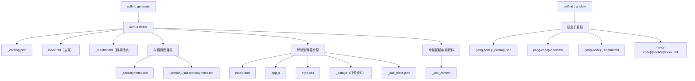

# 輸出結構說明

selfmd 執行完成後，所有產生的文件、靜態瀏覽器資源及中繼資料均集中存放於輸出目錄（預設為 `.doc-build/`）。本頁說明該目錄的完整檔案結構與各檔案的用途。

## 概述

輸出目錄由 `output.Writer` 統一管理寫入。selfmd 的四個產生階段各司其職，依序將不同類型的檔案寫入輸出目錄：

- **目錄階段**：寫入 `_catalog.json`（目錄索引 JSON）
- **內容階段**：寫入各章節的 `{dir}/index.md` 內容頁面
- **索引與導航階段**：寫入 `index.md`、`_sidebar.md` 及分類索引頁面
- **靜態瀏覽器**：寫入 `index.html`、`app.js`、`style.css`、`_data.js`、`_doc_meta.json`
- **翻譯階段**（可選）：在 `{lang-code}/` 子目錄下寫入各語言的對應版本

輸出目錄的根目錄路徑由 `selfmd.yaml` 中的 `output.dir` 欄位決定，預設值為 `.doc-build`。

## 架構



## 完整目錄結構

執行 `selfmd generate` 並加上翻譯後，典型的輸出目錄結構如下：

```
.doc-build/
├── index.html          # 靜態文件瀏覽器入口頁面
├── app.js              # 瀏覽器前端 JavaScript
├── style.css           # 瀏覽器樣式表
├── _data.js            # 所有 Markdown 內容的打包資料（供瀏覽器載入）
├── _doc_meta.json      # 多語言中繼資訊
├── _catalog.json       # 文件目錄結構（JSON，供增量更新使用）
├── _last_commit        # 最後一次產生時的 Git commit hash
├── index.md            # 文件主頁（目錄列表）
├── _sidebar.md         # Docsify/瀏覽器側欄導航
│
├── {section}/
│   └── index.md        # 章節內容頁面
├── {section}/
│   ├── index.md        # 分類索引頁面（有子章節時自動產生）
│   └── {subsection}/
│       └── index.md    # 子章節內容頁面
│
└── {lang-code}/        # 次要語言目錄（如 en-US/）
    ├── _catalog.json   # 翻譯版目錄結構
    ├── index.md        # 翻譯版主頁
    ├── _sidebar.md     # 翻譯版側欄導航
    └── {section}/
        └── index.md    # 翻譯版內容頁面
```

## 各類型檔案說明

### 系統檔案（底線前綴）

以底線（`_`）開頭的檔案為系統內部使用，不納入靜態瀏覽器的頁面路由，也不會顯示於文件目錄中。

| 檔案 | 說明 |
|------|------|
| `_catalog.json` | 文件目錄的 JSON 序列化，供增量更新（`selfmd update`）重用，避免重新呼叫 Claude |
| `_last_commit` | 紀錄最後一次產生時的 Git commit hash，供 `selfmd update` 判斷需更新的頁面 |
| `_data.js` | 將所有 `.md` 檔案與目錄結構打包為單一 JavaScript 資料物件，供靜態瀏覽器在客戶端渲染 |
| `_doc_meta.json` | 記錄主語言與所有次要語言的代碼及原生名稱，供語言切換功能使用 |
| `_sidebar.md` | 導航側欄，由 `GenerateSidebar` 自動從目錄結構產生 |

### 靜態瀏覽器資源

```go
// viewer.go 將三個嵌入式靜態資源寫入輸出目錄
if err := w.WriteFile("index.html", html); err != nil { ... }
if err := w.WriteFile("app.js", viewerJS); err != nil { ... }
if err := w.WriteFile("style.css", viewerCSS); err != nil { ... }
```

> 來源：`internal/output/viewer.go#L34-L44`

`index.html` 是瀏覽器的入口頁面，其中 `{{PROJECT_NAME}}` 與 `{{LANG}}` 佔位符會在寫入時被替換為實際的專案名稱與語言代碼。

### 內容頁面

每個文件項目（`catalog.FlatItem`）的頁面均以 `index.md` 為檔名，存放於對應的目錄路徑下：

```go
// writer.go：WritePage 使用 FlatItem.DirPath 決定目錄位置
func (w *Writer) WritePage(item catalog.FlatItem, content string) error {
    dir := filepath.Join(w.BaseDir, item.DirPath)
    path := filepath.Join(dir, "index.md")
    // ...
}
```

> 來源：`internal/output/writer.go#L50-L61`

路徑對應規則：目錄結構中的 `DirPath`（如 `core-modules/scanner`）直接映射為檔案系統路徑，最終產生 `core-modules/scanner/index.md`。

### 主頁與分類索引

- **`index.md`**（主頁）：由 `GenerateIndex` 產生，包含完整的文件目錄連結列表
- **`{section}/index.md`**（分類索引）：當一個章節有子章節時，其 `index.md` 由 `GenerateCategoryIndex` 自動產生，列出直接子章節的連結

```go
// index_phase.go：分類索引只為有子章節的項目產生
for _, item := range items {
    if !item.HasChildren {
        continue
    }
    // ...
    categoryContent := output.GenerateCategoryIndex(item, children, lang)
    if err := g.Writer.WritePage(item, categoryContent); err != nil { ... }
}
```

> 來源：`internal/generator/index_phase.go#L34-L53`

### `_data.js` 資料打包

靜態瀏覽器不依賴伺服器端路由，而是透過 `_data.js` 在客戶端載入所有內容。打包邏輯會掃描所有 `.md` 檔案，排除底線前綴檔案與次要語言目錄，將內容以 JSON 格式嵌入：

```go
// viewer.go：_data.js 的資料結構
data := map[string]interface{}{
    "catalog": catalogObj,
    "pages":   pages,
}
// 多語言時加入 meta 與各語言資料
if docMeta != nil {
    data["meta"] = docMeta
    // ... 加入 languages 物件
}

content := "window.DOC_DATA = " + string(jsonBytes) + ";\n"
return w.WriteFile("_data.js", content)
```

> 來源：`internal/output/viewer.go#L128-L195`

## 多語言目錄結構

啟用多語言翻譯後（透過 `selfmd translate`），每個次要語言會在輸出目錄下建立獨立的子目錄，結構與主語言完全相同：

```
.doc-build/
├── （主語言內容，直接在根目錄下）
└── en-US/              # 次要語言（以 en-US 為例）
    ├── _catalog.json   # 翻譯版目錄
    ├── index.md        # 翻譯版主頁
    ├── _sidebar.md     # 翻譯版側欄
    └── core-modules/
        └── scanner/
            └── index.md
```

`Writer.ForLanguage` 方法負責建立語言子目錄的寫入器：

```go
// writer.go：產生語言子目錄的 Writer
func (w *Writer) ForLanguage(lang string) *Writer {
    return &Writer{
        BaseDir: filepath.Join(w.BaseDir, lang),
    }
}
```

> 來源：`internal/output/writer.go#L139-L144`

## 輸出目錄設定

輸出目錄相關設定位於 `selfmd.yaml` 的 `output` 區段：

```go
// config.go：OutputConfig 結構
type OutputConfig struct {
    Dir                 string   `yaml:"dir"`
    Language            string   `yaml:"language"`
    SecondaryLanguages  []string `yaml:"secondary_languages"`
    CleanBeforeGenerate bool     `yaml:"clean_before_generate"`
}
```

> 來源：`internal/config/config.go#L31-L36`

預設值：

| 設定項 | 預設值 | 說明 |
|--------|--------|------|
| `output.dir` | `.doc-build` | 輸出目錄路徑 |
| `output.language` | `zh-TW` | 主語言（內容直接在根目錄） |
| `output.secondary_languages` | `[]`（空） | 次要語言列表，各自建立子目錄 |
| `output.clean_before_generate` | `false` | 是否在產生前清除舊輸出 |

## 增量更新檔案

`_catalog.json` 與 `_last_commit` 是增量更新機制的核心：

```go
// writer.go：保存增量更新所需的中繼資料
func (w *Writer) WriteCatalogJSON(cat *catalog.Catalog) error {
    data, err := cat.ToJSON()
    return w.WriteFile("_catalog.json", data)
}

func (w *Writer) SaveLastCommit(commit string) error {
    return w.WriteFile("_last_commit", commit)
}
```

> 來源：`internal/output/writer.go#L77-L137`

執行 `selfmd update` 時，系統會讀取這兩個檔案，比對目前的 Git commit 與上次產生時的 commit，僅重新產生受影響的頁面。

## 相關連結

- [整體流程與四階段管線](../../architecture/pipeline/index.md)
- [輸出寫入與連結修復](../../core-modules/output-writer/index.md)
- [靜態文件瀏覽器](../../core-modules/static-viewer/index.md)
- [多語言支援](../../i18n/index.md)
- [輸出與多語言設定](../../configuration/output-language/index.md)
- [增量更新](../../core-modules/incremental-update/index.md)

## 參考檔案

| 檔案路徑 | 說明 |
|----------|------|
| `internal/output/writer.go` | `Writer` 結構與所有檔案寫入方法 |
| `internal/output/viewer.go` | 靜態瀏覽器資源寫入與 `_data.js` 打包邏輯 |
| `internal/output/navigation.go` | `index.md`、`_sidebar.md` 及分類索引頁面產生邏輯 |
| `internal/output/linkfixer.go` | 連結修復器，確保頁面間相對連結正確 |
| `internal/generator/pipeline.go` | 四階段管線整體協調，各類型輸出的產生順序 |
| `internal/generator/index_phase.go` | 索引與導航階段實作 |
| `internal/generator/translate_phase.go` | 翻譯階段與語言子目錄寫入邏輯 |
| `internal/catalog/catalog.go` | `Catalog` 與 `FlatItem` 結構，`DirPath` 路徑映射規則 |
| `internal/config/config.go` | `OutputConfig` 結構定義與預設值 |