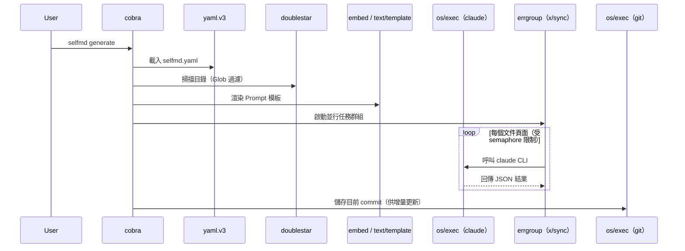

# 技術棧與相依套件

selfmd 以純 Go 實作，相依套件精簡，僅引入四個直接外部依賴，其餘功能均仰賴 Go 標準函式庫完成。

## 概述

selfmd 的設計目標之一是保持輕量、易於安裝。整個工具鏈除了 Go 執行環境本身之外，在執行期還需要兩個外部 CLI 工具：

- **Claude Code CLI**（`claude`）：作為 AI 後端，負責分析原始碼並產生文件內容
- **Git CLI**（`git`）：用於增量更新時偵測原始碼的變更

這兩個外部工具不透過 Go 套件管理，而是透過 `os/exec` 呼叫系統中已安裝的執行檔。

## 架構

```mermaid
graph TD
    subgraph GoStdLib["Go 標準函式庫"]
        embed["embed\n（嵌入模板）"]
        slog["log/slog\n（結構化日誌）"]
        exec["os/exec\n（子行程執行）"]
        tmpl["text/template\n（模板渲染）"]
        json["encoding/json\n（JSON 序列化）"]
        ctx["context\n（逾時控制）"]
        sync_pkg["sync / sync/atomic\n（並行原語）"]
    end

    subgraph ExternalDeps["外部相依套件"]
        cobra["cobra v1.10.2\n（CLI 框架）"]
        pflag["pflag v1.0.9\n（旗標解析，間接）"]
        doublestar["doublestar v4.10.0\n（Glob 比對）"]
        errgroup["x/sync v0.19.0\n（errgroup 並行）"]
        yaml["yaml.v3 v3.0.1\n（YAML 解析）"]
        mousetrap["mousetrap v1.1.0\n（Windows 相容，間接）"]
    end

    subgraph ExternalTools["外部執行工具（非 Go 套件）"]
        claude_cli["Claude Code CLI\n（claude 指令）"]
        git_cli["Git CLI\n（git 指令）"]
    end

    cobra --> pflag
    cobra --> mousetrap

    cmd_pkg["cmd/*"] --> cobra
    scanner_pkg["internal/scanner"] --> doublestar
    git_pkg["internal/git"] --> doublestar
    config_pkg["internal/config"] --> yaml
    prompt_pkg["internal/prompt"] --> embed
    prompt_pkg --> tmpl
    claude_pkg["internal/claude"] --> exec
    claude_pkg --> json
    claude_pkg --> slog
    claude_pkg --> ctx
    git_pkg --> exec
    generator_pkg["internal/generator"] --> errgroup
    generator_pkg --> sync_pkg
    output_pkg["internal/output"] --> json

    claude_pkg --> claude_cli
    git_pkg --> git_cli
```



## 相依套件詳細說明

### 直接相依套件

| 套件 | 版本 | 用途 | 使用位置 |
|------|------|------|----------|
| `github.com/spf13/cobra` | v1.10.2 | CLI 指令框架 | `cmd/root.go`、所有指令檔案 |
| `github.com/bmatcuk/doublestar/v4` | v4.10.0 | 雙星號（`**`）Glob 模式比對 | `internal/scanner/scanner.go`、`internal/git/git.go` |
| `golang.org/x/sync` | v0.19.0 | `errgroup` 並行任務群組 | `internal/generator/content_phase.go`、`translate_phase.go` |
| `gopkg.in/yaml.v3` | v3.0.1 | YAML 設定檔解析與序列化 | `internal/config/config.go` |

### 間接相依套件

| 套件 | 版本 | 說明 |
|------|------|------|
| `github.com/spf13/pflag` | v1.0.9 | cobra 的旗標解析底層實作 |
| `github.com/inconshreveable/mousetrap` | v1.1.0 | cobra 在 Windows 平台的相容性支援 |

> 來源：`go.mod#L1-L15`

```go
module github.com/monkenwu/selfmd

go 1.25.7

require (
	github.com/bmatcuk/doublestar/v4 v4.10.0
	github.com/spf13/cobra v1.10.2
	golang.org/x/sync v0.19.0
	gopkg.in/yaml.v3 v3.0.1
)

require (
	github.com/inconshreveable/mousetrap v1.1.0 // indirect
	github.com/spf13/pflag v1.0.9 // indirect
)
```

> 來源：`go.mod#L1-L15`

---

### cobra — CLI 框架

`cobra` 負責建立所有子指令（`init`、`generate`、`update`、`translate`）的路由結構、旗標定義，以及使用說明的自動生成。

```go
var rootCmd = &cobra.Command{
	Use:   "selfmd",
	Short: "selfmd — 專案文件自動產生器",
	Long: `selfmd 是一個 CLI 工具，透過本地 Claude Code CLI 作為 AI 後端，
自動掃描專案目錄並產生結構化的 Wiki 風格繁體中文技術文件。`,
}
```

> 來源：`cmd/root.go#L17-L25`

---

### doublestar — Glob 模式比對

Go 標準函式庫的 `filepath.Match` 不支援 `**` 雙星號（遞迴目錄比對）。`doublestar` 填補了這個空缺，讓使用者可以在 `selfmd.yaml` 中使用如 `internal/**` 或 `**/*.pb.go` 這類模式。

```go
// check excludes
for _, pattern := range cfg.Targets.Exclude {
    matched, _ := doublestar.Match(pattern, rel)
    if matched {
        if d.IsDir() {
            return filepath.SkipDir
        }
        return nil
    }
}
```

> 來源：`internal/scanner/scanner.go#L33-L41`

---

### golang.org/x/sync（errgroup）— 並行任務管控

`errgroup.WithContext` 搭配 channel 作為 semaphore，管控同時執行的 Claude CLI 呼叫數量，防止超過設定的 `max_concurrent` 上限。

```go
eg, ctx := errgroup.WithContext(ctx)
sem := make(chan struct{}, concurrency)

for _, item := range items {
    item := item
    eg.Go(func() error {
        sem <- struct{}{}
        defer func() { <-sem }()
        // ... generate page
        return nil
    })
}
```

> 來源：`internal/generator/content_phase.go#L37-L50`

---

### yaml.v3 — 設定檔解析

設定檔 `selfmd.yaml` 的讀取與寫入均透過 `yaml.v3` 完成。`Load` 函式先建立含預設值的 `Config` 物件，再用 YAML Unmarshal 覆蓋使用者定義的欄位。

```go
func Load(path string) (*Config, error) {
	data, err := os.ReadFile(path)
	// ...
	cfg := DefaultConfig()
	if err := yaml.Unmarshal(data, cfg); err != nil {
		return nil, fmt.Errorf("設定檔格式錯誤: %w", err)
	}
	// ...
}
```

> 來源：`internal/config/config.go#L131-L147`

---

## Go 標準函式庫重點用法

| 套件 | 用途 | 使用模組 |
|------|------|----------|
| `embed` | 編譯期嵌入 Prompt 模板（`.tmpl` 檔） | `internal/prompt/engine.go` |
| `text/template` | 渲染 Prompt 模板，將資料注入文字 | `internal/prompt/engine.go` |
| `os/exec` | 呼叫 `claude` 和 `git` 子行程 | `internal/claude/runner.go`、`internal/git/git.go` |
| `log/slog` | 結構化日誌（Go 1.21+ 內建） | `internal/claude/runner.go`、`internal/generator/pipeline.go` |
| `encoding/json` | 目錄（Catalog）的 JSON 序列化 | `internal/catalog/catalog.go`、`internal/claude/parser.go` |
| `context` | 子行程逾時控制與取消 | `internal/claude/runner.go` |
| `sync` / `sync/atomic` | 並行計數器（完成數、失敗數、跳過數） | `internal/generator/content_phase.go` |
| `path/filepath` | 跨平台路徑操作 | 多處 |

### embed — 編譯期嵌入模板

`//go:embed` 指示詞將 `templates/` 目錄下所有 `.tmpl` 檔案在編譯時打包進二進位執行檔，使用者無需額外部署模板檔案。

```go
//go:embed templates/*/*.tmpl templates/*.tmpl
var templateFS embed.FS
```

> 來源：`internal/prompt/engine.go#L10-L11`

### log/slog — 結構化日誌

`slog` 是 Go 1.21 引入的標準結構化日誌套件，取代了過去常見的第三方日誌函式庫。selfmd 以 `slog.Logger` 作為內部日誌介面，統一傳入各模組。

```go
r.logger.Debug("claude completed",
    "duration", elapsed.Round(time.Millisecond),
    "cost_usd", result.CostUSD,
    "is_error", result.IsError,
)
```

> 來源：`internal/claude/runner.go#L103-L108`

---

## 外部執行工具相依性

### Claude Code CLI

selfmd 的 AI 能力來自於呼叫本地安裝的 `claude` CLI，而非直接整合 Anthropic API SDK。這樣的設計讓使用者可以沿用已有的 Claude Code 授權與設定。

```go
cmd := exec.CommandContext(ctx, "claude", args...)
// ...
cmd.Stdin = strings.NewReader(opts.Prompt)
```

> 來源：`internal/claude/runner.go#L69-L75`

啟動前會先驗證 `claude` 是否可執行：

```go
func CheckAvailable() error {
	_, err := exec.LookPath("claude")
	if err != nil {
		return fmt.Errorf("找不到 claude CLI。請先安裝 Claude Code：https://docs.anthropic.com/en/docs/claude-code")
	}
	return nil
}
```

> 來源：`internal/claude/runner.go#L146-L152`

### Git CLI

增量更新功能透過執行 `git diff`、`git rev-parse` 等指令偵測原始碼變更，不依賴任何 Go 的 Git 函式庫：

```go
func runGit(dir string, args ...string) (string, error) {
	cmd := exec.Command("git", args...)
	cmd.Dir = dir
	// ...
}
```

> 來源：`internal/git/git.go#L124-L141`

---

## 核心流程



---

## 相關連結

- [整體流程與四階段管線](../../architecture/pipeline/index.md)
- [Claude CLI 執行器](../../core-modules/claude-runner/index.md)
- [專案掃描器](../../core-modules/scanner/index.md)
- [Prompt 模板引擎](../../core-modules/prompt-engine/index.md)
- [設定說明](../../configuration/index.md)
- [Git 整合設定](../../configuration/git-config/index.md)

---

## 參考檔案

| 檔案路徑 | 說明 |
|----------|------|
| `go.mod` | Go 模組定義，含所有直接與間接相依套件 |
| `cmd/root.go` | cobra 根指令定義，展示 CLI 框架使用方式 |
| `internal/config/config.go` | yaml.v3 用於設定檔解析的實作 |
| `internal/scanner/scanner.go` | doublestar 用於 include/exclude 模式比對 |
| `internal/git/git.go` | os/exec 呼叫 git CLI 的實作 |
| `internal/claude/runner.go` | os/exec 呼叫 claude CLI、log/slog 使用範例 |
| `internal/claude/types.go` | Claude CLI 回應的 JSON 型別定義 |
| `internal/prompt/engine.go` | embed + text/template 嵌入並渲染模板 |
| `internal/generator/content_phase.go` | errgroup + channel semaphore 並行控制 |
| `internal/generator/pipeline.go` | 整體管線，展示各模組如何整合 |
| `internal/catalog/catalog.go` | encoding/json 用於目錄的序列化 |
| `internal/output/writer.go` | 輸出寫入，展示標準 os 套件使用 |
| `internal/output/navigation.go` | 導航頁面生成實作 |
| `internal/scanner/filetree.go` | 檔案樹資料結構定義（ScanResult、FileNode） |