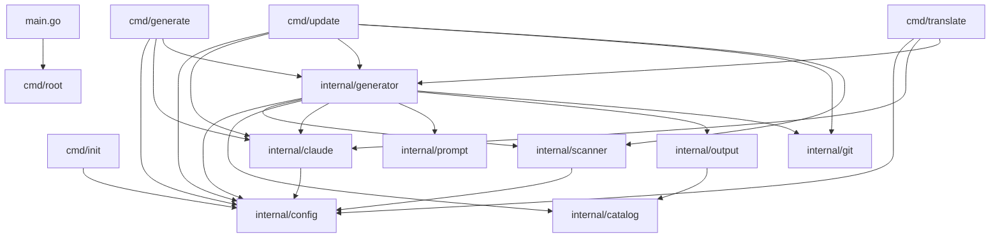
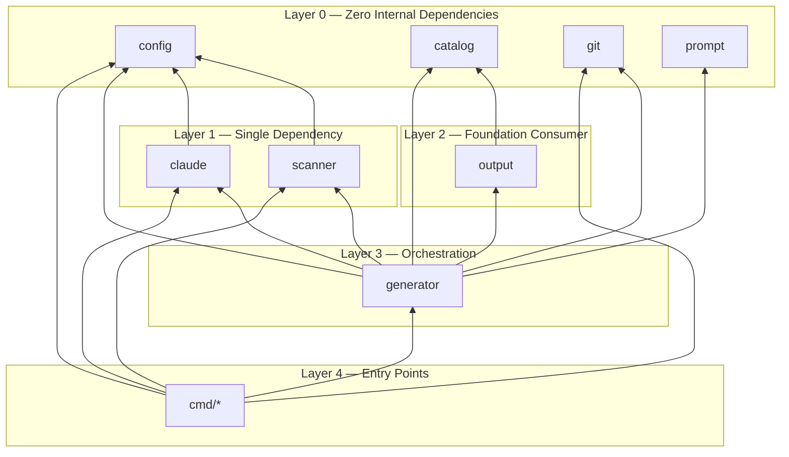
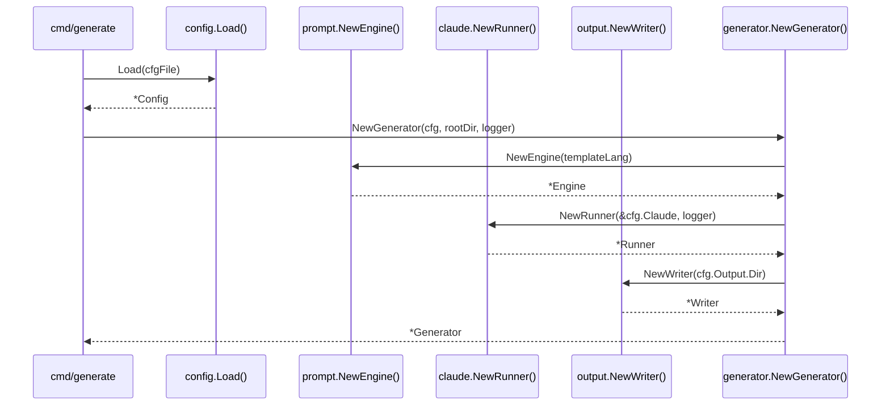
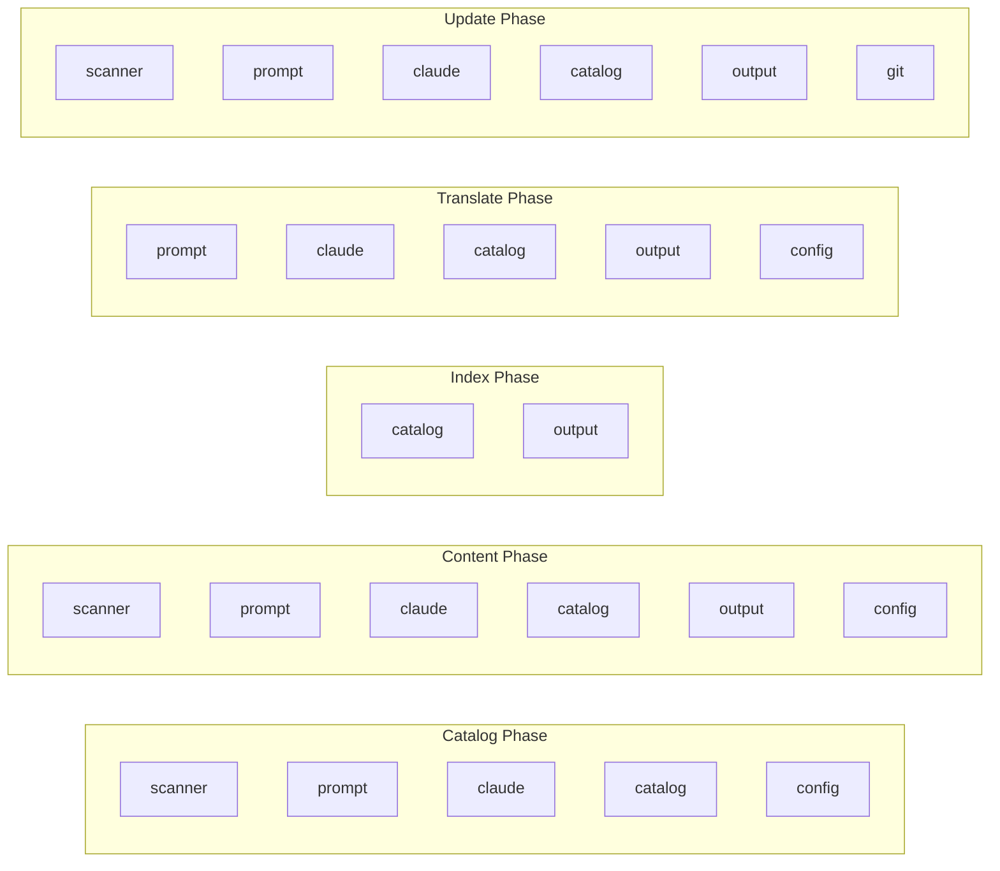

# Module Dependencies

A comprehensive analysis of the internal module dependency graph in selfmd, showing how each package relates to and depends on others.

## Overview

selfmd is organized as a Go project following the standard `cmd/` + `internal/` layout. The `cmd/` package defines CLI entry points, while `internal/` contains all core business logic split across eight specialized packages. Understanding these dependency relationships is essential for navigating the codebase, planning changes, and avoiding circular imports.

The architecture follows a layered design where:
- **Foundation modules** (`config`, `catalog`, `git`, `prompt`, `scanner`) have minimal internal dependencies
- **Infrastructure modules** (`claude`, `output`) depend on foundation modules
- **Orchestration modules** (`generator`) aggregate multiple foundation and infrastructure modules
- **Entry point layer** (`cmd`) wires everything together via the generator

## Architecture

### Full Module Dependency Graph



### Dependency Layers



## Module Inventory

### Foundation Modules (Layer 0)

These modules have **zero dependencies** on other `internal/` packages. They rely only on the Go standard library and external third-party packages.

| Module | Package | External Dependencies | Purpose |
|--------|---------|----------------------|---------|
| Config | `internal/config` | `gopkg.in/yaml.v3` | Configuration loading, validation, and defaults |
| Catalog | `internal/catalog` | — | Documentation catalog tree parsing and traversal |
| Git | `internal/git` | `doublestar/v4` | Git CLI wrapper for change detection |
| Prompt | `internal/prompt` | — | Template engine using `embed.FS` |

### Infrastructure Modules (Layer 1–2)

These modules depend on one or more foundation modules.

| Module | Package | Internal Dependencies | Purpose |
|--------|---------|----------------------|---------|
| Scanner | `internal/scanner` | `config` | Project file tree scanning with glob filtering |
| Claude | `internal/claude` | `config` | Claude CLI subprocess management and retry logic |
| Output | `internal/output` | `catalog` | File writing, link fixing, navigation generation, viewer bundling |

### Orchestration Module (Layer 3)

| Module | Package | Internal Dependencies | Purpose |
|--------|---------|----------------------|---------|
| Generator | `internal/generator` | `config`, `scanner`, `catalog`, `claude`, `prompt`, `output`, `git` | Pipeline orchestration across all generation phases |

## Dependency Details by Module

### `internal/config`

The config package is the most depended-upon module — it has **zero internal dependencies** and is imported by five other packages.

```go
package config

import (
	"fmt"
	"os"
	"path/filepath"

	"gopkg.in/yaml.v3"
)
```

> Source: internal/config/config.go#L1-L9

**Depended on by:** `cmd/*`, `internal/scanner`, `internal/claude`, `internal/generator`

### `internal/catalog`

The catalog package is self-contained with no internal imports. It provides the `Catalog`, `CatalogItem`, and `FlatItem` types used across the system.

```go
package catalog

import (
	"encoding/json"
	"fmt"
	"strings"
)
```

> Source: internal/catalog/catalog.go#L1-L8

**Depended on by:** `internal/output`, `internal/generator`

### `internal/scanner`

The scanner depends only on `config` to access include/exclude glob patterns for file filtering.

```go
package scanner

import (
	"os"
	"path/filepath"
	"strings"

	"github.com/bmatcuk/doublestar/v4"
	"github.com/monkenwu/selfmd/internal/config"
)
```

> Source: internal/scanner/scanner.go#L1-L10

**Depended on by:** `cmd/update`, `internal/generator`

### `internal/claude`

The claude package depends on `config` to read `ClaudeConfig` settings (model, timeout, retry count, allowed tools).

```go
// Runner manages Claude CLI subprocess invocations.
type Runner struct {
	config *config.ClaudeConfig
	logger *slog.Logger
}

// NewRunner creates a new Claude CLI runner.
func NewRunner(cfg *config.ClaudeConfig, logger *slog.Logger) *Runner {
	return &Runner{
		config: cfg,
		logger: logger,
	}
}
```

> Source: internal/claude/runner.go#L16-L27

**Depended on by:** `cmd/generate`, `cmd/update`, `cmd/translate`, `internal/generator`

### `internal/prompt`

The prompt package has zero internal dependencies. It uses Go's `embed.FS` to bundle templates and renders them with the standard `text/template` library.

```go
//go:embed templates/*/*.tmpl templates/*.tmpl
var templateFS embed.FS

// Engine renders prompt templates with context data.
type Engine struct {
	templates       *template.Template // language-specific templates
	sharedTemplates *template.Template // shared templates (translate.tmpl)
}
```

> Source: internal/prompt/engine.go#L10-L17

**Depended on by:** `internal/generator`

### `internal/output`

The output package depends on `catalog` for type definitions used in file writing, link fixing, and navigation generation.

```go
// writer.go
import (
	"github.com/monkenwu/selfmd/internal/catalog"
)

// linkfixer.go
import (
	"github.com/monkenwu/selfmd/internal/catalog"
)

// navigation.go
import (
	"github.com/monkenwu/selfmd/internal/catalog"
)
```

> Source: internal/output/writer.go#L9-L10, internal/output/linkfixer.go#L8-L9, internal/output/navigation.go#L8-L9

The `Writer`, `LinkFixer`, and navigation functions all operate on `catalog.FlatItem` and `catalog.Catalog` types.

**Depended on by:** `internal/generator`

### `internal/git`

The git package has zero internal dependencies. It shells out to the `git` CLI and uses `doublestar` for file pattern matching in `FilterChangedFiles`.

```go
package git

import (
	"bytes"
	"fmt"
	"os/exec"
	"strings"

	"github.com/bmatcuk/doublestar/v4"
)
```

> Source: internal/git/git.go#L1-L10

**Depended on by:** `cmd/update`, `internal/generator`

### `internal/generator`

The generator is the **heaviest module** in terms of dependencies — it imports all seven other internal packages. This is by design, as it orchestrates the full pipeline.

```go
package generator

import (
	"github.com/monkenwu/selfmd/internal/catalog"
	"github.com/monkenwu/selfmd/internal/claude"
	"github.com/monkenwu/selfmd/internal/config"
	"github.com/monkenwu/selfmd/internal/git"
	"github.com/monkenwu/selfmd/internal/output"
	"github.com/monkenwu/selfmd/internal/prompt"
	"github.com/monkenwu/selfmd/internal/scanner"
)
```

> Source: internal/generator/pipeline.go#L9-L16

The `Generator` struct holds references to the key collaborators:

```go
type Generator struct {
	Config  *config.Config
	Runner  *claude.Runner
	Engine  *prompt.Engine
	Writer  *output.Writer
	Logger  *slog.Logger
	RootDir string
}
```

> Source: internal/generator/pipeline.go#L19-L26

## Core Processes

### Generator Construction — Dependency Wiring

The `NewGenerator` factory function demonstrates how dependencies flow into the orchestrator:



```go
func NewGenerator(cfg *config.Config, rootDir string, logger *slog.Logger) (*Generator, error) {
	templateLang := cfg.Output.GetEffectiveTemplateLang()
	engine, err := prompt.NewEngine(templateLang)
	if err != nil {
		return nil, err
	}

	runner := claude.NewRunner(&cfg.Claude, logger)

	absOutDir := cfg.Output.Dir
	if absOutDir == "" {
		absOutDir = ".doc-build"
	}

	writer := output.NewWriter(absOutDir)

	return &Generator{
		Config:  cfg,
		Runner:  runner,
		Engine:  engine,
		Writer:  writer,
		Logger:  logger,
		RootDir: rootDir,
	}, nil
}
```

> Source: internal/generator/pipeline.go#L34-L58

### Per-Phase Dependency Usage

Each generation phase pulls in a different subset of modules:



| Phase | Modules Used |
|-------|-------------|
| Catalog Phase | `scanner`, `prompt`, `claude`, `catalog`, `config` |
| Content Phase | `scanner`, `prompt`, `claude`, `catalog`, `output`, `config` |
| Index Phase | `catalog`, `output` |
| Translate Phase | `prompt`, `claude`, `catalog`, `output`, `config` |
| Update Phase | `scanner`, `prompt`, `claude`, `catalog`, `output`, `git` |

### CMD-Level Dependencies

Each CLI command imports only the modules it needs:

| Command | Imports |
|---------|---------|
| `cmd/root.go` | — (only `cobra`) |
| `cmd/init.go` | `config` |
| `cmd/generate.go` | `config`, `claude`, `generator` |
| `cmd/update.go` | `config`, `claude`, `generator`, `git`, `scanner` |
| `cmd/translate.go` | `config`, `claude`, `generator` |

The `update` command is the most complex entry point because it also directly calls `git` and `scanner` before delegating to the generator:

```go
func runUpdate(cmd *cobra.Command, args []string) error {
	// ...
	if !git.IsGitRepo(rootDir) {
		return fmt.Errorf("%s", "current directory is not a git repository, cannot perform incremental update")
	}
	// ...
	scan, err := scanner.Scan(cfg, rootDir)
	if err != nil {
		return fmt.Errorf("failed to scan project: %w", err)
	}

	return gen.Update(ctx, scan, previousCommit, currentCommit, changedFiles)
}
```

> Source: cmd/update.go#L34-L111

## External Dependencies

The project keeps its external dependency surface minimal:

| Dependency | Version | Used By | Purpose |
|-----------|---------|---------|---------|
| `github.com/spf13/cobra` | v1.10.2 | `cmd/*` | CLI framework |
| `gopkg.in/yaml.v3` | v3.0.1 | `internal/config` | YAML config parsing |
| `github.com/bmatcuk/doublestar/v4` | v4.10.0 | `internal/scanner`, `internal/git` | Glob pattern matching (`**` support) |
| `golang.org/x/sync` | v0.19.0 | `internal/generator` | `errgroup` for concurrent page generation |

```go
require (
	github.com/bmatcuk/doublestar/v4 v4.10.0
	github.com/spf13/cobra v1.10.2
	golang.org/x/sync v0.19.0
	gopkg.in/yaml.v3 v3.0.1
)
```

> Source: go.mod#L5-L10

## Design Principles

### No Circular Dependencies

The layered architecture guarantees there are no circular imports. Dependencies always flow downward:

- Layer 0 (foundation) modules never import other `internal/` packages
- Layer 1–2 modules import only from Layer 0
- The generator (Layer 3) aggregates all lower layers
- CLI commands (Layer 4) import from any lower layer

### Single Responsibility

Each module has a well-defined boundary:
- `config` — only configuration data structures and loading
- `catalog` — only catalog tree data structures and serialization
- `scanner` — only filesystem traversal with glob filtering
- `claude` — only Claude CLI process execution and response parsing
- `prompt` — only template rendering
- `output` — only writing files, fixing links, generating navigation
- `git` — only git CLI interaction
- `generator` — only pipeline orchestration, connecting other modules

### Dependency Injection via Constructor

The `Generator` receives all its dependencies through `NewGenerator`, making the dependency graph explicit and testable:

```go
gen, err := generator.NewGenerator(cfg, rootDir, logger)
```

> Source: cmd/generate.go#L75-L78

This pattern avoids hidden global state and makes the wiring between modules visible at the call site.

## Related Links

- [System Architecture](../index.md)
- [Generation Pipeline](../pipeline/index.md)
- [Project Scanner](../../core-modules/scanner/index.md)
- [Catalog Manager](../../core-modules/catalog/index.md)
- [Claude Runner](../../core-modules/claude-runner/index.md)
- [Prompt Engine](../../core-modules/prompt-engine/index.md)
- [Documentation Generator](../../core-modules/generator/index.md)
- [Output Writer](../../core-modules/output-writer/index.md)
- [Tech Stack](../../overview/tech-stack/index.md)

## Reference Files

| File Path | Description |
|-----------|-------------|
| `main.go` | Application entry point |
| `go.mod` | Go module and external dependency definitions |
| `cmd/root.go` | Root CLI command and global flags |
| `cmd/generate.go` | Generate command wiring config, claude, and generator |
| `cmd/init.go` | Init command using config module |
| `cmd/update.go` | Update command using config, claude, generator, git, and scanner |
| `cmd/translate.go` | Translate command using config, claude, and generator |
| `internal/config/config.go` | Config struct definitions, loading, validation, and defaults |
| `internal/catalog/catalog.go` | Catalog and CatalogItem types, JSON parsing, tree flattening |
| `internal/scanner/scanner.go` | Project directory scanning with include/exclude glob filtering |
| `internal/scanner/filetree.go` | FileNode tree structure, ScanResult type, and tree rendering |
| `internal/claude/runner.go` | Claude CLI subprocess runner with retry logic |
| `internal/claude/parser.go` | JSON/Markdown/document-tag extraction from Claude responses |
| `internal/claude/types.go` | RunOptions, RunResult, and CLIResponse type definitions |
| `internal/prompt/engine.go` | Template engine with embedded templates and prompt data types |
| `internal/generator/pipeline.go` | Generator struct, NewGenerator constructor, Generate pipeline |
| `internal/generator/catalog_phase.go` | Catalog generation phase using scanner, prompt, and claude |
| `internal/generator/content_phase.go` | Content page generation with concurrency, link fixing |
| `internal/generator/index_phase.go` | Index and sidebar generation using catalog and output |
| `internal/generator/translate_phase.go` | Translation pipeline using prompt, claude, catalog, and output |
| `internal/generator/updater.go` | Incremental update logic using git, catalog, claude, and output |
| `internal/output/writer.go` | File writing, page management, and catalog JSON persistence |
| `internal/output/linkfixer.go` | Relative link validation and correction for generated markdown |
| `internal/output/navigation.go` | Index and sidebar markdown generation from catalog |
| `internal/output/viewer.go` | Static HTML viewer bundling with embedded assets |
| `internal/git/git.go` | Git CLI wrapper for repo detection, diffs, and file filtering |