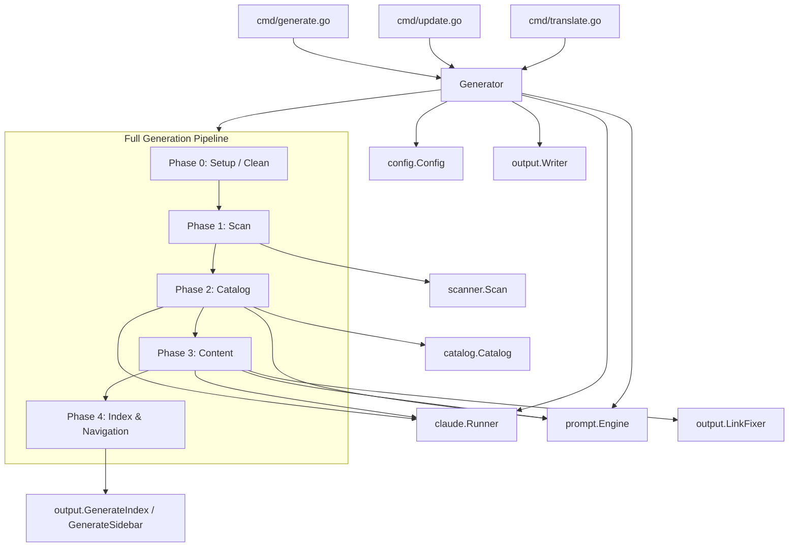
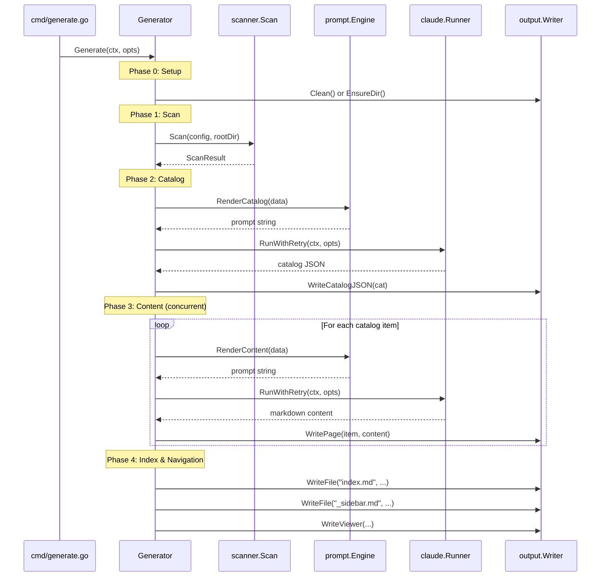
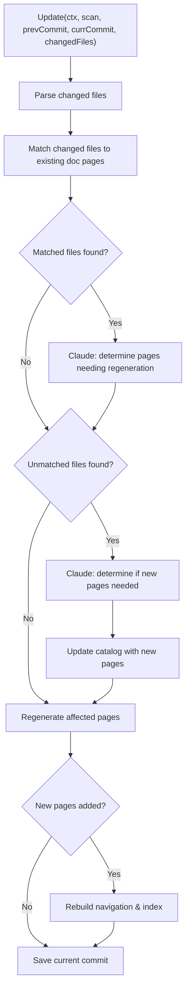
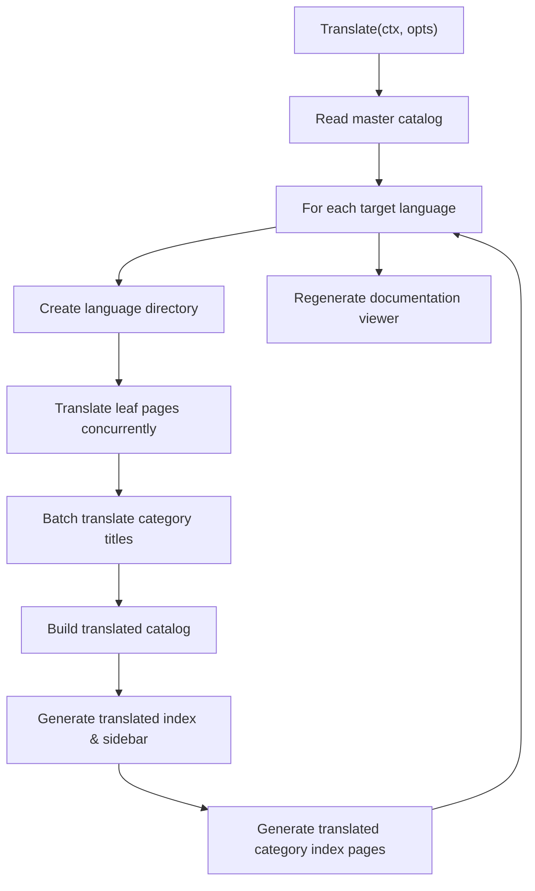

# Generation Pipeline

The generation pipeline is the core orchestration system of selfmd, coordinating a multi-phase workflow that transforms project source code into structured documentation through Claude AI.

## Overview

The `Generator` struct in `internal/generator/pipeline.go` serves as the central orchestrator for all documentation generation activities. It manages three distinct pipelines:

- **Full Generation** (`Generate`) — A 4-phase pipeline that scans the project, generates a documentation catalog, produces content pages concurrently, and builds navigation indexes.
- **Incremental Update** (`Update`) — A git-aware pipeline that detects changed source files, matches them to existing documentation pages, and selectively regenerates only the affected pages.
- **Translation** (`Translate`) — A pipeline that translates all generated documentation into one or more target languages using concurrent Claude API calls.

Each pipeline relies on a shared set of core dependencies: `Config` for settings, `Runner` for Claude CLI invocations, `Engine` for prompt template rendering, and `Writer` for file output.

## Architecture



## Generator Structure

The `Generator` struct holds all dependencies needed across pipelines and tracks generation statistics:

```go
type Generator struct {
	Config  *config.Config
	Runner  *claude.Runner
	Engine  *prompt.Engine
	Writer  *output.Writer
	Logger  *slog.Logger
	RootDir string // target project root directory

	// stats
	TotalCost   float64
	TotalPages  int
	FailedPages int
}
```

> Source: internal/generator/pipeline.go#L19-L31

The `NewGenerator` factory function initializes all dependencies based on the configuration. The `prompt.Engine` is created with the effective template language, the `claude.Runner` receives the Claude configuration, and the `output.Writer` is initialized with the output directory (defaulting to `.doc-build`):

```go
func NewGenerator(cfg *config.Config, rootDir string, logger *slog.Logger) (*Generator, error) {
	templateLang := cfg.Output.GetEffectiveTemplateLang()
	engine, err := prompt.NewEngine(templateLang)
	if err != nil {
		return nil, err
	}

	runner := claude.NewRunner(&cfg.Claude, logger)

	absOutDir := cfg.Output.Dir
	if absOutDir == "" {
		absOutDir = ".doc-build"
	}

	writer := output.NewWriter(absOutDir)

	return &Generator{
		Config:  cfg,
		Runner:  runner,
		Engine:  engine,
		Writer:  writer,
		Logger:  logger,
		RootDir: rootDir,
	}, nil
}
```

> Source: internal/generator/pipeline.go#L34-L58

## Full Generation Pipeline

The `Generate` method executes the complete 4-phase documentation generation flow. It is invoked by the `selfmd generate` CLI command.



### Phase 0: Setup

Before generation begins, the output directory is either cleaned (if `--clean` flag or `clean_before_generate` config is set) or ensured to exist:

```go
clean := opts.Clean || g.Config.Output.CleanBeforeGenerate
if clean {
	fmt.Println("[0/4] Cleaning output directory...")
	if !opts.DryRun {
		if err := g.Writer.Clean(); err != nil {
			return err
		}
	}
} else {
	if err := g.Writer.EnsureDir(); err != nil {
		return err
	}
}
```

> Source: internal/generator/pipeline.go#L72-L84

### Phase 1: Scan

The project scanner walks the target project directory, respecting include/exclude patterns from the configuration, and produces a `ScanResult` containing the file tree, file list, README content, and entry point contents:

```go
scan, err := scanner.Scan(g.Config, g.RootDir)
if err != nil {
	return fmt.Errorf("failed to scan project: %w", err)
}
```

> Source: internal/generator/pipeline.go#L88-L91

If running in `--dry-run` mode, the pipeline stops here after printing the file tree.

### Phase 2: Catalog Generation

The catalog phase produces a structured documentation outline. When the output directory is not cleaned, the pipeline first attempts to reuse an existing `_catalog.json` file. If no existing catalog is found, Claude AI is invoked to generate one:

```go
func (g *Generator) GenerateCatalog(ctx context.Context, scan *scanner.ScanResult) (*catalog.Catalog, error) {
	langName := config.GetLangNativeName(g.Config.Output.Language)
	data := prompt.CatalogPromptData{
		RepositoryName:       g.Config.Project.Name,
		ProjectType:          g.Config.Project.Type,
		Language:             g.Config.Output.Language,
		LanguageName:         langName,
		LanguageOverride:     g.Config.Output.NeedsLanguageOverride(),
		LanguageOverrideName: langName,
		KeyFiles:             scan.KeyFiles(),
		EntryPoints:          scan.EntryPointsFormatted(),
		FileTree:             scanner.RenderTree(scan.Tree, 4),
		ReadmeContent:        scan.ReadmeContent,
	}

	rendered, err := g.Engine.RenderCatalog(data)
	if err != nil {
		return nil, err
	}

	result, err := g.Runner.RunWithRetry(ctx, claude.RunOptions{
		Prompt:  rendered,
		WorkDir: g.RootDir,
	})
	// ...
	cat, err := catalog.Parse(jsonStr)
	// ...
	return cat, nil
}
```

> Source: internal/generator/catalog_phase.go#L15-L61

The resulting catalog is a tree structure of `CatalogItem` nodes, each with a title, path slug, order, and optional children.

### Phase 3: Content Generation

Content pages are generated concurrently using a semaphore-based concurrency pattern powered by `golang.org/x/sync/errgroup`. The concurrency level is configurable via `max_concurrent` in the config or the `--concurrency` CLI flag:

```go
eg, ctx := errgroup.WithContext(ctx)
sem := make(chan struct{}, concurrency)

for _, item := range items {
	item := item
	eg.Go(func() error {
		if skipExisting && g.Writer.PageExists(item) {
			skipped.Add(1)
			return nil
		}

		sem <- struct{}{}
		defer func() { <-sem }()

		err := g.generateSinglePage(ctx, scan, item, catalogTable, linkFixer, "")
		// ...
		return nil
	})
}
```

> Source: internal/generator/content_phase.go#L38-L73

Each page is generated by `generateSinglePage`, which renders a content prompt with the page's catalog path, title, project file tree, and full catalog link table, then invokes Claude to produce the documentation markdown. The result is validated (must start with `#`), run through `LinkFixer.FixLinks` to repair broken internal links, and written to disk. Failed pages receive a placeholder:

```go
func (g *Generator) generateSinglePage(ctx context.Context, scan *scanner.ScanResult, item catalog.FlatItem, catalogTable string, linkFixer *output.LinkFixer, existingContent string) error {
	// ... render prompt ...
	for attempt := 1; attempt <= maxAttempts; attempt++ {
		result, err := g.Runner.RunWithRetry(ctx, claude.RunOptions{
			Prompt:  rendered,
			WorkDir: g.RootDir,
		})
		// ... extract and validate content ...
		content = linkFixer.FixLinks(content, item.DirPath)
		return g.Writer.WritePage(item, content)
	}
	return lastErr
}
```

> Source: internal/generator/content_phase.go#L89-L157

Key behaviors of content generation:
- **Skip existing pages** — When not cleaning, already-generated pages are skipped
- **Retry on format errors** — Up to 2 attempts if Claude's output fails validation
- **Link post-processing** — `LinkFixer` resolves broken relative links by matching against the catalog
- **Graceful failure** — Individual page failures do not abort the entire batch

### Phase 4: Index and Navigation

The final phase generates navigation files without any Claude API calls. It produces three types of output:

1. **`index.md`** — The landing page listing all catalog sections
2. **`_sidebar.md`** — The sidebar navigation tree
3. **Category index pages** — Auto-generated index pages for parent items with children

```go
func (g *Generator) GenerateIndex(_ context.Context, cat *catalog.Catalog) error {
	// Generate main index.md
	indexContent := output.GenerateIndex(g.Config.Project.Name, g.Config.Project.Description, cat, lang)
	if err := g.Writer.WriteFile("index.md", indexContent); err != nil {
		return err
	}

	// Generate _sidebar.md
	sidebarContent := output.GenerateSidebar(g.Config.Project.Name, cat, lang)
	if err := g.Writer.WriteFile("_sidebar.md", sidebarContent); err != nil {
		return err
	}

	// Generate category index pages for items with children
	items := cat.Flatten()
	for _, item := range items {
		if !item.HasChildren {
			continue
		}
		// ... find children and generate category index ...
	}
	return nil
}
```

> Source: internal/generator/index_phase.go#L11-L55

After navigation, the pipeline also generates the static HTML viewer and writes a `.nojekyll` file for GitHub Pages compatibility. If the project is a git repository, the current commit hash is saved to `_last_commit` for future incremental updates.

## Incremental Update Pipeline

The `Update` method provides an efficient way to refresh documentation after source code changes. Instead of regenerating everything, it uses git diffs to identify what changed and selectively updates only the affected pages.



The update pipeline follows these steps:

1. **Parse changed files** — Extracts the list of modified files from the git diff
2. **Match to existing docs** — Scans all existing documentation page contents for references to changed file paths
3. **Determine regeneration needs** — For matched files, Claude analyzes whether the page content is actually affected
4. **Determine new pages** — For unmatched files, Claude decides whether new documentation pages should be created
5. **Regenerate pages** — Runs the same `generateSinglePage` method used by the full pipeline, passing existing content as context
6. **Update navigation** — Rebuilds index and sidebar if new pages were added

A notable feature is **leaf-to-parent promotion**: when a new child page is added under an existing leaf node, the original leaf's content is moved to an `overview` sub-page, and the leaf becomes a parent node:

```go
type promotedLeaf struct {
	OriginalPath  string
	OverviewPath  string
	OriginalTitle string
}
```

> Source: internal/generator/updater.go#L360-L367

## Translation Pipeline

The `Translate` method handles multi-language documentation by translating all generated pages into target languages. It operates per-language, creating a separate output directory for each target language.



Key aspects of the translation pipeline:

- **Concurrent page translation** — Uses the same `errgroup` + semaphore pattern as content generation
- **Skip existing translations** — Unless `--force` is specified, already-translated pages are skipped
- **Batch title translation** — Category titles are translated in a single Claude call for efficiency
- **Translated catalog** — A complete translated copy of the catalog is produced for each language, enabling full localized navigation

```go
func (g *Generator) translatePages(
	ctx context.Context,
	items []catalog.FlatItem,
	langWriter *output.Writer,
	sourceLang, sourceLangName, targetLang, targetLangName string,
	opts TranslateOptions,
) map[string]string {
	// ...
	eg, ctx := errgroup.WithContext(ctx)
	sem := make(chan struct{}, opts.Concurrency)

	for _, item := range leafItems {
		item := item
		eg.Go(func() error {
			if !opts.Force && langWriter.PageExists(item) {
				skipped.Add(1)
				return nil
			}
			// ... translate via Claude ...
			return nil
		})
	}
	// ...
}
```

> Source: internal/generator/translate_phase.go#L139-L275

## Configuration Options

The `GenerateOptions` struct controls pipeline behavior:

```go
type GenerateOptions struct {
	Clean       bool
	DryRun      bool
	Concurrency int // override max_concurrent if > 0
}
```

> Source: internal/generator/pipeline.go#L61-L65

These are set from CLI flags defined in `cmd/generate.go`:

| Flag | Description |
|------|-------------|
| `--clean` | Force clean the output directory before generation |
| `--no-clean` | Do not clean, even if configured in config file |
| `--dry-run` | Show the project scan results only, no Claude calls |
| `--concurrency` | Override the `max_concurrent` config value |

> Source: cmd/generate.go#L35-L38

## Post-Processing

After content is generated, two post-processing steps occur:

### Link Fixing

The `LinkFixer` component validates and repairs broken relative links in generated markdown. It builds an index of all catalog items by multiple keys (dot-notation path, directory path, last path segment, lowercase variants) and uses fuzzy matching to resolve broken targets:

```go
func (lf *LinkFixer) FixLinks(content string, currentDirPath string) string {
	linkRe := regexp.MustCompile(`\[([^\]]+)\]\(([^)]+)\)`)
	return linkRe.ReplaceAllStringFunc(content, func(match string) string {
		// ... extract text and target ...
		fixed := lf.fixSingleLink(target, currentDirPath)
		if fixed != "" && fixed != target {
			return "[" + text + "](" + fixed + ")"
		}
		return match
	})
}
```

> Source: internal/output/linkfixer.go#L52-L82

### Static Viewer Generation

The pipeline produces a complete static HTML viewer (HTML, JavaScript, CSS) along with a `_data.js` bundle. It also writes a `.nojekyll` file to ensure GitHub Pages does not strip files prefixed with underscores.

## Related Links

- [System Architecture](../index.md)
- [Module Dependencies](../module-dependencies/index.md)
- [Documentation Generator](../../core-modules/generator/index.md)
- [Catalog Phase](../../core-modules/generator/catalog-phase/index.md)
- [Content Phase](../../core-modules/generator/content-phase/index.md)
- [Index Phase](../../core-modules/generator/index-phase/index.md)
- [Translate Phase](../../core-modules/generator/translate-phase/index.md)
- [Incremental Update Engine](../../core-modules/incremental-update/index.md)
- [Project Scanner](../../core-modules/scanner/index.md)
- [Claude Runner](../../core-modules/claude-runner/index.md)
- [Prompt Engine](../../core-modules/prompt-engine/index.md)
- [Output Writer](../../core-modules/output-writer/index.md)
- [generate Command](../../cli/cmd-generate/index.md)
- [update Command](../../cli/cmd-update/index.md)
- [translate Command](../../cli/cmd-translate/index.md)

## Reference Files

| File Path | Description |
|-----------|-------------|
| `internal/generator/pipeline.go` | Generator struct definition and main Generate pipeline |
| `internal/generator/catalog_phase.go` | Catalog generation via Claude AI |
| `internal/generator/content_phase.go` | Concurrent content page generation and single-page generation logic |
| `internal/generator/index_phase.go` | Index, sidebar, and category index page generation |
| `internal/generator/translate_phase.go` | Translation pipeline for multi-language documentation |
| `internal/generator/updater.go` | Incremental update pipeline with git change detection |
| `cmd/generate.go` | CLI entry point for the generate command |
| `cmd/update.go` | CLI entry point for the update command |
| `internal/scanner/scanner.go` | Project file scanning and tree building |
| `internal/catalog/catalog.go` | Catalog data structures and parsing |
| `internal/prompt/engine.go` | Prompt template engine and data types |
| `internal/claude/runner.go` | Claude CLI subprocess runner with retry logic |
| `internal/output/writer.go` | File output writer for documentation pages |
| `internal/output/navigation.go` | Navigation file generation (index, sidebar, category pages) |
| `internal/output/linkfixer.go` | Post-processing link validation and repair |