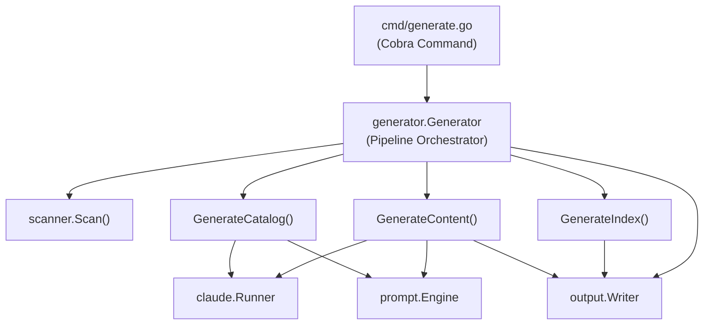
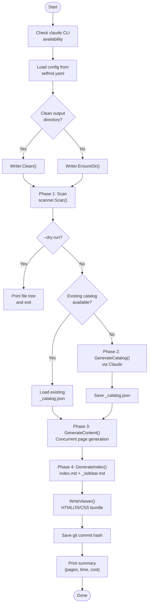

# generate Command

The `generate` command is the primary entry point for producing complete project documentation. It orchestrates a four-phase pipeline that scans the project structure, builds a documentation catalog via Claude, generates content pages concurrently, and produces navigation and index files.

## Overview

The `generate` command runs the full documentation generation pipeline from start to finish. It is the most comprehensive CLI command in selfmd, coordinating multiple internal modules to produce a complete set of Markdown documentation for any codebase.

Key responsibilities:

- **Project scanning** — Walks the project directory, applying include/exclude patterns from configuration to build a file tree
- **Catalog generation** — Invokes Claude to determine the optimal documentation structure (sections, pages, hierarchy)
- **Content generation** — Concurrently generates individual documentation pages via Claude, with retry and skip-existing logic
- **Index and navigation** — Produces `index.md`, `_sidebar.md`, and category index pages for browsing the documentation
- **Static viewer** — Outputs an HTML/JS/CSS viewer bundle so the documentation can be browsed locally
- **Git commit recording** — Saves the current commit hash for future incremental updates via the `update` command

## Architecture



## Command Syntax

```
selfmd generate [flags]
```

### Flags

| Flag | Type | Default | Description |
|------|------|---------|-------------|
| `--clean` | `bool` | `false` | Force clean the output directory before generating |
| `--no-clean` | `bool` | `false` | Do not clean the output directory (overrides config) |
| `--dry-run` | `bool` | `false` | Show scan results only; no Claude calls are made |
| `--concurrency` | `int` | `0` (use config) | Override the concurrency level for content generation |

### Global Flags (Inherited from Root)

| Flag | Short | Default | Description |
|------|-------|---------|-------------|
| `--config` | `-c` | `selfmd.yaml` | Path to the configuration file |
| `--verbose` | `-v` | `false` | Enable verbose (debug-level) output |
| `--quiet` | `-q` | `false` | Show errors only |

```go
var generateCmd = &cobra.Command{
	Use:   "generate",
	Short: "Generate the complete project documentation",
	Long: `Run the four-phase documentation generation flow:
  1. Scan project structure
  2. Generate documentation catalog
  3. Generate content pages (concurrent)
  4. Generate navigation and index`,
	RunE: runGenerate,
}
```

> Source: cmd/generate.go#L23-L32

## Core Processes

The `generate` command executes a strict four-phase pipeline, preceded by an optional cleanup phase.



### Phase 0: Setup

Before any generation begins, the command performs prerequisite checks and setup:

1. **Claude CLI check** — Verifies the `claude` CLI binary is available on `PATH` via `claude.CheckAvailable()`
2. **Config loading** — Loads `selfmd.yaml` (or a custom path via `--config`) using `config.Load()`
3. **Logger setup** — Configures `slog` with the appropriate level (`Debug`, `Info`, or `Error`)
4. **Signal handling** — Sets up context cancellation for `SIGINT` and `SIGTERM`
5. **Output directory** — Either cleans the directory (`Writer.Clean()`) or ensures it exists (`Writer.EnsureDir()`)

```go
func runGenerate(cmd *cobra.Command, args []string) error {
	// Check claude CLI availability
	if err := claude.CheckAvailable(); err != nil {
		return err
	}

	// Load config
	cfg, err := config.Load(cfgFile)
	if err != nil {
		return err
	}

	// Setup logger
	level := slog.LevelInfo
	if verbose {
		level = slog.LevelDebug
	}
	if quiet {
		level = slog.LevelError
	}
	logger := slog.New(slog.NewTextHandler(os.Stderr, &slog.HandlerOptions{Level: level}))

	// Setup context with signal handling
	ctx, cancel := signal.NotifyContext(context.Background(), syscall.SIGINT, syscall.SIGTERM)
	defer cancel()
```

> Source: cmd/generate.go#L42-L66

### Phase 1: Project Scanning

The scanner walks the project directory tree, applying include/exclude glob patterns from the configuration, and builds a `ScanResult` containing the file tree, file list, README content, and entry point contents.

```go
fmt.Println("[1/4] Scanning project structure...")
scan, err := scanner.Scan(g.Config, g.RootDir)
if err != nil {
	return fmt.Errorf("failed to scan project: %w", err)
}
fmt.Printf("      Found %d files in %d directories\n", scan.TotalFiles, scan.TotalDirs)
```

> Source: internal/generator/pipeline.go#L87-L93

When `--dry-run` is specified, the command prints the file tree and exits without making any Claude API calls:

```go
if opts.DryRun {
	fmt.Println("\n[Dry Run] File tree:")
	fmt.Println(scanner.RenderTree(scan.Tree, 3))
	fmt.Println("[Dry Run] No Claude calls will be made.")
	return nil
}
```

> Source: internal/generator/pipeline.go#L94-L99

### Phase 2: Catalog Generation

If the output directory was not cleaned and a valid `_catalog.json` exists, the existing catalog is reused. Otherwise, the `GenerateCatalog()` method renders a catalog prompt and invokes Claude to produce a structured JSON catalog defining the documentation hierarchy.

```go
var cat *catalog.Catalog
if !clean {
	// Try to reuse existing catalog
	catJSON, readErr := g.Writer.ReadCatalogJSON()
	if readErr == nil {
		cat, err = catalog.Parse(catJSON)
	}
	if cat != nil {
		items := cat.Flatten()
		fmt.Printf("[2/4] Loaded existing catalog (%d sections, %d items)\n", len(cat.Items), len(items))
	}
}
if cat == nil {
	fmt.Println("[2/4] Generating catalog...")
	cat, err = g.GenerateCatalog(ctx, scan)
	if err != nil {
		return fmt.Errorf("failed to generate catalog: %w", err)
	}
}
```

> Source: internal/generator/pipeline.go#L101-L127

### Phase 3: Content Generation

Content pages are generated concurrently using `errgroup` and a semaphore channel to limit parallelism. Each page is generated by a call to `generateSinglePage()`, which renders a content prompt, invokes Claude, extracts the `<document>` content, fixes links, and writes the result.

Key behaviors:
- **Skip existing** — When not in `--clean` mode, pages that already exist on disk are skipped
- **Retry on format errors** — Each page gets up to 2 attempts if Claude returns invalid Markdown
- **Placeholder on failure** — Failed pages get a placeholder file so they can be regenerated later
- **Link fixing** — Post-processing pass via `LinkFixer.FixLinks()` to correct relative links

```go
concurrency := g.Config.Claude.MaxConcurrent
if opts.Concurrency > 0 {
	concurrency = opts.Concurrency
}
fmt.Printf("[3/4] Generating content pages (concurrency: %d)...\n", concurrency)
if err := g.GenerateContent(ctx, scan, cat, concurrency, !clean); err != nil {
	g.Logger.Warn("some pages failed to generate", "error", err)
}
```

> Source: internal/generator/pipeline.go#L130-L137

### Phase 4: Index and Navigation

The final phase generates navigation artifacts without Claude involvement:

- **`index.md`** — The landing page with a full table of contents linking to all documentation pages
- **`_sidebar.md`** — The sidebar navigation file
- **Category index pages** — Auto-generated index pages for parent sections listing their children

```go
fmt.Println("[4/4] Generating navigation and index...")
if err := g.GenerateIndex(ctx, cat); err != nil {
	return fmt.Errorf("failed to generate index: %w", err)
}
```

> Source: internal/generator/pipeline.go#L140-L143

After navigation generation, the pipeline also:
1. Generates a static HTML/JS/CSS viewer via `Writer.WriteViewer()`
2. Writes a `.nojekyll` file for GitHub Pages compatibility
3. Saves the current git commit hash for incremental updates

## Clean Behavior

The clean/no-clean decision follows a priority chain:

1. `--clean` flag → forces clean
2. `--no-clean` flag → forces no-clean
3. `output.clean_before_generate` config value → default behavior

```go
clean := cfg.Output.CleanBeforeGenerate
if cleanFlag {
	clean = true
}
if noCleanFlag {
	clean = false
}
```

> Source: cmd/generate.go#L81-L87

When clean is `false`, the pipeline reuses the existing catalog and skips pages that have already been successfully generated. This enables resumable generation — if a run is interrupted, re-running `selfmd generate` will pick up where it left off.

## GenerateOptions

The `GenerateOptions` struct configures each generation run:

```go
type GenerateOptions struct {
	Clean       bool
	DryRun      bool
	Concurrency int // override max_concurrent if > 0
}
```

> Source: internal/generator/pipeline.go#L61-L65

## Generator Initialization

The `Generator` struct is initialized with all required dependencies:

```go
type Generator struct {
	Config  *config.Config
	Runner  *claude.Runner
	Engine  *prompt.Engine
	Writer  *output.Writer
	Logger  *slog.Logger
	RootDir string // target project root directory

	// stats
	TotalCost   float64
	TotalPages  int
	FailedPages int
}
```

> Source: internal/generator/pipeline.go#L19-L31

The `NewGenerator()` constructor sets up the prompt engine (selecting template language), the Claude runner, and the output writer:

```go
func NewGenerator(cfg *config.Config, rootDir string, logger *slog.Logger) (*Generator, error) {
	templateLang := cfg.Output.GetEffectiveTemplateLang()
	engine, err := prompt.NewEngine(templateLang)
	if err != nil {
		return nil, err
	}

	runner := claude.NewRunner(&cfg.Claude, logger)

	absOutDir := cfg.Output.Dir
	if absOutDir == "" {
		absOutDir = ".doc-build"
	}

	writer := output.NewWriter(absOutDir)

	return &Generator{
		Config:  cfg,
		Runner:  runner,
		Engine:  engine,
		Writer:  writer,
		Logger:  logger,
		RootDir: rootDir,
	}, nil
}
```

> Source: internal/generator/pipeline.go#L34-L58

## Usage Examples

### Basic full generation

```bash
selfmd generate
```

### Clean generation (fresh start)

```bash
selfmd generate --clean
```

### Preview without Claude calls

```bash
selfmd generate --dry-run
```

### Custom concurrency and verbose logging

```bash
selfmd generate --concurrency 5 -v
```

### Using a custom config file

```bash
selfmd generate -c my-config.yaml
```

## Output Summary

Upon completion, the command prints a summary including:

```go
fmt.Println("========================================")
fmt.Println("Documentation generation complete!")
fmt.Printf("  Output dir: %s\n", g.Config.Output.Dir)
fmt.Printf("  Pages: %d succeeded", g.TotalPages)
if g.FailedPages > 0 {
	fmt.Printf(", %d failed", g.FailedPages)
}
fmt.Println()
fmt.Printf("  Total time: %s\n", elapsed.Round(time.Second))
fmt.Printf("  Total cost: $%.4f USD\n", g.TotalCost)
fmt.Println("========================================")
```

> Source: internal/generator/pipeline.go#L172-L183

This includes the number of successful and failed pages, total elapsed time, and the aggregate Claude API cost in USD.

## Related Links

- [CLI Commands](../index.md)
- [init Command](../cmd-init/index.md)
- [update Command](../cmd-update/index.md)
- [translate Command](../cmd-translate/index.md)
- [Configuration Overview](../../configuration/config-overview/index.md)
- [Generation Pipeline](../../architecture/pipeline/index.md)
- [Documentation Generator](../../core-modules/generator/index.md)
- [Catalog Phase](../../core-modules/generator/catalog-phase/index.md)
- [Content Phase](../../core-modules/generator/content-phase/index.md)
- [Index Phase](../../core-modules/generator/index-phase/index.md)
- [Project Scanner](../../core-modules/scanner/index.md)
- [Claude Runner](../../core-modules/claude-runner/index.md)
- [Output Writer](../../core-modules/output-writer/index.md)

## Reference Files

| File Path | Description |
|-----------|-------------|
| `cmd/generate.go` | Cobra command definition, flag registration, and `runGenerate` entry point |
| `cmd/root.go` | Root command and global persistent flags (`--config`, `--verbose`, `--quiet`) |
| `internal/generator/pipeline.go` | `Generator` struct, `NewGenerator()`, and `Generate()` pipeline orchestrator |
| `internal/generator/catalog_phase.go` | `GenerateCatalog()` — Claude-based catalog generation |
| `internal/generator/content_phase.go` | `GenerateContent()` and `generateSinglePage()` — concurrent page generation |
| `internal/generator/index_phase.go` | `GenerateIndex()` — index, sidebar, and category page generation |
| `internal/generator/translate_phase.go` | `Translate()` — translation pipeline (for context on viewer regeneration) |
| `internal/generator/updater.go` | `Update()` — incremental update flow (for context on commit recording) |
| `internal/config/config.go` | `Config` struct, `Load()`, defaults, and validation |
| `internal/scanner/scanner.go` | `Scan()` function and `ScanResult` struct |
| `internal/claude/runner.go` | `Runner.Run()`, `RunWithRetry()`, and `CheckAvailable()` |
| `internal/claude/types.go` | `RunOptions`, `RunResult`, and `CLIResponse` type definitions |
| `internal/output/writer.go` | `Writer` struct for file output, page existence checks, and catalog I/O |
| `internal/output/navigation.go` | `GenerateIndex()`, `GenerateSidebar()`, and `GenerateCategoryIndex()` |
| `selfmd.yaml` | Project configuration file example |