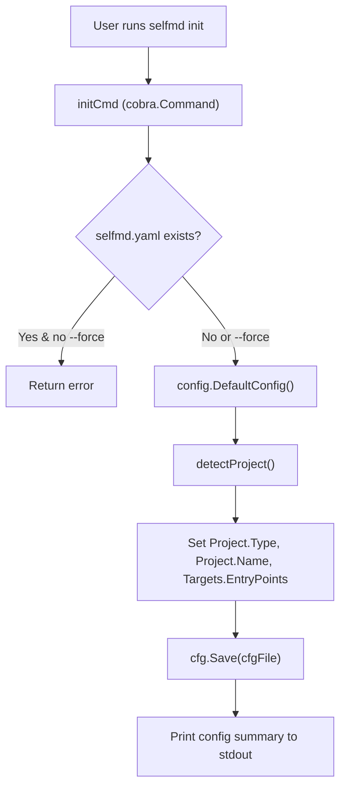
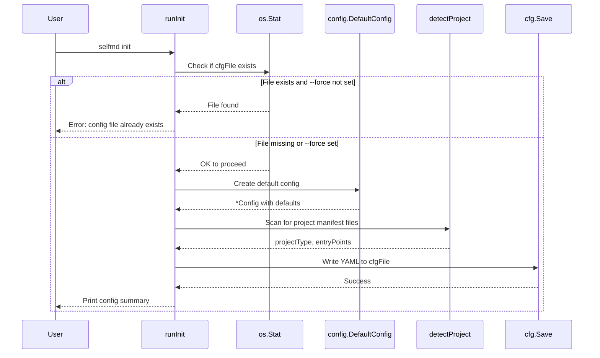

# init Command

The `init` command bootstraps a new selfmd project by auto-detecting the project type and generating a `selfmd.yaml` configuration file in the current directory.

## Overview

`selfmd init` is the first command users run when setting up selfmd for a new codebase. It performs automatic project detection—examining well-known manifest files (e.g., `go.mod`, `package.json`, `Cargo.toml`) to infer the project type and likely entry points—then writes a pre-populated `selfmd.yaml` configuration file that serves as the foundation for all subsequent documentation generation.

Key responsibilities:

- **Project type detection** — Identifies the project as `backend`, `frontend`, `fullstack`, or `library` based on the presence of language-specific manifest files.
- **Entry point discovery** — Locates common entry point files (e.g., `main.go`, `src/index.ts`) that exist on disk.
- **Default configuration generation** — Produces a complete `selfmd.yaml` with sensible defaults for targets, output, Claude settings, and Git integration.
- **Safety guard** — Refuses to overwrite an existing config file unless the `--force` flag is provided.

## Architecture



## Command Syntax

```
selfmd init [flags]
```

### Flags

| Flag | Type | Default | Description |
|------|------|---------|-------------|
| `--force` | `bool` | `false` | Force overwrite of an existing config file |
| `-c, --config` | `string` | `selfmd.yaml` | Config file path (inherited from root command) |

The `--config` flag is a persistent flag defined on the root command that controls the output path for the generated configuration file.

```go
var forceInit bool

var initCmd = &cobra.Command{
	Use:   "init",
	Short: "Initialize selfmd.yaml config file",
	Long:  "Scans the current directory, automatically detects the project type, and generates a selfmd.yaml config file.",
	RunE:  runInit,
}

func init() {
	initCmd.Flags().BoolVar(&forceInit, "force", false, "Force overwrite of existing config file")
	rootCmd.AddCommand(initCmd)
}
```

> Source: cmd/init.go#L13-L25

## Core Processes

### Initialization Flow



### Project Detection Logic

The `detectProject` function checks for language-specific manifest files in a fixed priority order. The first match wins.

```go
func detectProject() (projectType string, entryPoints []string) {
	checks := []struct {
		file    string
		pType   string
		entries []string
	}{
		{"go.mod", "backend", []string{"main.go", "cmd/root.go"}},
		{"Cargo.toml", "backend", []string{"src/main.rs", "src/lib.rs"}},
		{"package.json", "frontend", []string{"src/index.ts", "src/index.js", "src/main.ts", "src/App.tsx"}},
		{"pom.xml", "backend", []string{"src/main/java"}},
		{"build.gradle", "backend", []string{"src/main/java"}},
		{"requirements.txt", "backend", []string{"main.py", "app.py", "src/main.py"}},
		{"pyproject.toml", "backend", []string{"src/main.py", "main.py"}},
		{"composer.json", "backend", []string{"public/index.php", "src/Kernel.php"}},
		{"Gemfile", "backend", []string{"config/application.rb", "app/"}},
	}

	for _, c := range checks {
		if _, err := os.Stat(c.file); err == nil {
			var found []string
			for _, ep := range c.entries {
				if _, err := os.Stat(ep); err == nil {
					found = append(found, ep)
				}
			}
			if c.pType == "frontend" {
				if _, err := os.Stat("go.mod"); err == nil {
					return "fullstack", found
				}
				if _, err := os.Stat("server"); err == nil {
					return "fullstack", found
				}
			}
			return c.pType, found
		}
	}

	return "library", nil
}
```

> Source: cmd/init.go#L60-L99

The detection table covers the following ecosystems:

| Manifest File | Detected Type | Candidate Entry Points |
|---------------|---------------|----------------------|
| `go.mod` | `backend` | `main.go`, `cmd/root.go` |
| `Cargo.toml` | `backend` | `src/main.rs`, `src/lib.rs` |
| `package.json` | `frontend` | `src/index.ts`, `src/index.js`, `src/main.ts`, `src/App.tsx` |
| `pom.xml` | `backend` | `src/main/java` |
| `build.gradle` | `backend` | `src/main/java` |
| `requirements.txt` | `backend` | `main.py`, `app.py`, `src/main.py` |
| `pyproject.toml` | `backend` | `src/main.py`, `main.py` |
| `composer.json` | `backend` | `public/index.php`, `src/Kernel.php` |
| `Gemfile` | `backend` | `config/application.rb`, `app/` |

**Fullstack detection:** When a `package.json` is found (indicating a frontend project), the function performs a secondary check. If `go.mod` or a `server` directory also exists, the project type is upgraded to `fullstack`.

**Fallback:** If no manifest file matches, the project type defaults to `library` with no entry points.

### Default Configuration Values

When no existing configuration is found, `config.DefaultConfig()` supplies the following defaults:

```go
func DefaultConfig() *Config {
	return &Config{
		Project: ProjectConfig{
			Name: filepath.Base(mustGetwd()),
			Type: "backend",
		},
		Targets: TargetsConfig{
			Include: []string{"src/**", "pkg/**", "cmd/**", "internal/**", "lib/**", "app/**"},
			Exclude: []string{
				"vendor/**", "node_modules/**", ".git/**", ".doc-build/**",
				"**/*.pb.go", "**/generated/**", "dist/**", "build/**",
			},
			EntryPoints: []string{},
		},
		Output: OutputConfig{
			Dir:                 ".doc-build",
			Language:            "zh-TW",
			SecondaryLanguages:  []string{},
			CleanBeforeGenerate: false,
		},
		Claude: ClaudeConfig{
			Model:          "sonnet",
			MaxConcurrent:  3,
			TimeoutSeconds: 1800,
			MaxRetries:     2,
			AllowedTools:   []string{"Read", "Glob", "Grep"},
			ExtraArgs:      []string{},
		},
		Git: GitConfig{
			Enabled:    true,
			BaseBranch: "main",
		},
	}
}
```

> Source: internal/config/config.go#L96-L129

After creating the default config, `runInit` overrides three fields based on detection results:

- `Project.Type` — from `detectProject()`
- `Project.Name` — set to the current directory's base name via `filepath.Base(mustCwd())`
- `Targets.EntryPoints` — only the candidate entry points that actually exist on disk

## Usage Examples

**Basic initialization in a Go project:**

```bash
$ cd my-go-project
$ selfmd init
Config file created: selfmd.yaml
  Project name: my-go-project
  Project type: backend
  Output dir: .doc-build
  Doc language: zh-TW
  Entry points: main.go, cmd/root.go

Please edit the config file as needed, then run selfmd generate to generate documentation.
```

**Force overwrite an existing config:**

```bash
$ selfmd init --force
Config file created: selfmd.yaml
  ...
```

**Use a custom config path:**

```bash
$ selfmd init --config my-docs.yaml
Config file created: my-docs.yaml
  ...
```

The output summary is produced by the following code:

```go
fmt.Printf("Config file created: %s\n", cfgFile)
fmt.Printf("  Project name: %s\n", cfg.Project.Name)
fmt.Printf("  Project type: %s\n", cfg.Project.Type)
fmt.Printf("  Output dir: %s\n", cfg.Output.Dir)
fmt.Printf("  Doc language: %s\n", cfg.Output.Language)
if len(cfg.Output.SecondaryLanguages) > 0 {
    fmt.Printf("  Secondary languages: %s\n", strings.Join(cfg.Output.SecondaryLanguages, ", "))
}

if len(cfg.Targets.EntryPoints) > 0 {
    fmt.Printf("  Entry points: %s\n", strings.Join(cfg.Targets.EntryPoints, ", "))
}

fmt.Println("\nPlease edit the config file as needed, then run selfmd generate to generate documentation.")
```

> Source: cmd/init.go#L43-L57

## Related Links

- [CLI Commands](../index.md)
- [generate Command](../cmd-generate/index.md)
- [Configuration Overview](../../configuration/config-overview/index.md)
- [Project Targets](../../configuration/project-targets/index.md)
- [Initialization (Getting Started)](../../getting-started/init/index.md)

## Reference Files

| File Path | Description |
|-----------|-------------|
| `cmd/init.go` | init command implementation, project detection logic |
| `cmd/root.go` | Root command definition, persistent flags (`--config`, `--verbose`, `--quiet`) |
| `internal/config/config.go` | Config struct definitions, `DefaultConfig()`, `Save()`, and validation |
| `cmd/generate.go` | generate command (referenced for downstream workflow context) |
| `selfmd.yaml` | Real-world example of a generated config file |