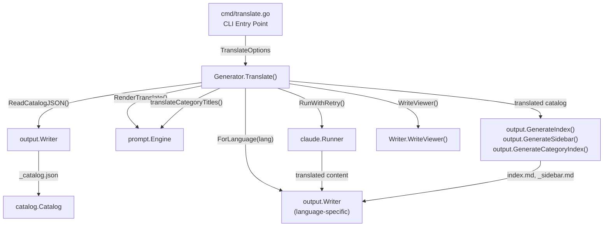
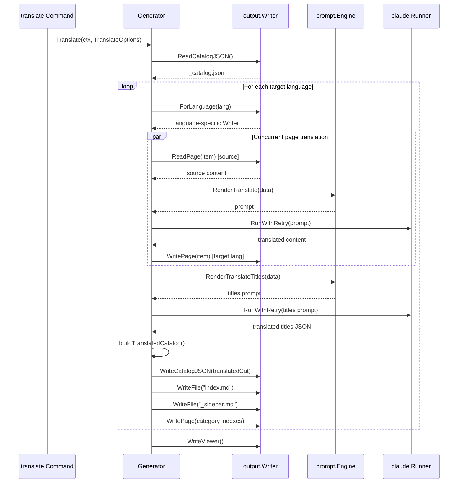

# translate Command

The `translate` command translates generated documentation from the primary language into one or more secondary languages using Claude AI.

## Overview

The `translate` command is a standalone CLI command in selfmd that takes existing documentation (generated by the `generate` command) and translates it into the secondary languages defined in `selfmd.yaml`. It operates as a post-generation step, reading the primary language output from `.doc-build/` and producing translated copies in language-specific subdirectories (e.g., `.doc-build/en-US/`).

Key characteristics:

- **Requires prior generation** — The `translate` command reads from the existing catalog (`_catalog.json`) and page files; `selfmd generate` must be run first.
- **Concurrent translation** — Pages are translated in parallel using Go's `errgroup` with configurable concurrency.
- **Incremental by default** — Already-translated pages are skipped unless the `--force` flag is used.
- **Full output reconstruction** — After translating pages, the command also translates catalog titles, generates translated navigation (index, sidebar, category pages), and regenerates the documentation viewer bundle.

## Architecture



## Command Syntax

```
selfmd translate [flags]
```

> Source: cmd/translate.go#L24-L30

### Flags

| Flag | Type | Default | Description |
|------|------|---------|-------------|
| `--lang` | `[]string` | all secondary languages | Translate only the specified languages |
| `--force` | `bool` | `false` | Force re-translation of existing files |
| `--concurrency` | `int` | config value | Override the concurrency setting from config |

```go
func init() {
	translateCmd.Flags().StringSliceVar(&translateLangs, "lang", nil, "only translate specified languages (default: all secondary languages)")
	translateCmd.Flags().BoolVar(&translateForce, "force", false, "force re-translate existing files")
	translateCmd.Flags().IntVar(&translateConc, "concurrency", 0, "concurrency (override config)")
	rootCmd.AddCommand(translateCmd)
}
```

> Source: cmd/translate.go#L32-L37

### Global Flags (Inherited)

| Flag | Short | Default | Description |
|------|-------|---------|-------------|
| `--config` | `-c` | `selfmd.yaml` | Config file path |
| `--verbose` | `-v` | `false` | Enable verbose output |
| `--quiet` | `-q` | `false` | Show errors only |

> Source: cmd/root.go#L37-L39

## Configuration Prerequisites

The `translate` command requires `secondary_languages` to be defined in `selfmd.yaml`. If no secondary languages are configured, the command exits with an error.

```go
if len(cfg.Output.SecondaryLanguages) == 0 {
    return fmt.Errorf("%s", "secondary_languages not defined in config, cannot translate")
}
```

> Source: cmd/translate.go#L49-L51

Example configuration in `selfmd.yaml`:

```yaml
output:
  language: zh-TW                    # primary language
  secondary_languages:               # target translation languages
    - en-US
    - ja-JP
```

The `--lang` flag values are validated against the `secondary_languages` list. Specifying a language that is not in the configuration results in an error:

```go
for _, l := range translateLangs {
    if !validLangs[l] {
        return fmt.Errorf("language %s is not in secondary_languages list (available: %s)", l, strings.Join(cfg.Output.SecondaryLanguages, ", "))
    }
}
```

> Source: cmd/translate.go#L61-L64

## Core Processes

The translation pipeline consists of five sequential stages per target language, followed by a final viewer regeneration step.



### Stage 1: Read Master Catalog

The command reads the existing `_catalog.json` from the output directory. This catalog was generated by the `generate` command and contains the full documentation structure.

```go
catJSON, err := g.Writer.ReadCatalogJSON()
if err != nil {
    return fmt.Errorf("failed to read catalog (please run selfmd generate first): %w", err)
}
```

> Source: internal/generator/translate_phase.go#L33-L36

### Stage 2: Translate Pages (Concurrent)

Leaf pages (non-category items) are translated concurrently using an `errgroup` with a semaphore for concurrency control. Each page goes through this pipeline:

1. **Skip check** — If the translated page already exists and `--force` is not set, the page is skipped. The title is extracted from the existing translation for catalog use.
2. **Read source** — The primary language page content is read from the output directory.
3. **Render prompt** — The `translate.tmpl` template is rendered with source/target language metadata and the source content.
4. **Call Claude** — The prompt is sent to Claude via `RunWithRetry()`.
5. **Extract content** — The translated Markdown is extracted from `<document>` tags in the response.
6. **Write output** — The translated page is written to the language-specific subdirectory.

```go
data := prompt.TranslatePromptData{
    SourceLanguage:     sourceLang,
    SourceLanguageName: sourceLangName,
    TargetLanguage:     targetLang,
    TargetLanguageName: targetLangName,
    SourceContent:      sourceContent,
}

rendered, err := g.Engine.RenderTranslate(data)
```

> Source: internal/generator/translate_phase.go#L197-L206

### Stage 3: Translate Category Titles

Category items (items with children) are not full pages — they only have titles. These titles are batch-translated in a single Claude call using the `translate_titles.tmpl` template. The response is expected as a JSON array of translated strings.

```go
rendered, err := g.Engine.RenderTranslateTitles(prompt.TranslateTitlesPromptData{
    SourceLanguage:     sourceLang,
    SourceLanguageName: sourceLangName,
    TargetLanguage:     targetLang,
    TargetLanguageName: targetLangName,
    Titles:             titles,
})
```

> Source: internal/generator/translate_phase.go#L329-L335

### Stage 4: Build Translated Catalog and Navigation

A translated copy of the catalog is constructed by replacing titles with their translations. This catalog is then used to generate:

- `_catalog.json` — The translated catalog in JSON format
- `index.md` — The main landing page with translated headings
- `_sidebar.md` — The sidebar navigation with translated links
- Category index pages — Index pages for each category section

```go
translatedCat := buildTranslatedCatalog(cat, translatedTitles)
if err := langWriter.WriteCatalogJSON(translatedCat); err != nil {
    g.Logger.Warn("failed to save translated catalog", "lang", targetLang, "error", err)
}
```

> Source: internal/generator/translate_phase.go#L73-L76

### Stage 5: Regenerate Viewer

After all languages are translated, the documentation viewer is regenerated with updated language metadata so users can switch between languages in the browser.

```go
docMeta := g.buildDocMeta()
fmt.Println("Regenerating documentation viewer...")
if err := g.Writer.WriteViewer(g.Config.Project.Name, docMeta); err != nil {
    g.Logger.Warn("failed to generate viewer", "error", err)
}
```

> Source: internal/generator/translate_phase.go#L118-L124

## Translation Prompt Templates

The translation system uses two shared prompt templates (language-independent, stored at `templates/` root level rather than language-specific subfolders).

### Page Translation Template (`translate.tmpl`)

This template instructs Claude to translate a full documentation page while preserving:

- Markdown formatting (headings, links, tables, code blocks)
- Code identifiers and file paths
- Mermaid diagram syntax (labels are translated)
- Relative link paths (only display text is translated)
- Source annotations (`> Source: path/to/file#L10-L25`)

The translated content must be returned inside `<document>` tags.

> Source: internal/prompt/templates/translate.tmpl#L1-L34

### Category Title Translation Template (`translate_titles.tmpl`)

This template batch-translates category titles, expecting a JSON array response. Technical terms and proper nouns (e.g., "Git", "CLI", "API") are preserved as-is.

> Source: internal/prompt/templates/translate_titles.tmpl#L1-L16

## Output Structure

Translated documents are placed in language-specific subdirectories under the output directory:

```
.doc-build/
├── _catalog.json          # primary language catalog
├── index.md               # primary language index
├── overview/
│   └── index.md           # primary language page
├── en-US/                  # translated language directory
│   ├── _catalog.json      # translated catalog
│   ├── _sidebar.md        # translated sidebar
│   ├── index.md           # translated index
│   └── overview/
│       └── index.md       # translated page
└── ja-JP/                  # another translated language
    ├── _catalog.json
    └── ...
```

The `Writer.ForLanguage()` method creates a new writer scoped to the language subdirectory:

```go
func (w *Writer) ForLanguage(lang string) *Writer {
	return &Writer{
		BaseDir: filepath.Join(w.BaseDir, lang),
	}
}
```

> Source: internal/output/writer.go#L145-L149

## Usage Examples

**Translate to all configured secondary languages:**

```bash
selfmd translate
```

**Translate to a specific language only:**

```bash
selfmd translate --lang en-US
```

**Translate multiple specific languages:**

```bash
selfmd translate --lang en-US --lang ja-JP
```

**Force re-translation of all pages:**

```bash
selfmd translate --force
```

**Override concurrency and enable verbose logging:**

```bash
selfmd translate --concurrency 5 --verbose
```

## Error Handling

The translate command handles errors gracefully without aborting the entire process:

- **Individual page failures** are logged but do not stop other pages from being translated. Failures are counted and reported in the summary.
- **Category title translation failures** produce a warning but do not prevent the rest of the pipeline from completing.
- **Missing catalog** results in a clear error message directing the user to run `selfmd generate` first.

At completion, the command prints a summary with success/failure/skip counts and total cost:

```go
fmt.Println("Translation complete!")
fmt.Printf("  Total time: %s\n", elapsed.Round(time.Second))
fmt.Printf("  Total cost: $%.4f USD\n", g.TotalCost)
```

> Source: internal/generator/translate_phase.go#L129-L131

## Related Links

- [CLI Commands](../index.md)
- [generate Command](../cmd-generate/index.md)
- [Output Language](../../configuration/output-language/index.md)
- [Translation Workflow](../../i18n/translation-workflow/index.md)
- [Supported Languages](../../i18n/supported-languages/index.md)
- [Translate Phase](../../core-modules/generator/translate-phase/index.md)
- [Claude Runner](../../core-modules/claude-runner/index.md)
- [Prompt Engine](../../core-modules/prompt-engine/index.md)
- [Configuration Overview](../../configuration/config-overview/index.md)

## Reference Files

| File Path | Description |
|-----------|-------------|
| `cmd/translate.go` | translate command CLI definition and flag handling |
| `cmd/root.go` | Root command and global flag definitions |
| `internal/generator/translate_phase.go` | Translation pipeline implementation (page translation, title translation, catalog building) |
| `internal/generator/pipeline.go` | Generator struct definition and NewGenerator constructor |
| `internal/config/config.go` | Config struct with OutputConfig.SecondaryLanguages and KnownLanguages |
| `internal/prompt/engine.go` | Prompt engine with TranslatePromptData and RenderTranslate methods |
| `internal/prompt/templates/translate.tmpl` | Page translation prompt template |
| `internal/prompt/templates/translate_titles.tmpl` | Category title batch translation prompt template |
| `internal/output/writer.go` | Output writer with ForLanguage(), PageExists(), and ReadPage() methods |
| `internal/output/navigation.go` | Navigation generation (GenerateIndex, GenerateSidebar, GenerateCategoryIndex) |
| `internal/claude/runner.go` | Claude CLI runner with RunWithRetry logic |
| `internal/claude/parser.go` | Response parsing and ExtractDocumentTag function |
| `internal/catalog/catalog.go` | Catalog data model and Flatten() method |