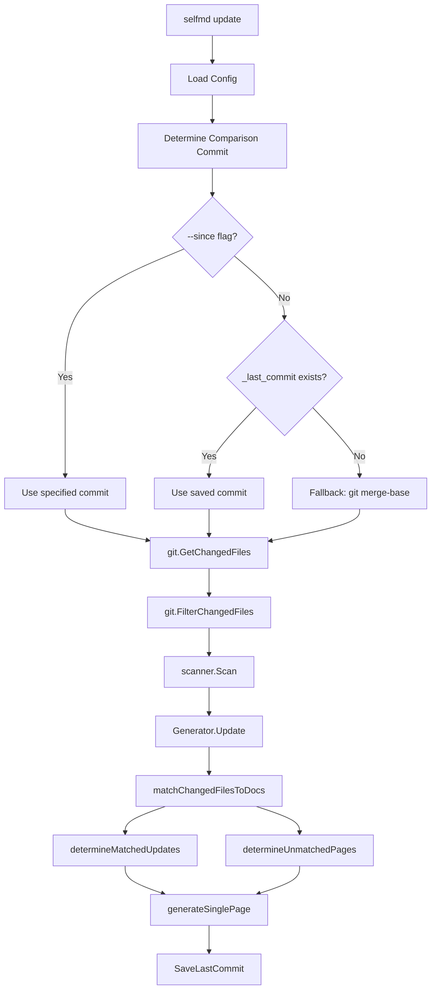
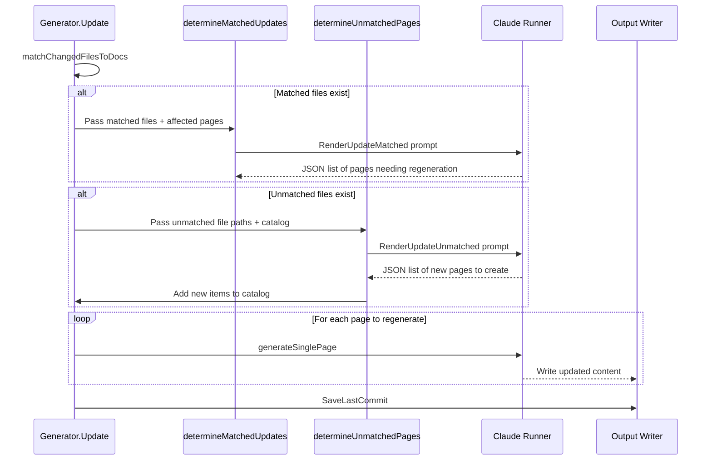

# update Command

The `selfmd update` command performs incremental documentation updates by analyzing git changes and regenerating only the affected documentation pages.

## Overview

The `update` command is designed for maintaining documentation after the initial full generation. Instead of regenerating all pages from scratch, it:

- Detects source code changes between two git commits
- Matches changed files to existing documentation pages
- Uses Claude to determine which pages actually need updating
- Identifies whether new documentation pages should be created for unmatched files
- Regenerates only the affected pages, preserving unchanged content

This command requires that documentation has been previously generated using `selfmd generate`. It relies on the existing catalog (`_catalog.json`) and a saved commit reference (`_last_commit`) to determine what has changed since the last generation or update.

### Prerequisites

- The current directory must be a git repository
- Claude CLI must be available on the system
- A valid `selfmd.yaml` configuration file must exist
- Documentation must have been previously generated via `selfmd generate`

## Architecture



## Command Syntax

```
selfmd update [flags]
```

### Flags

| Flag | Type | Default | Description |
|------|------|---------|-------------|
| `--since` | `string` | `""` | Compare with a specified commit hash. If omitted, defaults to the last generate/update commit |
| `-c, --config` | `string` | `selfmd.yaml` | Path to the configuration file (inherited from root) |
| `-v, --verbose` | `bool` | `false` | Enable verbose debug output (inherited from root) |

### Examples

```bash
# Basic incremental update (uses last saved commit)
selfmd update

# Update since a specific commit
selfmd update --since abc1234

# Update with verbose logging
selfmd update -v

# Update with a custom config file
selfmd update -c my-config.yaml
```

## Core Processes

The update command follows a multi-step pipeline that progressively narrows down which pages need regeneration.

### Step 1: Commit Resolution

The command first determines which two commits to compare. The resolution follows a three-level fallback:

```go
// Determine comparison commit
previousCommit := sinceCommit
if previousCommit == "" {
    // Try reading saved commit from last generate/update
    saved, readErr := gen.Writer.ReadLastCommit()
    if readErr == nil && saved != "" {
        previousCommit = saved
    } else {
        // Fallback to merge-base
        base, err := git.GetMergeBase(rootDir, cfg.Git.BaseBranch)
        if err != nil {
            return fmt.Errorf("cannot get base commit: %w\nhint: run selfmd generate first or use --since to specify a commit", err)
        }
        previousCommit = base
    }
}
```

> Source: cmd/update.go#L68-L82

### Step 2: Change Detection and Filtering

Changed files between the two commits are retrieved using `git diff --name-status` and filtered through the configured include/exclude glob patterns:

```go
changedFiles, err := git.GetChangedFiles(rootDir, previousCommit, currentCommit)
if err != nil {
    return err
}

changedFiles = git.FilterChangedFiles(changedFiles, cfg.Targets.Include, cfg.Targets.Exclude)
```

> Source: cmd/update.go#L89-L94

### Step 3: File-to-Page Matching

The `matchChangedFilesToDocs` method searches existing documentation pages for references to changed file paths. It pre-reads all page contents, then checks each changed file against every page to find text matches:

```go
func (g *Generator) matchChangedFilesToDocs(files []git.ChangedFile, cat *catalog.Catalog) (matched []matchResult, unmatched []string) {
    items := cat.Flatten()

    // Pre-read all page contents
    pageContents := make(map[string]string)
    for _, item := range items {
        content, err := g.Writer.ReadPage(item)
        if err != nil {
            continue
        }
        pageContents[item.Path] = content
    }

    // For each changed file, find which pages reference it
    for _, f := range files {
        var matchedPages []catalog.FlatItem
        for _, item := range items {
            content, ok := pageContents[item.Path]
            if !ok {
                continue
            }
            if strings.Contains(content, f.Path) {
                matchedPages = append(matchedPages, item)
            }
        }

        if len(matchedPages) > 0 {
            matched = append(matched, matchResult{
                changedFile: f.Path,
                pages:       matchedPages,
            })
        } else {
            unmatched = append(unmatched, f.Path)
        }
    }

    return matched, unmatched
}
```

> Source: internal/generator/updater.go#L177-L214

### Step 4: Claude-Assisted Update Analysis

The update process makes up to two Claude API calls to intelligently determine what needs updating:



**Matched file analysis** (`determineMatchedUpdates`): Sends changed file paths along with summaries of potentially affected documentation pages to Claude, which returns a JSON array of pages that genuinely need regeneration. The prompt instructs Claude to be conservative — only marking pages for regeneration when changes actually affect behavior, architecture, or APIs.

**Unmatched file analysis** (`determineUnmatchedPages`): For source files not referenced by any existing documentation page, Claude determines whether new pages should be created. It avoids duplication by checking whether the file logically belongs within the scope of an existing page.

### Step 5: Page Regeneration

Pages identified for update are regenerated using the same `generateSinglePage` method used by the `generate` command. Existing page content is passed as context to help Claude produce a relevant update:

```go
for i, item := range allPages {
    fmt.Printf("      [%d/%d] %s（%s）...", i+1, len(allPages), item.Title, item.Path)
    // Read existing content to pass as context for regeneration
    existing, _ := g.Writer.ReadPage(item)
    err := g.generateSinglePage(ctx, scan, item, catalogTable, linkFixer, existing)
    if err != nil {
        fmt.Printf(" Failed: %v\n", err)
        g.Logger.Warn("page regeneration failed", "title", item.Title, "path", item.Path, "error", err)
        g.writePlaceholder(item, err)
    }
}
```

> Source: internal/generator/updater.go#L137-L148

### Step 6: Catalog and Navigation Updates

When new pages are added, the catalog structure is updated dynamically. The system handles a special case where adding a child page to an existing leaf node promotes that leaf to a parent node, moving its original content to an "overview" child:

```go
promoted := addItemToCatalog(cat, np.CatalogPath, np.Title)
if promoted != nil {
    // A leaf node was promoted to a parent.
    // Move the original content to the new "overview" child.
    origItem := catalog.FlatItem{
        Path:    promoted.OriginalPath,
        DirPath: catalogPathToDir(promoted.OriginalPath),
    }
    overviewItem := catalog.FlatItem{
        Title:   promoted.OriginalTitle,
        Path:    promoted.OverviewPath,
        DirPath: catalogPathToDir(promoted.OverviewPath),
    }
    if content, err := g.Writer.ReadPage(origItem); err == nil && content != "" {
        if err := g.Writer.WritePage(overviewItem, content); err != nil {
            g.Logger.Warn("failed to move page to overview", "from", promoted.OriginalPath, "error", err)
        }
    }
}
```

> Source: internal/generator/updater.go#L96-L116

After all pages are regenerated, navigation and index files are updated if any new pages were added. Finally, the current commit hash is saved to `_last_commit` for the next incremental update.

## Data Types

The update process uses two key result types returned by Claude's analysis:

```go
// UpdateMatchedResult represents a page that Claude determined needs regeneration.
type UpdateMatchedResult struct {
    CatalogPath string `json:"catalogPath"`
    Title       string `json:"title"`
    Reason      string `json:"reason"`
}

// UpdateUnmatchedResult represents a new page that Claude determined should be created.
type UpdateUnmatchedResult struct {
    CatalogPath string `json:"catalogPath"`
    Title       string `json:"title"`
    Reason      string `json:"reason"`
}
```

> Source: internal/generator/updater.go#L18-L29

## Configuration

The `update` command relies on several configuration sections from `selfmd.yaml`:

| Config Path | Purpose |
|-------------|---------|
| `targets.include` | Glob patterns to include changed files |
| `targets.exclude` | Glob patterns to exclude changed files |
| `git.base_branch` | Fallback branch for `git merge-base` when no saved commit exists |
| `output.dir` | Documentation output directory (default: `.doc-build`) |
| `output.language` | Language for documentation output |
| `claude.model` | Claude model to use for analysis and generation |

## Comparison with generate

| Aspect | `generate` | `update` |
|--------|-----------|----------|
| Scope | Full documentation from scratch | Only changed/new pages |
| Git required | No (optional for commit saving) | Yes (mandatory) |
| Catalog | Generated via Claude | Read from existing `_catalog.json` |
| Concurrency | Configurable concurrent page generation | Sequential page regeneration |
| Static viewer | Generated after completion | Not regenerated |
| Cost | Higher (all pages) | Lower (only affected pages) |

## Related Links

- [CLI Commands](../index.md)
- [generate Command](../cmd-generate/index.md)
- [translate Command](../cmd-translate/index.md)
- [Incremental Update Engine](../../core-modules/incremental-update/index.md)
- [Generation Pipeline](../../architecture/pipeline/index.md)
- [Change Detection](../../git-integration/change-detection/index.md)
- [Affected Page Matching](../../git-integration/affected-pages/index.md)
- [Configuration Overview](../../configuration/config-overview/index.md)
- [Git Integration Settings](../../configuration/git-config/index.md)

## Reference Files

| File Path | Description |
|-----------|-------------|
| `cmd/update.go` | Update command definition, flag registration, and execution flow |
| `cmd/root.go` | Root command with global flags (`--config`, `--verbose`) |
| `cmd/generate.go` | Generate command for comparison with update flow |
| `internal/generator/updater.go` | Core update logic: file matching, Claude analysis, page regeneration |
| `internal/generator/pipeline.go` | Generator struct definition and `NewGenerator` constructor |
| `internal/generator/content_phase.go` | `generateSinglePage` implementation used for page regeneration |
| `internal/git/git.go` | Git operations: change detection, commit resolution, file filtering |
| `internal/config/config.go` | Configuration struct and `GitConfig` definition |
| `internal/catalog/catalog.go` | Catalog data structures and flatten/parse operations |
| `internal/output/writer.go` | Output writer: page read/write, commit save/load, catalog JSON I/O |
| `internal/prompt/engine.go` | Prompt template engine and update-related data types |
| `internal/prompt/templates/en-US/update_matched.tmpl` | Prompt template for matched file analysis |
| `internal/prompt/templates/en-US/update_unmatched.tmpl` | Prompt template for unmatched file analysis |