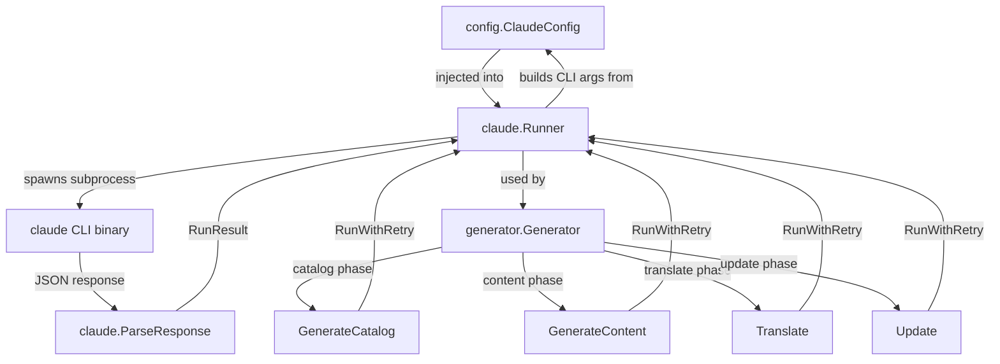
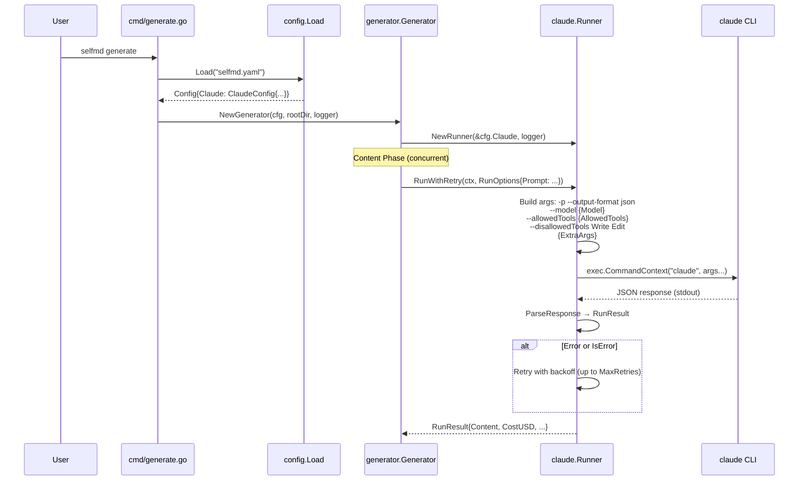

# Claude Settings

Configuration options for controlling how selfmd interacts with the Claude CLI to generate documentation.

## Overview

The `claude` section in `selfmd.yaml` controls all aspects of how selfmd invokes the Claude Code CLI as a subprocess. These settings determine which AI model is used, how many pages can be generated concurrently, timeout and retry behavior, which tools Claude is allowed to use during generation, and any additional CLI arguments passed to the `claude` command.

selfmd does not call the Claude API directly. Instead, it shells out to the `claude` CLI binary (Claude Code) in print mode (`-p`) with JSON output, making these settings a critical interface between selfmd and the AI-powered documentation pipeline.

## Architecture



## Configuration Fields

The `ClaudeConfig` struct defines all available settings:

```go
type ClaudeConfig struct {
	Model          string   `yaml:"model"`
	MaxConcurrent  int      `yaml:"max_concurrent"`
	TimeoutSeconds int      `yaml:"timeout_seconds"`
	MaxRetries     int      `yaml:"max_retries"`
	AllowedTools   []string `yaml:"allowed_tools"`
	ExtraArgs      []string `yaml:"extra_args"`
}
```

> Source: internal/config/config.go#L82-L89

### Field Reference

| Field | Type | Default | Description |
|-------|------|---------|-------------|
| `model` | `string` | `"sonnet"` | Claude model identifier passed via `--model` flag |
| `max_concurrent` | `int` | `3` | Maximum number of concurrent Claude invocations during content generation |
| `timeout_seconds` | `int` | `1800` | Per-invocation timeout in seconds (30 minutes default) |
| `max_retries` | `int` | `2` | Number of retry attempts for failed Claude calls |
| `allowed_tools` | `[]string` | `["Read", "Glob", "Grep"]` | Tools Claude is permitted to use during generation |
| `extra_args` | `[]string` | `[]` | Additional CLI arguments appended to every `claude` invocation |

### Default Configuration

```go
Claude: ClaudeConfig{
    Model:          "sonnet",
    MaxConcurrent:  3,
    TimeoutSeconds: 1800,
    MaxRetries:     2,
    AllowedTools:   []string{"Read", "Glob", "Grep"},
    ExtraArgs:      []string{},
},
```

> Source: internal/config/config.go#L116-L123

### Example YAML

```yaml
claude:
    model: opus
    max_concurrent: 3
    timeout_seconds: 30000
    max_retries: 2
    allowed_tools:
        - Read
        - Glob
        - Grep
    extra_args: []
```

> Source: selfmd.yaml#L30-L39

## How Settings Are Applied

### Model Selection

The `model` field is passed as the `--model` flag to the Claude CLI. Per-invocation overrides are also supported via `RunOptions.Model`, though all standard pipeline phases use the configured default.

```go
model := opts.Model
if model == "" {
    model = r.config.Model
}
if model != "" {
    args = append(args, "--model", model)
}
```

> Source: internal/claude/runner.go#L37-L43

### Tool Restrictions

The `allowed_tools` list determines which Claude Code tools are permitted during generation. Each tool name is passed via `--allowedTools`. Additionally, `Write` and `Edit` are always explicitly blocked via `--disallowedTools` to prevent Claude from attempting to write files directly — all output is captured from stdout and written by selfmd's own `output.Writer`.

```go
tools := opts.AllowedTools
if len(tools) == 0 {
    tools = r.config.AllowedTools
}
if len(tools) > 0 {
    for _, t := range tools {
        args = append(args, "--allowedTools", t)
    }
}

// Explicitly block Write/Edit to prevent content from being lost in denied tool calls
args = append(args, "--disallowedTools", "Write", "--disallowedTools", "Edit")
```

> Source: internal/claude/runner.go#L45-L56

### Concurrency Control

The `max_concurrent` field controls how many documentation pages are generated in parallel during the content phase. It is enforced using a semaphore pattern with `golang.org/x/sync/errgroup`:

```go
concurrency := g.Config.Claude.MaxConcurrent
if opts.Concurrency > 0 {
    concurrency = opts.Concurrency
}
fmt.Printf("[3/4] Generating content pages (concurrency: %d)...\n", concurrency)
```

> Source: internal/generator/pipeline.go#L130-L134

The `--concurrency` CLI flag on the `generate` command can override this value at runtime.

### Timeout Handling

Each Claude invocation is wrapped in a `context.WithTimeout` using `TimeoutSeconds`. If the deadline is exceeded, a specific timeout error is returned:

```go
timeout := opts.Timeout
if timeout == 0 {
    timeout = time.Duration(r.config.TimeoutSeconds) * time.Second
}

ctx, cancel := context.WithTimeout(ctx, timeout)
defer cancel()
```

> Source: internal/claude/runner.go#L61-L67

### Retry Logic

Failed Claude calls are automatically retried up to `MaxRetries` times with linear backoff (5 seconds per attempt). Both CLI errors and Claude-reported errors trigger retries:

```go
func (r *Runner) RunWithRetry(ctx context.Context, opts RunOptions) (*RunResult, error) {
	maxRetries := r.config.MaxRetries
	var lastErr error

	for attempt := 0; attempt <= maxRetries; attempt++ {
		if attempt > 0 {
			backoff := time.Duration(attempt) * 5 * time.Second
			r.logger.Info("retrying", "attempt", attempt+1, "backoff", backoff)
			select {
			case <-ctx.Done():
				return nil, ctx.Err()
			case <-time.After(backoff):
			}
		}

		result, err := r.Run(ctx, opts)
		if err == nil && !result.IsError {
			return result, nil
		}

		if err != nil {
			lastErr = err
		} else {
			lastErr = fmt.Errorf("Claude reported error: %s", result.Content)
		}

		r.logger.Warn("Claude call failed", "attempt", attempt+1, "error", lastErr)
	}

	return nil, fmt.Errorf("all %d attempts failed: %w", maxRetries+1, lastErr)
}
```

> Source: internal/claude/runner.go#L113-L143

### Extra Arguments

The `extra_args` field allows passing arbitrary additional flags to the `claude` CLI. These are appended after all standard arguments:

```go
args = append(args, r.config.ExtraArgs...)
args = append(args, opts.ExtraArgs...)
```

> Source: internal/claude/runner.go#L58-L59

## Core Processes

The following sequence shows how Claude settings flow through a typical documentation generation invocation:



## Validation Rules

The config loader applies validation and correction to Claude settings:

```go
if c.Claude.MaxConcurrent < 1 {
    c.Claude.MaxConcurrent = 1
}
if c.Claude.TimeoutSeconds < 30 {
    c.Claude.TimeoutSeconds = 30
}
if c.Claude.MaxRetries < 0 {
    c.Claude.MaxRetries = 0
}
```

> Source: internal/config/config.go#L164-L173

- `max_concurrent` is clamped to a minimum of `1`
- `timeout_seconds` is clamped to a minimum of `30`
- `max_retries` is clamped to a minimum of `0` (no retries)

## Prerequisites

The Claude CLI must be installed and available on the system `PATH`. selfmd verifies this before any generation or update command:

```go
func CheckAvailable() error {
	_, err := exec.LookPath("claude")
	if err != nil {
		return fmt.Errorf("claude CLI not found. Please install Claude Code: https://docs.anthropic.com/en/docs/claude-code")
	}
	return nil
}
```

> Source: internal/claude/runner.go#L146-L152

## Related Links

- [Configuration Overview](../config-overview/index.md)
- [Configuration](../index.md)
- [Claude Runner](../../core-modules/claude-runner/index.md)
- [Generation Pipeline](../../architecture/pipeline/index.md)
- [Documentation Generator](../../core-modules/generator/index.md)
- [Content Phase](../../core-modules/generator/content-phase/index.md)
- [Prompt Engine](../../core-modules/prompt-engine/index.md)

## Reference Files

| File Path | Description |
|-----------|-------------|
| `internal/config/config.go` | `ClaudeConfig` struct definition, defaults, and validation |
| `internal/claude/runner.go` | `Runner` implementation — CLI arg building, execution, retry logic |
| `internal/claude/types.go` | `RunOptions`, `RunResult`, and `CLIResponse` type definitions |
| `internal/claude/parser.go` | Response parsing and content extraction utilities |
| `internal/generator/pipeline.go` | `Generator` orchestrator — uses `ClaudeConfig` for concurrency and runner setup |
| `internal/generator/content_phase.go` | Content generation phase — concurrent page generation with semaphore |
| `internal/generator/catalog_phase.go` | Catalog generation phase — single Claude invocation |
| `internal/generator/translate_phase.go` | Translation phase — concurrent translation with Claude |
| `internal/generator/updater.go` | Incremental update — multiple Claude calls for change analysis |
| `internal/prompt/engine.go` | Prompt template engine — renders prompts sent to Claude |
| `cmd/generate.go` | Generate command — loads config, passes concurrency override |
| `cmd/init.go` | Init command — generates default `ClaudeConfig` values |
| `cmd/update.go` | Update command — uses Claude for incremental documentation updates |
| `selfmd.yaml` | Project configuration file with example Claude settings |