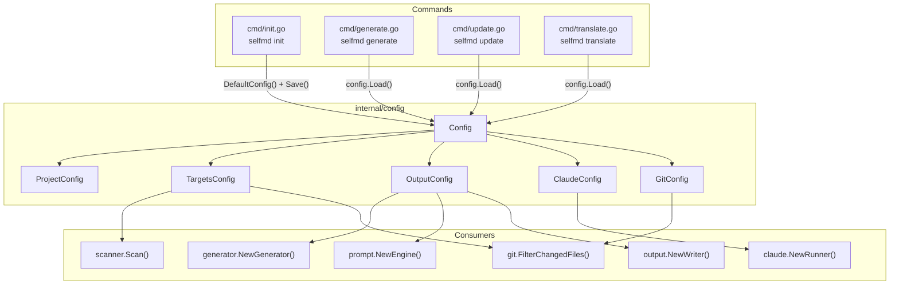
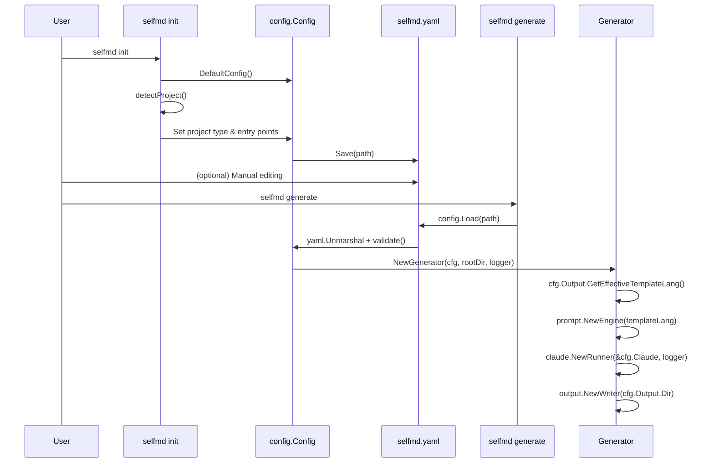

# Configuration Overview

selfmd uses a single YAML configuration file (`selfmd.yaml`) to control all aspects of documentation generation, from project metadata to Claude AI settings and git integration.

## Overview

The `selfmd.yaml` file is the central configuration point for the selfmd tool. It is loaded at the start of every command (`generate`, `update`, `translate`) and governs:

- **Project identity** — name, type, and description
- **File targeting** — which source files to include or exclude from documentation
- **Output settings** — output directory, primary and secondary languages, and cleanup behavior
- **Claude AI parameters** — model selection, concurrency, timeouts, retries, and tool permissions
- **Git integration** — whether to enable git-based incremental updates and which branch to compare against

The configuration file is created by `selfmd init` and can be edited manually afterward. All fields have sensible defaults defined in the `DefaultConfig()` function, so only values that differ from the defaults need to be specified.

## Architecture



## Configuration Structure

The `Config` struct is defined in `internal/config/config.go` and consists of five top-level sections:

```go
type Config struct {
	Project ProjectConfig `yaml:"project"`
	Targets TargetsConfig `yaml:"targets"`
	Output  OutputConfig  `yaml:"output"`
	Claude  ClaudeConfig  `yaml:"claude"`
	Git     GitConfig     `yaml:"git"`
}
```

> Source: internal/config/config.go#L11-L17

### `project` — Project Metadata

Describes the project being documented.

```go
type ProjectConfig struct {
	Name        string `yaml:"name"`
	Type        string `yaml:"type"`
	Description string `yaml:"description"`
}
```

> Source: internal/config/config.go#L19-L23

| Field | Type | Default | Description |
|-------|------|---------|-------------|
| `name` | string | Current directory name | Project display name used in documentation headings |
| `type` | string | `"backend"` | Project type. Auto-detected by `selfmd init` from project files (e.g., `go.mod` → `backend`, `package.json` → `frontend`) |
| `description` | string | `""` | Optional project description |

The `selfmd init` command auto-detects project type by checking for marker files:

```go
checks := []struct {
	file    string
	pType   string
	entries []string
}{
	{"go.mod", "backend", []string{"main.go", "cmd/root.go"}},
	{"Cargo.toml", "backend", []string{"src/main.rs", "src/lib.rs"}},
	{"package.json", "frontend", []string{"src/index.ts", "src/index.js", "src/main.ts", "src/App.tsx"}},
	{"pom.xml", "backend", []string{"src/main/java"}},
	{"build.gradle", "backend", []string{"src/main/java"}},
	{"requirements.txt", "backend", []string{"main.py", "app.py", "src/main.py"}},
	{"pyproject.toml", "backend", []string{"src/main.py", "main.py"}},
	{"composer.json", "backend", []string{"public/index.php", "src/Kernel.php"}},
	{"Gemfile", "backend", []string{"config/application.rb", "app/"}},
}
```

> Source: cmd/init.go#L61-L75

### `targets` — File Targeting

Controls which source files are scanned and included in documentation generation.

```go
type TargetsConfig struct {
	Include     []string `yaml:"include"`
	Exclude     []string `yaml:"exclude"`
	EntryPoints []string `yaml:"entry_points"`
}
```

> Source: internal/config/config.go#L25-L29

| Field | Type | Default | Description |
|-------|------|---------|-------------|
| `include` | []string | `["src/**", "pkg/**", "cmd/**", "internal/**", "lib/**", "app/**"]` | Glob patterns for files to include |
| `exclude` | []string | `["vendor/**", "node_modules/**", ".git/**", ".doc-build/**", "**/*.pb.go", "**/generated/**", "dist/**", "build/**"]` | Glob patterns for files to exclude |
| `entry_points` | []string | `[]` | Key files whose content is read and passed to Claude as context |

The scanner evaluates exclude patterns first (skipping entire directories when matched), then checks include patterns. Both use the `doublestar` glob library for pattern matching:

```go
// check excludes
for _, pattern := range cfg.Targets.Exclude {
	matched, _ := doublestar.Match(pattern, rel)
	if matched {
		if d.IsDir() {
			return filepath.SkipDir
		}
		return nil
	}
}
```

> Source: internal/scanner/scanner.go#L33-L41

The `entry_points` field is particularly important — these files are read in full and provided as context to Claude when generating documentation, helping it understand the project's architecture and entry flow.

### `output` — Output Settings

Controls where and how documentation is generated.

```go
type OutputConfig struct {
	Dir                 string   `yaml:"dir"`
	Language            string   `yaml:"language"`
	SecondaryLanguages  []string `yaml:"secondary_languages"`
	CleanBeforeGenerate bool     `yaml:"clean_before_generate"`
}
```

> Source: internal/config/config.go#L31-L36

| Field | Type | Default | Description |
|-------|------|---------|-------------|
| `dir` | string | `".doc-build"` | Output directory for generated documentation |
| `language` | string | `"zh-TW"` | Primary documentation language |
| `secondary_languages` | []string | `[]` | Additional languages for translation via `selfmd translate` |
| `clean_before_generate` | bool | `false` | Whether to wipe the output directory before generating |

The `OutputConfig` also provides helper methods for template language resolution:

```go
func (o *OutputConfig) GetEffectiveTemplateLang() string {
	for _, lang := range SupportedTemplateLangs {
		if o.Language == lang {
			return o.Language
		}
	}
	return "en-US"
}
```

> Source: internal/config/config.go#L58-L65

Currently, built-in prompt templates are available for `zh-TW` and `en-US`. If the configured language does not have a built-in template, selfmd falls back to `en-US` templates and instructs Claude to output in the target language via a language override.

### `claude` — Claude AI Settings

Controls how selfmd interacts with the Claude Code CLI.

```go
type ClaudeConfig struct {
	Model          string   `yaml:"model"`
	MaxConcurrent  int      `yaml:"max_concurrent"`
	TimeoutSeconds int      `yaml:"timeout_seconds"`
	MaxRetries     int      `yaml:"max_retries"`
	AllowedTools   []string `yaml:"allowed_tools"`
	ExtraArgs      []string `yaml:"extra_args"`
}
```

> Source: internal/config/config.go#L82-L89

| Field | Type | Default | Description |
|-------|------|---------|-------------|
| `model` | string | `"sonnet"` | Claude model name (e.g., `sonnet`, `opus`, `haiku`) |
| `max_concurrent` | int | `3` | Maximum number of concurrent Claude calls for content generation |
| `timeout_seconds` | int | `1800` | Timeout per Claude invocation in seconds |
| `max_retries` | int | `2` | Number of retries on failure |
| `allowed_tools` | []string | `["Read", "Glob", "Grep"]` | Tools Claude is allowed to use during documentation generation |
| `extra_args` | []string | `[]` | Additional CLI arguments passed to the Claude Code command |

The `max_concurrent` setting directly controls parallelism in the content generation phase:

```go
concurrency := g.Config.Claude.MaxConcurrent
if opts.Concurrency > 0 {
	concurrency = opts.Concurrency
}
fmt.Printf("[3/4] Generating content pages (concurrency: %d)...\n", concurrency)
```

> Source: internal/generator/pipeline.go#L130-L134

### `git` — Git Integration Settings

Controls git-based incremental update behavior.

```go
type GitConfig struct {
	Enabled    bool   `yaml:"enabled"`
	BaseBranch string `yaml:"base_branch"`
}
```

> Source: internal/config/config.go#L91-L94

| Field | Type | Default | Description |
|-------|------|---------|-------------|
| `enabled` | bool | `true` | Whether git integration is active |
| `base_branch` | string | `"main"` | Branch used as the baseline for `selfmd update` change detection |

The `base_branch` is used to find the merge base when no saved commit is available:

```go
base, err := git.GetMergeBase(rootDir, cfg.Git.BaseBranch)
```

> Source: cmd/update.go#L76

## Core Processes

### Configuration Lifecycle



### Configuration Loading and Validation

The `Load` function reads the YAML file, unmarshals it onto a pre-populated default config (so unspecified fields retain their defaults), and runs validation:

```go
func Load(path string) (*Config, error) {
	data, err := os.ReadFile(path)
	if err != nil {
		return nil, fmt.Errorf("failed to read config file %s: %w", path, err)
	}

	cfg := DefaultConfig()
	if err := yaml.Unmarshal(data, cfg); err != nil {
		return nil, fmt.Errorf("config file format error: %w", err)
	}

	if err := cfg.validate(); err != nil {
		return nil, err
	}

	return cfg, nil
}
```

> Source: internal/config/config.go#L131-L147

The validation rules enforce the following constraints:

```go
func (c *Config) validate() error {
	if c.Output.Dir == "" {
		return fmt.Errorf("%s", "output.dir must not be empty")
	}
	if c.Output.Language == "" {
		return fmt.Errorf("%s", "output.language must not be empty")
	}
	if c.Claude.MaxConcurrent < 1 {
		c.Claude.MaxConcurrent = 1
	}
	if c.Claude.TimeoutSeconds < 30 {
		c.Claude.TimeoutSeconds = 30
	}
	if c.Claude.MaxRetries < 0 {
		c.Claude.MaxRetries = 0
	}
	return nil
}
```

> Source: internal/config/config.go#L157-L174

Key validation behaviors:

- `output.dir` and `output.language` are **required** — an error is returned if they are empty
- `max_concurrent` is silently clamped to a minimum of `1`
- `timeout_seconds` is silently clamped to a minimum of `30`
- `max_retries` is silently clamped to a minimum of `0`

## Usage Examples

### Complete Configuration File

Below is a real-world `selfmd.yaml` from the selfmd project itself:

```yaml
project:
    name: selfmd
    type: cli
    description: ""
targets:
    include:
        - src/**
        - pkg/**
        - cmd/**
        - internal/**
        - lib/**
        - app/**
    exclude:
        - vendor/**
        - node_modules/**
        - .git/**
        - .doc-build/**
        - '**/*.pb.go'
        - '**/generated/**'
        - dist/**
        - build/**
    entry_points:
        - main.go
        - cmd/root.go
output:
    dir: docs
    language: en-US
    secondary_languages: ["zh-TW"]
    clean_before_generate: false
claude:
    model: opus
    max_concurrent: 3
    timeout_seconds: 30000
    max_retries: 2
    allowed_tools:
        - Read
        - Glob
        - Grep
    extra_args: []
git:
    enabled: true
    base_branch: develop
```

> Source: selfmd.yaml#L1-L43

### CLI Config File Override

The config file path can be overridden using the `--config` (or `-c`) flag on any command:

```go
rootCmd.PersistentFlags().StringVarP(&cfgFile, "config", "c", "selfmd.yaml", "config file path")
```

> Source: cmd/root.go#L37

This allows maintaining multiple configuration files for different documentation targets or environments.

## Related Links

- [Configuration](../index.md) — Parent section for all configuration topics
- [Project Targets](../project-targets/index.md) — Detailed documentation on include/exclude patterns and entry points
- [Output Language](../output-language/index.md) — Supported languages and template resolution
- [Claude Settings](../claude-config/index.md) — Claude model and concurrency tuning
- [Git Integration Settings](../git-config/index.md) — Git-based incremental update configuration
- [init Command](../../cli/cmd-init/index.md) — How `selfmd init` generates the configuration file
- [generate Command](../../cli/cmd-generate/index.md) — How the generate command consumes configuration
- [Generation Pipeline](../../architecture/pipeline/index.md) — Architecture of the generation pipeline that uses this configuration

## Reference Files

| File Path | Description |
|-----------|-------------|
| `internal/config/config.go` | Core Config struct definition, defaults, loading, validation, and language helpers |
| `cmd/root.go` | Root command definition with `--config` flag |
| `cmd/init.go` | `selfmd init` — config generation with project type detection |
| `cmd/generate.go` | `selfmd generate` — config loading and option overrides |
| `cmd/update.go` | `selfmd update` — config loading and git integration usage |
| `cmd/translate.go` | `selfmd translate` — config loading and language validation |
| `internal/generator/pipeline.go` | Generator struct creation and pipeline using config values |
| `internal/scanner/scanner.go` | Scanner that applies `targets.include` and `targets.exclude` patterns |
| `internal/git/git.go` | Git operations using `git.base_branch` config |
| `internal/generator/updater.go` | Incremental update logic using config for matching and regeneration |
| `selfmd.yaml` | Real-world configuration example from the selfmd project |