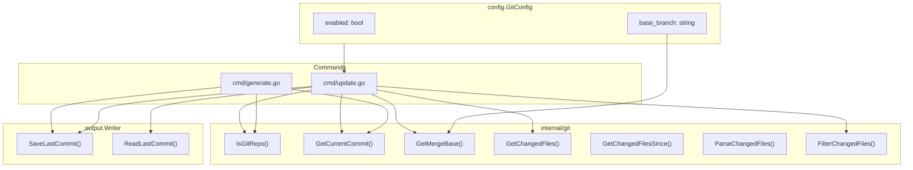
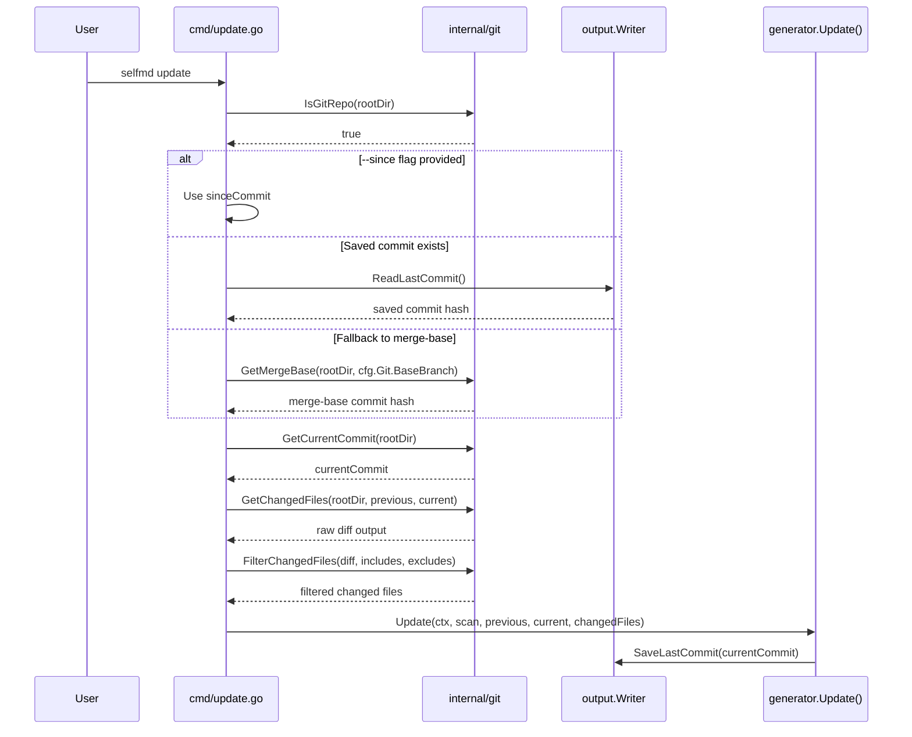

# Git Integration Settings

The `git` section in `selfmd.yaml` controls how selfmd integrates with Git for incremental documentation updates via the `update` command.

## Overview

selfmd leverages Git to detect source code changes between commits, enabling incremental documentation updates instead of full regeneration. The Git integration settings determine:

- Whether Git-based change detection is active
- Which branch serves as the baseline for diff comparisons
- How commit history is tracked between runs

When Git integration is enabled, the `generate` command records the current HEAD commit hash, and the `update` command uses it as a reference point to identify changed files and update only the affected documentation pages.

## Architecture



## Configuration Fields

The Git settings are defined in the `git` section of `selfmd.yaml`:

```yaml
git:
    enabled: true
    base_branch: main
```

### `enabled`

| Property | Value |
|----------|-------|
| Type | `bool` |
| Default | `true` |
| Required | No |

Controls whether Git integration is active. When set to `true`, the `generate` command will record the current commit hash into a `_last_commit` file in the output directory. This saved commit is then used by the `update` command to determine which files have changed.

### `base_branch`

| Property | Value |
|----------|-------|
| Type | `string` |
| Default | `"main"` |
| Required | No |

Specifies the base branch used to compute the merge-base commit when no saved commit exists. During an `update`, selfmd resolves the comparison commit in this priority order:

1. The `--since` flag value (if provided on the CLI)
2. The saved commit from `_last_commit` (written by a previous `generate` or `update`)
3. The merge-base between `base_branch` and the current `HEAD`

```go
// Determine comparison commit
previousCommit := sinceCommit
if previousCommit == "" {
    // Try reading saved commit from last generate/update
    saved, readErr := gen.Writer.ReadLastCommit()
    if readErr == nil && saved != "" {
        previousCommit = saved
    } else {
        // Fallback to merge-base
        base, err := git.GetMergeBase(rootDir, cfg.Git.BaseBranch)
        if err != nil {
            return fmt.Errorf("cannot get base commit: %w\nhint: run selfmd generate first or use --since to specify a commit", err)
        }
        previousCommit = base
    }
}
```

> Source: cmd/update.go#L68-L82

## Core Processes

### Commit Tracking in `generate`

When `generate` completes, it checks if the project is a Git repository and saves the current HEAD commit hash for future incremental updates:

```go
// Save current commit for incremental updates
if git.IsGitRepo(g.RootDir) {
    if commit, err := git.GetCurrentCommit(g.RootDir); err == nil {
        if err := g.Writer.SaveLastCommit(commit); err != nil {
            g.Logger.Warn("failed to save commit record", "error", err)
        }
    }
}
```

> Source: internal/generator/pipeline.go#L163-L169

The commit hash is persisted to a `_last_commit` file in the output directory:

```go
// SaveLastCommit saves the current commit hash for incremental updates.
func (w *Writer) SaveLastCommit(commit string) error {
	return w.WriteFile("_last_commit", commit)
}
```

> Source: internal/output/writer.go#L130-L132

### Change Detection in `update`

The following sequence diagram illustrates the full incremental update flow driven by Git settings:



The `update` command requires the project to be a Git repository. If it is not, the command exits with an error:

```go
if !git.IsGitRepo(rootDir) {
    return fmt.Errorf("%s", "current directory is not a git repository, cannot perform incremental update")
}
```

> Source: cmd/update.go#L49-L51

### Changed File Detection and Filtering

The `GetChangedFiles` function runs `git diff --relative --name-status` between two commits, producing output with file status indicators (`M` for modified, `A` for added, `D` for deleted, `R` for renamed):

```go
// GetChangedFiles returns the list of changed files between two commits.
// Uses --relative so paths are relative to the working directory (dir), not the git repo root.
func GetChangedFiles(dir, fromCommit, toCommit string) (string, error) {
	return runGit(dir, "diff", "--relative", "--name-status", fromCommit+".."+toCommit)
}
```

> Source: internal/git/git.go#L31-L34

The raw diff output is then filtered using the `targets.include` and `targets.exclude` glob patterns from the configuration, ensuring only relevant source files are considered:

```go
changedFiles = git.FilterChangedFiles(changedFiles, cfg.Targets.Include, cfg.Targets.Exclude)
```

> Source: cmd/update.go#L94

The `FilterChangedFiles` function applies doublestar glob matching to each file path, excluding files that match any exclude pattern and including only files that match at least one include pattern:

```go
// FilterChangedFiles filters git diff --name-status output using include/exclude glob patterns.
func FilterChangedFiles(changedFiles string, includes, excludes []string) string {
	lines := strings.Split(changedFiles, "\n")
	var filtered []string

	for _, line := range lines {
		line = strings.TrimSpace(line)
		if line == "" {
			continue
		}

		parts := strings.SplitN(line, "\t", 3)
		if len(parts) < 2 {
			continue
		}

		// For renames, check the destination path (last element)
		filePath := parts[len(parts)-1]

		// Check excludes
		excluded := false
		for _, pattern := range excludes {
			if matched, _ := doublestar.Match(pattern, filePath); matched {
				excluded = true
				break
			}
		}
		if excluded {
			continue
		}

		// Check includes (if configured)
		if len(includes) > 0 {
			included := false
			for _, pattern := range includes {
				if matched, _ := doublestar.Match(pattern, filePath); matched {
					included = true
					break
				}
			}
			if !included {
				continue
			}
		}

		filtered = append(filtered, line)
	}

	return strings.Join(filtered, "\n")
}
```

> Source: internal/git/git.go#L73-L122

## Usage Examples

### Default Configuration

When initialized with `selfmd init`, the default Git settings are:

```go
Git: GitConfig{
    Enabled:    true,
    BaseBranch: "main",
},
```

> Source: internal/config/config.go#L124-L127

### Custom Base Branch

If your project uses `develop` as its primary branch:

```yaml
git:
    enabled: true
    base_branch: develop
```

> Source: selfmd.yaml#L40-L42

### Running Incremental Update

After generating initial documentation with `selfmd generate`, run incremental updates with:

```bash
selfmd update
```

Or specify a particular commit to diff from:

```bash
selfmd update --since abc1234
```

> Source: cmd/update.go#L30

## Related Links

- [Configuration Overview](../config-overview/index.md)
- [update Command](../../cli/cmd-update/index.md)
- [generate Command](../../cli/cmd-generate/index.md)
- [Change Detection](../../git-integration/change-detection/index.md)
- [Affected Page Matching](../../git-integration/affected-pages/index.md)
- [Incremental Update Engine](../../core-modules/incremental-update/index.md)
- [Project Targets](../project-targets/index.md)

## Reference Files

| File Path | Description |
|-----------|-------------|
| `internal/config/config.go` | `GitConfig` struct definition and default values |
| `internal/git/git.go` | Git operations: diff, merge-base, change detection, filtering |
| `cmd/update.go` | `update` command implementation and commit resolution logic |
| `cmd/generate.go` | `generate` command implementation |
| `internal/generator/pipeline.go` | Generation pipeline with commit saving on completion |
| `internal/generator/updater.go` | Incremental update logic using parsed changed files |
| `internal/output/writer.go` | `SaveLastCommit` / `ReadLastCommit` persistence |
| `selfmd.yaml` | Project configuration file with example git settings |