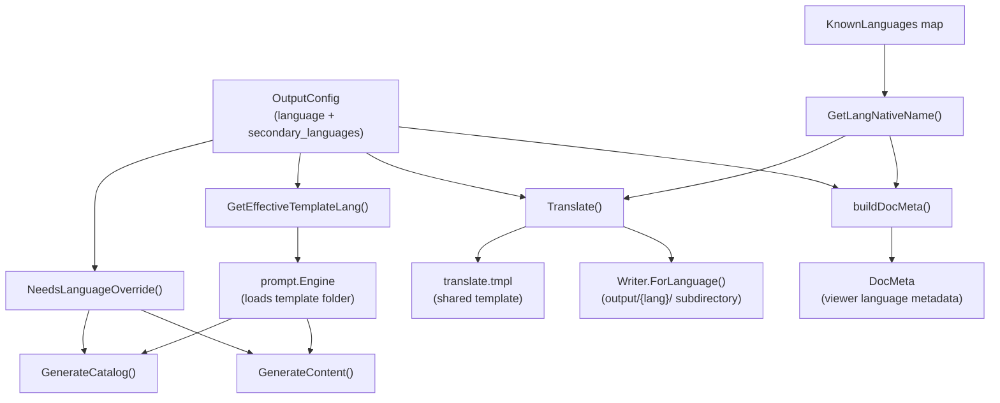
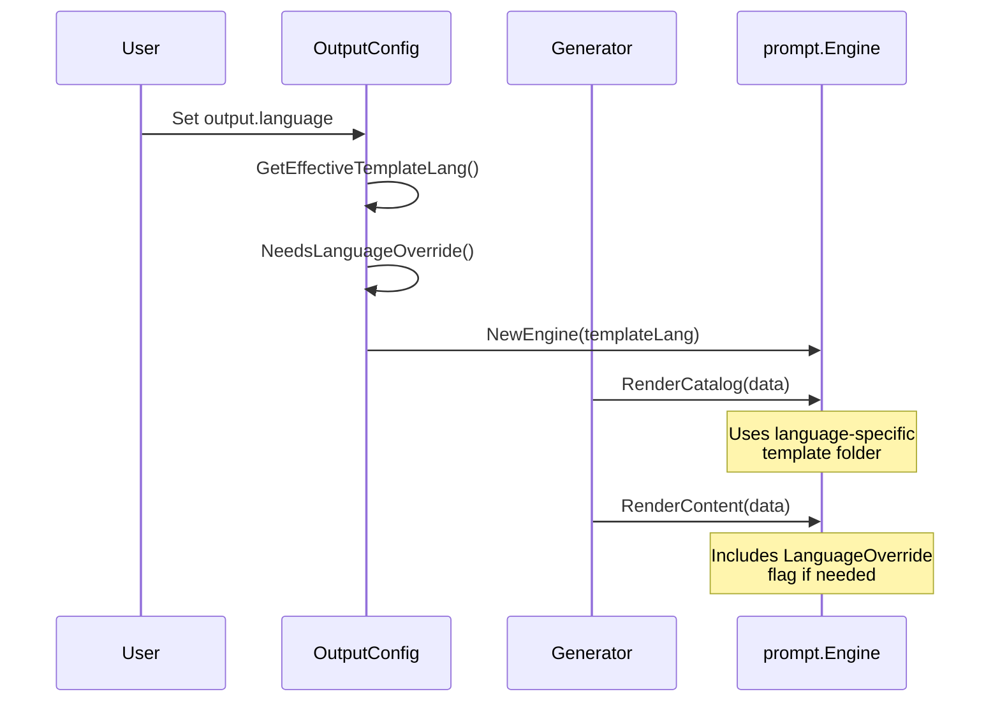
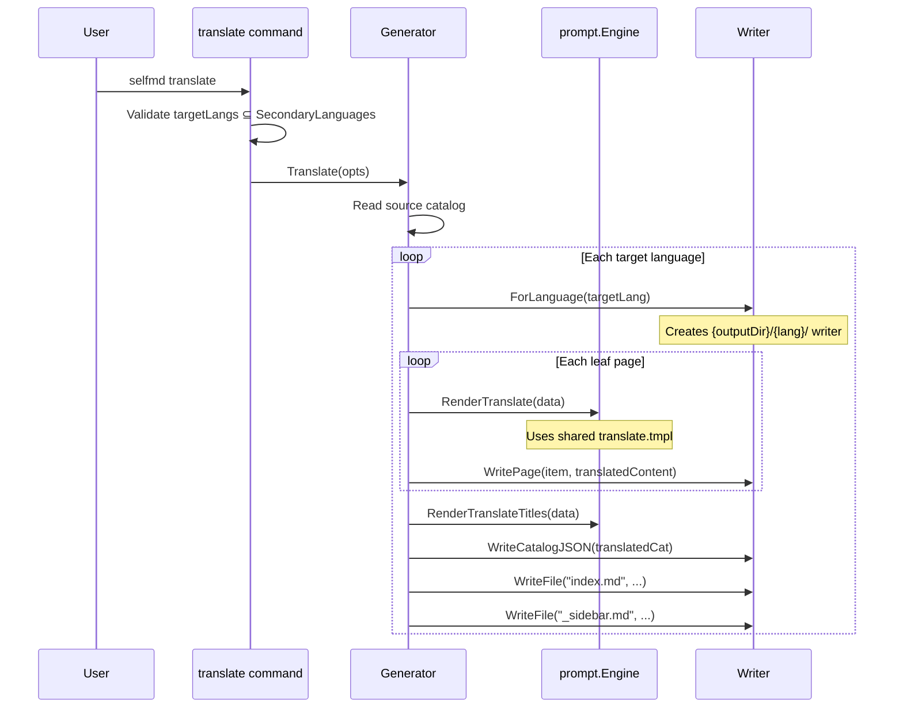

# Output Language

The output language configuration controls which language selfmd uses when generating documentation, and defines secondary languages for translation.

## Overview

selfmd supports multilingual documentation generation through a two-tier language system:

- **Primary language** (`output.language`): The language used during initial documentation generation. All prompts, catalog titles, and content pages are produced in this language.
- **Secondary languages** (`output.secondary_languages`): Additional languages that existing documentation can be translated into via the `selfmd translate` command.

The system maintains a registry of known language codes, manages prompt template selection with fallback logic, and provides a language override mechanism for languages without dedicated prompt templates.

## Architecture



## Configuration Fields

The language-related settings reside in the `output` section of `selfmd.yaml`:

```yaml
output:
    dir: docs
    language: en-US
    secondary_languages: ["zh-TW"]
    clean_before_generate: false
```

> Source: selfmd.yaml#L25-L29

| Field | Type | Default | Description |
|-------|------|---------|-------------|
| `language` | `string` | `"zh-TW"` | Primary documentation language (BCP 47 code) |
| `secondary_languages` | `[]string` | `[]` | Languages for translation output |

These fields are defined in the `OutputConfig` struct:

```go
type OutputConfig struct {
	Dir                 string   `yaml:"dir"`
	Language            string   `yaml:"language"`
	SecondaryLanguages  []string `yaml:"secondary_languages"`
	CleanBeforeGenerate bool     `yaml:"clean_before_generate"`
}
```

> Source: internal/config/config.go#L31-L36

The `language` field is mandatory — validation rejects an empty value:

```go
func (c *Config) validate() error {
	if c.Output.Language == "" {
		return fmt.Errorf("%s", "output.language must not be empty")
	}
	// ...
}
```

> Source: internal/config/config.go#L157-L162

## Known Languages

selfmd maintains a map of recognized language codes and their native display names:

```go
var KnownLanguages = map[string]string{
	"zh-TW": "繁體中文",
	"zh-CN": "简体中文",
	"en-US": "English",
	"ja-JP": "日本語",
	"ko-KR": "한국어",
	"fr-FR": "Français",
	"de-DE": "Deutsch",
	"es-ES": "Español",
	"pt-BR": "Português",
	"th-TH": "ไทย",
	"vi-VN": "Tiếng Việt",
}
```

> Source: internal/config/config.go#L39-L51

The `GetLangNativeName` helper resolves a language code to its display name, falling back to the code itself for unrecognized values:

```go
func GetLangNativeName(code string) string {
	if name, ok := KnownLanguages[code]; ok {
		return name
	}
	return code
}
```

> Source: internal/config/config.go#L75-L80

This function is used throughout the codebase — in catalog generation, content generation, translation output, and viewer metadata construction.

## Prompt Template Selection

Not all known languages have dedicated prompt template folders. Only two languages have built-in prompt templates:

```go
var SupportedTemplateLangs = []string{"zh-TW", "en-US"}
```

> Source: internal/config/config.go#L54

The template directory structure reflects this:

```
internal/prompt/templates/
├── en-US/
│   ├── catalog.tmpl
│   ├── content.tmpl
│   ├── update_matched.tmpl
│   ├── update_unmatched.tmpl
│   └── updater.tmpl
├── zh-TW/
│   ├── catalog.tmpl
│   ├── content.tmpl
│   ├── update_matched.tmpl
│   ├── update_unmatched.tmpl
│   └── updater.tmpl
├── translate.tmpl
└── translate_titles.tmpl
```

### Effective Template Language

When the configured `output.language` does not match any built-in template folder, the system falls back to `en-US`:

```go
func (o *OutputConfig) GetEffectiveTemplateLang() string {
	for _, lang := range SupportedTemplateLangs {
		if o.Language == lang {
			return o.Language
		}
	}
	return "en-US"
}
```

> Source: internal/config/config.go#L58-L65

The effective template language is used when creating the `prompt.Engine`:

```go
func NewGenerator(cfg *config.Config, rootDir string, logger *slog.Logger) (*Generator, error) {
	templateLang := cfg.Output.GetEffectiveTemplateLang()
	engine, err := prompt.NewEngine(templateLang)
	// ...
}
```

> Source: internal/generator/pipeline.go#L34-L36

### Language Override Mechanism

When the template language differs from the configured output language (e.g., `output.language: "ja-JP"` uses `en-US` templates), a language override flag is set. This injects an explicit instruction into the prompt telling Claude to produce output in the target language despite the template being in English:

```go
func (o *OutputConfig) NeedsLanguageOverride() bool {
	return o.GetEffectiveTemplateLang() != o.Language
}
```

> Source: internal/config/config.go#L69-L71

The override is passed into prompt data during both catalog and content generation:

```go
data := prompt.ContentPromptData{
	LanguageOverride:     g.Config.Output.NeedsLanguageOverride(),
	LanguageOverrideName: langName,
	// ...
}
```

> Source: internal/generator/content_phase.go#L91-L95

Within the prompt template, the override triggers an additional instruction block:

```
{{- if .LanguageOverride}}
- **Document Language**: {{.LanguageOverrideName}} ({{.Language}})
- **IMPORTANT**: All documentation content MUST be written in **{{.LanguageOverrideName}}** ({{.Language}}).
{{- else}}
- **Document Language**: {{.LanguageName}} ({{.Language}})
{{- end}}
```

> Source: internal/prompt/templates/en-US/content.tmpl#L21-L26

## Core Processes

### Primary Language Generation Flow



### Translation Flow

When secondary languages are configured, the `selfmd translate` command triggers a separate pipeline:



The translate command validates that the specified `--lang` flags are a subset of `secondary_languages`:

```go
targetLangs := cfg.Output.SecondaryLanguages
if len(translateLangs) > 0 {
	validLangs := make(map[string]bool)
	for _, l := range cfg.Output.SecondaryLanguages {
		validLangs[l] = true
	}
	for _, l := range translateLangs {
		if !validLangs[l] {
			return fmt.Errorf("language %s is not in secondary_languages list (available: %s)", l, strings.Join(cfg.Output.SecondaryLanguages, ", "))
		}
	}
	targetLangs = translateLangs
}
```

> Source: cmd/translate.go#L54-L67

## Output Directory Structure

Translated documentation is stored in language-specific subdirectories under the output directory. The `Writer.ForLanguage()` method creates a scoped writer:

```go
func (w *Writer) ForLanguage(lang string) *Writer {
	return &Writer{
		BaseDir: filepath.Join(w.BaseDir, lang),
	}
}
```

> Source: internal/output/writer.go#L145-L149

This produces a directory layout like:

```
docs/                          # output.dir
├── _catalog.json              # primary language catalog
├── index.md                   # primary language index
├── configuration/
│   └── output-language/
│       └── index.md           # primary language page
├── zh-TW/                     # secondary language
│   ├── _catalog.json          # translated catalog
│   ├── index.md               # translated index
│   └── configuration/
│       └── output-language/
│           └── index.md       # translated page
└── index.html                 # static viewer
```

## Viewer Language Metadata

After generation or translation, selfmd builds a `DocMeta` structure that tells the static viewer which languages are available:

```go
func (g *Generator) buildDocMeta() *output.DocMeta {
	meta := &output.DocMeta{
		DefaultLanguage: g.Config.Output.Language,
		AvailableLanguages: []output.LangInfo{
			{
				Code:       g.Config.Output.Language,
				NativeName: config.GetLangNativeName(g.Config.Output.Language),
				IsDefault:  true,
			},
		},
	}
	for _, lang := range g.Config.Output.SecondaryLanguages {
		meta.AvailableLanguages = append(meta.AvailableLanguages, output.LangInfo{
			Code:       lang,
			NativeName: config.GetLangNativeName(lang),
			IsDefault:  false,
		})
	}
	return meta
}
```

> Source: internal/generator/pipeline.go#L189-L208

The `DocMeta` struct and `LangInfo` struct define the viewer's language data:

```go
type DocMeta struct {
	DefaultLanguage    string     `json:"default_language"`
	AvailableLanguages []LangInfo `json:"available_languages"`
}

type LangInfo struct {
	Code       string `json:"code"`
	NativeName string `json:"native_name"`
	IsDefault  bool   `json:"is_default"`
}
```

> Source: internal/output/writer.go#L13-L23

## UI Strings

Navigation pages (index, sidebar, category pages) use localized UI strings. Currently, two languages have full UI string support:

```go
var UIStrings = map[string]map[string]string{
	"zh-TW": {
		"techDocs":        "技術文件",
		"catalog":         "目錄",
		"home":            "首頁",
		"sectionContains": "本章節包含以下內容：",
		"autoGenerated":   "本文件由 [selfmd](https://github.com/monkenwu/selfmd) 自動產生",
	},
	"en-US": {
		"techDocs":        "Technical Documentation",
		"catalog":         "Table of Contents",
		"home":            "Home",
		"sectionContains": "This section contains the following:",
		"autoGenerated":   "This documentation was automatically generated by [selfmd](https://github.com/monkenwu/selfmd)",
	},
}
```

> Source: internal/output/navigation.go#L12-L27

Languages without an entry in `UIStrings` fall back to the English strings:

```go
func getUIStrings(lang string) map[string]string {
	if s, ok := UIStrings[lang]; ok {
		return s
	}
	return UIStrings["en-US"]
}
```

> Source: internal/output/navigation.go#L30-L35

## Usage Examples

### Setting the Primary Language

In `selfmd.yaml`, set the primary documentation language:

```yaml
output:
    language: en-US
```

> Source: selfmd.yaml#L26-L27

### Adding Secondary Languages for Translation

Define secondary languages in the config, then run the translate command:

```yaml
output:
    language: en-US
    secondary_languages: ["zh-TW"]
```

> Source: selfmd.yaml#L26-L28

```bash
# Translate to all secondary languages
selfmd translate

# Translate to a specific language only
selfmd translate --lang zh-TW

# Force re-translate existing pages
selfmd translate --force
```

### Using an Unsupported Template Language

For languages without built-in prompt templates (e.g., `ja-JP`), selfmd automatically uses the `en-US` templates with a language override instruction:

```yaml
output:
    language: ja-JP
```

In this case:
- `GetEffectiveTemplateLang()` returns `"en-US"` (fallback)
- `NeedsLanguageOverride()` returns `true`
- The prompt includes an explicit instruction to write in 日本語

## Related Links

- [Configuration Overview](../config-overview/index.md)
- [translate Command](../../cli/cmd-translate/index.md)
- [Prompt Engine](../../core-modules/prompt-engine/index.md)
- [Translate Phase](../../core-modules/generator/translate-phase/index.md)
- [Supported Languages](../../i18n/supported-languages/index.md)
- [Translation Workflow](../../i18n/translation-workflow/index.md)
- [Output Writer](../../core-modules/output-writer/index.md)
- [Static Viewer](../../core-modules/static-viewer/index.md)

## Reference Files

| File Path | Description |
|-----------|-------------|
| `internal/config/config.go` | `OutputConfig` struct, `KnownLanguages`, `SupportedTemplateLangs`, template fallback logic |
| `selfmd.yaml` | Project configuration file with language settings |
| `cmd/translate.go` | `translate` command implementation and language validation |
| `cmd/init.go` | `init` command showing default config creation |
| `internal/generator/pipeline.go` | `NewGenerator` (template lang selection), `buildDocMeta` (viewer metadata) |
| `internal/generator/translate_phase.go` | Translation pipeline: page translation, title translation, catalog building |
| `internal/generator/content_phase.go` | Content generation with language override injection |
| `internal/generator/catalog_phase.go` | Catalog generation with language override injection |
| `internal/prompt/engine.go` | Prompt template engine and prompt data structs |
| `internal/prompt/templates/en-US/content.tmpl` | Content prompt template with language override conditional |
| `internal/prompt/templates/translate.tmpl` | Shared translation prompt template |
| `internal/prompt/templates/translate_titles.tmpl` | Shared category title translation prompt |
| `internal/output/writer.go` | `Writer.ForLanguage()`, `DocMeta`, `LangInfo` structs |
| `internal/output/navigation.go` | `UIStrings` map and navigation page generators |