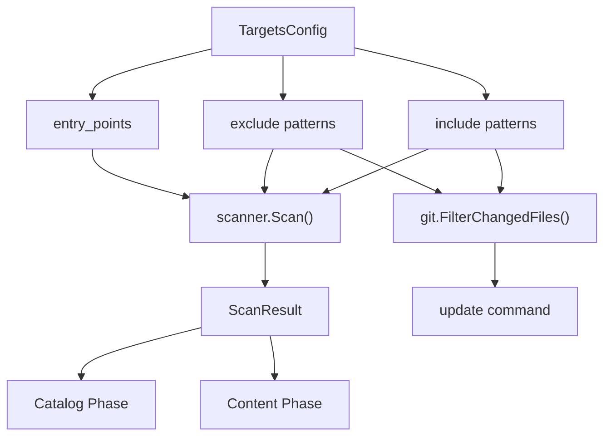
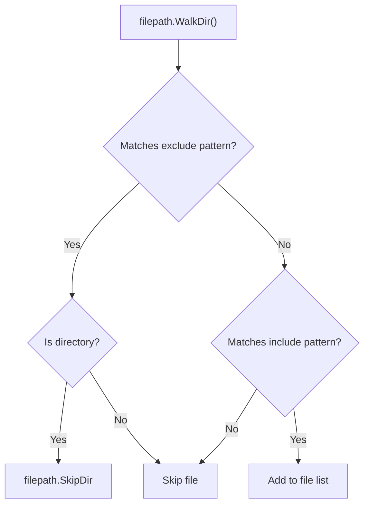

# Project Targets

The `targets` section of `selfmd.yaml` defines which source files the scanner should include, exclude, and treat as entry points during documentation generation.

## Overview

Project targets control the scope of files that selfmd analyzes. When selfmd scans a project directory, it uses three configuration fields — `include`, `exclude`, and `entry_points` — to determine which files to process. These same patterns are reused during incremental updates to filter git-changed files, ensuring consistency between full generation and update workflows.

The pattern matching is powered by the [doublestar](https://github.com/bmatcuk/doublestar) library, which supports glob patterns including the `**` wildcard for recursive directory matching.

## Architecture



## Configuration Fields

The `TargetsConfig` struct defines three fields that control file targeting:

```go
type TargetsConfig struct {
	Include     []string `yaml:"include"`
	Exclude     []string `yaml:"exclude"`
	EntryPoints []string `yaml:"entry_points"`
}
```

> Source: internal/config/config.go#L25-L29

### `include`

A list of glob patterns specifying which files to include in the scan. Only files matching at least one include pattern are processed. If the list is empty, all files are included (subject to exclusions).

### `exclude`

A list of glob patterns specifying files and directories to skip. Exclusions are evaluated first — if a directory matches an exclude pattern, the scanner skips the entire directory tree via `filepath.SkipDir`.

### `entry_points`

A list of relative file paths pointing to the project's main entry files. The scanner reads their content and passes it to the catalog generation prompt, giving Claude additional context about the project's structure and purpose.

## Default Values

When `selfmd init` generates a new configuration, it applies these defaults:

```go
Targets: TargetsConfig{
	Include: []string{"src/**", "pkg/**", "cmd/**", "internal/**", "lib/**", "app/**"},
	Exclude: []string{
		"vendor/**", "node_modules/**", ".git/**", ".doc-build/**",
		"**/*.pb.go", "**/generated/**", "dist/**", "build/**",
	},
	EntryPoints: []string{},
},
```

> Source: internal/config/config.go#L102-L109

The `init` command also auto-detects entry points based on the project type:

```go
checks := []struct {
	file    string
	pType   string
	entries []string
}{
	{"go.mod", "backend", []string{"main.go", "cmd/root.go"}},
	{"Cargo.toml", "backend", []string{"src/main.rs", "src/lib.rs"}},
	{"package.json", "frontend", []string{"src/index.ts", "src/index.js", "src/main.ts", "src/App.tsx"}},
	{"pom.xml", "backend", []string{"src/main/java"}},
	{"build.gradle", "backend", []string{"src/main/java"}},
	{"requirements.txt", "backend", []string{"main.py", "app.py", "src/main.py"}},
	{"pyproject.toml", "backend", []string{"src/main.py", "main.py"}},
	{"composer.json", "backend", []string{"public/index.php", "src/Kernel.php"}},
	{"Gemfile", "backend", []string{"config/application.rb", "app/"}},
}
```

> Source: cmd/init.go#L61-L75

Only entry point paths that actually exist on disk are included in the final configuration.

## Glob Pattern Syntax

Patterns use the `doublestar` library for matching. Key rules:

| Pattern | Meaning |
|---------|---------|
| `*` | Matches any sequence of non-separator characters |
| `**` | Matches zero or more directories recursively |
| `?` | Matches any single non-separator character |
| `[abc]` | Matches any character in the set |
| `{a,b}` | Matches either `a` or `b` |

Examples:

| Pattern | Matches |
|---------|---------|
| `src/**` | All files under `src/` at any depth |
| `**/*.pb.go` | All Protocol Buffer generated Go files |
| `**/generated/**` | All files within any `generated/` directory |
| `vendor/**` | All files under `vendor/` |

## Core Processes

### Scanner File Filtering

The scanner walks the project directory and applies exclude patterns first, then include patterns:



The scanner implementation applies this logic during directory traversal:

```go
// check excludes
for _, pattern := range cfg.Targets.Exclude {
	matched, _ := doublestar.Match(pattern, rel)
	if matched {
		if d.IsDir() {
			return filepath.SkipDir
		}
		return nil
	}
}

// ...

// check includes
if len(cfg.Targets.Include) > 0 {
	included := false
	for _, pattern := range cfg.Targets.Include {
		matched, _ := doublestar.Match(pattern, rel)
		if matched {
			included = true
			break
		}
	}
	if !included {
		return nil
	}
}
```

> Source: internal/scanner/scanner.go#L33-L61

### Entry Point Reading

After the file list is built, the scanner reads the content of each entry point file and stores it in `ScanResult.EntryPointContents`. Files larger than 50,000 characters are truncated.

```go
entryPointContents := make(map[string]string)
for _, ep := range cfg.Targets.EntryPoints {
	content := readFileIfExists(rootDir, ep)
	if content != "" {
		entryPointContents[ep] = content
	}
}
```

> Source: internal/scanner/scanner.go#L84-L90

This content is then formatted and injected into the catalog generation prompt via `EntryPointsFormatted()`:

```go
data := prompt.CatalogPromptData{
	// ...
	EntryPoints: scan.EntryPointsFormatted(),
	// ...
}
```

> Source: internal/generator/catalog_phase.go#L17-L28

### Git Change Filtering

During incremental updates (`selfmd update`), the same include/exclude patterns filter git-changed files to ensure only relevant changes trigger documentation regeneration:

```go
changedFiles = git.FilterChangedFiles(changedFiles, cfg.Targets.Include, cfg.Targets.Exclude)
```

> Source: cmd/update.go#L94

The `FilterChangedFiles` function parses `git diff --name-status` output and applies the same doublestar matching logic:

```go
func FilterChangedFiles(changedFiles string, includes, excludes []string) string {
	lines := strings.Split(changedFiles, "\n")
	var filtered []string

	for _, line := range lines {
		// ...
		filePath := parts[len(parts)-1]

		// Check excludes
		excluded := false
		for _, pattern := range excludes {
			if matched, _ := doublestar.Match(pattern, filePath); matched {
				excluded = true
				break
			}
		}
		if excluded {
			continue
		}

		// Check includes (if configured)
		if len(includes) > 0 {
			included := false
			for _, pattern := range includes {
				if matched, _ := doublestar.Match(pattern, filePath); matched {
					included = true
					break
				}
			}
			if !included {
				continue
			}
		}

		filtered = append(filtered, line)
	}

	return strings.Join(filtered, "\n")
}
```

> Source: internal/git/git.go#L73-L122

## Usage Examples

A typical `targets` section in `selfmd.yaml`:

```yaml
targets:
    include:
        - src/**
        - pkg/**
        - cmd/**
        - internal/**
        - lib/**
        - app/**
    exclude:
        - vendor/**
        - node_modules/**
        - .git/**
        - .doc-build/**
        - '**/*.pb.go'
        - '**/generated/**'
        - dist/**
        - build/**
    entry_points:
        - main.go
        - cmd/root.go
```

> Source: selfmd.yaml#L5-L23

### Customization Tips

**Monorepo with multiple services:** narrow the include patterns to the relevant service directory:

```yaml
targets:
    include:
        - services/api/**
        - shared/lib/**
```

**Frontend project:** focus on source files and exclude test/build artifacts:

```yaml
targets:
    include:
        - src/**
    exclude:
        - node_modules/**
        - dist/**
        - '**/*.test.ts'
        - '**/*.spec.ts'
        - coverage/**
```

**Adding entry points:** specify the main files Claude should read for project context:

```yaml
targets:
    entry_points:
        - src/index.ts
        - src/App.tsx
```

## Related Links

- [Configuration Overview](../config-overview/index.md)
- [Claude Settings](../claude-config/index.md)
- [Git Integration Settings](../git-config/index.md)
- [Project Scanner](../../core-modules/scanner/index.md)
- [Change Detection](../../git-integration/change-detection/index.md)
- [Affected Page Matching](../../git-integration/affected-pages/index.md)
- [Catalog Phase](../../core-modules/generator/catalog-phase/index.md)

## Reference Files

| File Path | Description |
|-----------|-------------|
| `internal/config/config.go` | `TargetsConfig` struct definition and default values |
| `internal/scanner/scanner.go` | Scanner implementation using include/exclude patterns and entry point reading |
| `internal/scanner/filetree.go` | `ScanResult` struct and file tree building |
| `internal/git/git.go` | `FilterChangedFiles` applying targets patterns to git diffs |
| `internal/generator/pipeline.go` | Generator pipeline invoking the scanner |
| `internal/generator/catalog_phase.go` | Catalog phase consuming entry point content |
| `internal/prompt/engine.go` | `CatalogPromptData` struct with `EntryPoints` field |
| `cmd/init.go` | Auto-detection of project type and entry points |
| `cmd/generate.go` | Generate command loading config and invoking pipeline |
| `cmd/update.go` | Update command filtering changed files with targets patterns |
| `selfmd.yaml` | Example project configuration file |