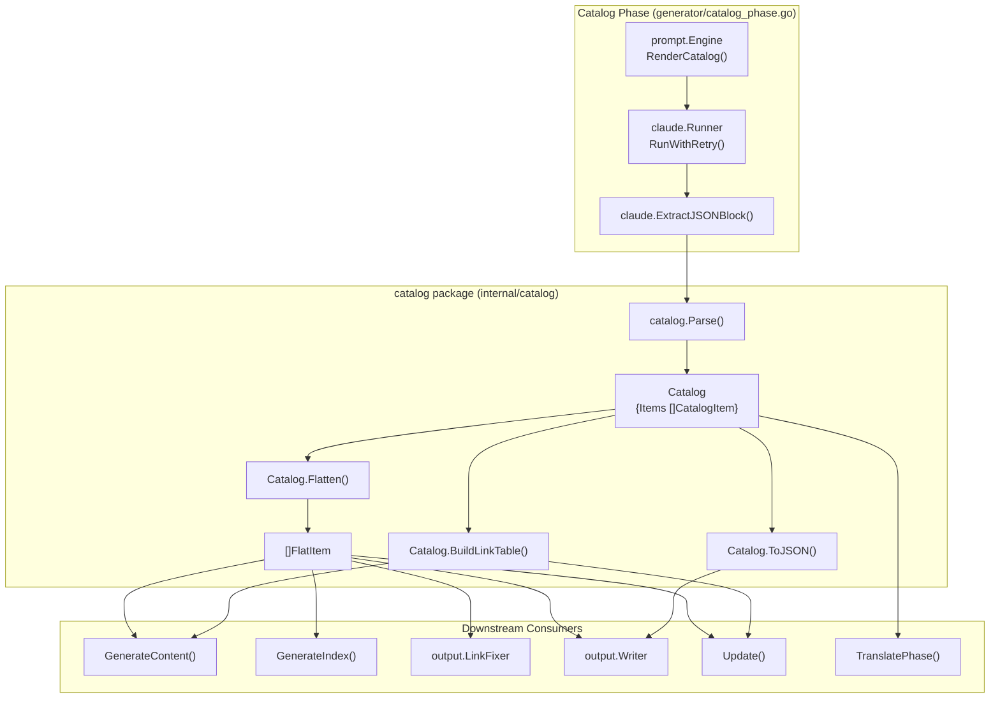
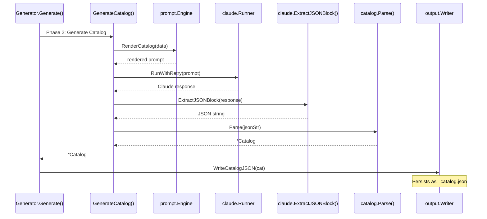

# Catalog Manager

The Catalog Manager (`internal/catalog`) defines and manages the hierarchical documentation structure that drives the entire generation pipeline. It provides the core data model for representing, parsing, flattening, and serializing the documentation catalog.

## Overview

The Catalog Manager is a foundational module in selfmd responsible for representing the tree-structured table of contents that organizes all documentation pages. Every other phase of the generation pipeline — content generation, index generation, navigation, link fixing, translation, and incremental updates — depends on the catalog data model.

Key responsibilities:

- **Define the catalog data model** — `Catalog`, `CatalogItem` (tree nodes), and `FlatItem` (flattened representation)
- **Parse JSON into a catalog tree** — Deserializing Claude's AI-generated output into a structured `Catalog`
- **Flatten the tree for iteration** — Converting the hierarchical structure into a depth-first ordered flat list
- **Serialize back to JSON** — Persisting the catalog for reuse across generation runs
- **Build link tables** — Generating formatted path references used in prompt templates

The catalog is initially generated by Claude AI during Phase 2 of the generation pipeline, then persisted as `_catalog.json` in the output directory for reuse in subsequent runs and incremental updates.

## Architecture



## Data Model

The catalog package defines three core types that represent the documentation structure.

### Catalog

The root container holding the top-level items of the documentation tree.

```go
type Catalog struct {
	Items []CatalogItem `json:"items"`
}
```

> Source: internal/catalog/catalog.go#L11-L13

### CatalogItem

A recursive tree node representing a single documentation section. Each item can have nested children, forming the hierarchical structure.

```go
type CatalogItem struct {
	Title    string        `json:"title"`
	Path     string        `json:"path"`
	Order    int           `json:"order"`
	Children []CatalogItem `json:"children"`
}
```

> Source: internal/catalog/catalog.go#L16-L21

- **Title** — The display title for the documentation page (language-dependent)
- **Path** — A lowercase, hyphen-separated slug (e.g., `"cmd-generate"`)
- **Order** — Numeric ordering for sibling items
- **Children** — Nested sub-items forming the tree hierarchy

### FlatItem

A computed representation produced by flattening the catalog tree. This is the primary type consumed by downstream modules.

```go
type FlatItem struct {
	Title      string
	Path       string // dot-notation path, e.g., "core-modules.authentication"
	DirPath    string // filesystem path, e.g., "core-modules/authentication"
	Depth      int
	ParentPath string
	HasChildren bool
}
```

> Source: internal/catalog/catalog.go#L24-L31

The dual-path representation is central to the module's design:
- **Path** uses dot-notation (`core-modules.scanner`) for internal references and prompt data
- **DirPath** uses filesystem slashes (`core-modules/scanner`) for writing files to disk

## Core Processes

### Catalog Generation Flow

The catalog is created during Phase 2 of the generation pipeline. The process involves rendering a prompt template with project metadata, calling Claude AI, extracting JSON from the response, and parsing it into the `Catalog` structure.



### Catalog Reuse

When the output directory is not cleaned between runs, the pipeline attempts to load an existing `_catalog.json` before invoking Claude. This avoids redundant AI calls and preserves a stable catalog structure.

```go
var cat *catalog.Catalog
if !clean {
	// Try to reuse existing catalog
	catJSON, readErr := g.Writer.ReadCatalogJSON()
	if readErr == nil {
		cat, err = catalog.Parse(catJSON)
	}
	if cat != nil {
		items := cat.Flatten()
		fmt.Printf("[2/4] Loaded existing catalog (%d sections, %d items)\n", len(cat.Items), len(items))
	}
}
```

> Source: internal/generator/pipeline.go#L102-L113

### Flattening Algorithm

The `Flatten()` method performs a depth-first traversal of the catalog tree, producing a flat list of `FlatItem` values. The key complexity is handling two path formats that Claude may produce:

- **Format A** — Relative paths where the child `Path` needs the parent prefix prepended (e.g., child path `"introduction"` under parent `"overview"` becomes `"overview.introduction"`)
- **Format B** — Full paths that already include the parent directory (e.g., `"overview/introduction"`)

```go
func flattenItem(items *[]FlatItem, item CatalogItem, parentPath string, depth int) {
	path := item.Path
	dirPath := strings.ReplaceAll(path, ".", "/")

	if parentPath != "" {
		parentDir := strings.ReplaceAll(parentPath, ".", "/")
		if !strings.HasPrefix(dirPath, parentDir+"/") {
			path = parentPath + "." + item.Path
			dirPath = strings.ReplaceAll(path, ".", "/")
		} else {
			path = strings.ReplaceAll(dirPath, "/", ".")
		}
	}

	*items = append(*items, FlatItem{
		Title:       item.Title,
		Path:        path,
		DirPath:     dirPath,
		Depth:       depth,
		ParentPath:  parentPath,
		HasChildren: len(item.Children) > 0,
	})

	for _, child := range item.Children {
		flattenItem(items, child, path, depth+1)
	}
}
```

> Source: internal/catalog/catalog.go#L56-L88

## API Reference

### Parse

Deserializes a JSON string into a `Catalog`. Returns an error if the JSON is invalid or the catalog contains no items.

```go
func Parse(data string) (*Catalog, error) {
	var cat Catalog
	if err := json.Unmarshal([]byte(data), &cat); err != nil {
		return nil, fmt.Errorf("%s: %w", "failed to parse catalog JSON", err)
	}

	if len(cat.Items) == 0 {
		return nil, fmt.Errorf("%s", "catalog cannot be empty")
	}

	return &cat, nil
}
```

> Source: internal/catalog/catalog.go#L34-L45

### Flatten

Returns all catalog items in depth-first order as `[]FlatItem`, computing full dot-notation paths and filesystem paths for each item.

```go
func (c *Catalog) Flatten() []FlatItem {
	var items []FlatItem
	for _, item := range c.Items {
		flattenItem(&items, item, "", 0)
	}
	return items
}
```

> Source: internal/catalog/catalog.go#L48-L54

### ToJSON

Serializes the catalog back to indented JSON for persistence.

```go
func (c *Catalog) ToJSON() (string, error) {
	data, err := json.MarshalIndent(c, "", "  ")
	if err != nil {
		return "", err
	}
	return string(data), nil
}
```

> Source: internal/catalog/catalog.go#L91-L97

### BuildLinkTable

Produces a formatted string showing all catalog items with their directory paths, used in content generation prompts to provide Claude with the complete documentation structure.

```go
func (c *Catalog) BuildLinkTable() string {
	items := c.Flatten()
	var sb strings.Builder
	for _, item := range items {
		indent := strings.Repeat("  ", item.Depth)
		sb.WriteString(fmt.Sprintf("%s- 「%s」 → %s/index.md\n", indent, item.Title, item.DirPath))
	}
	return sb.String()
}
```

> Source: internal/catalog/catalog.go#L106-L114

The output format uses indentation to reflect nesting depth, for example:

```
- 「Overview」 → overview/index.md
  - 「Introduction」 → overview/introduction/index.md
  - 「Tech Stack」 → overview/tech-stack/index.md
- 「Core Modules」 → core-modules/index.md
  - 「Catalog Manager」 → core-modules/catalog/index.md
```

## Catalog Persistence

The catalog is stored as `_catalog.json` in the output directory via `output.Writer`. This file serves two purposes:

1. **Reuse across generation runs** — Avoids re-generating the catalog when the output directory is not cleaned
2. **Incremental updates** — The `Update()` method reads the existing catalog to match changed source files to documentation pages

Writing and reading are handled by the `Writer`:

```go
func (w *Writer) WriteCatalogJSON(cat *catalog.Catalog) error {
	data, err := cat.ToJSON()
	if err != nil {
		return err
	}
	return w.WriteFile("_catalog.json", data)
}

func (w *Writer) ReadCatalogJSON() (string, error) {
	path := filepath.Join(w.BaseDir, "_catalog.json")
	data, err := os.ReadFile(path)
	if err != nil {
		return "", fmt.Errorf("failed to read catalog JSON: %w", err)
	}
	return string(data), nil
}
```

> Source: internal/output/writer.go#L77-L93

## Catalog in Incremental Updates

During incremental updates, the catalog plays a dynamic role. The `addItemToCatalog()` function in `updater.go` can modify the catalog at runtime when Claude determines that new documentation pages are needed for changed source files.

When a new page is added as a child of an existing leaf node, that leaf is promoted to a parent by inserting an `"overview"` child to preserve the original content:

```go
func addItemToCatalog(cat *catalog.Catalog, catalogPath, title string) *promotedLeaf {
	parts := strings.Split(catalogPath, ".")
	var promoted *promotedLeaf
	addItemToChildren(&cat.Items, parts, title, "", &promoted)
	return promoted
}
```

> Source: internal/generator/updater.go#L372-L377

After modifications, the catalog table and link fixer are rebuilt, and the updated catalog is saved:

```go
if len(newPages) > 0 {
	catalogTable = cat.BuildLinkTable()
	linkFixer = output.NewLinkFixer(cat)
	if err := g.Writer.WriteCatalogJSON(cat); err != nil {
		g.Logger.Warn("failed to save updated catalog", "error", err)
	}
}
```

> Source: internal/generator/updater.go#L119-L127

## Related Links

- [Core Modules](../index.md)
- [Documentation Generator](../generator/index.md)
- [Catalog Phase](../generator/catalog-phase/index.md)
- [Prompt Engine](../prompt-engine/index.md)
- [Claude Runner](../claude-runner/index.md)
- [Output Writer](../output-writer/index.md)
- [Incremental Update Engine](../incremental-update/index.md)
- [Generation Pipeline](../../architecture/pipeline/index.md)

## Reference Files

| File Path | Description |
|-----------|-------------|
| `internal/catalog/catalog.go` | Core catalog data model: `Catalog`, `CatalogItem`, `FlatItem`, and all catalog operations |
| `internal/generator/catalog_phase.go` | Catalog generation phase — invokes Claude to produce the catalog |
| `internal/generator/pipeline.go` | Main generation pipeline — orchestrates catalog creation and reuse |
| `internal/generator/content_phase.go` | Content generation — uses `Flatten()` and `BuildLinkTable()` for page generation |
| `internal/generator/index_phase.go` | Index generation — uses `Flatten()` to build navigation and category pages |
| `internal/generator/updater.go` | Incremental updates — reads, modifies, and saves catalog dynamically |
| `internal/output/writer.go` | Persists and reads `_catalog.json`; writes pages using `FlatItem` |
| `internal/output/navigation.go` | Generates index and sidebar navigation from catalog structure |
| `internal/output/linkfixer.go` | Builds link index from flattened catalog for fixing broken links |
| `internal/prompt/engine.go` | Prompt template engine — defines `CatalogPromptData` and renders catalog prompts |
| `internal/prompt/templates/en-US/catalog.tmpl` | English catalog generation prompt template |
| `docs/_catalog.json` | Example persisted catalog JSON output |