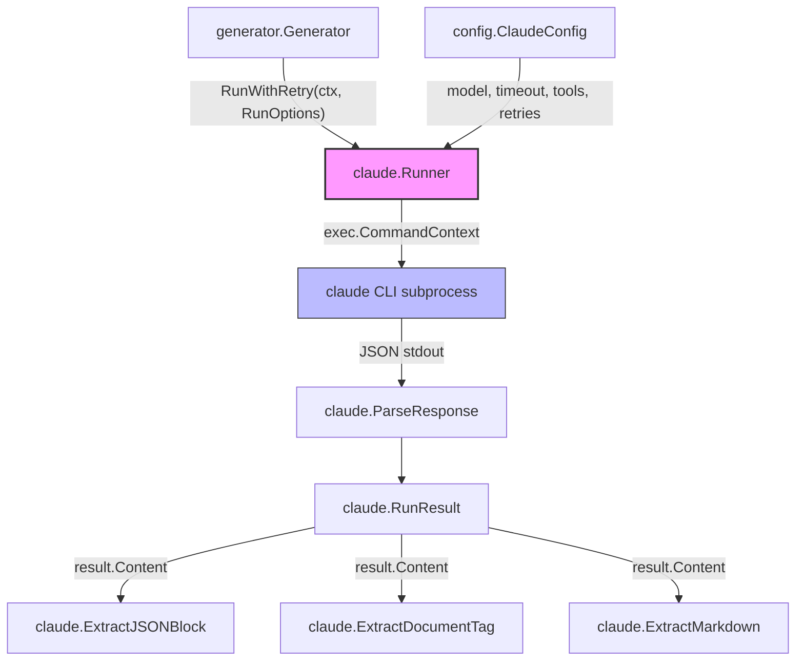
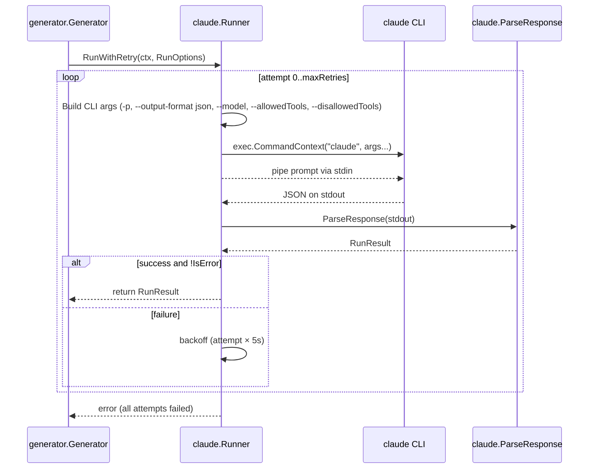

# Claude Runner

The Claude Runner (`internal/claude`) is the subprocess management layer that handles all interactions with the Claude CLI. It encapsulates command construction, execution, timeout management, retry logic, and response parsing.

## Overview

The Claude Runner serves as the bridge between selfmd's documentation generation pipeline and the external `claude` CLI tool. Rather than using an HTTP API, selfmd invokes Claude Code as a local subprocess, piping prompts via stdin and receiving structured JSON responses on stdout.

Key responsibilities:

- **CLI invocation** — Constructs and executes `claude -p --output-format json` commands with configurable model, tool restrictions, and timeout settings
- **Retry with backoff** — Automatically retries failed invocations with linear backoff (5s × attempt number)
- **Response parsing** — Deserializes Claude's JSON output into typed Go structs
- **Content extraction** — Provides utilities to extract JSON blocks, Markdown content, and `<document>` tag content from Claude's free-form text responses
- **Availability checking** — Verifies the `claude` CLI is installed before running any pipeline phase

## Architecture



## Core Types

### RunOptions

`RunOptions` configures a single Claude CLI invocation. The caller specifies the prompt, working directory, and optional overrides for model, tools, and timeout.

```go
type RunOptions struct {
	Prompt       string
	WorkDir      string        // CWD for the claude process
	AllowedTools []string      // tool restrictions
	Model        string        // model override
	Timeout      time.Duration // per-invocation timeout
	ExtraArgs    []string      // additional CLI arguments
}
```

> Source: internal/claude/types.go#L6-L13

### RunResult

`RunResult` holds the parsed output from a Claude CLI invocation, including the text content, error status, execution time, cost, and session ID.

```go
type RunResult struct {
	Content    string  // the text result from Claude
	IsError    bool    // whether Claude reported an error
	DurationMs int64   // execution time in milliseconds
	CostUSD    float64 // cost of this invocation
	SessionID  string  // Claude session ID
}
```

> Source: internal/claude/types.go#L15-L22

### CLIResponse

`CLIResponse` maps directly to the JSON structure returned by `claude -p --output-format json`.

```go
type CLIResponse struct {
	Type       string  `json:"type"`
	Subtype    string  `json:"subtype"`
	IsError    bool    `json:"is_error"`
	Result     string  `json:"result"`
	DurationMs int64   `json:"duration_ms"`
	TotalCost  float64 `json:"total_cost_usd"`
	SessionID  string  `json:"session_id"`
}
```

> Source: internal/claude/types.go#L24-L33

### ClaudeConfig

The `Runner` is initialized with a `config.ClaudeConfig` struct that provides default values for model, concurrency, timeout, retries, allowed tools, and extra arguments.

```go
type ClaudeConfig struct {
	Model          string   `yaml:"model"`
	MaxConcurrent  int      `yaml:"max_concurrent"`
	TimeoutSeconds int      `yaml:"timeout_seconds"`
	MaxRetries     int      `yaml:"max_retries"`
	AllowedTools   []string `yaml:"allowed_tools"`
	ExtraArgs      []string `yaml:"extra_args"`
}
```

> Source: internal/config/config.go#L82-L89

Default values:

```go
Claude: ClaudeConfig{
	Model:          "sonnet",
	MaxConcurrent:  3,
	TimeoutSeconds: 1800,
	MaxRetries:     2,
	AllowedTools:   []string{"Read", "Glob", "Grep"},
	ExtraArgs:      []string{},
},
```

> Source: internal/config/config.go#L116-L123

## Core Processes

### Invocation Lifecycle

The following sequence shows how a single Claude invocation flows from the generator through the runner to the CLI and back:



### Command Construction

The `Run` method builds the CLI arguments in a specific order:

1. Base flags: `-p` (pipe mode) and `--output-format json`
2. Model: from `RunOptions.Model`, falling back to `config.ClaudeConfig.Model`
3. Allowed tools: from `RunOptions.AllowedTools`, falling back to `config.ClaudeConfig.AllowedTools`
4. Disallowed tools: `Write` and `Edit` are always blocked to prevent Claude from losing content in denied tool calls
5. Extra args: from both the config and per-invocation options

```go
args := []string{
	"-p",
	"--output-format", "json",
}
// ...
// Explicitly block Write/Edit to prevent content from being lost in denied tool calls
args = append(args, "--disallowedTools", "Write", "--disallowedTools", "Edit")
```

> Source: internal/claude/runner.go#L32-L56

### Retry Logic

`RunWithRetry` wraps `Run` with configurable retry behavior. Retries occur when the CLI call returns an error or when `RunResult.IsError` is `true`. The backoff is linear: `attempt × 5 seconds`.

```go
func (r *Runner) RunWithRetry(ctx context.Context, opts RunOptions) (*RunResult, error) {
	maxRetries := r.config.MaxRetries
	var lastErr error

	for attempt := 0; attempt <= maxRetries; attempt++ {
		if attempt > 0 {
			backoff := time.Duration(attempt) * 5 * time.Second
			r.logger.Info("retrying", "attempt", attempt+1, "backoff", backoff)
			select {
			case <-ctx.Done():
				return nil, ctx.Err()
			case <-time.After(backoff):
			}
		}

		result, err := r.Run(ctx, opts)
		if err == nil && !result.IsError {
			return result, nil
		}
		// ...
	}

	return nil, fmt.Errorf("all %d attempts failed: %w", maxRetries+1, lastErr)
}
```

> Source: internal/claude/runner.go#L112-L143

### Timeout Handling

Each invocation is wrapped with `context.WithTimeout`. If the deadline is exceeded, the runner returns a descriptive timeout error rather than a generic context error.

```go
timeout := opts.Timeout
if timeout == 0 {
	timeout = time.Duration(r.config.TimeoutSeconds) * time.Second
}

ctx, cancel := context.WithTimeout(ctx, timeout)
defer cancel()
```

> Source: internal/claude/runner.go#L61-L67

## Response Parsing & Content Extraction

### ParseResponse

Deserializes the raw JSON output from the Claude CLI into a `RunResult` struct.

```go
func ParseResponse(data []byte) (*RunResult, error) {
	var resp CLIResponse
	if err := json.Unmarshal(data, &resp); err != nil {
		return nil, fmt.Errorf("JSON parse failed: %w", err)
	}

	return &RunResult{
		Content:    resp.Result,
		IsError:    resp.IsError,
		DurationMs: resp.DurationMs,
		CostUSD:    resp.TotalCost,
		SessionID:  resp.SessionID,
	}, nil
}
```

> Source: internal/claude/parser.go#L12-L25

### ExtractJSONBlock

Extracts JSON from Claude's response text. Used by the catalog phase and update engine to parse structured JSON output. The function tries three strategies in order:

1. Fenced ` ```json ... ``` ` code blocks
2. Fenced ` ``` ... ``` ` code blocks (without language tag)
3. Raw JSON object detection via brace-depth tracking

```go
func ExtractJSONBlock(text string) (string, error) {
	// try fenced code block first
	re := regexp.MustCompile("(?s)```json\\s*\n(.*?)```")
	matches := re.FindStringSubmatch(text)
	if len(matches) > 1 {
		return strings.TrimSpace(matches[1]), nil
	}

	// try without language tag
	re = regexp.MustCompile("(?s)```\\s*\n(\\{.*?\\})\\s*```")
	matches = re.FindStringSubmatch(text)
	if len(matches) > 1 {
		return strings.TrimSpace(matches[1]), nil
	}

	// try to find raw JSON object
	start := strings.Index(text, "{")
	if start >= 0 {
		depth := 0
		for i := start; i < len(text); i++ {
			switch text[i] {
			case '{':
				depth++
			case '}':
				depth--
				if depth == 0 {
					return text[start : i+1], nil
				}
			}
		}
	}

	return "", fmt.Errorf("%s", "failed to extract JSON block from response")
}
```

> Source: internal/claude/parser.go#L27-L62

### ExtractDocumentTag

Extracts content from `<document>...