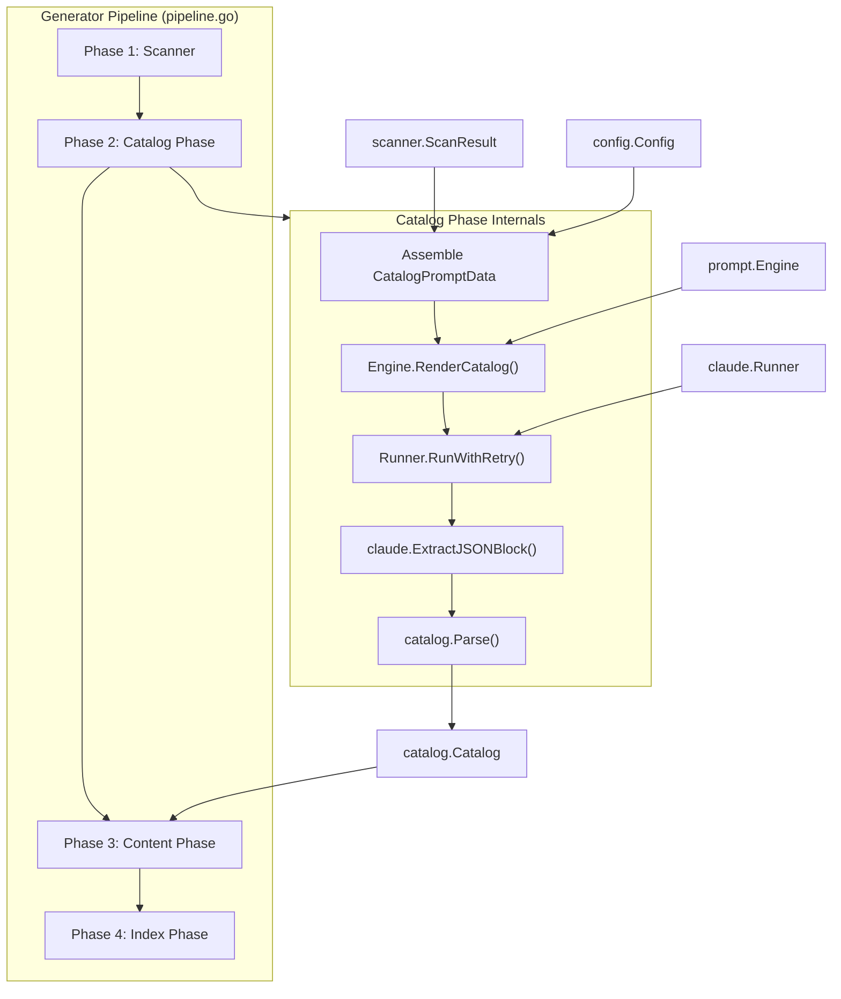
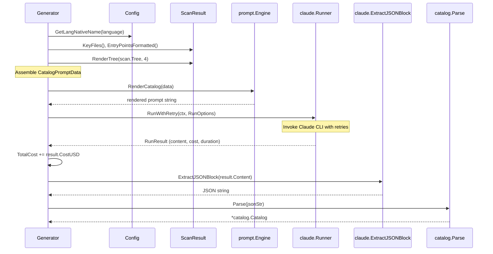

# Catalog Phase

The Catalog Phase is the second phase of selfmd's documentation generation pipeline. It uses Claude AI to analyze a project's source code structure and produce a hierarchical documentation catalog in JSON format.

## Overview

The Catalog Phase serves as the structural planning step for the entire documentation generation process. After the project scanner has collected the file tree, key files, README content, and entry points, the Catalog Phase sends this information to Claude via a prompt template. Claude analyzes the codebase and returns a JSON catalog that defines the documentation's table of contents — including section titles, paths, ordering, and nesting hierarchy.

This catalog then drives all subsequent phases: Content Phase uses it to know which pages to generate, and Index Phase uses it to build navigation.

Key responsibilities:
- Assemble project metadata into a `CatalogPromptData` struct
- Render the catalog prompt template via the Prompt Engine
- Invoke Claude CLI with retry logic
- Extract and parse the JSON catalog from Claude's response
- Track invocation cost and duration

## Architecture



## Data Flow

### Input: CatalogPromptData

The Catalog Phase assembles a `CatalogPromptData` struct from the project configuration and scan results. This struct contains all context Claude needs to design an appropriate documentation structure.

```go
type CatalogPromptData struct {
	RepositoryName       string
	ProjectType          string
	Language             string
	LanguageName         string // native display name (e.g., "繁體中文")
	LanguageOverride     bool   // true when template lang != output lang
	LanguageOverrideName string // native name of the desired output language
	KeyFiles             string
	EntryPoints          string
	FileTree             string
	ReadmeContent        string
}
```

> Source: internal/prompt/engine.go#L40-L51

Each field is populated from specific sources:

| Field | Source | Description |
|-------|--------|-------------|
| `RepositoryName` | `config.Project.Name` | Project name from `selfmd.yaml` |
| `ProjectType` | `config.Project.Type` | Project type (e.g., `"backend"`) |
| `Language` | `config.Output.Language` | Target language code (e.g., `"zh-TW"`) |
| `LanguageName` | `config.GetLangNativeName()` | Native display name for the language |
| `LanguageOverride` | `config.Output.NeedsLanguageOverride()` | Whether template lang differs from output lang |
| `KeyFiles` | `scan.KeyFiles()` | Notable files like `go.mod`, `main.go`, `README.md` |
| `EntryPoints` | `scan.EntryPointsFormatted()` | Contents of configured entry point files |
| `FileTree` | `scanner.RenderTree()` | ASCII tree representation of the project |
| `ReadmeContent` | `scan.ReadmeContent` | Full README content |

### Output: Catalog

The output is a `catalog.Catalog` struct — a tree of `CatalogItem` nodes with titles, paths, ordering, and nested children.

```go
type Catalog struct {
	Items []CatalogItem `json:"items"`
}

type CatalogItem struct {
	Title    string        `json:"title"`
	Path     string        `json:"path"`
	Order    int           `json:"order"`
	Children []CatalogItem `json:"children"`
}
```

> Source: internal/catalog/catalog.go#L11-L21

## Core Process



### Step-by-Step Execution

The `GenerateCatalog` method on the `Generator` struct performs the following steps:

**1. Assemble prompt data**

Project metadata and scan results are gathered into a `CatalogPromptData` struct:

```go
langName := config.GetLangNativeName(g.Config.Output.Language)
data := prompt.CatalogPromptData{
	RepositoryName:       g.Config.Project.Name,
	ProjectType:          g.Config.Project.Type,
	Language:             g.Config.Output.Language,
	LanguageName:         langName,
	LanguageOverride:     g.Config.Output.NeedsLanguageOverride(),
	LanguageOverrideName: langName,
	KeyFiles:             scan.KeyFiles(),
	EntryPoints:          scan.EntryPointsFormatted(),
	FileTree:             scanner.RenderTree(scan.Tree, 4),
	ReadmeContent:        scan.ReadmeContent,
}
```

> Source: internal/generator/catalog_phase.go#L16-L28

**2. Render the prompt template**

The assembled data is passed to the Prompt Engine, which renders `catalog.tmpl` using Go's `text/template`:

```go
rendered, err := g.Engine.RenderCatalog(data)
```

> Source: internal/generator/catalog_phase.go#L30

**3. Invoke Claude with retry logic**

The rendered prompt is sent to the Claude CLI via `RunWithRetry`, which provides automatic retries with exponential backoff:

```go
result, err := g.Runner.RunWithRetry(ctx, claude.RunOptions{
	Prompt:  rendered,
	WorkDir: g.RootDir,
})
```

> Source: internal/generator/catalog_phase.go#L37-L40

The retry logic uses `config.Claude.MaxRetries` (default: 2) with a backoff of `attempt * 5 seconds`:

```go
for attempt := 0; attempt <= maxRetries; attempt++ {
	if attempt > 0 {
		backoff := time.Duration(attempt) * 5 * time.Second
		// ...
		select {
		case <-ctx.Done():
			return nil, ctx.Err()
		case <-time.After(backoff):
		}
	}
	result, err := r.Run(ctx, opts)
	if err == nil && !result.IsError {
		return result, nil
	}
	// ...
}
```

> Source: internal/claude/runner.go#L113-L143

**4. Extract JSON from response**

Claude's response may contain markdown-fenced JSON or raw JSON. `ExtractJSONBlock` tries three strategies in order: fenced ` ```json ` blocks, untagged fenced blocks, and finally raw JSON object extraction via brace-depth counting:

```go
jsonStr, err := claude.ExtractJSONBlock(result.Content)
```

> Source: internal/generator/catalog_phase.go#L50

**5. Parse into Catalog struct**

The extracted JSON string is unmarshalled into a `Catalog` struct. Parsing validates that at least one item exists:

```go
cat, err := catalog.Parse(jsonStr)
```

> Source: internal/generator/catalog_phase.go#L55

### Catalog Reuse Optimization

In the pipeline's `Generate` method, the catalog phase includes an optimization: if `--clean` was not specified, it first attempts to load an existing `_catalog.json` from the output directory, skipping the Claude call entirely:

```go
if !clean {
	catJSON, readErr := g.Writer.ReadCatalogJSON()
	if readErr == nil {
		cat, err = catalog.Parse(catJSON)
	}
	if cat != nil {
		items := cat.Flatten()
		fmt.Printf("[2/4] Loaded existing catalog (%d sections, %d items)\n", len(cat.Items), len(items))
	}
}
if cat == nil {
	fmt.Println("[2/4] Generating catalog...")
	cat, err = g.GenerateCatalog(ctx, scan)
	// ...
}
```

> Source: internal/generator/pipeline.go#L102-L127

After a successful generation, the catalog JSON is persisted via `Writer.WriteCatalogJSON` so future runs can reuse it.

## Prompt Template

The catalog prompt template (`catalog.tmpl`) instructs Claude to act as a "senior code repository analyst" and produce a JSON catalog. Key aspects of the prompt:

- Provides project metadata (name, type, language)
- Includes the project's key files, entry points, directory tree, and README
- Enforces strict rules: completeness, verification via tools, no fabrication
- Defines catalog design principles focused on business capabilities rather than code structure
- Specifies a four-step workflow: analyze entry points, explore modules, design structure, verify and output
- Requires output as a single ` ```json ` code block with the `items` array structure

The prompt explicitly tells Claude to use `Read`, `Glob`, and `Grep` tools to explore the project before designing the catalog.

## Catalog Structure

The generated catalog uses a nested tree structure. Each item has:

- **`title`**: Human-readable section title in the configured output language
- **`path`**: URL-safe, lowercase, hyphen-separated path segment
- **`order`**: Numeric ordering within its siblings
- **`children`**: Nested sub-items forming the hierarchy

The `Catalog.Flatten()` method converts this tree into a flat list of `FlatItem` entries for iteration, computing full dot-notation paths and filesystem directory paths:

```go
type FlatItem struct {
	Title      string
	Path       string // dot-notation path, e.g., "core-modules.authentication"
	DirPath    string // filesystem path, e.g., "core-modules/authentication"
	Depth      int
	ParentPath string
	HasChildren bool
}
```

> Source: internal/catalog/catalog.go#L24-L31

## Related Links

- [Documentation Generator](../index.md) — Parent module overview
- [Content Phase](../content-phase/index.md) — Next phase that generates pages from this catalog
- [Index Phase](../index-phase/index.md) — Final phase that builds navigation from the catalog
- [Prompt Engine](../../prompt-engine/index.md) — Template engine that renders the catalog prompt
- [Claude Runner](../../claude-runner/index.md) — CLI runner that executes the Claude invocation
- [Catalog Manager](../../catalog/index.md) — Catalog data structures and parsing
- [Project Scanner](../../scanner/index.md) — Scanner that produces the input ScanResult
- [Generation Pipeline](../../../architecture/pipeline/index.md) — Overall pipeline architecture

## Reference Files

| File Path | Description |
|-----------|-------------|
| `internal/generator/catalog_phase.go` | Core `GenerateCatalog` method implementation |
| `internal/generator/pipeline.go` | Pipeline orchestration with catalog reuse logic |
| `internal/catalog/catalog.go` | `Catalog`, `CatalogItem`, and `FlatItem` struct definitions and parsing |
| `internal/prompt/engine.go` | `CatalogPromptData` struct and `RenderCatalog` method |
| `internal/claude/runner.go` | `Runner.RunWithRetry` retry logic and CLI invocation |
| `internal/claude/parser.go` | `ExtractJSONBlock` JSON extraction from Claude responses |
| `internal/claude/types.go` | `RunOptions`, `RunResult`, and `CLIResponse` type definitions |
| `internal/scanner/scanner.go` | `ScanResult`, `KeyFiles()`, and `EntryPointsFormatted()` methods |
| `internal/scanner/filetree.go` | `FileNode` tree and `RenderTree` for prompt rendering |
| `internal/config/config.go` | `Config` struct, language settings, and `NeedsLanguageOverride` |
| `internal/output/writer.go` | `WriteCatalogJSON` and `ReadCatalogJSON` for catalog persistence |
| `internal/prompt/templates/en-US/catalog.tmpl` | English catalog prompt template |
| `cmd/generate.go` | CLI entry point invoking the generation pipeline |