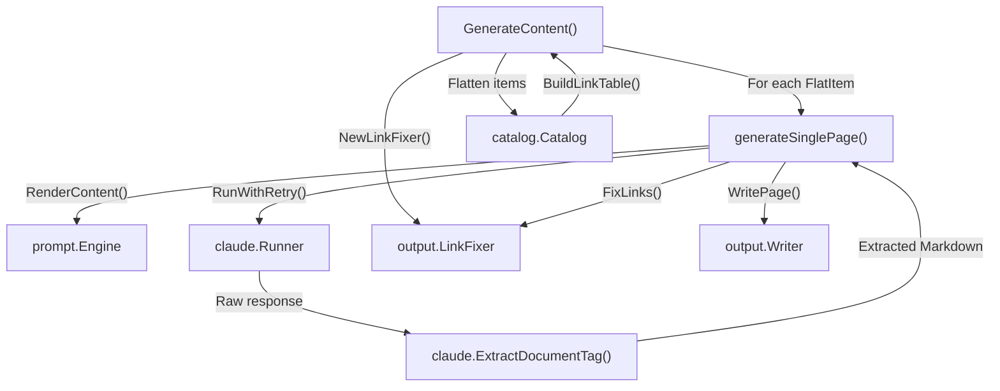
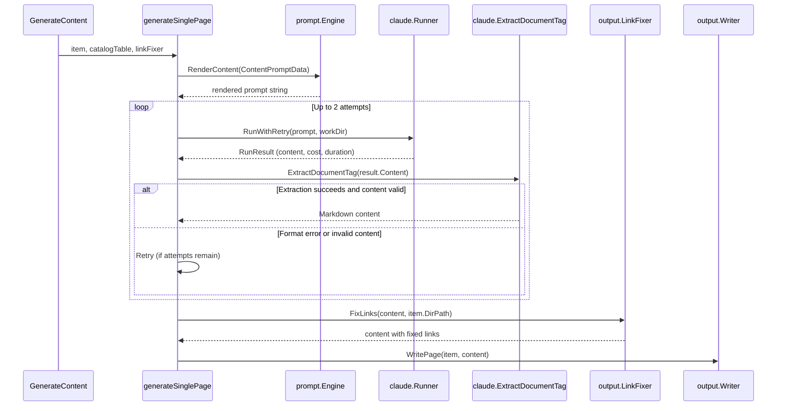

# Content Phase

The Content Phase is Phase 3 of selfmd's 4-phase documentation generation pipeline. It takes a flattened catalog and concurrently generates Markdown documentation pages for each catalog item by invoking the Claude CLI.

## Overview

The Content Phase is responsible for the bulk of the documentation generation work. After the catalog has been created in Phase 2, this phase iterates over every catalog item, renders a prompt with project context, sends it to Claude, validates the response, post-processes links, and writes the resulting Markdown page to disk.

Key responsibilities:

- **Concurrent page generation** — Uses Go's `errgroup` with a semaphore to generate multiple pages in parallel, controlled by the `max_concurrent` configuration setting.
- **Prompt assembly** — Populates `ContentPromptData` with project metadata, the file tree, catalog link table, and page-specific context, then renders it via the `content.tmpl` template.
- **Response validation** — Extracts content from `<document>` XML tags and verifies it begins with a Markdown heading (`#`). Retries up to 2 attempts on format errors.
- **Link post-processing** — Runs `LinkFixer.FixLinks` on the generated content to correct broken relative links before writing.
- **Skip-existing optimization** — When not performing a clean build, pages that already exist on disk with valid content are skipped.
- **Failure resilience** — Failed pages receive placeholder content rather than aborting the entire generation run.

## Architecture



## Core Components

### GenerateContent — Concurrent Orchestrator

`GenerateContent` is the entry point for the Content Phase. It flattens the catalog into a list of `FlatItem` values, builds shared resources (the catalog link table and link fixer), and launches concurrent goroutines for each item.

```go
func (g *Generator) GenerateContent(ctx context.Context, scan *scanner.ScanResult, cat *catalog.Catalog, concurrency int, skipExisting bool) error {
	items := cat.Flatten()
	total := len(items)

	// Build the catalog link table once for all pages
	catalogTable := cat.BuildLinkTable()

	// Build the link fixer once for all pages
	linkFixer := output.NewLinkFixer(cat)

	var done atomic.Int32
	var failed atomic.Int32
	var skipped atomic.Int32
	var costMu sync.Mutex

	eg, ctx := errgroup.WithContext(ctx)
	sem := make(chan struct{}, concurrency)
```

> Source: internal/generator/content_phase.go#L21-L37

Concurrency is governed by a buffered channel (`sem`) acting as a semaphore. The `concurrency` parameter is sourced from `ClaudeConfig.MaxConcurrent` (default: 3) or overridden via `GenerateOptions.Concurrency`.

### Skip-Existing Logic

When `skipExisting` is true (i.e., not a clean build), pages are checked against disk before generation:

```go
if skipExisting && g.Writer.PageExists(item) {
	skipped.Add(1)
	fmt.Printf("      [Skip] %s (exists)\n", item.Title)
	return nil
}
```

> Source: internal/generator/content_phase.go#L43-L47

`PageExists` in the writer checks that the file exists, is non-empty, and does not contain the failure placeholder marker `"This page failed to generate"`:

```go
func (w *Writer) PageExists(item catalog.FlatItem) bool {
	path := filepath.Join(w.BaseDir, item.DirPath, "index.md")
	data, err := os.ReadFile(path)
	if err != nil {
		return false
	}
	content := strings.TrimSpace(string(data))
	if content == "" {
		return false
	}
	head := content
	if len(head) > 500 {
		head = head[:500]
	}
	if strings.Contains(head, "This page failed to generate") {
		return false
	}
	return true
}
```

> Source: internal/output/writer.go#L97-L117

### generateSinglePage — Per-Page Pipeline

This private method handles the full lifecycle for generating a single documentation page.

```go
func (g *Generator) generateSinglePage(ctx context.Context, scan *scanner.ScanResult, item catalog.FlatItem, catalogTable string, linkFixer *output.LinkFixer, existingContent string) error {
	langName := config.GetLangNativeName(g.Config.Output.Language)
	data := prompt.ContentPromptData{
		RepositoryName:       g.Config.Project.Name,
		Language:             g.Config.Output.Language,
		LanguageName:         langName,
		LanguageOverride:     g.Config.Output.NeedsLanguageOverride(),
		LanguageOverrideName: langName,
		CatalogPath:          item.Path,
		CatalogTitle:         item.Title,
		CatalogDirPath:       item.DirPath,
		ProjectDir:           g.RootDir,
		FileTree:             scanner.RenderTree(scan.Tree, 3),
		CatalogTable:         catalogTable,
		ExistingContent:      existingContent,
	}

	rendered, err := g.Engine.RenderContent(data)
	if err != nil {
		return err
	}
```

> Source: internal/generator/content_phase.go#L89-L107

### ContentPromptData Structure

The `ContentPromptData` struct carries all context needed by the `content.tmpl` prompt template:

```go
type ContentPromptData struct {
	RepositoryName       string
	Language             string
	LanguageName         string
	LanguageOverride     bool
	LanguageOverrideName string
	CatalogPath          string
	CatalogTitle         string
	CatalogDirPath       string // filesystem dir path of THIS item, e.g., "configuration/claude-config"
	ProjectDir           string
	FileTree             string
	CatalogTable         string // formatted table of all catalog items with their dir paths
	ExistingContent      string // existing page content for update context (empty for new pages)
}
```

> Source: internal/prompt/engine.go#L54-L67

The `ExistingContent` field is empty during initial generation but populated during incremental updates (see the `Update` method in `updater.go`), allowing Claude to preserve and update existing documentation.

## Core Processes

### Single Page Generation Flow



### Retry and Validation Logic

The phase applies a two-level retry strategy:

1. **Claude CLI retry** — `Runner.RunWithRetry` handles transient CLI failures with exponential backoff (configured via `max_retries`, default: 2).
2. **Content format retry** — `generateSinglePage` retries up to 2 attempts when the response cannot be parsed or lacks a valid Markdown heading.

```go
maxAttempts := 2
var lastErr error

for attempt := 1; attempt <= maxAttempts; attempt++ {
	result, err := g.Runner.RunWithRetry(ctx, claude.RunOptions{
		Prompt:  rendered,
		WorkDir: g.RootDir,
	})
	if err != nil {
		return err
	}

	g.TotalCost += result.CostUSD

	// Extract content from <document> tag
	content, extractErr := claude.ExtractDocumentTag(result.Content)
	if extractErr != nil {
		lastErr = fmt.Errorf("failed to extract document content: %w", extractErr)
		if attempt < maxAttempts {
			fmt.Printf(" Format error, retrying...\n      ")
			continue
		}
		fmt.Printf(" Failed (format error)\n")
		return lastErr
	}

	content = strings.TrimSpace(content)
	if content == "" || !strings.HasPrefix(content, "#") {
		lastErr = fmt.Errorf("Claude did not output valid Markdown document (missing heading)")
		if attempt < maxAttempts {
			fmt.Printf(" Invalid content, retrying...\n      ")
			continue
		}
		fmt.Printf(" Failed (invalid content)\n")
		return lastErr
	}
```

> Source: internal/generator/content_phase.go#L111-L146

### Document Tag Extraction

`ExtractDocumentTag` parses the `<document>...