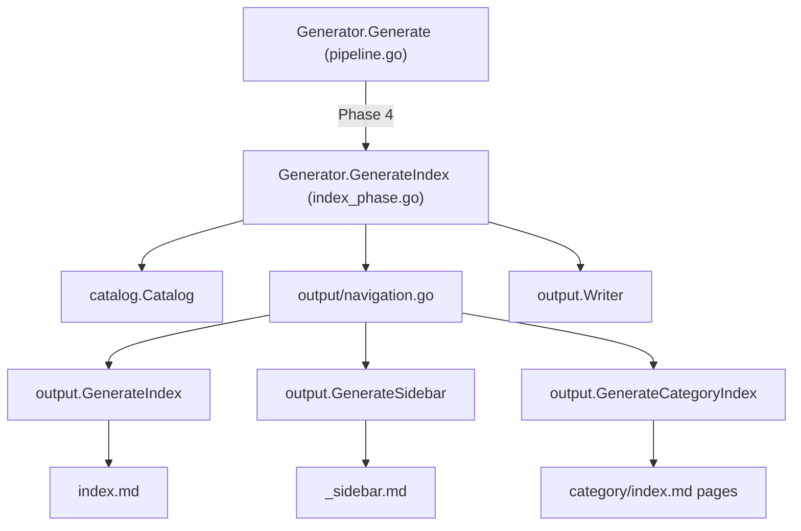
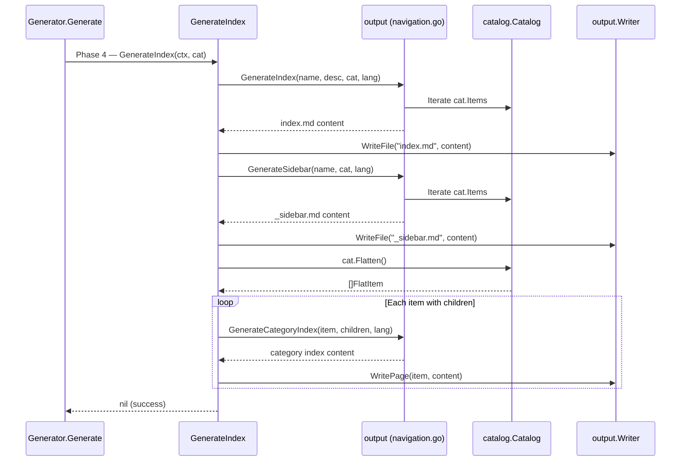

# Index Phase

The Index Phase is the final generation phase (Phase 4) of the selfmd documentation pipeline, responsible for producing navigation files — `index.md`, `_sidebar.md`, and category index pages — from the catalog structure.

## Overview

After the Content Phase generates all documentation pages, the pipeline needs navigational entry points so readers can browse and discover content. The Index Phase fills this role by reading the finalized `Catalog` and producing three types of output:

- **Main index page** (`index.md`) — the documentation landing page with a full table of contents
- **Sidebar navigation** (`_sidebar.md`) — a tree-structured navigation menu for the static viewer
- **Category index pages** — auto-generated hub pages for every catalog item that has child items

The Index Phase is purely deterministic — it does not invoke Claude or any AI model. It transforms the catalog tree into Markdown files using Go template logic in the `output` package.

## Architecture



## How It Works

The `GenerateIndex` method on `Generator` executes three sequential steps:

### Step 1: Generate the Main Index Page

The function calls `output.GenerateIndex`, passing the project name, description, catalog, and output language. This produces a Markdown page with a heading, optional project description, and a nested list of all catalog items as links.

```go
indexContent := output.GenerateIndex(
    g.Config.Project.Name,
    g.Config.Project.Description,
    cat,
    lang,
)
if err := g.Writer.WriteFile("index.md", indexContent); err != nil {
    return err
}
```

> Source: internal/generator/index_phase.go#L15-L23

### Step 2: Generate the Sidebar

The function calls `output.GenerateSidebar` to produce a navigation sidebar containing a "Home" link and the full catalog tree.

```go
sidebarContent := output.GenerateSidebar(g.Config.Project.Name, cat, lang)
if err := g.Writer.WriteFile("_sidebar.md", sidebarContent); err != nil {
    return err
}
```

> Source: internal/generator/index_phase.go#L26-L29

### Step 3: Generate Category Index Pages

For every catalog item that has children, the phase generates a hub page listing its direct child pages. It does this by flattening the catalog, filtering for items with `HasChildren == true`, then collecting their direct children by matching `ParentPath`.

```go
items := cat.Flatten()
for _, item := range items {
    if !item.HasChildren {
        continue
    }

    // find direct children
    var children []catalog.FlatItem
    for _, child := range items {
        if child.ParentPath == item.Path && child.Path != item.Path {
            children = append(children, child)
        }
    }

    if len(children) > 0 {
        categoryContent := output.GenerateCategoryIndex(item, children, lang)
        if err := g.Writer.WritePage(item, categoryContent); err != nil {
            g.Logger.Warn("failed to write category index", "path", item.Path, "error", err)
        }
    }
}
```

> Source: internal/generator/index_phase.go#L32-L52

## Core Processes



## Navigation File Generation Details

### Main Index Page Structure

`output.GenerateIndex` builds a Markdown document with the following structure:

```
# {ProjectName} Technical Documentation

{Project description}

---

## Table of Contents

- [Overview](../../../overview/index.md)
  - [Introduction](../../../overview/introduction/index.md)
  ...

---

*This documentation was automatically generated by selfmd*
```

The function uses localized UI strings obtained via `getUIStrings(lang)`, which supports `zh-TW` and `en-US` with a fallback to `en-US`.

```go
func GenerateIndex(projectName, projectDesc string, cat *catalog.Catalog, lang string) string {
    ui := getUIStrings(lang)
    var sb strings.Builder

    sb.WriteString(fmt.Sprintf("# %s %s\n\n", projectName, ui["techDocs"]))

    if projectDesc != "" {
        sb.WriteString(projectDesc + "\n\n")
    }

    sb.WriteString("---\n\n")
    sb.WriteString(fmt.Sprintf("## %s\n\n", ui["catalog"]))

    for _, item := range cat.Items {
        writeIndexItem(&sb, item, "", 0)
    }

    sb.WriteString("\n---\n\n")
    sb.WriteString(fmt.Sprintf("*%s*\n", ui["autoGenerated"]))

    return sb.String()
}
```

> Source: internal/output/navigation.go#L38-L59

### Sidebar Structure

`output.GenerateSidebar` produces a Markdown list starting with the project name as a heading and a "Home" link, followed by the full catalog tree.

```go
func GenerateSidebar(projectName string, cat *catalog.Catalog, lang string) string {
    ui := getUIStrings(lang)
    var sb strings.Builder

    sb.WriteString(fmt.Sprintf("# %s\n\n", projectName))
    sb.WriteString(fmt.Sprintf("- [%s](./index.md)\n", ui["home"]))

    for _, item := range cat.Items {
        writeSidebarItem(&sb, item, "", 0)
    }

    return sb.String()
}
```

> Source: internal/output/navigation.go#L74-L86

### Category Index Pages

`output.GenerateCategoryIndex` creates a simple hub page for parent items, listing their direct children with relative links.

```go
func GenerateCategoryIndex(item catalog.FlatItem, children []catalog.FlatItem, lang string) string {
    ui := getUIStrings(lang)
    var sb strings.Builder

    sb.WriteString(fmt.Sprintf("# %s\n\n", item.Title))
    sb.WriteString(ui["sectionContains"] + "\n\n")

    for _, child := range children {
        relPath := computeRelativePath(item.DirPath, child.DirPath)
        sb.WriteString(fmt.Sprintf("- [%s](%s/index.md)\n", child.Title, relPath))
    }

    return sb.String()
}
```

> Source: internal/output/navigation.go#L101-L114

## Path Resolution

The navigation module includes two helper functions for computing correct link paths within the generated output:

- **`resolveDirPath`** — handles both relative child paths (e.g., `"init"`) and fully-qualified paths (e.g., `"cli/init"`) by conditionally prepending the parent directory.
- **`computeRelativePath`** — wraps `filepath.Rel` to compute relative paths between two directory locations, converting the result to forward slashes for Markdown compatibility.

```go
func resolveDirPath(itemPath, parentDir string) string {
    if parentDir == "" {
        return itemPath
    }
    if strings.HasPrefix(itemPath, parentDir+"/") {
        return itemPath
    }
    return parentDir + "/" + itemPath
}
```

> Source: internal/output/navigation.go#L118-L126

## When the Index Phase Runs

The Index Phase is invoked in two contexts:

1. **Full generation** (`selfmd generate`) — always runs as Phase 4, after content generation completes.
2. **Incremental update** (`selfmd update`) — runs only when new pages were added to the catalog, to refresh navigation with the new entries.

```go
// In updater.go — only regenerates index when new pages exist
if len(newPages) > 0 {
    fmt.Println("Updating navigation and index...")
    if err := g.GenerateIndex(ctx, cat); err != nil {
        g.Logger.Warn("failed to update index", "error", err)
    }
}
```

> Source: internal/generator/updater.go#L152-L157

## Related Links

- [Documentation Generator](../index.md)
- [Catalog Phase](../catalog-phase/index.md)
- [Content Phase](../content-phase/index.md)
- [Translate Phase](../translate-phase/index.md)
- [Catalog Manager](../../catalog/index.md)
- [Output Writer](../../output-writer/index.md)
- [Static Viewer](../../static-viewer/index.md)
- [Generation Pipeline](../../../architecture/pipeline/index.md)

## Reference Files

| File Path | Description |
|-----------|-------------|
| `internal/generator/index_phase.go` | Index phase implementation — `GenerateIndex` method |
| `internal/generator/pipeline.go` | Pipeline orchestration — shows phase ordering and `Generator` struct |
| `internal/output/navigation.go` | Navigation file generators — `GenerateIndex`, `GenerateSidebar`, `GenerateCategoryIndex` |
| `internal/output/writer.go` | Output writer — `WriteFile`, `WritePage` methods |
| `internal/catalog/catalog.go` | Catalog data model — `Catalog`, `CatalogItem`, `FlatItem`, `Flatten` |
| `internal/generator/content_phase.go` | Content phase — context for understanding phase sequencing |
| `internal/generator/updater.go` | Incremental updater — shows conditional index regeneration |