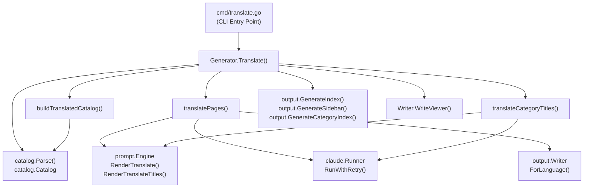
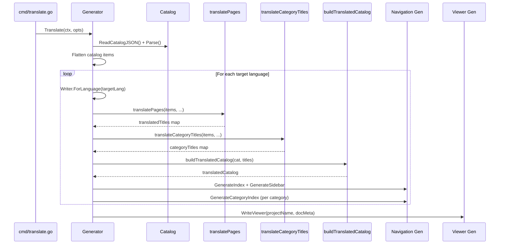
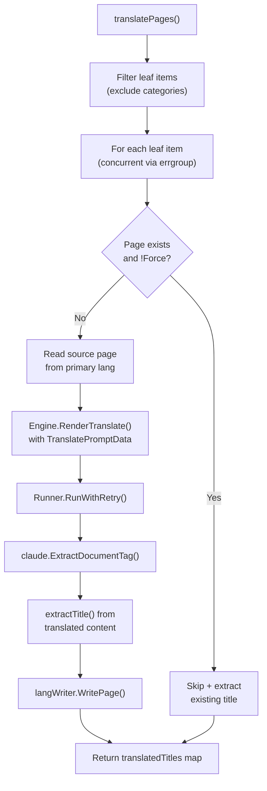

# Translate Phase

The Translate Phase is responsible for translating generated documentation from the primary language into one or more secondary languages using Claude AI, producing complete localized documentation sets.

## Overview

The Translate Phase is the final optional stage in the selfmd documentation pipeline. After the main generation pipeline produces documentation in the primary language (configured via `output.language`), this phase takes those pages and translates them into each secondary language defined in `output.secondary_languages`.

Key responsibilities:

- **Page Translation**: Translates each leaf documentation page from the source language to target languages via Claude AI
- **Category Title Translation**: Batch-translates category (parent section) titles in a single Claude call
- **Catalog Reconstruction**: Builds a fully translated catalog structure for each target language
- **Navigation Generation**: Produces localized `index.md`, `_sidebar.md`, and category index pages per language
- **Viewer Regeneration**: Updates the static documentation viewer to include all available languages
- **Incremental Skipping**: Skips pages that already have translations unless `--force` is specified

The translated output for each language is written to a subdirectory under the documentation output directory (e.g., `.doc-build/en-US/`, `.doc-build/ja-JP/`).

## Architecture



## Translation Pipeline

The `Translate` method orchestrates the full translation workflow. It iterates over each target language sequentially, while parallelizing page translations within each language.

### Main Workflow



### Entry Point

The `Translate` function is invoked from the `selfmd translate` CLI command. It loads the existing master catalog, determines the source and target languages, then processes each target language in sequence.

```go
func (g *Generator) Translate(ctx context.Context, opts TranslateOptions) error {
	start := time.Now()

	// Read master catalog
	catJSON, err := g.Writer.ReadCatalogJSON()
	if err != nil {
		return fmt.Errorf("failed to read catalog (please run selfmd generate first): %w", err)
	}

	cat, err := catalog.Parse(catJSON)
	if err != nil {
		return fmt.Errorf("failed to parse catalog: %w", err)
	}

	items := cat.Flatten()
	sourceLang := g.Config.Output.Language
	sourceLangName := config.GetLangNativeName(sourceLang)
```

> Source: internal/generator/translate_phase.go#L29-L46

## TranslateOptions

The `TranslateOptions` struct configures the behavior of a translation run:

```go
type TranslateOptions struct {
	TargetLanguages []string
	Force           bool
	Concurrency     int
}
```

> Source: internal/generator/translate_phase.go#L22-L26

| Field | Type | Description |
|-------|------|-------------|
| `TargetLanguages` | `[]string` | List of language codes to translate into (e.g., `["en-US", "ja-JP"]`) |
| `Force` | `bool` | When `true`, re-translates pages that already exist |
| `Concurrency` | `int` | Maximum number of concurrent Claude calls for page translation |

These options are populated from CLI flags in `cmd/translate.go`:

```go
translateCmd.Flags().StringSliceVar(&translateLangs, "lang", nil, "only translate specified languages (default: all secondary languages)")
translateCmd.Flags().BoolVar(&translateForce, "force", false, "force re-translate existing files")
translateCmd.Flags().IntVar(&translateConc, "concurrency", 0, "concurrency (override config)")
```

> Source: cmd/translate.go#L33-L35

## Core Processes

### Page Translation (`translatePages`)

The `translatePages` function handles concurrent translation of all leaf (non-category) documentation pages. It uses Go's `errgroup` with a semaphore channel to control concurrency.



Key implementation details:

1. **Leaf-only filtering**: Only pages without children are translated; category pages get separate title translation.
2. **Skip logic**: If a translated page already exists and `Force` is `false`, the page is skipped. The existing title is extracted for catalog building.
3. **Concurrency control**: A semaphore channel (`sem`) limits parallel Claude calls to `opts.Concurrency`.
4. **Error resilience**: Individual page failures are logged but do not abort the entire run. Atomic counters track success, failure, and skip counts.

```go
// Only translate leaf items (non-category pages)
var leafItems []catalog.FlatItem
for _, item := range items {
	if !item.HasChildren {
		leafItems = append(leafItems, item)
	}
}

eg, ctx := errgroup.WithContext(ctx)
sem := make(chan struct{}, opts.Concurrency)
```

> Source: internal/generator/translate_phase.go#L153-L162

### Prompt Rendering

Each page translation uses the `TranslatePromptData` struct to render the `translate.tmpl` shared template:

```go
data := prompt.TranslatePromptData{
	SourceLanguage:     sourceLang,
	SourceLanguageName: sourceLangName,
	TargetLanguage:     targetLang,
	TargetLanguageName: targetLangName,
	SourceContent:      sourceContent,
}

rendered, err := g.Engine.RenderTranslate(data)
```

> Source: internal/generator/translate_phase.go#L197-L206

The `translate.tmpl` template instructs Claude to:

- Preserve all Markdown formatting, links, code blocks, and Mermaid diagrams
- Keep code identifiers, file paths, and source annotations unchanged
- Translate section headings and prose naturally
- Return the result wrapped in `<document>` tags

```go
// RenderTranslate renders the translation prompt.
func (e *Engine) RenderTranslate(data TranslatePromptData) (string, error) {
	return e.renderShared("translate.tmpl", data)
}
```

> Source: internal/prompt/engine.go#L141-L143

### Response Extraction

After Claude returns a response, the translated content is extracted from `<document>` tags using `claude.ExtractDocumentTag()`:

```go
content, err := claude.ExtractDocumentTag(result.Content)
if err != nil {
	failed.Add(1)
	fmt.Printf(" Failed (format error): %v\n", err)
	return nil
}
```

> Source: internal/generator/translate_phase.go#L226-L231

### Category Title Translation (`translateCategoryTitles`)

Category titles (items with children) are batch-translated in a single Claude call for efficiency, rather than translating each one individually.

```go
func (g *Generator) translateCategoryTitles(
	ctx context.Context,
	items []catalog.FlatItem,
	alreadyTranslated map[string]string,
	sourceLang, sourceLangName, targetLang, targetLangName string,
) (map[string]string, error) {
```

> Source: internal/generator/translate_phase.go#L296-L302

The process:

1. Collect all category items whose titles are not yet in the `alreadyTranslated` map
2. Render the `translate_titles.tmpl` prompt with all titles as a batch
3. Parse the Claude response as a JSON array of translated strings
4. Validate that the response count matches the request count

The `translate_titles.tmpl` template asks Claude to return a JSON array:

```
## Rules

1. Translate each title naturally into {{.TargetLanguageName}}
2. Keep technical terms, product names, and proper nouns as-is (e.g., "Git", "CLI", "API")
3. Return ONLY a JSON array of translated titles in the same order, no other text
```

> Source: internal/prompt/templates/translate_titles.tmpl#L9-L13

### Translated Catalog Building

The `buildTranslatedCatalog` function creates a deep copy of the original catalog with translated titles substituted:

```go
func buildTranslatedCatalog(original *catalog.Catalog, translatedTitles map[string]string) *catalog.Catalog {
	translated := &catalog.Catalog{
		Items: translateCatalogItems(original.Items, translatedTitles, ""),
	}
	return translated
}
```

> Source: internal/generator/translate_phase.go#L288-L293

The recursive helper `translateCatalogItems` walks the catalog tree, replacing each item's title with its translated version when available:

```go
func translateCatalogItems(items []catalog.CatalogItem, titles map[string]string, parentPath string) []catalog.CatalogItem {
	result := make([]catalog.CatalogItem, len(items))
	for i, item := range items {
		dotPath := item.Path
		if parentPath != "" {
			dotPath = parentPath + "." + item.Path
		}

		result[i] = catalog.CatalogItem{
			Title:    item.Title,
			Path:     item.Path,
			Order:    item.Order,
			Children: translateCatalogItems(item.Children, titles, dotPath),
		}

		// Use translated title if available
		if translatedTitle, ok := titles[dotPath]; ok {
			result[i].Title = translatedTitle
		}
	}
	return result
}
```

> Source: internal/generator/translate_phase.go#L382-L403

### Navigation and Viewer Generation

After all pages and titles are translated, the phase generates localized navigation files:

```go
// Generate translated index and sidebar
indexContent := output.GenerateIndex(
	g.Config.Project.Name,
	g.Config.Project.Description,
	translatedCat,
	targetLang,
)
if err := langWriter.WriteFile("index.md", indexContent); err != nil {
	g.Logger.Warn("failed to write translated index", "lang", targetLang, "error", err)
}

sidebarContent := output.GenerateSidebar(g.Config.Project.Name, translatedCat, targetLang)
```

> Source: internal/generator/translate_phase.go#L79-L89

Category index pages are also regenerated for translated items. Finally, the documentation viewer is rebuilt to incorporate all available languages:

```go
docMeta := g.buildDocMeta()
fmt.Println("Regenerating documentation viewer...")
if err := g.Writer.WriteViewer(g.Config.Project.Name, docMeta); err != nil {
	g.Logger.Warn("failed to generate viewer", "error", err)
}
```

> Source: internal/generator/translate_phase.go#L118-L121

## Language-Specific Output Structure

The `Writer.ForLanguage()` method creates a sub-writer scoped to a language-specific subdirectory:

```go
func (w *Writer) ForLanguage(lang string) *Writer {
	return &Writer{
		BaseDir: filepath.Join(w.BaseDir, lang),
	}
}
```

> Source: internal/output/writer.go#L145-L149

This produces a file layout like:

```
.doc-build/
├── _catalog.json          # Primary language catalog
├── index.md               # Primary language index
├── _sidebar.md            # Primary language sidebar
├── overview/
│   └── index.md
├── en-US/                 # Translated language directory
│   ├── _catalog.json      # Translated catalog
│   ├── index.md           # Translated index
│   ├── _sidebar.md        # Translated sidebar
│   └── overview/
│       └── index.md
└── ja-JP/                 # Another translated language
    ├── _catalog.json
    └── ...
```

## Title Extraction Helper

The `extractTitle` function parses the first `#` heading from translated Markdown content to populate the translated titles map:

```go
func extractTitle(content string) string {
	re := regexp.MustCompile(`(?m)^#\s+(.+)$`)
	match := re.FindStringSubmatch(content)
	if len(match) >= 2 {
		return strings.TrimSpace(match[1])
	}
	return ""
}
```

> Source: internal/generator/translate_phase.go#L278-L285

This extracted title is used in two places:
- When a page is freshly translated, the title from the output is captured
- When an existing translation is skipped, the title is read from the existing file

## Configuration

Translation is configured in `selfmd.yaml` under the `output` section:

| Config Key | Type | Description |
|------------|------|-------------|
| `output.language` | `string` | Primary (source) language code |
| `output.secondary_languages` | `[]string` | Target languages for translation |
| `claude.max_concurrent` | `int` | Default concurrency for Claude calls |

Supported languages are defined in `config.KnownLanguages`:

```go
var KnownLanguages = map[string]string{
	"zh-TW": "繁體中文",
	"zh-CN": "简体中文",
	"en-US": "English",
	"ja-JP": "日本語",
	"ko-KR": "한국어",
	"fr-FR": "Français",
	"de-DE": "Deutsch",
	"es-ES": "Español",
	"pt-BR": "Português",
	"th-TH": "ไทย",
	"vi-VN": "Tiếng Việt",
}
```

> Source: internal/config/config.go#L39-L51

## Related Links

- [Documentation Generator](../index.md)
- [Catalog Phase](../catalog-phase/index.md)
- [Content Phase](../content-phase/index.md)
- [Index Phase](../index-phase/index.md)
- [translate Command](../../../cli/cmd-translate/index.md)
- [Claude Runner](../../claude-runner/index.md)
- [Prompt Engine](../../prompt-engine/index.md)
- [Output Writer](../../output-writer/index.md)
- [Output Language](../../../configuration/output-language/index.md)
- [Translation Workflow](../../../i18n/translation-workflow/index.md)
- [Supported Languages](../../../i18n/supported-languages/index.md)

## Reference Files

| File Path | Description |
|-----------|-------------|
| `internal/generator/translate_phase.go` | Core translate phase implementation |
| `internal/generator/pipeline.go` | Generator struct definition and main pipeline |
| `cmd/translate.go` | CLI command entry point for translation |
| `internal/prompt/engine.go` | Prompt template engine with translate rendering methods |
| `internal/prompt/templates/translate.tmpl` | Page translation prompt template |
| `internal/prompt/templates/translate_titles.tmpl` | Category title batch translation prompt template |
| `internal/output/writer.go` | Output writer with language subdirectory support |
| `internal/output/navigation.go` | Index, sidebar, and category index generation |
| `internal/catalog/catalog.go` | Catalog data structures and flattening logic |
| `internal/claude/runner.go` | Claude CLI runner with retry logic |
| `internal/claude/parser.go` | Response parsing and document tag extraction |
| `internal/config/config.go` | Configuration structs and language definitions |