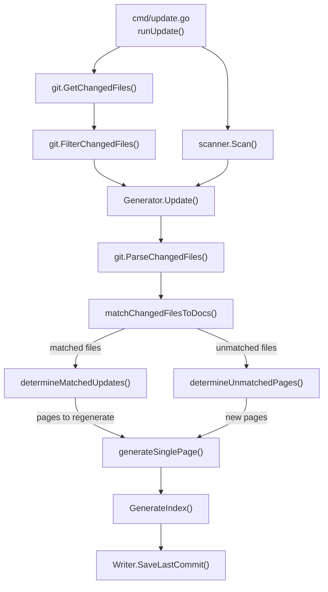
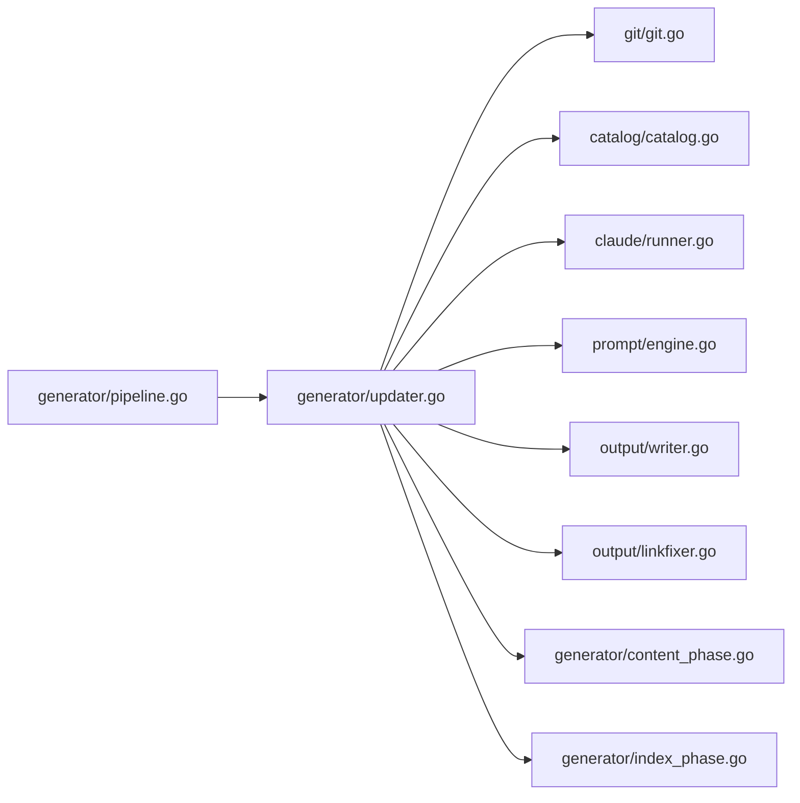
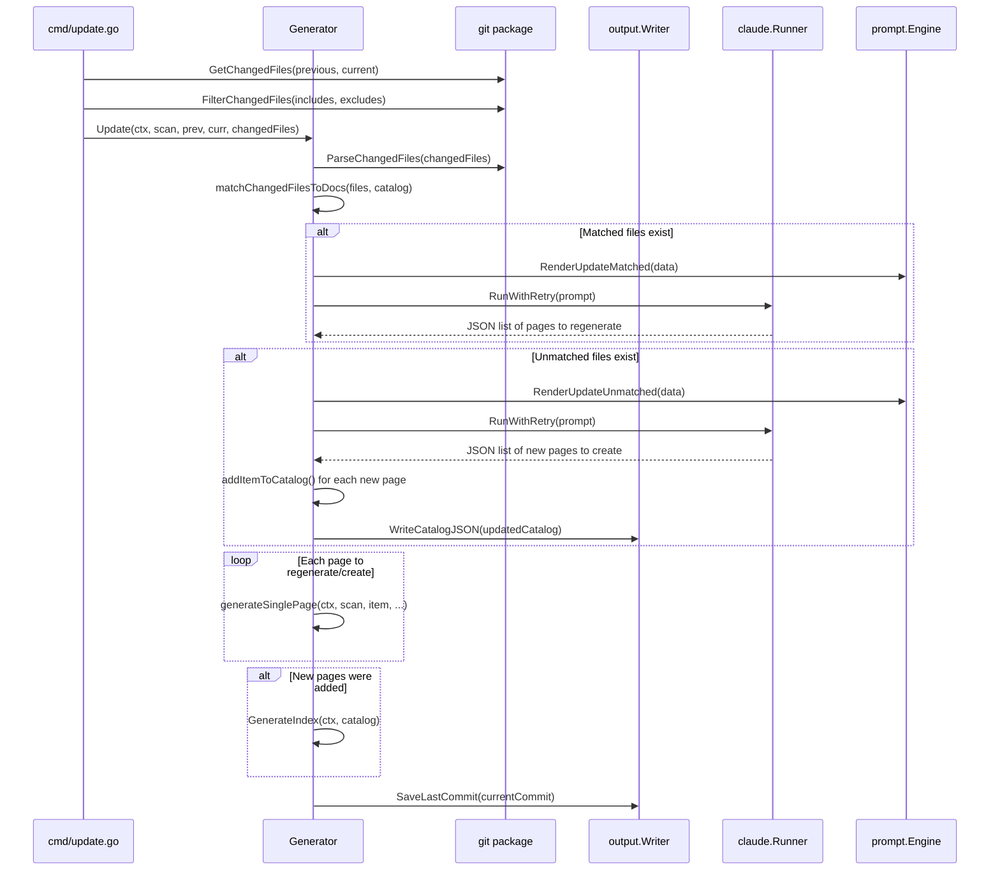
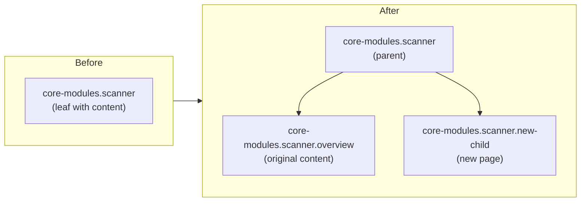

# Incremental Update Engine

The Incremental Update Engine enables selective regeneration of documentation pages based on git changes, avoiding costly full regeneration when only a few source files have been modified.

## Overview

When a project evolves, only a subset of documentation pages typically need updating. The Incremental Update Engine bridges git change detection with AI-powered impact analysis to identify exactly which documentation pages require regeneration — and whether entirely new pages should be created for newly added source files.

This component is the implementation behind the `selfmd update` CLI command. It depends on an existing documentation set produced by `selfmd generate` and uses the saved `_last_commit` marker to determine the comparison baseline.

**Key concepts:**

- **Matched files** — Changed source files that are referenced by existing documentation pages. These trigger a Claude-based assessment to determine if the page content is actually affected.
- **Unmatched files** — Changed source files not referenced by any existing documentation page. These are evaluated by Claude to decide if a new documentation page should be created.
- **Leaf-to-parent promotion** — When a new page needs to be added as a child of an existing leaf node, the engine automatically promotes the leaf to a parent by moving its content into an `overview` child page.

## Architecture



### Module Dependencies



## Core Processes

### Update Workflow

The full update lifecycle is orchestrated by `Generator.Update()` and proceeds through five sequential steps:



### Step 1: Parse Changed Files

The raw git diff output is parsed into structured `ChangedFile` records by `git.ParseChangedFiles()`. Each record contains a status code (`M`, `A`, `D`, `R`) and a file path.

```go
type ChangedFile struct {
	Status string // "M", "A", "D", "R"
	Path   string
}
```

> Source: internal/git/git.go#L48-L51

### Step 2: Match Changed Files to Existing Docs

`matchChangedFilesToDocs()` performs a text-search scan: for each changed file, it reads every existing documentation page and checks whether the page content contains the file's path string. This produces two groups:

```go
func (g *Generator) matchChangedFilesToDocs(files []git.ChangedFile, cat *catalog.Catalog) (matched []matchResult, unmatched []string) {
	items := cat.Flatten()

	// Pre-read all page contents
	pageContents := make(map[string]string)
	for _, item := range items {
		content, err := g.Writer.ReadPage(item)
		if err != nil {
			continue
		}
		pageContents[item.Path] = content
	}

	// For each changed file, find which pages reference it
	for _, f := range files {
		var matchedPages []catalog.FlatItem
		for _, item := range items {
			content, ok := pageContents[item.Path]
			if !ok {
				continue
			}
			if strings.Contains(content, f.Path) {
				matchedPages = append(matchedPages, item)
			}
		}

		if len(matchedPages) > 0 {
			matched = append(matched, matchResult{
				changedFile: f.Path,
				pages:       matchedPages,
			})
		} else {
			unmatched = append(unmatched, f.Path)
		}
	}

	return matched, unmatched
}
```

> Source: internal/generator/updater.go#L177-L214

### Step 3: Claude Evaluates Matched Pages

For matched files, `determineMatchedUpdates()` sends a prompt to Claude containing the list of changed files and summaries of affected pages. Claude reads the actual source code and returns a JSON array of pages that truly need regeneration.

The prompt template instructs Claude to be conservative — only marking pages for regeneration when changes affect behavior, architecture, or APIs described in the documentation:

```go
data := prompt.UpdateMatchedPromptData{
	RepositoryName: g.Config.Project.Name,
	Language:       g.Config.Output.Language,
	ChangedFiles:   changedFilesList.String(),
	AffectedPages:  affectedPagesInfo.String(),
}

rendered, err := g.Engine.RenderUpdateMatched(data)
```

> Source: internal/generator/updater.go#L257-L264

The response is parsed into `UpdateMatchedResult` structs:

```go
type UpdateMatchedResult struct {
	CatalogPath string `json:"catalogPath"`
	Title       string `json:"title"`
	Reason      string `json:"reason"`
}
```

> Source: internal/generator/updater.go#L18-L22

### Step 4: Claude Evaluates Unmatched Files

For unmatched files, `determineUnmatchedPages()` asks Claude whether entirely new documentation pages should be created. Claude receives the list of unmatched files along with the full existing catalog structure:

```go
data := prompt.UpdateUnmatchedPromptData{
	RepositoryName:  g.Config.Project.Name,
	Language:        g.Config.Output.Language,
	UnmatchedFiles:  fileList.String(),
	ExistingCatalog: existingCatalog,
	CatalogTable:    cat.BuildLinkTable(),
}

rendered, err := g.Engine.RenderUpdateUnmatched(data)
```

> Source: internal/generator/updater.go#L320-L328

New pages are inserted into the catalog tree via `addItemToCatalog()`. If a new page must be placed under an existing leaf node, the leaf is promoted to a parent:

```go
type promotedLeaf struct {
	OriginalPath  string
	OverviewPath  string
	OriginalTitle string
}

func addItemToCatalog(cat *catalog.Catalog, catalogPath, title string) *promotedLeaf {
	parts := strings.Split(catalogPath, ".")
	var promoted *promotedLeaf
	addItemToChildren(&cat.Items, parts, title, "", &promoted)
	return promoted
}
```

> Source: internal/generator/updater.go#L360-L377

### Step 5: Regenerate Pages

All pages identified for regeneration (both existing and new) are processed sequentially through `generateSinglePage()`. For existing pages, the current content is passed as `existingContent` context so Claude can produce an informed update:

```go
allPages := append(pagesToRegenerate, newPages...)
if len(allPages) == 0 {
	fmt.Println("[4/4] No documentation pages need updating or creating.")
} else {
	fmt.Printf("[4/4] Regenerating %d pages...\n", len(allPages))
	for i, item := range allPages {
		fmt.Printf("      [%d/%d] %s（%s）...", i+1, len(allPages), item.Title, item.Path)
		existing, _ := g.Writer.ReadPage(item)
		err := g.generateSinglePage(ctx, scan, item, catalogTable, linkFixer, existing)
		if err != nil {
			fmt.Printf(" Failed: %v\n", err)
			g.Logger.Warn("page regeneration failed", "title", item.Title, "path", item.Path, "error", err)
			g.writePlaceholder(item, err)
		}
	}
}
```

> Source: internal/generator/updater.go#L133-L149

If new pages were added, navigation files (index and sidebar) are regenerated, and the updated catalog is saved to `_catalog.json`. Finally, the current commit hash is persisted to `_last_commit` for the next incremental update.

## Commit Baseline Resolution

The `update` command resolves the comparison baseline commit through a three-level fallback chain:

1. **Explicit `--since` flag** — User-provided commit hash takes highest priority
2. **Saved `_last_commit`** — Read from the output directory, written by the last `generate` or `update` run
3. **Merge-base fallback** — Computes `git merge-base <base_branch> HEAD` using the configured `git.base_branch`

```go
previousCommit := sinceCommit
if previousCommit == "" {
	saved, readErr := gen.Writer.ReadLastCommit()
	if readErr == nil && saved != "" {
		previousCommit = saved
	} else {
		base, err := git.GetMergeBase(rootDir, cfg.Git.BaseBranch)
		if err != nil {
			return fmt.Errorf("cannot get base commit: %w\nhint: run selfmd generate first or use --since to specify a commit", err)
		}
		previousCommit = base
	}
}
```

> Source: cmd/update.go#L68-L82

## Catalog Modification: Leaf-to-Parent Promotion

When Claude determines a new page should be added under an existing leaf node (a page with no children), the engine automatically promotes it. The original content is moved to an `overview` child, and the new page is inserted as a sibling:



The recursive `addItemToChildren()` function handles arbitrary nesting depth by walking the catalog tree based on dot-notation path segments:

```go
func addItemToChildren(children *[]catalog.CatalogItem, pathParts []string, title string, parentDotPath string, promoted **promotedLeaf) {
	if len(pathParts) == 1 {
		*children = append(*children, catalog.CatalogItem{
			Title: title,
			Path:  pathParts[0],
			Order: len(*children) + 1,
		})
		return
	}

	parentSlug := pathParts[0]
	currentDotPath := parentSlug
	if parentDotPath != "" {
		currentDotPath = parentDotPath + "." + parentSlug
	}

	for i, item := range *children {
		if item.Path == parentSlug {
			if len(item.Children) == 0 {
				(*children)[i].Children = append((*children)[i].Children, catalog.CatalogItem{
					Title: item.Title,
					Path:  "overview",
					Order: 0,
				})
				*promoted = &promotedLeaf{
					OriginalPath:  currentDotPath,
					OverviewPath:  currentDotPath + ".overview",
					OriginalTitle: item.Title,
				}
			}
			addItemToChildren(&(*children)[i].Children, pathParts[1:], title, currentDotPath, promoted)
			return
		}
	}

	newParent := catalog.CatalogItem{
		Title: parentSlug,
		Path:  parentSlug,
		Order: len(*children) + 1,
	}
	*children = append(*children, newParent)
	addItemToChildren(&(*children)[len(*children)-1].Children, pathParts[1:], title, currentDotPath, promoted)
}
```

> Source: internal/generator/updater.go#L381-L430

## Usage Examples

### Running an Incremental Update

The `update` command is invoked via the CLI. It compares the current HEAD against the last known commit:

```go
var updateCmd = &cobra.Command{
	Use:   "update",
	Short: "Incremental update based on git changes",
	Long: `Analyze git changes and incrementally update affected documentation pages.
Requires initial documentation generated by selfmd generate.`,
	RunE: runUpdate,
}

func init() {
	updateCmd.Flags().StringVar(&sinceCommit, "since", "", "compare with specified commit (default: last generate/update commit)")
	rootCmd.AddCommand(updateCmd)
}
```

> Source: cmd/update.go#L21-L32

### File Filtering with Include/Exclude Patterns

Before entering the update pipeline, changed files are filtered through the configured `targets.include` and `targets.exclude` glob patterns:

```go
changedFiles = git.FilterChangedFiles(changedFiles, cfg.Targets.Include, cfg.Targets.Exclude)
```

> Source: cmd/update.go#L94

The filter uses doublestar glob matching to support patterns like `src/**`, `**/*.pb.go`, and `vendor/**`:

```go
func FilterChangedFiles(changedFiles string, includes, excludes []string) string {
	lines := strings.Split(changedFiles, "\n")
	var filtered []string

	for _, line := range lines {
		line = strings.TrimSpace(line)
		if line == "" {
			continue
		}

		parts := strings.SplitN(line, "\t", 3)
		if len(parts) < 2 {
			continue
		}

		filePath := parts[len(parts)-1]

		excluded := false
		for _, pattern := range excludes {
			if matched, _ := doublestar.Match(pattern, filePath); matched {
				excluded = true
				break
			}
		}
		if excluded {
			continue
		}

		if len(includes) > 0 {
			included := false
			for _, pattern := range includes {
				if matched, _ := doublestar.Match(pattern, filePath); matched {
					included = true
					break
				}
			}
			if !included {
				continue
			}
		}

		filtered = append(filtered, line)
	}

	return strings.Join(filtered, "\n")
}
```

> Source: internal/git/git.go#L73-L122

## Related Links

- [update Command](../../cli/cmd-update/index.md)
- [Documentation Generator](../generator/index.md)
- [Content Phase](../generator/content-phase/index.md)
- [Catalog Manager](../catalog/index.md)
- [Claude Runner](../claude-runner/index.md)
- [Prompt Engine](../prompt-engine/index.md)
- [Change Detection](../../git-integration/change-detection/index.md)
- [Affected Page Matching](../../git-integration/affected-pages/index.md)
- [Generation Pipeline](../../architecture/pipeline/index.md)
- [Output Writer](../output-writer/index.md)

## Reference Files

| File Path | Description |
|-----------|-------------|
| `internal/generator/updater.go` | Core incremental update logic: matching, Claude evaluation, catalog modification |
| `cmd/update.go` | CLI entry point for the `update` command |
| `internal/git/git.go` | Git operations: changed files, merge-base, filtering |
| `internal/generator/pipeline.go` | Generator struct definition and full generation pipeline |
| `internal/generator/content_phase.go` | Single page generation logic reused by the update engine |
| `internal/generator/index_phase.go` | Index and navigation regeneration |
| `internal/catalog/catalog.go` | Catalog data model, flatten, and link table building |
| `internal/output/writer.go` | File I/O: reading/writing pages, catalog JSON, commit markers |
| `internal/output/linkfixer.go` | Post-processing link fixer for generated markdown |
| `internal/prompt/engine.go` | Prompt template engine and data structures |
| `internal/config/config.go` | Configuration model including git and target settings |
| `internal/prompt/templates/en-US/update_matched.tmpl` | Prompt template for evaluating matched pages |
| `internal/prompt/templates/en-US/update_unmatched.tmpl` | Prompt template for evaluating unmatched files |