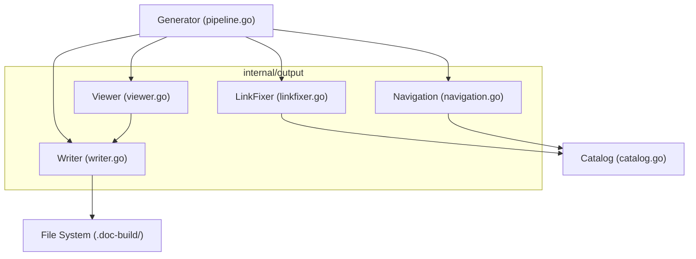
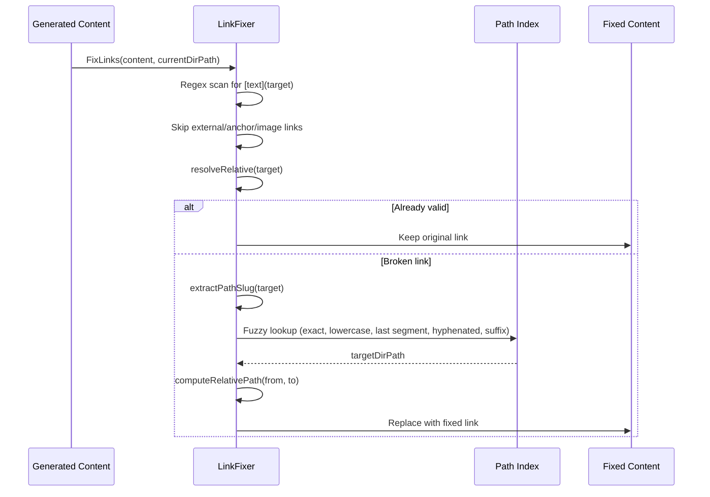
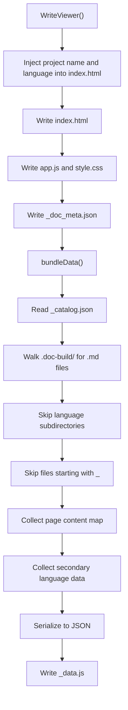
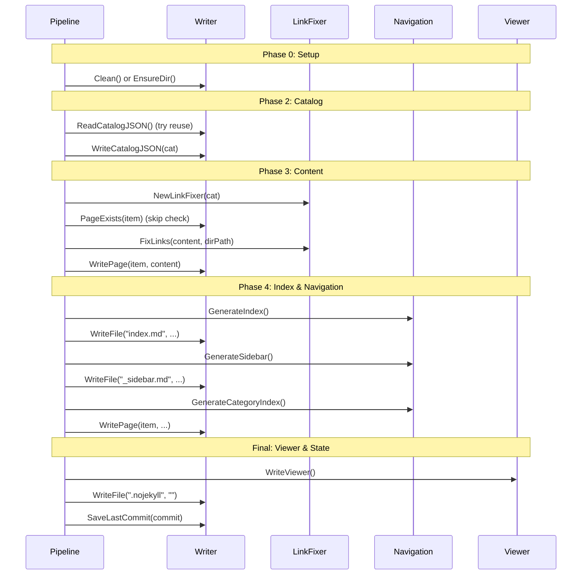

# Output Writer

The Output Writer module (`internal/output`) is responsible for all file I/O operations related to generated documentation. It writes Markdown pages, navigation files, catalog JSON, and static viewer assets to the output directory.

## Overview

The Output Writer sits at the final stage of the documentation generation pipeline. After Claude generates Markdown content, the Output Writer handles:

- **File persistence** — Writing generated Markdown pages to the correct directory structure
- **Link validation and repair** — Fixing broken relative links produced by the AI
- **Navigation generation** — Creating index pages, sidebars, and category indices
- **Static viewer bundling** — Packaging all content into an offline-capable HTML viewer
- **Incremental state tracking** — Saving catalog JSON and commit hashes for incremental updates
- **Multi-language support** — Writing translated content to language-specific subdirectories

The module is contained in the `internal/output` package, which exposes four primary components: `Writer`, `LinkFixer`, navigation generators, and viewer bundling.

## Architecture



The `Writer` struct is the core I/O component. The `LinkFixer`, navigation generators, and viewer bundler all collaborate with `Writer` to produce the final documentation output.

## Writer

The `Writer` struct manages all filesystem interactions. It operates relative to a base directory (typically `.doc-build/`).

### Struct Definition

```go
type Writer struct {
	BaseDir string // absolute path to .doc-build/
}
```

> Source: internal/output/writer.go#L26-L28

### Key Operations

| Method | Purpose |
|--------|---------|
| `Clean()` | Removes and recreates the output directory |
| `EnsureDir()` | Creates the output directory if it doesn't exist |
| `WritePage()` | Writes a documentation page for a catalog item |
| `WriteFile()` | Writes an arbitrary file under the output directory |
| `WriteCatalogJSON()` | Saves the catalog as `_catalog.json` |
| `ReadCatalogJSON()` | Reads the saved catalog JSON |
| `PageExists()` | Checks if a page exists and has valid content |
| `ReadPage()` | Reads the content of a documentation page |
| `SaveLastCommit()` | Saves the current commit hash for incremental updates |
| `ReadLastCommit()` | Reads the saved commit hash |
| `ForLanguage()` | Returns a new Writer scoped to a language subdirectory |

### Page Writing

`WritePage` maps a catalog item to a directory path and writes the content as `index.md`:

```go
func (w *Writer) WritePage(item catalog.FlatItem, content string) error {
	dir := filepath.Join(w.BaseDir, item.DirPath)
	if err := os.MkdirAll(dir, 0755); err != nil {
		return fmt.Errorf("failed to create directory %s: %w", dir, err)
	}

	path := filepath.Join(dir, "index.md")
	if err := os.WriteFile(path, []byte(content), 0644); err != nil {
		return fmt.Errorf("failed to write %s: %w", path, err)
	}
	return nil
}
```

> Source: internal/output/writer.go#L49-L60

### Page Existence Check

`PageExists` verifies that a page file exists, is non-empty, and does not contain the failure marker. This is used by the pipeline to skip already-generated pages during non-clean runs:

```go
func (w *Writer) PageExists(item catalog.FlatItem) bool {
	path := filepath.Join(w.BaseDir, item.DirPath, "index.md")
	data, err := os.ReadFile(path)
	if err != nil {
		return false
	}
	content := strings.TrimSpace(string(data))
	if content == "" {
		return false
	}
	// Only check the first 500 bytes for the failure marker to avoid false positives
	// when translated docs reference the marker string in their content.
	head := content
	if len(head) > 500 {
		head = head[:500]
	}
	if strings.Contains(head, "This page failed to generate") {
		return false
	}
	return true
}
```

> Source: internal/output/writer.go#L96-L117

### Multi-Language Support

`ForLanguage` creates a derived Writer that writes to a language-specific subdirectory (e.g., `.doc-build/en-US/`):

```go
func (w *Writer) ForLanguage(lang string) *Writer {
	return &Writer{
		BaseDir: filepath.Join(w.BaseDir, lang),
	}
}
```

> Source: internal/output/writer.go#L145-L149

## LinkFixer

The `LinkFixer` post-processes generated Markdown to repair broken relative links. Since Claude may produce incorrect link formats (dot-notation, missing paths, wrong relative depth), the LinkFixer uses a fuzzy matching strategy to resolve and fix them.

### How It Works



### Index Construction

When created, the `LinkFixer` builds a lookup index from the catalog with multiple keys for each item — enabling fuzzy matching on dot-notation paths, slash paths, and last-segment slugs:

```go
func NewLinkFixer(cat *catalog.Catalog) *LinkFixer {
	items := cat.Flatten()
	dirPaths := make(map[string]bool)
	pathIndex := make(map[string]string)

	for _, item := range items {
		dirPaths[item.DirPath] = true

		// index by multiple keys for fuzzy matching
		pathIndex[item.DirPath] = item.DirPath
		pathIndex[item.Path] = item.DirPath                          // dot-notation
		pathIndex[strings.ReplaceAll(item.Path, ".", "/")] = item.DirPath // explicit slash conversion

		// index by last segment (e.g., "scanner" → "core-modules/scanner")
		parts := strings.Split(item.DirPath, "/")
		lastSeg := parts[len(parts)-1]
		if _, exists := pathIndex[lastSeg]; !exists {
			pathIndex[lastSeg] = item.DirPath
		}

		// index by slug-like variations
		pathIndex[strings.ToLower(item.DirPath)] = item.DirPath
	}

	return &LinkFixer{
		allItems:  items,
		dirPaths:  dirPaths,
		pathIndex: pathIndex,
	}
}
```

> Source: internal/output/linkfixer.go#L19-L48

### Fuzzy Resolution Strategy

The `fixSingleLink` method tries multiple strategies in order:

1. **Direct resolution** — Check if the relative path already resolves to a valid catalog item
2. **Exact index match** — Look up the cleaned slug in the path index
3. **Case-insensitive match** — Try lowercase version
4. **Last segment match** — Extract the final path segment and look it up
5. **Hyphenated combination** — Combine the last two segments with a hyphen (e.g., `prompt/engine` → `prompt-engine`)
6. **Suffix match** — Scan all known directory paths for a matching suffix

```go
func (lf *LinkFixer) fixSingleLink(target, currentDirPath string) string {
	// already a valid relative link pointing to existing page?
	resolved := lf.resolveRelative(target, currentDirPath)
	if resolved != "" && lf.isValidTarget(resolved) {
		return target // already correct
	}

	// extract the "meaningful" part from the target
	cleaned := lf.extractPathSlug(target)
	if cleaned == "" {
		return ""
	}

	// look up in index
	targetDirPath, found := lf.pathIndex[cleaned]
	if !found {
		// try lowercase
		targetDirPath, found = lf.pathIndex[strings.ToLower(cleaned)]
	}
	if !found {
		// try last segment only
		segments := strings.FieldsFunc(cleaned, func(r rune) bool {
			return r == '.' || r == '/'
		})
		if len(segments) > 0 {
			last := segments[len(segments)-1]
			targetDirPath, found = lf.pathIndex[last]
		}
		// try combining last two segments with hyphen
		if !found && len(segments) >= 2 {
			hyphenated := segments[len(segments)-2] + "-" + segments[len(segments)-1]
			targetDirPath, found = lf.pathIndex[hyphenated]
		}
	}
	if !found {
		// substring match: find any dirPath that ends with the cleaned slug
		for dp := range lf.dirPaths {
			if strings.HasSuffix(dp, "/"+cleaned) || strings.HasSuffix(dp, "/"+strings.ReplaceAll(cleaned, "/", "-")) {
				targetDirPath = dp
				found = true
				break
			}
		}
	}
	if !found {
		return "" // can't fix
	}

	// compute correct relative path from currentDirPath to targetDirPath
	return lf.computeRelativePath(currentDirPath, targetDirPath)
}
```

> Source: internal/output/linkfixer.go#L84-L134

## Navigation Generation

The `navigation.go` file provides functions to generate structural navigation pages: the main index, sidebar, and category index pages. These functions are stateless — they take catalog data and a language code, and return Markdown strings.

### Localized UI Strings

Navigation pages use localized UI strings. The module provides built-in strings for `zh-TW` and `en-US`, with `en-US` as the fallback:

```go
var UIStrings = map[string]map[string]string{
	"zh-TW": {
		"techDocs":        "技術文件",
		"catalog":         "目錄",
		"home":            "首頁",
		"sectionContains": "本章節包含以下內容：",
		"autoGenerated":   "本文件由 [selfmd](https://github.com/monkenwu/selfmd) 自動產生",
	},
	"en-US": {
		"techDocs":        "Technical Documentation",
		"catalog":         "Table of Contents",
		"home":            "Home",
		"sectionContains": "This section contains the following:",
		"autoGenerated":   "This documentation was automatically generated by [selfmd](https://github.com/monkenwu/selfmd)",
	},
}
```

> Source: internal/output/navigation.go#L12-L27

### Generated Files

| Function | Output File | Description |
|----------|-------------|-------------|
| `GenerateIndex` | `index.md` | Main landing page with project name, description, and full table of contents |
| `GenerateSidebar` | `_sidebar.md` | Sidebar navigation with hierarchical links |
| `GenerateCategoryIndex` | `{category}/index.md` | Section index listing child pages |

### Category Index Generation

For catalog items that have children, `GenerateCategoryIndex` produces a simple listing page:

```go
func GenerateCategoryIndex(item catalog.FlatItem, children []catalog.FlatItem, lang string) string {
	ui := getUIStrings(lang)
	var sb strings.Builder

	sb.WriteString(fmt.Sprintf("# %s\n\n", item.Title))
	sb.WriteString(ui["sectionContains"] + "\n\n")

	for _, child := range children {
		relPath := computeRelativePath(item.DirPath, child.DirPath)
		sb.WriteString(fmt.Sprintf("- [%s](%s/index.md)\n", child.Title, relPath))
	}

	return sb.String()
}
```

> Source: internal/output/navigation.go#L100-L114

## Static Viewer

The `viewer.go` file handles writing the static documentation viewer — an offline-capable HTML/JS/CSS application that renders Markdown documentation in the browser. It uses Go's `embed` directive to bundle the viewer assets at compile time.

### Embedded Assets

```go
//go:embed viewer/index.html
var viewerHTML string

//go:embed viewer/app.js
var viewerJS string

//go:embed viewer/style.css
var viewerCSS string
```

> Source: internal/output/viewer.go#L13-L20

### WriteViewer Process



The `bundleData` method walks the output directory, collects all `.md` files and catalog data, then serializes everything into a single `_data.js` file as `window.DOC_DATA`:

```go
content := "window.DOC_DATA = " + string(jsonBytes) + ";\n"
return w.WriteFile("_data.js", content)
```

> Source: internal/output/viewer.go#L193-L194

### DocMeta Structure

The `DocMeta` struct carries language metadata used by both the viewer and the data bundle:

```go
type DocMeta struct {
	DefaultLanguage    string     `json:"default_language"`
	AvailableLanguages []LangInfo `json:"available_languages"`
}

type LangInfo struct {
	Code       string `json:"code"`
	NativeName string `json:"native_name"`
	IsDefault  bool   `json:"is_default"`
}
```

> Source: internal/output/writer.go#L13-L23

## Core Processes

### Full Generation Pipeline Integration

The Writer is used throughout the generation pipeline. Here is how each pipeline phase interacts with the output module:



### Incremental Update Flow

During incremental updates, the Writer's read capabilities are equally important — `ReadCatalogJSON`, `ReadPage`, and `ReadLastCommit` enable the updater to detect what already exists and what needs regeneration:

```go
// Read existing catalog
existingCatalogJSON, err := g.Writer.ReadCatalogJSON()
```

> Source: internal/generator/updater.go#L34

```go
// Read existing content to pass as context for regeneration
existing, _ := g.Writer.ReadPage(item)
```

> Source: internal/generator/updater.go#L141

### Translation Output Flow

For multi-language support, the `ForLanguage` method creates a scoped Writer per target language. The translation phase writes translated pages, catalogs, navigation, and category indices to language subdirectories:

```go
langWriter := g.Writer.ForLanguage(targetLang)
if err := langWriter.EnsureDir(); err != nil {
    return fmt.Errorf("failed to create language directory: %w", err)
}
```

> Source: internal/generator/translate_phase.go#L55-L58

## Output Directory Structure

The Writer produces the following directory structure:

```
.doc-build/
├── index.html              # Static viewer entry point
├── app.js                  # Viewer JavaScript
├── style.css               # Viewer stylesheet
├── _data.js                # Bundled content for offline viewing
├── _catalog.json           # Catalog structure (JSON)
├── _doc_meta.json          # Language metadata
├── _sidebar.md             # Sidebar navigation
├── _last_commit            # Last processed git commit hash
├── .nojekyll               # GitHub Pages compatibility
├── index.md                # Main landing page
├── overview/
│   └── index.md
├── core-modules/
│   ├── index.md            # Category index (auto-generated)
│   ├── scanner/
│   │   └── index.md
│   └── ...
└── en-US/                  # Secondary language directory
    ├── _catalog.json
    ├── _sidebar.md
    ├── index.md
    └── ...
```

## Related Links

- [Documentation Generator](../generator/index.md)
- [Content Phase](../generator/content-phase/index.md)
- [Index Phase](../generator/index-phase/index.md)
- [Translate Phase](../generator/translate-phase/index.md)
- [Catalog Manager](../catalog/index.md)
- [Static Viewer](../static-viewer/index.md)
- [Incremental Update Engine](../incremental-update/index.md)
- [Generation Pipeline](../../architecture/pipeline/index.md)
- [Output Structure](../../overview/output-structure/index.md)
- [Output Language](../../configuration/output-language/index.md)

## Reference Files

| File Path | Description |
|-----------|-------------|
| `internal/output/writer.go` | Core Writer struct with file I/O operations and DocMeta types |
| `internal/output/linkfixer.go` | LinkFixer for validating and repairing relative links |
| `internal/output/navigation.go` | Navigation page generators (index, sidebar, category) |
| `internal/output/viewer.go` | Static viewer writer and data bundler |
| `internal/generator/pipeline.go` | Generator struct and full pipeline orchestration |
| `internal/generator/content_phase.go` | Content generation phase using Writer and LinkFixer |
| `internal/generator/index_phase.go` | Index generation phase using navigation functions |
| `internal/generator/translate_phase.go` | Translation phase using ForLanguage Writer |
| `internal/generator/updater.go` | Incremental update using Writer read/write methods |
| `internal/catalog/catalog.go` | Catalog types consumed by Writer and LinkFixer |
| `internal/config/config.go` | OutputConfig defining output directory and language settings |