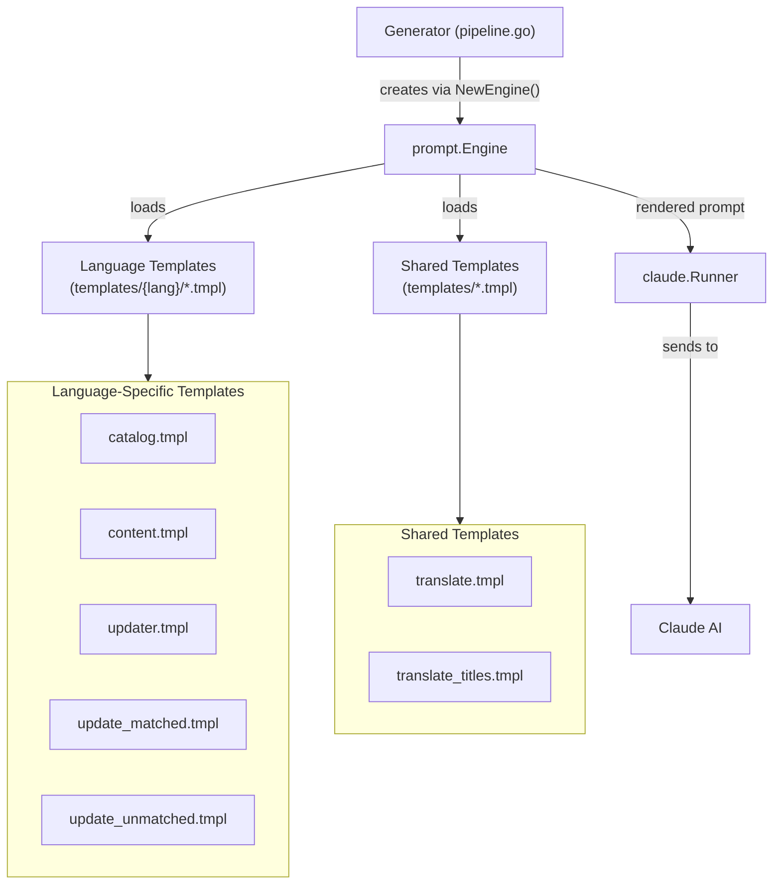
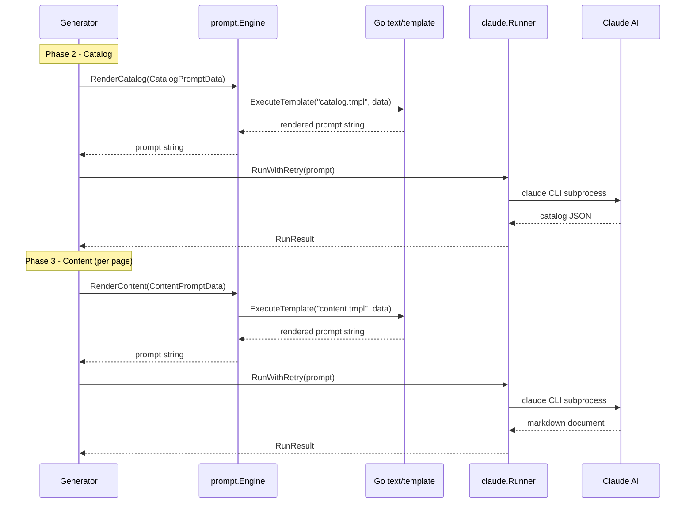

# Prompt Engine

The Prompt Engine is the template rendering subsystem that transforms structured data into fully formed prompts for Claude AI, powering every phase of the documentation generation pipeline.

## Overview

The Prompt Engine (`internal/prompt/engine.go`) serves as the bridge between selfmd's generation logic and the Claude AI model. It manages a collection of Go `text/template` files organized by language, renders them with phase-specific context data, and produces the final prompt strings that are sent to Claude via the Runner.

**Key responsibilities:**

- **Template management** — Loads and parses embedded `.tmpl` files from language-specific and shared directories using Go's `embed.FS`
- **Multi-language support** — Selects the appropriate template subfolder based on the configured output language (e.g., `zh-TW`, `en-US`), with fallback to `en-US` for unsupported languages
- **Prompt rendering** — Provides typed render methods for each generation phase: catalog, content, update (matched/unmatched), and translation
- **Data binding** — Accepts strongly-typed data structs that carry project metadata, scan results, catalog information, and language settings into each template

The Engine is instantiated once per `Generator` and used throughout all pipeline phases.

## Architecture



## Template Organization

Templates are embedded into the binary at compile time using Go's `//go:embed` directive. They are organized into two categories:

### Language-Specific Templates

Located under `internal/prompt/templates/{lang}/`, where `{lang}` is a language code such as `zh-TW` or `en-US`. Each language folder contains identical template files with localized prompt instructions:

| Template File | Render Method | Pipeline Phase | Purpose |
|---|---|---|---|
| `catalog.tmpl` | `RenderCatalog()` | Catalog Phase | Instructs Claude to analyze project structure and produce a documentation catalog |
| `content.tmpl` | `RenderContent()` | Content Phase | Instructs Claude to write a single documentation page |
| `updater.tmpl` | `RenderUpdater()` | Legacy Update | Full incremental update prompt (kept for reference) |
| `update_matched.tmpl` | `RenderUpdateMatched()` | Update Phase | Asks Claude which existing pages need regeneration |
| `update_unmatched.tmpl` | `RenderUpdateUnmatched()` | Update Phase | Asks Claude whether new pages are needed for unmatched files |

### Shared Templates

Located directly under `internal/prompt/templates/`, these templates are language-independent:

| Template File | Render Method | Pipeline Phase | Purpose |
|---|---|---|---|
| `translate.tmpl` | `RenderTranslate()` | Translate Phase | Instructs Claude to translate a documentation page |
| `translate_titles.tmpl` | `RenderTranslateTitles()` | Translate Phase | Batch-translates catalog category titles |

### Template Language Selection

The Engine selects which template subfolder to load based on `OutputConfig.GetEffectiveTemplateLang()`. If the configured output language has a built-in template folder (currently `zh-TW` and `en-US`), that folder is used. Otherwise, it falls back to `en-US` and sets a language override flag so the prompt explicitly instructs Claude to write in the desired language.

```go
func (o *OutputConfig) GetEffectiveTemplateLang() string {
	for _, lang := range SupportedTemplateLangs {
		if o.Language == lang {
			return o.Language
		}
	}
	return "en-US"
}
```

> Source: internal/config/config.go#L58-L65

## Data Structures

The Engine defines a typed data struct for each prompt type. These structs carry all the context that templates need to produce a complete prompt.

### CatalogPromptData

Used by `RenderCatalog()` during the catalog generation phase. Carries project metadata, scanned file tree, key files, entry points, and README content.

```go
type CatalogPromptData struct {
	RepositoryName       string
	ProjectType          string
	Language             string
	LanguageName         string
	LanguageOverride     bool
	LanguageOverrideName string
	KeyFiles             string
	EntryPoints          string
	FileTree             string
	ReadmeContent        string
}
```

> Source: internal/prompt/engine.go#L40-L51

### ContentPromptData

Used by `RenderContent()` to generate a single documentation page. Includes catalog path information, project directory, file tree, the full catalog link table, and optionally the existing content for update context.

```go
type ContentPromptData struct {
	RepositoryName       string
	Language             string
	LanguageName         string
	LanguageOverride     bool
	LanguageOverrideName string
	CatalogPath          string
	CatalogTitle         string
	CatalogDirPath       string
	ProjectDir           string
	FileTree             string
	CatalogTable         string
	ExistingContent      string
}
```

> Source: internal/prompt/engine.go#L54-L67

### TranslatePromptData

Used by `RenderTranslate()` to translate a documentation page between languages. Contains source/target language codes, display names, and the full source content.

```go
type TranslatePromptData struct {
	SourceLanguage     string
	SourceLanguageName string
	TargetLanguage     string
	TargetLanguageName string
	SourceContent      string
}
```

> Source: internal/prompt/engine.go#L98-L104

### Update-Related Data Structs

Two data structs support the incremental update workflow:

- **`UpdateMatchedPromptData`** — Carries changed file list and affected page summaries for determining which existing pages need regeneration
- **`UpdateUnmatchedPromptData`** — Carries unmatched changed files and the existing catalog for determining if new pages are needed

```go
type UpdateMatchedPromptData struct {
	RepositoryName string
	Language       string
	ChangedFiles   string
	AffectedPages  string
}

type UpdateUnmatchedPromptData struct {
	RepositoryName  string
	Language        string
	UnmatchedFiles  string
	ExistingCatalog string
	CatalogTable    string
}
```

> Source: internal/prompt/engine.go#L81-L95

## Core Processes

The following sequence diagram shows how the Engine is used during the documentation generation pipeline:



### Engine Initialization

The Engine is created once when a `Generator` is instantiated. It loads two sets of templates: language-specific and shared.

```go
func NewEngine(templateLang string) (*Engine, error) {
	langGlob := fmt.Sprintf("templates/%s/*.tmpl", templateLang)
	tmpl, err := template.New("").ParseFS(templateFS, langGlob)
	if err != nil {
		return nil, fmt.Errorf("failed to load prompt templates (%s): %w", templateLang, err)
	}

	shared, err := template.New("").ParseFS(templateFS, "templates/*.tmpl")
	if err != nil {
		return nil, fmt.Errorf("failed to load shared templates: %w", err)
	}

	return &Engine{
		templates:       tmpl,
		sharedTemplates: shared,
	}, nil
}
```

> Source: internal/prompt/engine.go#L21-L37

### Template Rendering

All render methods follow the same pattern: accept a typed data struct, execute the named template, and return the rendered string. Language-specific templates use the `render()` method while shared templates use `renderShared()`.

```go
func (e *Engine) render(name string, data any) (string, error) {
	var buf bytes.Buffer
	if err := e.templates.ExecuteTemplate(&buf, name, data); err != nil {
		return "", fmt.Errorf("failed to render template %s: %w", name, err)
	}
	return buf.String(), nil
}

func (e *Engine) renderShared(name string, data any) (string, error) {
	var buf bytes.Buffer
	if err := e.sharedTemplates.ExecuteTemplate(&buf, name, data); err != nil {
		return "", fmt.Errorf("failed to render shared template %s: %w", name, err)
	}
	return buf.String(), nil
}
```

> Source: internal/prompt/engine.go#L150-L164

## Usage Examples

### Catalog Phase Usage

The `Generator.GenerateCatalog()` method populates a `CatalogPromptData` struct from scan results and config, then calls `Engine.RenderCatalog()`:

```go
data := prompt.CatalogPromptData{
	RepositoryName:       g.Config.Project.Name,
	ProjectType:          g.Config.Project.Type,
	Language:             g.Config.Output.Language,
	LanguageName:         langName,
	LanguageOverride:     g.Config.Output.NeedsLanguageOverride(),
	LanguageOverrideName: langName,
	KeyFiles:             scan.KeyFiles(),
	EntryPoints:          scan.EntryPointsFormatted(),
	FileTree:             scanner.RenderTree(scan.Tree, 4),
	ReadmeContent:        scan.ReadmeContent,
}

rendered, err := g.Engine.RenderCatalog(data)
```

> Source: internal/generator/catalog_phase.go#L17-L31

### Content Phase Usage

Each documentation page is rendered with project context and catalog information:

```go
data := prompt.ContentPromptData{
	RepositoryName:       g.Config.Project.Name,
	Language:             g.Config.Output.Language,
	LanguageName:         langName,
	LanguageOverride:     g.Config.Output.NeedsLanguageOverride(),
	LanguageOverrideName: langName,
	CatalogPath:          item.Path,
	CatalogTitle:         item.Title,
	CatalogDirPath:       item.DirPath,
	ProjectDir:           g.RootDir,
	FileTree:             scanner.RenderTree(scan.Tree, 3),
	CatalogTable:         catalogTable,
	ExistingContent:      existingContent,
}

rendered, err := g.Engine.RenderContent(data)
```

> Source: internal/generator/content_phase.go#L91-L107

### Translation Phase Usage

Translation prompts use the shared template engine:

```go
data := prompt.TranslatePromptData{
	SourceLanguage:     sourceLang,
	SourceLanguageName: sourceLangName,
	TargetLanguage:     targetLang,
	TargetLanguageName: targetLangName,
	SourceContent:      sourceContent,
}

rendered, err := g.Engine.RenderTranslate(data)
```

> Source: internal/generator/translate_phase.go#L197-L206

## Related Links

- [Claude Runner](../claude-runner/index.md) — The subprocess runner that executes rendered prompts via the Claude CLI
- [Documentation Generator](../generator/index.md) — The pipeline orchestrator that uses the Engine across all phases
- [Catalog Phase](../generator/catalog-phase/index.md) — The phase that uses `RenderCatalog()` to generate documentation structure
- [Content Phase](../generator/content-phase/index.md) — The phase that uses `RenderContent()` to generate individual pages
- [Translate Phase](../generator/translate-phase/index.md) — The phase that uses `RenderTranslate()` and `RenderTranslateTitles()`
- [Incremental Update Engine](../incremental-update/index.md) — The update workflow using `RenderUpdateMatched()` and `RenderUpdateUnmatched()`
- [Configuration Overview](../../configuration/config-overview/index.md) — Language and template configuration settings
- [Output Language](../../configuration/output-language/index.md) — Output language configuration that affects template selection

## Reference Files

| File Path | Description |
|-----------|-------------|
| `internal/prompt/engine.go` | Engine struct, data types, and render methods |
| `internal/prompt/templates/en-US/catalog.tmpl` | English catalog generation prompt template |
| `internal/prompt/templates/en-US/content.tmpl` | English content page generation prompt template |
| `internal/prompt/templates/en-US/update_matched.tmpl` | English prompt for determining pages needing regeneration |
| `internal/prompt/templates/en-US/update_unmatched.tmpl` | English prompt for determining new pages needed |
| `internal/prompt/templates/en-US/updater.tmpl` | Legacy incremental update prompt template |
| `internal/prompt/templates/translate.tmpl` | Shared translation prompt template |
| `internal/prompt/templates/translate_titles.tmpl` | Shared batch title translation prompt template |
| `internal/prompt/templates/zh-TW/catalog.tmpl` | Traditional Chinese catalog prompt (verified exists) |
| `internal/generator/pipeline.go` | Generator struct definition and Engine initialization |
| `internal/generator/catalog_phase.go` | Catalog phase using RenderCatalog() |
| `internal/generator/content_phase.go` | Content phase using RenderContent() |
| `internal/generator/translate_phase.go` | Translation phase using RenderTranslate() and RenderTranslateTitles() |
| `internal/generator/updater.go` | Update workflow using RenderUpdateMatched() and RenderUpdateUnmatched() |
| `internal/config/config.go` | GetEffectiveTemplateLang() and language configuration |