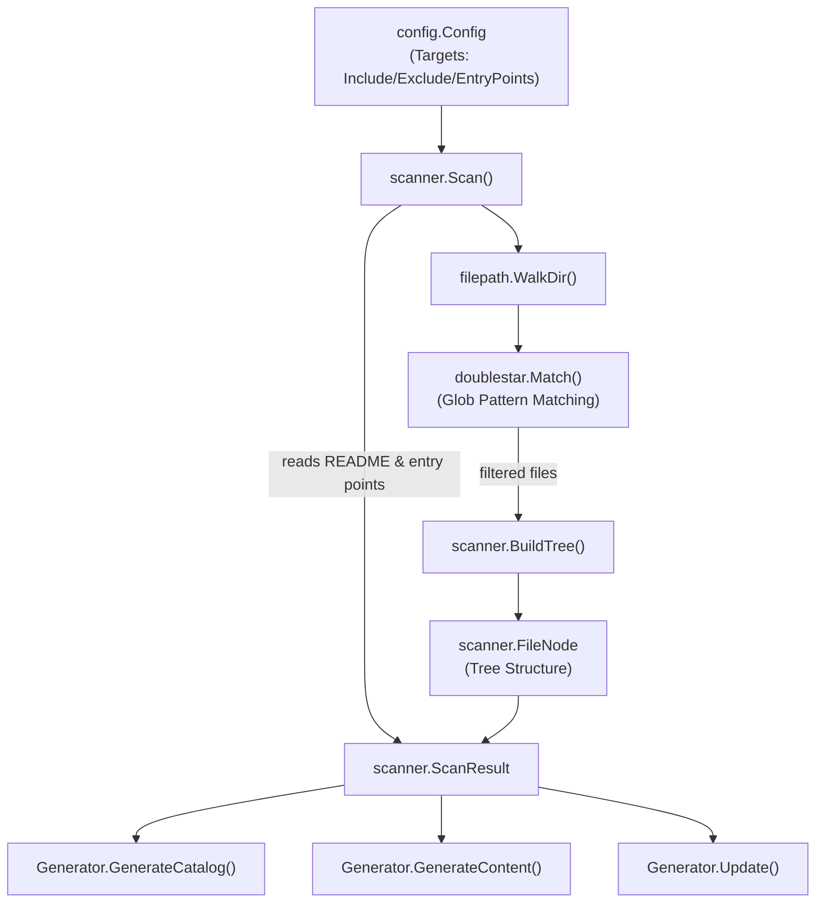
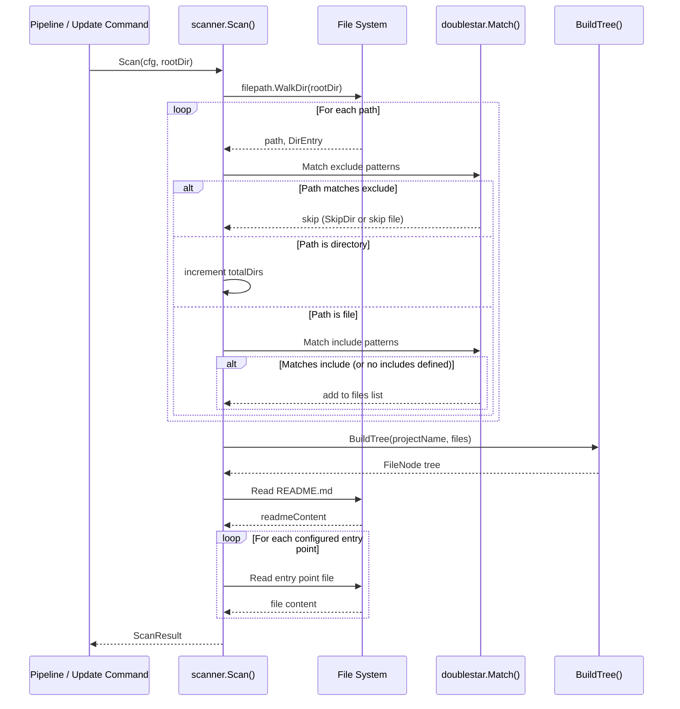

# Project Scanner

The Project Scanner is the foundational module responsible for traversing a project's directory structure, filtering files based on configuration rules, and producing a structured representation used throughout the documentation generation pipeline.

## Overview

The `scanner` package (`internal/scanner/`) serves as the very first phase of selfmd's documentation generation pipeline. Its primary responsibilities are:

- **Directory traversal** — Recursively walks the project directory to discover all files and directories
- **File filtering** — Applies include/exclude glob patterns from the configuration to determine which files are relevant for documentation
- **Tree construction** — Builds an in-memory tree structure (`FileNode`) from the flat list of discovered file paths
- **Metadata extraction** — Reads README files and configured entry point files to provide context for downstream Claude prompts
- **Key file detection** — Identifies notable project files (e.g., `main.go`, `package.json`, `Dockerfile`) for catalog generation

The scanner is invoked at the beginning of both the `generate` and `update` commands, and its output (`ScanResult`) flows into the catalog phase, content phase, and incremental update engine.

## Architecture



## Core Data Structures

### FileNode

`FileNode` is the fundamental building block of the scanned file tree. Each node represents either a file or a directory and holds references to its children.

```go
type FileNode struct {
	Name     string
	Path     string // relative path from project root
	IsDir    bool
	Children []*FileNode
}
```

> Source: internal/scanner/filetree.go#L11-L16

### ScanResult

`ScanResult` aggregates all data collected during a scan — the file tree, flat file list, statistics, and content from README and entry point files.

```go
type ScanResult struct {
	RootDir            string
	Tree               *FileNode
	FileList           []string
	TotalFiles         int
	TotalDirs          int
	ReadmeContent      string
	EntryPointContents map[string]string
}
```

> Source: internal/scanner/filetree.go#L19-L27

## Core Processes

### Scan Workflow

The `Scan` function orchestrates the entire scanning process. It walks the directory, applies filtering rules, builds the tree, and reads supplementary files.



### File Filtering Logic

The scanner applies a two-stage filtering strategy using the `doublestar` glob matching library:

1. **Exclude check (first)** — Every path is tested against `cfg.Targets.Exclude` patterns. If a directory matches, the entire subtree is skipped via `filepath.SkipDir`. If a file matches, it is silently omitted.

2. **Include check (second)** — If `cfg.Targets.Include` is non-empty, only files matching at least one include pattern are kept. If no include patterns are configured, all non-excluded files are accepted.

```go
// check excludes
for _, pattern := range cfg.Targets.Exclude {
    matched, _ := doublestar.Match(pattern, rel)
    if matched {
        if d.IsDir() {
            return filepath.SkipDir
        }
        return nil
    }
}
```

> Source: internal/scanner/scanner.go#L33-L41

```go
// check includes
if len(cfg.Targets.Include) > 0 {
    included := false
    for _, pattern := range cfg.Targets.Include {
        matched, _ := doublestar.Match(pattern, rel)
        if matched {
            included = true
            break
        }
    }
    if !included {
        return nil
    }
}
```

> Source: internal/scanner/scanner.go#L49-L61

The default configuration provides sensible defaults for both patterns:

```go
Targets: TargetsConfig{
    Include: []string{"src/**", "pkg/**", "cmd/**", "internal/**", "lib/**", "app/**"},
    Exclude: []string{
        "vendor/**", "node_modules/**", ".git/**", ".doc-build/**",
        "**/*.pb.go", "**/generated/**", "dist/**", "build/**",
    },
    EntryPoints: []string{},
},
```

> Source: internal/config/config.go#L102-L109

### Tree Building

`BuildTree` converts a flat list of relative file paths into a hierarchical `FileNode` tree. It splits each path by `/`, traverses or creates intermediate directory nodes, and marks the final segment as a file.

```go
func BuildTree(rootName string, paths []string) *FileNode {
	root := &FileNode{
		Name:  rootName,
		Path:  "",
		IsDir: true,
	}

	for _, p := range paths {
		parts := strings.Split(filepath.ToSlash(p), "/")
		current := root
		for i, part := range parts {
			isLast := i == len(parts)-1
			child := findChild(current, part)
			if child == nil {
				child = &FileNode{
					Name:  part,
					Path:  strings.Join(parts[:i+1], "/"),
					IsDir: !isLast,
				}
				current.Children = append(current.Children, child)
			}
			if !isLast {
				child.IsDir = true
			}
			current = child
		}
	}

	sortTree(root)
	return root
}
```

> Source: internal/scanner/filetree.go#L30-L60

After construction, `sortTree` sorts each directory's children with **directories first**, then alphabetically within each group:

```go
func sortTree(node *FileNode) {
	sort.Slice(node.Children, func(i, j int) bool {
		if node.Children[i].IsDir != node.Children[j].IsDir {
			return node.Children[i].IsDir
		}
		return node.Children[i].Name < node.Children[j].Name
	})
	for _, c := range node.Children {
		if c.IsDir {
			sortTree(c)
		}
	}
}
```

> Source: internal/scanner/filetree.go#L71-L84

### Tree Rendering

`RenderTree` produces a human-readable, tree-style text representation used in Claude prompts. It supports depth limiting (`maxDepth`) and truncation for directories with more than 30 children.

```go
func RenderTree(node *FileNode, maxDepth int) string {
	var sb strings.Builder
	sb.WriteString(node.Name + "/\n")
	renderChildren(&sb, node, "", maxDepth, 0)
	return sb.String()
}
```

> Source: internal/scanner/filetree.go#L87-L92

The renderer uses standard tree-drawing characters (`├──`, `└──`, `│`) and truncates large directories:

```go
// truncate if too many children
truncated := false
if len(children) > 30 {
    children = children[:30]
    truncated = true
}
```

> Source: internal/scanner/filetree.go#L104-L108

## Utility Methods on ScanResult

### KeyFiles

`KeyFiles` scans the file list for well-known project files (e.g., `main.go`, `Dockerfile`, `package.json`) and returns them as a comma-separated string. This is used during catalog generation to help Claude understand the project's technology stack.

```go
func (s *ScanResult) KeyFiles() string {
	notable := []string{}
	patterns := []string{
		"main.go", "main.py", "main.rs", "main.ts", "main.js",
		"index.ts", "index.js", "app.go", "app.py", "app.ts",
		"Makefile", "Dockerfile", "docker-compose.yml", "compose.yaml",
		"package.json", "go.mod", "Cargo.toml", "pom.xml",
		"README.md", "CHANGELOG.md",
	}

	for _, f := range s.FileList {
		base := filepath.Base(f)
		for _, p := range patterns {
			if strings.EqualFold(base, p) {
				notable = append(notable, f)
				break
			}
		}
	}

	if len(notable) > 20 {
		notable = notable[:20]
	}
	return strings.Join(notable, ", ")
}
```

> Source: internal/scanner/scanner.go#L117-L141

### EntryPointsFormatted

`EntryPointsFormatted` formats configured entry point file contents into a Markdown string suitable for embedding in Claude prompts. Each entry point is rendered with its path as a heading and content in a code block, truncated at 10,000 characters.

```go
func (s *ScanResult) EntryPointsFormatted() string {
	if len(s.EntryPointContents) == 0 {
		return "(no entry points specified)"
	}

	var sb strings.Builder
	for path, content := range s.EntryPointContents {
		sb.WriteString("### " + path + "\n```\n")
		if len(content) > 10000 {
			content = content[:10000] + "\n... (truncated)"
		}
		sb.WriteString(content)
		sb.WriteString("\n```\n\n")
	}
	return sb.String()
}
```

> Source: internal/scanner/scanner.go#L144-L160

## Usage in the Pipeline

The scanner is invoked as **Phase 1** of the generation pipeline and also during incremental updates:

**Full Generation** (`selfmd generate`):

```go
// Phase 1: Scan
fmt.Println("[1/4] Scanning project structure...")
scan, err := scanner.Scan(g.Config, g.RootDir)
if err != nil {
    return fmt.Errorf("failed to scan project: %w", err)
}
fmt.Printf("      Found %d files in %d directories\n", scan.TotalFiles, scan.TotalDirs)
```

> Source: internal/generator/pipeline.go#L86-L92

**Incremental Update** (`selfmd update`):

```go
// Scan project structure (needed for content generation)
scan, err := scanner.Scan(cfg, rootDir)
if err != nil {
    return fmt.Errorf("failed to scan project: %w", err)
}
```

> Source: cmd/update.go#L104-L108

The `ScanResult` is then consumed by:

- **`GenerateCatalog`** — Uses `KeyFiles()`, `EntryPointsFormatted()`, `RenderTree()`, and `ReadmeContent` to build the catalog prompt
- **`GenerateContent`** — Uses `RenderTree()` to provide file tree context in each page's content prompt
- **`Update`** — Passes the full `ScanResult` to the incremental update engine for context during page regeneration

## Related Links

- [Configuration Overview](../../configuration/config-overview/index.md)
- [Project Targets](../../configuration/project-targets/index.md)
- [Generation Pipeline](../../architecture/pipeline/index.md)
- [Core Modules](../index.md)
- [Catalog Manager](../catalog/index.md)
- [Documentation Generator](../generator/index.md)
- [Catalog Phase](../generator/catalog-phase/index.md)
- [Content Phase](../generator/content-phase/index.md)
- [Incremental Update Engine](../incremental-update/index.md)

## Reference Files

| File Path | Description |
|-----------|-------------|
| `internal/scanner/scanner.go` | Core `Scan` function, file reading helpers, `KeyFiles`, and `EntryPointsFormatted` methods |
| `internal/scanner/filetree.go` | `FileNode` and `ScanResult` structs, `BuildTree`, `RenderTree`, and sorting logic |
| `internal/config/config.go` | `Config` and `TargetsConfig` structs with default include/exclude patterns |
| `internal/generator/pipeline.go` | Generation pipeline invoking `scanner.Scan` as Phase 1 |
| `internal/generator/catalog_phase.go` | Catalog generation consuming `ScanResult` fields |
| `internal/generator/content_phase.go` | Content generation using `RenderTree` and `ScanResult` |
| `internal/generator/updater.go` | Incremental update engine receiving `ScanResult` |
| `cmd/update.go` | Update command invoking `scanner.Scan` |