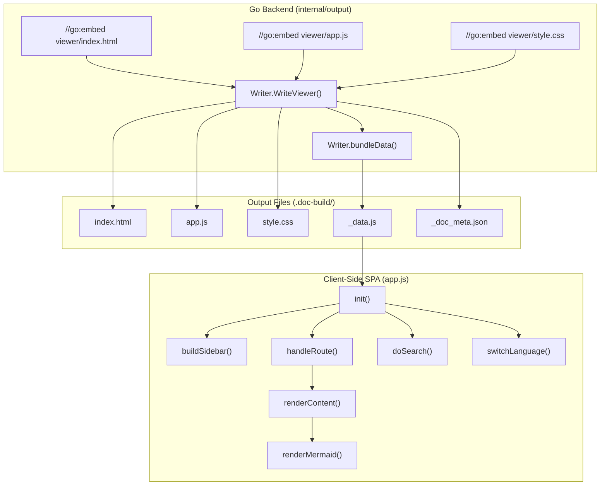
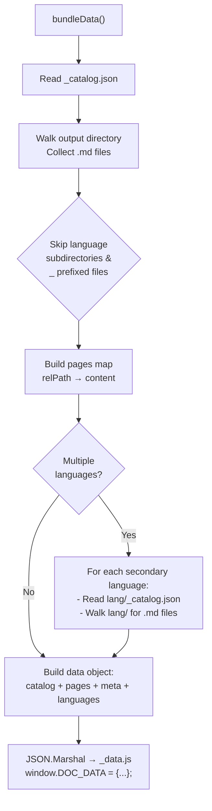

# Static Viewer

The Static Viewer is a self-contained, single-page documentation browser that bundles all generated Markdown content into a serverless HTML/JS/CSS application for offline viewing.

## Overview

The Static Viewer is the final output artifact of selfmd's documentation generation pipeline. After all Markdown pages have been generated (and optionally translated), the viewer module:

- **Embeds viewer assets at compile time** — The HTML, JavaScript, and CSS files are compiled into the Go binary using `//go:embed` directives, ensuring zero external dependencies at build time
- **Bundles all documentation into a single `_data.js` file** — All Markdown pages, catalog structure, and language metadata are serialized into a JavaScript-loadable data object
- **Provides a complete SPA experience** — Hash-based routing, sidebar navigation, full-text search, Mermaid diagram rendering with fullscreen/zoom/pan, language switching, and responsive mobile layout
- **Requires no server** — The output can be opened directly as a local file (`index.html`) or deployed to any static hosting (GitHub Pages, Netlify, etc.)

The viewer is invoked at the end of both the `generate` and `translate` pipelines via `Writer.WriteViewer()`.

## Architecture



## Embedded Assets

The viewer assets are embedded into the Go binary at compile time using Go's `embed` package. This ensures the viewer files ship as part of the selfmd binary with no external file dependencies.

```go
//go:embed viewer/index.html
var viewerHTML string

//go:embed viewer/app.js
var viewerJS string

//go:embed viewer/style.css
var viewerCSS string
```

> Source: internal/output/viewer.go#L13-L20

The three embedded files form the complete viewer:

| File | Purpose |
|------|---------|
| `viewer/index.html` | HTML shell with template placeholders (`{{PROJECT_NAME}}`, `{{LANG}}`) |
| `viewer/app.js` | Full SPA logic: routing, rendering, search, language switching, Mermaid support |
| `viewer/style.css` | Responsive styling with dark sidebar, typography, and Mermaid fullscreen support |

## WriteViewer Process

The `WriteViewer` method on `Writer` is the primary entry point. It writes all static assets and bundles the documentation data.

```go
func (w *Writer) WriteViewer(projectName string, docMeta *DocMeta) error {
	// Write index.html with project name and language injected
	html := strings.ReplaceAll(viewerHTML, "{{PROJECT_NAME}}", projectName)
	lang := "zh-TW"
	if docMeta != nil {
		lang = docMeta.DefaultLanguage
	}
	html = strings.ReplaceAll(html, "{{LANG}}", lang)

	if err := w.WriteFile("index.html", html); err != nil {
		return fmt.Errorf("failed to write index.html: %w", err)
	}

	// Write static assets
	if err := w.WriteFile("app.js", viewerJS); err != nil {
		return fmt.Errorf("failed to write app.js: %w", err)
	}
	if err := w.WriteFile("style.css", viewerCSS); err != nil {
		return fmt.Errorf("failed to write style.css: %w", err)
	}

	// Write _doc_meta.json
	if docMeta != nil {
		metaBytes, err := json.MarshalIndent(docMeta, "", "  ")
		if err != nil {
			return fmt.Errorf("failed to serialize _doc_meta.json: %w", err)
		}
		if err := w.WriteFile("_doc_meta.json", string(metaBytes)); err != nil {
			return fmt.Errorf("failed to write _doc_meta.json: %w", err)
		}
	}

	// Bundle all content into _data.js
	return w.bundleData(projectName, docMeta)
}
```

> Source: internal/output/viewer.go#L24-L58

### Template Substitution

The HTML template contains two placeholders that are replaced at write time:

- `{{PROJECT_NAME}}` — Injected into the `<title>` tag and the sidebar header `<h1>`
- `{{LANG}}` — Set on the `<html lang="...">` attribute from `DocMeta.DefaultLanguage`

## Data Bundling

The `bundleData` method walks the output directory, collects all Markdown files and catalog data, and writes everything into a single `_data.js` file that the client-side application consumes.



### Data Object Structure

The bundled `_data.js` file assigns a global `window.DOC_DATA` object with the following structure:

```javascript
window.DOC_DATA = {
    "catalog": { /* parsed _catalog.json */ },
    "pages": {
        "overview/index.md": "# Overview\n...",
        "configuration/index.md": "# Configuration\n..."
    },
    "meta": {
        "default_language": "en-US",
        "available_languages": [
            { "code": "en-US", "native_name": "English", "is_default": true },
            { "code": "zh-TW", "native_name": "繁體中文", "is_default": false }
        ]
    },
    "languages": {
        "zh-TW": {
            "catalog": { /* translated catalog */ },
            "pages": { /* translated pages */ }
        }
    }
};
```

### File Collection Logic

The bundler applies specific filtering rules when collecting Markdown files:

```go
// Skip files starting with _
if strings.HasPrefix(filepath.Base(relPath), "_") {
    return nil
}

// Skip files inside language subdirectories
topDir := strings.SplitN(relPath, "/", 2)[0]
if langDirs[topDir] {
    return nil
}
```

> Source: internal/output/viewer.go#L103-L112

Files prefixed with `_` (such as `_catalog.json`, `_sidebar.md`) and files inside secondary language directories are excluded from the primary pages collection. Secondary language content is collected separately and placed under the `languages` key.

## Client-Side Application

The `app.js` file implements a complete single-page application with the following subsystems.

### Initialization

On DOM ready, the `init()` function bootstraps the viewer:

```javascript
function init() {
    if (!window.DOC_DATA) {
        document.getElementById("article").innerHTML = "<p>Error: _data.js not found.</p>";
        return;
    }

    catalog = window.DOC_DATA.catalog;
    pages = window.DOC_DATA.pages;
    docMeta = window.DOC_DATA.meta || null;

    configureMarked();
    mermaid.initialize({ startOnLoad: false, theme: "default" });

    if (docMeta && docMeta.available_languages && docMeta.available_languages.length > 1) {
        buildLangSwitcher();
        var urlLang = getQueryParam("lang");
        if (urlLang && urlLang !== docMeta.default_language) {
            switchLanguage(urlLang);
        }
    }

    buildSidebar();
    handleRoute();
    window.addEventListener("hashchange", handleRoute);
    setupMobileMenu();
    setupGlobalEsc();
    setupSearch();
}
```

> Source: internal/output/viewer/app.js#L36-L64

### Hash-Based Routing

Navigation uses the URL hash fragment. The `handleRoute()` function extracts the path from `location.hash` and loads the corresponding page from the in-memory `pages` map:

```javascript
function handleRoute() {
    var path = location.hash.slice(1) || "index.md";
    loadPage(path);
}
```

> Source: internal/output/viewer/app.js#L212-L215

### Markdown Rendering

Content rendering uses [marked.js](https://github.com/markedjs/marked) with [highlight.js](https://highlightjs.org/) for syntax highlighting. Mermaid code blocks are excluded from highlight.js and rendered separately by mermaid.js:

```javascript
function configureMarked() {
    marked.setOptions({
        highlight: function (code, lang) {
            if (lang === "mermaid") {
                return code.replace(/&/g, "&amp;").replace(/</g, "&lt;").replace(/>/g, "&gt;");
            }
            if (lang && hljs.getLanguage(lang)) {
                return hljs.highlight(code, { language: lang }).value;
            }
            return hljs.highlightAuto(code).value;
        },
        breaks: false,
        gfm: true
    });
}
```

> Source: internal/output/viewer/app.js#L128-L143

### Relative Link Resolution

Internal Markdown links (relative paths like `../overview/index.md`) are converted to hash-based links at render time by the `fixLinks()` function:

```javascript
function fixLinks(container, currentPath) {
    var baseDir = currentPath.replace(/[^/]*$/, "");
    var links = container.querySelectorAll("a[href]");

    for (var i = 0; i < links.length; i++) {
        var href = links[i].getAttribute("href");
        if (href.indexOf("://") !== -1 || href.charAt(0) === "#" || href.indexOf("mailto:") === 0) continue;
        var resolved = resolvePath(baseDir, href);
        links[i].setAttribute("href", "#" + resolved);
    }
}
```

> Source: internal/output/viewer/app.js#L325-L338

### Full-Text Search

The search system provides real-time, client-side full-text search across all loaded pages with a 200ms debounce:

```javascript
function doSearch(query) {
    var results = [];
    var lowerQuery = query.toLowerCase();
    var pageKeys = Object.keys(pages);

    for (var i = 0; i < pageKeys.length; i++) {
        var path = pageKeys[i];
        var content = pages[path];
        var lowerContent = content.toLowerCase();
        var idx = lowerContent.indexOf(lowerQuery);
        if (idx === -1) continue;

        var titleMatch = content.match(/^#\s+(.+)/m);
        var title = titleMatch ? titleMatch[1] : path;

        var start = Math.max(0, idx - 30);
        var end = Math.min(content.length, idx + query.length + 60);
        var snippet = (start > 0 ? "…" : "") +
            content.substring(start, end).replace(/\n/g, " ") +
            (end < content.length ? "…" : "");

        results.push({ path: path, title: title, snippet: snippet, matchIdx: idx - start + (start > 0 ? 1 : 0) });
    }

    showSearchResults(results, query);
}
```

> Source: internal/output/viewer/app.js#L633-L660

When a search result is clicked, the viewer navigates to that page and scrolls to the first match, temporarily highlighting it with a `<mark>` element.

### Language Switching

When multiple languages are available, the viewer renders a `<select>` dropdown in the sidebar. Switching languages swaps out the `catalog` and `pages` variables with data from the secondary language, then rebuilds the sidebar and re-renders the current page:

```javascript
function switchLanguage(langCode) {
    if (!docMeta) return;

    if (langCode === docMeta.default_language) {
        catalog = window.DOC_DATA.catalog;
        pages = window.DOC_DATA.pages;
        currentLang = null;
    } else {
        var langData = window.DOC_DATA.languages;
        if (langData && langData[langCode]) {
            if (langData[langCode].catalog) {
                catalog = langData[langCode].catalog;
            }
            pages = langData[langCode].pages || {};
            currentLang = langCode;
        }
    }

    buildSidebar();
    handleRoute();

    var select = document.getElementById("lang-select");
    if (select) select.value = langCode;

    setQueryParam("lang", langCode === (docMeta && docMeta.default_language) ? null : langCode);
}
```

> Source: internal/output/viewer/app.js#L98-L124

The selected language is persisted via the URL query parameter `?lang=zh-TW`, so language preference survives page reloads.

### Mermaid Diagram Support

Mermaid code blocks are detected after Markdown rendering and processed by mermaid.js. Each diagram is wrapped in a `mindmap-wrapper` with a fullscreen button that enables zoom (mouse wheel, 0.8x–2.0x) and pan (click-drag):

```javascript
function renderMermaid(container) {
    var codeBlocks = container.querySelectorAll("pre code.language-mermaid");
    if (codeBlocks.length === 0) return;

    for (var i = 0; i < codeBlocks.length; i++) {
        var block = codeBlocks[i];
        var pre = block.parentElement;

        var wrapper = document.createElement("div");
        wrapper.className = "mindmap-wrapper";

        var div = document.createElement("div");
        div.className = "mermaid";
        var mermaidText = decodeHtmlEntities(block.textContent).replace(/\\n/g, "<br/>");
        div.textContent = mermaidText;

        var btn = document.createElement("button");
        btn.className = "mindmap-fullscreen-btn";
        btn.title = uiText("fullscreen");
        btn.innerHTML = "&#x26F6;";

        wrapper.appendChild(div);
        wrapper.appendChild(btn);
        pre.parentNode.replaceChild(wrapper, pre);
    }

    try {
        mermaid.run();
    } catch (e) {
        console.warn("Mermaid rendering error:", e);
    }
}
```

> Source: internal/output/viewer/app.js#L356-L404

### UI Internationalization

The viewer UI strings (button labels, search placeholder, error messages) support localization through a built-in `uiI18n` dictionary:

```javascript
var uiI18n = {
    "zh-TW": {
        home: "首頁", overview: "概覽", pageNotFound: "頁面未找到",
        notFoundPrefix: "找不到", copyTitle: "複製本頁 .md 相對路徑",
        copyLabel: "複製本頁位置", dlTitle: "下載本頁 Markdown",
        dlLabel: "下載本頁", copied: "已複製", fullscreen: "全螢幕檢視",
        zoomHint: "滾輪縮放 / 拖曳平移", noResults: "找不到符合的結果",
        resultsPrefix: "找到 ", resultsSuffix: " 筆結果"
    },
    "en-US": {
        home: "Home", overview: "Overview", pageNotFound: "Page Not Found",
        notFoundPrefix: "Could not find", copyTitle: "Copy .md relative path",
        copyLabel: "Copy Path", dlTitle: "Download Markdown",
        dlLabel: "Download", copied: "Copied", fullscreen: "Fullscreen",
        zoomHint: "Scroll to zoom / Drag to pan", noResults: "No results found",
        resultsPrefix: "Found ", resultsSuffix: " results"
    }
};
```

> Source: internal/output/viewer/app.js#L9-L26

### Page Toolbar

Each rendered page includes a toolbar with two actions:

- **Copy Path** — Copies the page's relative `.md` path to the clipboard
- **Download** — Downloads the raw Markdown content as a file

```javascript
function buildPageToolbar(path) {
    return '<div class="page-toolbar">' +
        '<button id="btn-copy-path" class="toolbar-btn" title="' + uiText("copyTitle") + '">' +
        '<span class="toolbar-icon">&#128203;</span> ' + uiText("copyLabel") + '</button>' +
        '<button id="btn-download" class="toolbar-btn" title="' + uiText("dlTitle") + '">' +
        '<span class="toolbar-icon">&#11015;</span> ' + uiText("dlLabel") + '</button>' +
        '</div>';
}
```

> Source: internal/output/viewer/app.js#L270-L277

## Pipeline Integration

The viewer is generated at the end of two pipelines:

### Generate Pipeline (Phase 4)

After content generation and index building, `WriteViewer` is called as the final step:

```go
// Build doc metadata for multi-language support
docMeta := g.buildDocMeta()

// Generate static viewer (HTML/JS/CSS + _data.js bundle)
fmt.Println("Generating documentation viewer...")
if err := g.Writer.WriteViewer(g.Config.Project.Name, docMeta); err != nil {
    g.Logger.Warn("failed to generate viewer", "error", err)
    fmt.Printf("      Viewer generation failed: %v\n", err)
} else {
    fmt.Println("      Done, open .doc-build/index.html to browse")
}
```

> Source: internal/generator/pipeline.go#L146-L155

### Translate Pipeline

After translation completes, the viewer is regenerated to include all language data:

```go
// Regenerate viewer bundle with all language data
docMeta := g.buildDocMeta()
fmt.Println("Regenerating documentation viewer...")
if err := g.Writer.WriteViewer(g.Config.Project.Name, docMeta); err != nil {
    g.Logger.Warn("failed to generate viewer", "error", err)
} else {
    fmt.Println("      Done")
}
```

> Source: internal/generator/translate_phase.go#L117-L124

## Output File Structure

After `WriteViewer` completes, the output directory contains:

```
.doc-build/
├── index.html          # Main HTML shell (from embedded template)
├── app.js              # SPA application logic
├── style.css           # Stylesheet
├── _data.js            # Bundled documentation data
├── _doc_meta.json      # Language metadata
├── _catalog.json       # Catalog structure
├── .nojekyll           # GitHub Pages compatibility
├── overview/
│   └── index.md        # Primary language pages
├── core-modules/
│   └── ...
└── zh-TW/              # Secondary language (if translated)
    ├── _catalog.json
    └── overview/
        └── index.md
```

## Third-Party Dependencies

The viewer loads three external libraries from CDN at runtime:

| Library | Purpose | Loaded From |
|---------|---------|-------------|
| marked.js | Markdown → HTML rendering | `cdn.jsdelivr.net/npm/marked/marked.min.js` |
| highlight.js | Syntax highlighting for code blocks | `cdn.jsdelivr.net/npm/highlight.js@11` |
| mermaid.js | Diagram rendering (flowchart, sequence, etc.) | `cdn.jsdelivr.net/npm/mermaid/dist/mermaid.min.js` |

## Responsive Design

The viewer uses CSS media queries to adapt to different screen sizes:

- **Desktop (> 860px)** — Fixed 280px sidebar, main content area with 56px padding
- **Mobile (≤ 860px)** — Sidebar hidden by default, revealed via hamburger menu button with overlay
- **Small screens (≤ 480px)** — Reduced heading sizes
- **Print** — Sidebar and menu button hidden, content fills the page

```css
@media (max-width: 860px) {
    #menu-toggle {
        display: block;
    }

    #sidebar {
        position: fixed;
        left: 0;
        top: 0;
        height: 100vh;
        z-index: 150;
        transform: translateX(-100%);
        transition: transform 0.25s ease;
        box-shadow: 4px 0 24px rgba(0, 0, 0, 0.3);
    }

    #sidebar.open {
        transform: translateX(0);
    }
}
```

> Source: internal/output/viewer/style.css#L632-L662

## Related Links

- [Core Modules](../index.md)
- [Output Writer](../output-writer/index.md)
- [Documentation Generator](../generator/index.md)
- [Generation Pipeline](../../architecture/pipeline/index.md)
- [Translation Workflow](../../i18n/translation-workflow/index.md)
- [Output Structure](../../overview/output-structure/index.md)
- [Tech Stack](../../overview/tech-stack/index.md)

## Reference Files

| File Path | Description |
|-----------|-------------|
| `internal/output/viewer.go` | `WriteViewer` and `bundleData` implementation with `//go:embed` directives |
| `internal/output/viewer/index.html` | HTML template with `{{PROJECT_NAME}}` and `{{LANG}}` placeholders |
| `internal/output/viewer/app.js` | Complete SPA logic: routing, rendering, search, language switching, Mermaid |
| `internal/output/viewer/style.css` | Responsive CSS with dark sidebar theme and Mermaid fullscreen styles |
| `internal/output/writer.go` | `Writer` struct, `DocMeta`/`LangInfo` types, file writing utilities |
| `internal/output/navigation.go` | `GenerateIndex`, `GenerateSidebar`, UI strings for navigation pages |
| `internal/output/linkfixer.go` | `LinkFixer` for validating and repairing relative links in Markdown |
| `internal/generator/pipeline.go` | `Generate()` pipeline calling `WriteViewer`, `buildDocMeta()` |
| `internal/generator/translate_phase.go` | Translation pipeline calling `WriteViewer` after translation |