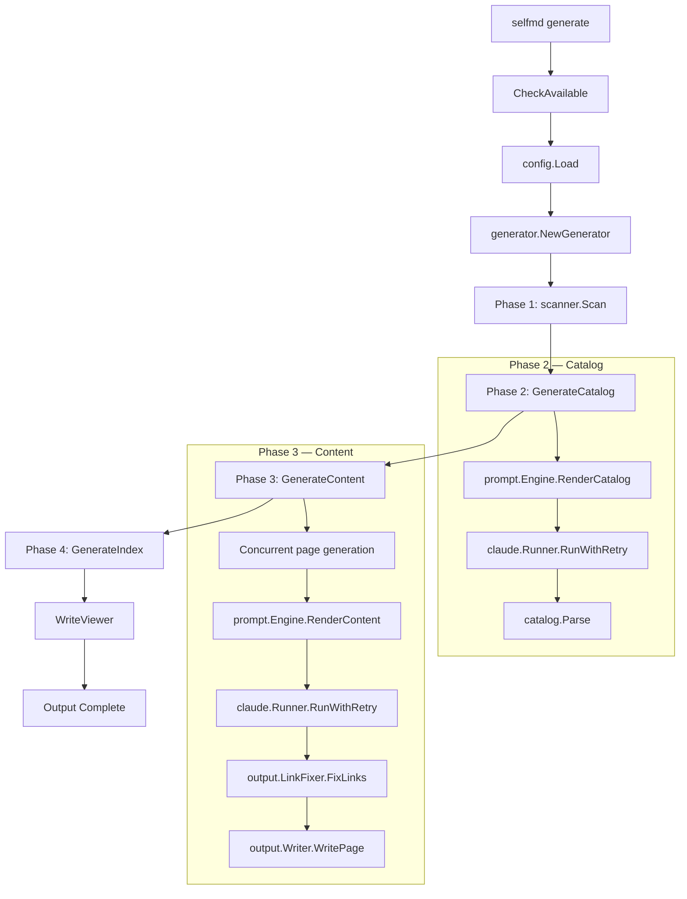
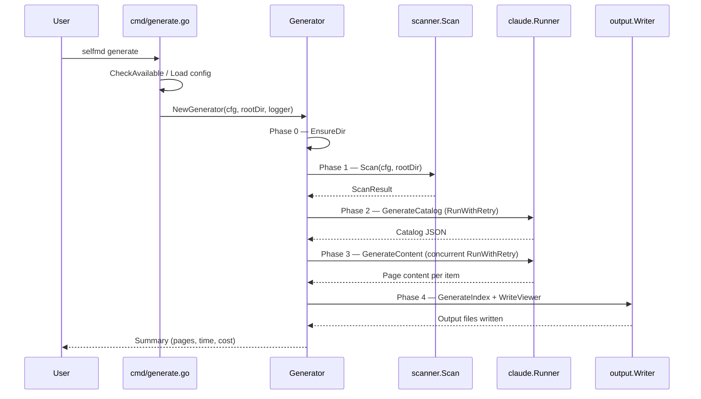

# First Run

After initializing your project with `selfmd init`, you are ready to generate your first set of documentation using the `selfmd generate` command.

## Overview

The first run of `selfmd generate` executes a four-phase pipeline that scans your project, generates a documentation catalog via Claude, produces content pages for each catalog entry concurrently, and finally builds navigation files and a static viewer. The entire process is fully automated — once invoked, selfmd handles everything from code analysis to final output.

### Prerequisites

Before running `selfmd generate`, ensure the following are in place:

1. **`selfmd.yaml` configuration file** — Created by `selfmd init`. This file defines your project name, scan targets, output settings, and Claude configuration.
2. **Claude Code CLI (`claude`)** — Must be installed and available on your system `PATH`. selfmd invokes Claude as a subprocess to analyze your codebase.
3. **Source code** — Your project must contain files matching the `targets.include` glob patterns defined in `selfmd.yaml`.

## Architecture



## Running the Command

To generate documentation for the first time, run the following command from your project root:

```bash
selfmd generate
```

### Command-Line Flags

The `generate` command supports several flags that override configuration values:

```go
generateCmd.Flags().BoolVar(&cleanFlag, "clean", false, "Force clean the output directory")
generateCmd.Flags().BoolVar(&noCleanFlag, "no-clean", false, "Do not clean the output directory")
generateCmd.Flags().BoolVar(&dryRun, "dry-run", false, "Show plan only, do not execute")
generateCmd.Flags().IntVar(&concurrencyNum, "concurrency", 0, "Concurrency (overrides config file)")
```

> Source: cmd/generate.go#L35-L38

Global flags available on all commands:

```go
rootCmd.PersistentFlags().StringVarP(&cfgFile, "config", "c", "selfmd.yaml", "config file path")
rootCmd.PersistentFlags().BoolVarP(&verbose, "verbose", "v", false, "enable verbose output")
rootCmd.PersistentFlags().BoolVarP(&quiet, "quiet", "q", false, "show errors only")
```

> Source: cmd/root.go#L37-L39

| Flag | Default | Description |
|------|---------|-------------|
| `--clean` | `false` | Force clean the output directory before generating |
| `--no-clean` | `false` | Skip cleaning, even if configured in `selfmd.yaml` |
| `--dry-run` | `false` | Scan the project and display the file tree, but make no Claude calls |
| `--concurrency` | `0` (use config) | Override the `claude.max_concurrent` setting |
| `--config`, `-c` | `selfmd.yaml` | Path to configuration file |
| `--verbose`, `-v` | `false` | Enable debug-level logging |
| `--quiet`, `-q` | `false` | Show errors only |

### Dry Run Mode

Use `--dry-run` to preview the scan results without making any Claude API calls:

```bash
selfmd generate --dry-run
```

This will print the detected file tree (up to depth 3) and exit, allowing you to verify that the correct files are being targeted before incurring any API costs.

## Core Processes

The generation pipeline consists of four sequential phases, preceded by a setup step.



### Phase 0: Setup

Before scanning begins, the output directory is prepared:

```go
clean := opts.Clean || g.Config.Output.CleanBeforeGenerate
if clean {
    fmt.Println("[0/4] Cleaning output directory...")
    if !opts.DryRun {
        if err := g.Writer.Clean(); err != nil {
            return err
        }
    }
} else {
    if err := g.Writer.EnsureDir(); err != nil {
        return err
    }
}
```

> Source: internal/generator/pipeline.go#L72-L84

On a first run with default settings (`clean_before_generate: false`), this simply creates the output directory via `os.MkdirAll`.

### Phase 1: Scan Project Structure

The scanner walks the project directory, applies include/exclude glob patterns, builds a file tree, and reads the README and entry point files:

```go
scan, err := scanner.Scan(g.Config, g.RootDir)
if err != nil {
    return fmt.Errorf("failed to scan project: %w", err)
}
fmt.Printf("      Found %d files in %d directories\n", scan.TotalFiles, scan.TotalDirs)
```

> Source: internal/generator/pipeline.go#L87-L92

The scanner produces a `ScanResult` containing:
- **File tree** — A hierarchical `FileNode` tree for display in prompts
- **File list** — All matched source files
- **README content** — Truncated to 50,000 characters
- **Entry point contents** — Source code of files listed in `targets.entry_points`

### Phase 2: Generate Catalog

Claude analyzes the project and produces a structured documentation catalog:

```go
fmt.Println("[2/4] Generating catalog...")
cat, err = g.GenerateCatalog(ctx, scan)
if err != nil {
    return fmt.Errorf("failed to generate catalog: %w", err)
}
items := cat.Flatten()
fmt.Printf("      Catalog: %d sections, %d items\n", len(cat.Items), len(items))
```

> Source: internal/generator/pipeline.go#L114-L121

The catalog generation process:

1. Assembles prompt data (project name, type, key files, entry points, file tree, README)
2. Renders the catalog prompt template via `prompt.Engine.RenderCatalog`
3. Invokes the Claude CLI with retry logic via `claude.Runner.RunWithRetry`
4. Extracts and parses the JSON catalog from Claude's response
5. Saves the catalog as `_catalog.json` in the output directory for reuse in future runs

Claude is invoked as a subprocess with the following flags:

```go
args := []string{
    "-p",
    "--output-format", "json",
}
// ...
args = append(args, "--disallowedTools", "Write", "--disallowedTools", "Edit")
```

> Source: internal/claude/runner.go#L32-L56

The `--disallowedTools Write --disallowedTools Edit` flags prevent Claude from attempting to write files, ensuring all output flows through selfmd's pipeline.

### Phase 3: Generate Content Pages

Each catalog item gets its own documentation page, generated concurrently:

```go
concurrency := g.Config.Claude.MaxConcurrent
if opts.Concurrency > 0 {
    concurrency = opts.Concurrency
}
fmt.Printf("[3/4] Generating content pages (concurrency: %d)...\n", concurrency)
if err := g.GenerateContent(ctx, scan, cat, concurrency, !clean); err != nil {
    g.Logger.Warn("some pages failed to generate", "error", err)
}
```

> Source: internal/generator/pipeline.go#L130-L137

For each page, `generateSinglePage` performs:

1. Builds prompt data with project context, file tree, and catalog link table
2. Renders the content prompt template
3. Calls Claude, which uses Read/Glob/Grep tools to analyze actual source code
4. Extracts the document from `<document>` tags in Claude's response
5. Validates the output (must start with a Markdown heading `#`)
6. Fixes broken relative links via `output.LinkFixer`
7. Writes the page as `<dirPath>/index.md`

If a page fails to generate after retries, a placeholder is written and the pipeline continues:

```go
func (g *Generator) writePlaceholder(item catalog.FlatItem, genErr error) {
	content := fmt.Sprintf("# %s\n\n> This page failed to generate. Please re-run `selfmd generate`.\n>\n> Error: %v\n", item.Title, genErr)
	if err := g.Writer.WritePage(item, content); err != nil {
		g.Logger.Warn("failed to write placeholder page", "path", item.Path, "error", err)
	}
}
```

> Source: internal/generator/content_phase.go#L159-L164

### Phase 4: Generate Index and Navigation

The final phase generates deterministic navigation files without calling Claude:

```go
func (g *Generator) GenerateIndex(_ context.Context, cat *catalog.Catalog) error {
	lang := g.Config.Output.Language

	indexContent := output.GenerateIndex(
		g.Config.Project.Name,
		g.Config.Project.Description,
		cat,
		lang,
	)
	if err := g.Writer.WriteFile("index.md", indexContent); err != nil {
		return err
	}

	sidebarContent := output.GenerateSidebar(g.Config.Project.Name, cat, lang)
	if err := g.Writer.WriteFile("_sidebar.md", sidebarContent); err != nil {
		return err
	}
	// ... category index pages
}
```

> Source: internal/generator/index_phase.go#L11-L30

This phase produces:
- **`index.md`** — Landing page with a hierarchical table of contents
- **`_sidebar.md`** — Sidebar navigation for the static viewer
- **Category index pages** — For parent items that have children, listing their sub-pages

After this phase, the static viewer is generated:

```go
fmt.Println("Generating documentation viewer...")
if err := g.Writer.WriteViewer(g.Config.Project.Name, docMeta); err != nil {
    g.Logger.Warn("failed to generate viewer", "error", err)
} else {
    fmt.Println("      Done, open .doc-build/index.html to browse")
}
```

> Source: internal/generator/pipeline.go#L149-L155

The viewer bundles all Markdown content into a single `_data.js` file, enabling fully offline documentation browsing.

## Output Structure

After a successful first run, the output directory contains:

```
<output_dir>/
├── index.html          # Static viewer HTML
├── app.js              # Viewer JavaScript
├── style.css           # Viewer CSS
├── index.md            # Landing page with table of contents
├── _sidebar.md         # Sidebar navigation
├── _catalog.json       # Catalog JSON (reused on subsequent runs)
├── _data.js            # Bundled content for offline viewing
├── _doc_meta.json      # Language metadata
├── _last_commit        # Git commit hash for incremental updates
├── .nojekyll           # GitHub Pages compatibility marker
├── overview/
│   ├── index.md        # Category index
│   └── introduction/
│       └── index.md    # Claude-generated content page
├── getting-started/
│   ├── index.md
│   ├── installation/
│   │   └── index.md
│   └── ...
└── ...
```

### Viewing the Output

Open the generated `index.html` in any browser to browse your documentation with the built-in static viewer. No web server is required — the viewer works entirely offline using the bundled `_data.js` file.

## Completion Summary

When generation finishes, selfmd prints a summary:

```go
fmt.Println("========================================")
fmt.Println("Documentation generation complete!")
fmt.Printf("  Output dir: %s\n", g.Config.Output.Dir)
fmt.Printf("  Pages: %d succeeded", g.TotalPages)
if g.FailedPages > 0 {
    fmt.Printf(", %d failed", g.FailedPages)
}
fmt.Println()
fmt.Printf("  Total time: %s\n", elapsed.Round(time.Second))
fmt.Printf("  Total cost: $%.4f USD\n", g.TotalCost)
fmt.Println("========================================")
```

> Source: internal/generator/pipeline.go#L173-L183

The summary includes:
- **Output directory** path
- **Page counts** — number of successfully generated pages and failures
- **Total time** elapsed
- **Total cost** in USD for Claude API usage

## Error Handling

selfmd validates several prerequisites before and during generation:

| Check | Behavior |
|-------|----------|
| Claude CLI not on PATH | Fails immediately with installation URL |
| Config file missing or invalid | Fails with parse error |
| `output.dir` is empty | Validation error |
| `output.language` is empty | Validation error |
| Claude CLI timeout | Returns timeout error, triggers retry |
| Claude response format error | Retries up to 2 attempts per page |
| Single page generation fails | Writes placeholder, continues with other pages |
| SIGINT/SIGTERM received | Graceful cancellation via Go context |
| Viewer generation fails | Warning logged, pipeline still completes |

Failed pages receive a placeholder that is automatically detected and regenerated on subsequent runs:

```go
func (w *Writer) PageExists(item catalog.FlatItem) bool {
	path := filepath.Join(w.BaseDir, item.DirPath, "index.md")
	data, err := os.ReadFile(path)
	if err != nil {
		return false
	}
	content := strings.TrimSpace(string(data))
	if content == "" {
		return false
	}
	head := content
	if len(head) > 500 {
		head = head[:500]
	}
	if strings.Contains(head, "This page failed to generate") {
		return false
	}
	return true
}
```

> Source: internal/output/writer.go#L97-L117

## Incremental Behavior

On subsequent runs (without `--clean`), selfmd optimizes by:

1. **Reusing the catalog** — If `_catalog.json` exists, it is loaded instead of calling Claude again
2. **Skipping existing pages** — Pages that already exist with valid content are not regenerated
3. **Re-generating failed pages** — Placeholder pages are detected and regenerated

This means you can safely re-run `selfmd generate` to fill in any pages that failed on the first attempt, without re-generating pages that already succeeded.

## Related Links

- [Installation](../installation/index.md)
- [Initialization](../init/index.md)
- [generate Command](../../cli/cmd-generate/index.md)
- [Configuration Overview](../../configuration/config-overview/index.md)
- [Generation Pipeline](../../architecture/pipeline/index.md)
- [Documentation Generator](../../core-modules/generator/index.md)

## Reference Files

| File Path | Description |
|-----------|-------------|
| `cmd/generate.go` | Generate command definition and entry point |
| `cmd/root.go` | Root command and global flag definitions |
| `internal/generator/pipeline.go` | Four-phase generation pipeline orchestrator |
| `internal/generator/catalog_phase.go` | Catalog generation via Claude |
| `internal/generator/content_phase.go` | Concurrent content page generation |
| `internal/generator/index_phase.go` | Index and navigation file generation |
| `internal/config/config.go` | Configuration struct, loading, and validation |
| `internal/scanner/scanner.go` | Project directory scanning and file tree building |
| `internal/claude/runner.go` | Claude CLI subprocess invocation with retry logic |
| `internal/output/writer.go` | Output file writing and page existence checks |
| `internal/output/navigation.go` | Index, sidebar, and category index generation |
| `internal/output/viewer.go` | Static viewer and data bundle generation |
| `selfmd.yaml` | Example project configuration file |