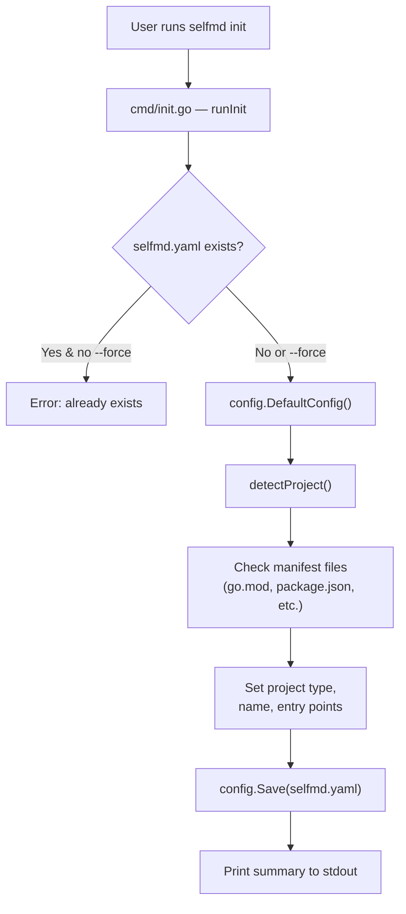
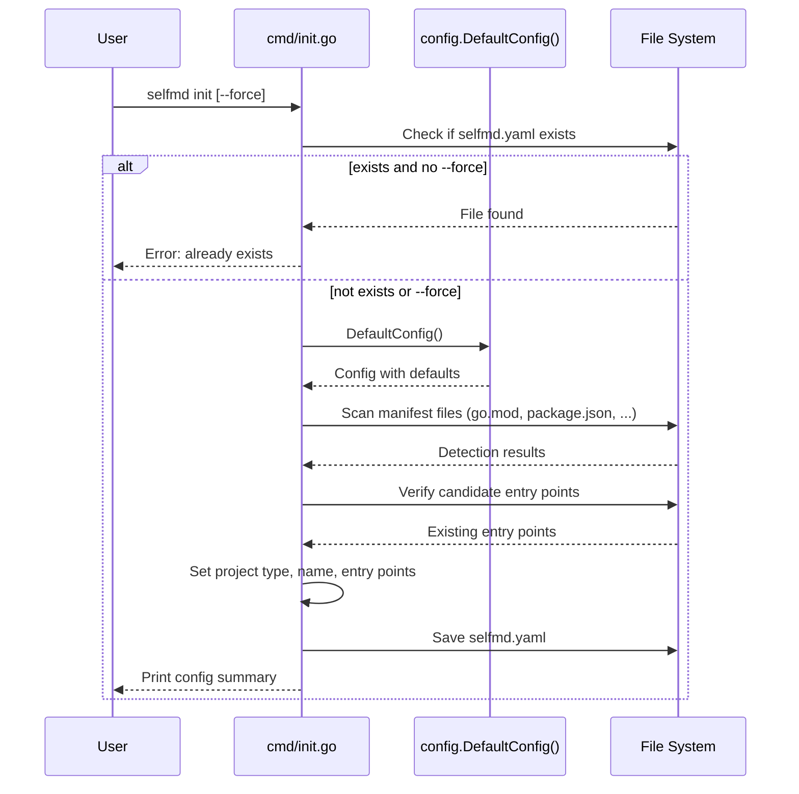

# Initialization

Setting up a selfmd project by generating a `selfmd.yaml` configuration file with automatic project detection.

## Overview

Before selfmd can generate documentation for your project, it needs a configuration file (`selfmd.yaml`) that describes the project structure, output preferences, and Claude settings. The **initialization** step creates this file automatically.

The `selfmd init` command scans your current working directory, detects the project type (e.g., backend, frontend, fullstack), identifies likely entry points, and writes a fully populated `selfmd.yaml` with sensible defaults. This gives you a working starting point that you can then customize before running the documentation generator.

Key concepts:

- **Project detection** — selfmd inspects well-known manifest files (`go.mod`, `package.json`, `Cargo.toml`, etc.) to classify your project and locate entry points.
- **Default config** — All configuration fields are pre-filled with defaults so the generated file is immediately usable.
- **Safe by default** — Running `init` when a config file already exists will fail unless you pass `--force`.

## Architecture



## Initialization Process

### Step 1: Safety Check

Before writing anything, the command checks whether `selfmd.yaml` already exists at the configured path (default: `selfmd.yaml` in the current directory). If the file exists and `--force` is not set, the command exits with an error to prevent accidental overwrites.

```go
if _, err := os.Stat(cfgFile); err == nil && !forceInit {
    return fmt.Errorf("config file %s already exists, use --force to overwrite", cfgFile)
}
```

> Source: cmd/init.go#L28-L30

### Step 2: Generate Default Configuration

A `Config` struct is populated with default values via `config.DefaultConfig()`. These defaults cover every section of the configuration:

```go
func DefaultConfig() *Config {
    return &Config{
        Project: ProjectConfig{
            Name: filepath.Base(mustGetwd()),
            Type: "backend",
        },
        Targets: TargetsConfig{
            Include: []string{"src/**", "pkg/**", "cmd/**", "internal/**", "lib/**", "app/**"},
            Exclude: []string{
                "vendor/**", "node_modules/**", ".git/**", ".doc-build/**",
                "**/*.pb.go", "**/generated/**", "dist/**", "build/**",
            },
            EntryPoints: []string{},
        },
        Output: OutputConfig{
            Dir:                 ".doc-build",
            Language:            "zh-TW",
            SecondaryLanguages:  []string{},
            CleanBeforeGenerate: false,
        },
        Claude: ClaudeConfig{
            Model:          "sonnet",
            MaxConcurrent:  3,
            TimeoutSeconds: 1800,
            MaxRetries:     2,
            AllowedTools:   []string{"Read", "Glob", "Grep"},
            ExtraArgs:      []string{},
        },
        Git: GitConfig{
            Enabled:    true,
            BaseBranch: "main",
        },
    }
}
```

> Source: internal/config/config.go#L96-L129

### Step 3: Detect Project Type

The `detectProject()` function scans the working directory for known manifest files and maps them to a project type and candidate entry points:

```go
func detectProject() (projectType string, entryPoints []string) {
    checks := []struct {
        file    string
        pType   string
        entries []string
    }{
        {"go.mod", "backend", []string{"main.go", "cmd/root.go"}},
        {"Cargo.toml", "backend", []string{"src/main.rs", "src/lib.rs"}},
        {"package.json", "frontend", []string{"src/index.ts", "src/index.js", "src/main.ts", "src/App.tsx"}},
        {"pom.xml", "backend", []string{"src/main/java"}},
        {"build.gradle", "backend", []string{"src/main/java"}},
        {"requirements.txt", "backend", []string{"main.py", "app.py", "src/main.py"}},
        {"pyproject.toml", "backend", []string{"src/main.py", "main.py"}},
        {"composer.json", "backend", []string{"public/index.php", "src/Kernel.php"}},
        {"Gemfile", "backend", []string{"config/application.rb", "app/"}},
    }

    for _, c := range checks {
        if _, err := os.Stat(c.file); err == nil {
            var found []string
            for _, ep := range c.entries {
                if _, err := os.Stat(ep); err == nil {
                    found = append(found, ep)
                }
            }
            if c.pType == "frontend" {
                if _, err := os.Stat("go.mod"); err == nil {
                    return "fullstack", found
                }
                if _, err := os.Stat("server"); err == nil {
                    return "fullstack", found
                }
            }
            return c.pType, found
        }
    }

    return "library", nil
}
```

> Source: cmd/init.go#L60-L98

The detection logic supports these project types:

| Manifest File | Detected Type | Candidate Entry Points |
|---|---|---|
| `go.mod` | backend | `main.go`, `cmd/root.go` |
| `Cargo.toml` | backend | `src/main.rs`, `src/lib.rs` |
| `package.json` | frontend | `src/index.ts`, `src/index.js`, `src/main.ts`, `src/App.tsx` |
| `pom.xml` | backend | `src/main/java` |
| `build.gradle` | backend | `src/main/java` |
| `requirements.txt` | backend | `main.py`, `app.py`, `src/main.py` |
| `pyproject.toml` | backend | `src/main.py`, `main.py` |
| `composer.json` | backend | `public/index.php`, `src/Kernel.php` |
| `Gemfile` | backend | `config/application.rb`, `app/` |
| *(none matched)* | library | *(none)* |

If a `package.json` is found (frontend) **and** either `go.mod` or a `server/` directory also exists, the type is elevated to `fullstack`.

Only entry points that actually exist on disk are included in the final configuration.

### Step 4: Write and Report

The assembled config is serialized to YAML and written to the config file path. A summary is printed to stdout:

```go
cfg.Project.Type = projectType
cfg.Project.Name = filepath.Base(mustCwd())
cfg.Targets.EntryPoints = entryPoints

if err := cfg.Save(cfgFile); err != nil {
    return fmt.Errorf("failed to write config file: %w", err)
}

fmt.Printf("Config file created: %s\n", cfgFile)
fmt.Printf("  Project name: %s\n", cfg.Project.Name)
fmt.Printf("  Project type: %s\n", cfg.Project.Type)
fmt.Printf("  Output dir: %s\n", cfg.Output.Dir)
fmt.Printf("  Doc language: %s\n", cfg.Output.Language)
```

> Source: cmd/init.go#L35-L47

## Core Processes



## Usage Examples

**Basic initialization** in a Go project directory:

```bash
cd my-go-project
selfmd init
```

Expected output:

```
Config file created: selfmd.yaml
  Project name: my-go-project
  Project type: backend
  Output dir: .doc-build
  Doc language: zh-TW
  Entry points: main.go, cmd/root.go

Please edit the config file as needed, then run selfmd generate to generate documentation.
```

**Force overwrite** an existing config:

```bash
selfmd init --force
```

**Use a custom config path** (via the global `--config` flag):

```bash
selfmd --config my-config.yaml init
```

> Source: cmd/init.go#L15-L57, cmd/root.go#L37

## Generated Config Structure

After running `selfmd init`, the generated `selfmd.yaml` contains these sections:

| Section | Key Fields | Purpose |
|---|---|---|
| `project` | `name`, `type`, `description` | Project metadata |
| `targets` | `include`, `exclude`, `entry_points` | Which files to scan for documentation |
| `output` | `dir`, `language`, `secondary_languages` | Output directory and language settings |
| `claude` | `model`, `max_concurrent`, `timeout_seconds` | Claude CLI runner configuration |
| `git` | `enabled`, `base_branch` | Git integration for incremental updates |

The config struct is defined in `internal/config/config.go`:

```go
type Config struct {
    Project ProjectConfig `yaml:"project"`
    Targets TargetsConfig `yaml:"targets"`
    Output  OutputConfig  `yaml:"output"`
    Claude  ClaudeConfig  `yaml:"claude"`
    Git     GitConfig     `yaml:"git"`
}
```

> Source: internal/config/config.go#L11-L17

## Next Steps

After initialization, you should:

1. **Review and edit `selfmd.yaml`** — Adjust the project description, include/exclude patterns, output language, and Claude model as needed.
2. **Run `selfmd generate`** — Execute the full documentation generation pipeline.

## Related Links

- [Installation](../installation/index.md) — How to install the selfmd binary
- [First Run](../first-run/index.md) — Running documentation generation for the first time
- [init Command](../../cli/cmd-init/index.md) — CLI reference for the init command
- [Configuration Overview](../../configuration/config-overview/index.md) — Detailed explanation of all config options
- [Project Targets](../../configuration/project-targets/index.md) — Configuring include/exclude patterns and entry points

## Reference Files

| File Path | Description |
|-----------|-------------|
| `cmd/init.go` | init command implementation and project detection logic |
| `cmd/root.go` | Root command definition and global flags |
| `cmd/generate.go` | Generate command (shows config loading flow) |
| `internal/config/config.go` | Config struct definitions, defaults, loading, saving, and validation |
| `selfmd.yaml` | Example of a real project configuration file |
| `go.mod` | Module definition confirming project structure |