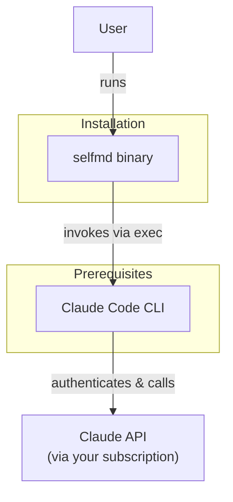
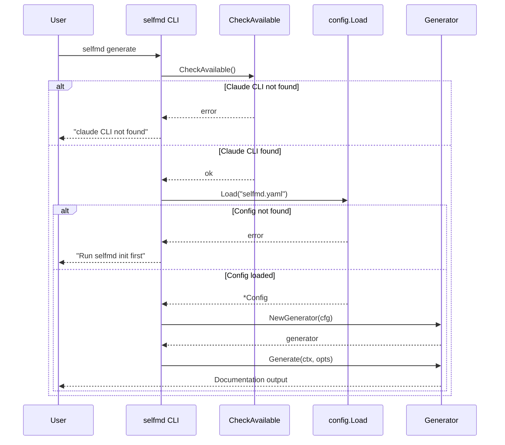

# Installation

SelfMD is distributed as a single pre-built binary with no external dependencies other than the Claude Code CLI. This page covers all supported platforms, installation methods, and verification steps.

## Overview

SelfMD is a standalone Go binary that orchestrates documentation generation by invoking the [Claude Code CLI](https://code.claude.com/docs/en/overview) as a subprocess. Because of this architecture, the installation process involves two parts:

1. **Installing the prerequisite** — Claude Code CLI must be installed and available in your system `PATH`
2. **Installing SelfMD itself** — Download a pre-built binary or build from source

No server, database, Docker, or additional runtime is required. Once the binary is in your `PATH`, you can run `selfmd` from any project directory.

## Architecture



SelfMD calls the `claude` command-line executable using Go's `os/exec` package. The `CheckAvailable` function verifies that the CLI exists in the system `PATH` before any generation run begins:

```go
// CheckAvailable verifies that the claude CLI is installed and accessible.
func CheckAvailable() error {
	_, err := exec.LookPath("claude")
	if err != nil {
		return fmt.Errorf("claude CLI not found. Please install Claude Code: https://docs.anthropic.com/en/docs/claude-code")
	}
	return nil
}
```

> Source: internal/claude/runner.go#L146-L152

## Prerequisites

Before installing SelfMD, ensure the following is in place:

| Requirement | Details |
|-------------|---------|
| **Claude Code CLI** | Must be installed and available in your `PATH`. See [Claude Code documentation](https://code.claude.com/docs/en/overview) for installation instructions. |
| **Active Claude Subscription** | SelfMD uses your existing Claude Pro / Max subscription through the Claude Code CLI. No separate API key is needed. |
| **Git** (optional) | Required if you want to use incremental updates (`selfmd update`) or git-based change detection. |

## Supported Platforms

SelfMD provides pre-built binaries for the following platforms and architectures:

| Platform | Architecture | Binary Name |
|----------|-------------|-------------|
| macOS | Apple Silicon (arm64) | `selfmd-macos-arm64` |
| macOS | Intel (amd64) | `selfmd-macos-amd64` |
| Linux | arm64 | `selfmd-linux-arm64` |
| Linux | amd64 | `selfmd-linux-amd64` |
| Windows | arm64 | `selfmd-windows-arm64.exe` |
| Windows | amd64 | `selfmd-windows-amd64.exe` |

## Installation Methods

### Method 1: Download Pre-Built Binary (Recommended)

Download the latest binary for your platform from the [Releases](https://github.com/monkenWu/selfmd-claude-code/releases) page.

#### macOS / Linux

```bash
# macOS / Linux: make it executable, rename, and move to PATH
chmod +x selfmd-macos-arm64
sudo mv selfmd-macos-arm64 /usr/local/bin/selfmd
```

> Source: README.md#L48-L51

Replace `selfmd-macos-arm64` with the correct binary name for your platform (e.g., `selfmd-linux-amd64` for Linux on x86_64).

#### Windows (PowerShell)

```powershell
# Windows (PowerShell): create a directory, move the binary, and add to PATH
mkdir "$env:USERPROFILE\selfmd"
Rename-Item selfmd-windows-amd64.exe selfmd.exe
Move-Item selfmd.exe "$env:USERPROFILE\selfmd\selfmd.exe"
[Environment]::SetEnvironmentVariable("Path", "$env:Path;$env:USERPROFILE\selfmd", "User")
```

> Source: README.md#L53-L59

#### Windows (CMD)

```cmd
:: Windows (CMD): create a directory, move the binary, and add to PATH
mkdir "%USERPROFILE%\selfmd"
ren selfmd-windows-amd64.exe selfmd.exe
move selfmd.exe "%USERPROFILE%\selfmd\selfmd.exe"
setx Path "%Path%;%USERPROFILE%\selfmd"
```

> Source: README.md#L61-L67

### Method 2: Build from Source

Building from source requires **Go 1.25 or later**.

```bash
# Clone the repository
git clone https://github.com/monkenWu/selfmd-claude-code.git
cd selfmd-claude-code

# Build the binary
go build -o selfmd .

# Move to PATH (optional)
sudo mv selfmd /usr/local/bin/selfmd
```

The entry point is `main.go`, which delegates to the Cobra-based command router:

```go
package main

import (
	"os"

	"github.com/monkenwu/selfmd/cmd"
)

func main() {
	if err := cmd.Execute(); err != nil {
		os.Exit(1)
	}
}
```

> Source: main.go#L1-L13

## Verifying the Installation

After installation, verify that both prerequisites are working:

```bash
# Verify selfmd is accessible
selfmd --help

# Verify Claude Code CLI is accessible
claude --version
```

A successful `selfmd --help` invocation will display the CLI banner and available commands:

```go
var rootCmd = &cobra.Command{
	Use:   "selfmd",
	Short: "selfmd — Auto Documentation Generator for Claude Code CLI",
	Long: banner + `Automatically generate structured, high-quality technical documentation
for any codebase — powered by Claude Code CLI.`,
}
```

> Source: cmd/root.go#L25-L30

### Global Flags

The root command provides these global flags available to all subcommands:

```go
func init() {
	rootCmd.PersistentFlags().StringVarP(&cfgFile, "config", "c", "selfmd.yaml", "config file path")
	rootCmd.PersistentFlags().BoolVarP(&verbose, "verbose", "v", false, "enable verbose output")
	rootCmd.PersistentFlags().BoolVarP(&quiet, "quiet", "q", false, "show errors only")
}
```

> Source: cmd/root.go#L36-L40

| Flag | Short | Default | Description |
|------|-------|---------|-------------|
| `--config` | `-c` | `selfmd.yaml` | Path to the configuration file |
| `--verbose` | `-v` | `false` | Enable debug-level output |
| `--quiet` | `-q` | `false` | Show errors only |

## Core Processes

The following sequence shows what happens when a user first runs `selfmd generate` after installation, illustrating how the CLI availability check fits into the startup flow:



## Troubleshooting

| Problem | Cause | Solution |
|---------|-------|----------|
| `claude CLI not found` | Claude Code CLI is not installed or not in `PATH` | Install Claude Code CLI and ensure the `claude` command is accessible from your terminal |
| `selfmd: command not found` | Binary not in `PATH` | Move the binary to a directory in your `PATH` (e.g., `/usr/local/bin/`) or add its directory to `PATH` |
| `permission denied` | Binary lacks execute permission (macOS/Linux) | Run `chmod +x selfmd` |
| `config file selfmd.yaml already exists` | Running `init` in a previously initialized project | Use `selfmd init --force` to overwrite, or edit the existing file |

## Related Links

- [Initialization](../init/index.md) — Set up `selfmd.yaml` in your project after installation
- [First Run](../first-run/index.md) — Generate your first documentation site
- [Configuration Overview](../../configuration/config-overview/index.md) — Detailed explanation of all configuration options
- [CLI Commands](../../cli/index.md) — Complete reference for all available commands
- [Claude Settings](../../configuration/claude-config/index.md) — Configure the Claude CLI integration

## Reference Files

| File Path | Description |
|-----------|-------------|
| `main.go` | Application entry point |
| `cmd/root.go` | Root command definition and global flags |
| `cmd/init.go` | Init command with project type detection |
| `cmd/generate.go` | Generate command with CLI availability check |
| `internal/claude/runner.go` | Claude CLI runner with `CheckAvailable` function |
| `internal/config/config.go` | Configuration struct definitions and defaults |
| `go.mod` | Go module definition and dependencies |
| `selfmd.yaml` | Example configuration file |
| `README.md` | Project README with installation instructions |