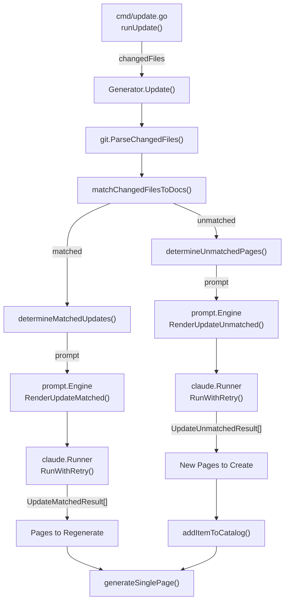
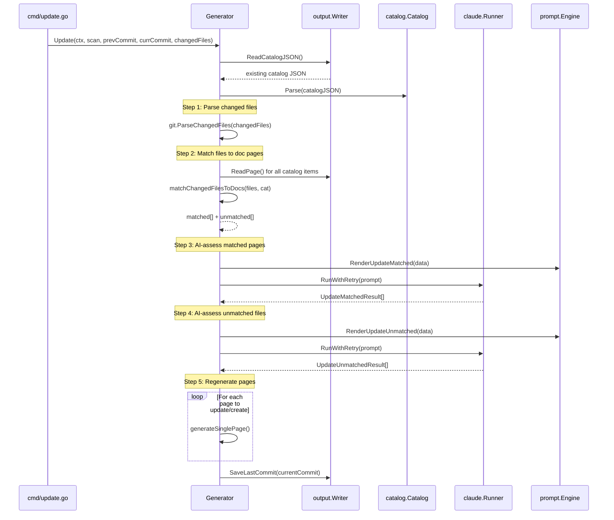

# Affected Page Matching

When source code changes, selfmd determines which existing documentation pages are affected and whether new pages need to be created — this is the core intelligence behind incremental updates.

## Overview

Affected Page Matching is the decision-making layer of the `selfmd update` workflow. After git change detection identifies which source files have been modified, this subsystem is responsible for:

- **Matching changed files to existing doc pages** — by scanning page content for file path references
- **Consulting Claude to confirm regeneration need** — using an AI-driven assessment to avoid unnecessary rebuilds
- **Identifying unmatched files** — changed files not referenced in any documentation page
- **Determining if new pages are needed** — asking Claude whether unmatched files warrant new documentation entries

This two-phase approach (matched + unmatched) ensures that documentation stays in sync with code while minimizing wasted regeneration.

## Architecture



## Core Data Structures

The matching system operates on two key result types that capture Claude's decisions:

```go
// UpdateMatchedResult represents a page that Claude determined needs regeneration.
type UpdateMatchedResult struct {
	CatalogPath string `json:"catalogPath"`
	Title       string `json:"title"`
	Reason      string `json:"reason"`
}

// UpdateUnmatchedResult represents a new page that Claude determined should be created.
type UpdateUnmatchedResult struct {
	CatalogPath string `json:"catalogPath"`
	Title       string `json:"title"`
	Reason      string `json:"reason"`
}
```

> Source: internal/generator/updater.go#L18-L29

The intermediate matching structure links changed files to the documentation pages that reference them:

```go
// matchResult holds the mapping between changed files and the doc pages that reference them.
type matchResult struct {
	// changedFile is the source file path that changed
	changedFile string
	// pages are the doc pages that reference this file
	pages []catalog.FlatItem
}
```

> Source: internal/generator/updater.go#L168-L174

## Matching Process

### Phase 1: Content-Based File Matching

The `matchChangedFilesToDocs` method performs a string-search match between changed file paths and existing documentation page content. For every changed file, it scans all flattened catalog pages to find which ones contain a reference to that file path.

```go
func (g *Generator) matchChangedFilesToDocs(files []git.ChangedFile, cat *catalog.Catalog) (matched []matchResult, unmatched []string) {
	items := cat.Flatten()

	// Pre-read all page contents
	pageContents := make(map[string]string) // key: item.Path, value: page content
	for _, item := range items {
		content, err := g.Writer.ReadPage(item)
		if err != nil {
			continue
		}
		pageContents[item.Path] = content
	}

	// For each changed file, find which pages reference it
	for _, f := range files {
		var matchedPages []catalog.FlatItem
		for _, item := range items {
			content, ok := pageContents[item.Path]
			if !ok {
				continue
			}
			if strings.Contains(content, f.Path) {
				matchedPages = append(matchedPages, item)
			}
		}

		if len(matchedPages) > 0 {
			matched = append(matched, matchResult{
				changedFile: f.Path,
				pages:       matchedPages,
			})
		} else {
			unmatched = append(unmatched, f.Path)
		}
	}

	return matched, unmatched
}
```

> Source: internal/generator/updater.go#L177-L213

The matching logic works as follows:

1. **Flatten the catalog** — convert the hierarchical catalog tree into a flat list of `FlatItem` entries
2. **Pre-read all pages** — load every existing documentation page's markdown content into memory
3. **String search** — for each changed file, check if its path string appears anywhere in the page content
4. **Partition** — files with at least one matching page go into `matched`; files with no matches go into `unmatched`

This approach leverages the fact that selfmd-generated documentation pages include `> Source:` annotations with file paths, making string matching a reliable heuristic.

### Phase 2: AI-Driven Regeneration Decision (Matched Files)

After identifying which pages reference the changed files, `determineMatchedUpdates` asks Claude to decide which of those pages actually need to be regenerated.

```go
func (g *Generator) determineMatchedUpdates(ctx context.Context, matched []matchResult, cat *catalog.Catalog) ([]catalog.FlatItem, error) {
	// Build changed files list
	var changedFilesList strings.Builder
	for _, m := range matched {
		changedFilesList.WriteString(fmt.Sprintf("- `%s`\n", m.changedFile))
	}

	// Build affected pages info (deduplicated)
	seenPages := make(map[string]bool)
	var affectedPagesInfo strings.Builder
	for _, m := range matched {
		for _, page := range m.pages {
			if seenPages[page.Path] {
				continue
			}
			seenPages[page.Path] = true

			summary := ""
			content, err := g.Writer.ReadPage(page)
			if err == nil && len(content) > 500 {
				summary = content[:500] + "..."
			} else if err == nil {
				summary = content
			}

			affectedPagesInfo.WriteString(fmt.Sprintf("### %s (catalogPath: %s)\n", page.Title, page.Path))
			affectedPagesInfo.WriteString("Referenced changed files: ")
			for _, m2 := range matched {
				for _, p := range m2.pages {
					if p.Path == page.Path {
						affectedPagesInfo.WriteString(fmt.Sprintf("`%s` ", m2.changedFile))
					}
				}
			}
			affectedPagesInfo.WriteString("\n")
			affectedPagesInfo.WriteString(fmt.Sprintf("Summary:\n%s\n\n", summary))
		}
	}

	data := prompt.UpdateMatchedPromptData{
		RepositoryName: g.Config.Project.Name,
		Language:       g.Config.Output.Language,
		ChangedFiles:   changedFilesList.String(),
		AffectedPages:  affectedPagesInfo.String(),
	}

	rendered, err := g.Engine.RenderUpdateMatched(data)
	// ...
}
```

> Source: internal/generator/updater.go#L217-L262

The prompt template instructs Claude to be **conservative** — only flagging pages for regeneration when changes genuinely affect the behavior, architecture, or API described in the documentation. Claude reads the actual changed source files and compares them against page summaries before making a judgment.

### Phase 3: AI-Driven New Page Decision (Unmatched Files)

For files not referenced by any existing page, `determineUnmatchedPages` asks Claude whether new documentation pages should be created.

```go
func (g *Generator) determineUnmatchedPages(ctx context.Context, unmatchedFiles []string, cat *catalog.Catalog) ([]UpdateUnmatchedResult, error) {
	var fileList strings.Builder
	for _, f := range unmatchedFiles {
		fileList.WriteString(fmt.Sprintf("- `%s`\n", f))
	}

	existingCatalog, err := cat.ToJSON()
	if err != nil {
		return nil, err
	}

	data := prompt.UpdateUnmatchedPromptData{
		RepositoryName:  g.Config.Project.Name,
		Language:        g.Config.Output.Language,
		UnmatchedFiles:  fileList.String(),
		ExistingCatalog: existingCatalog,
		CatalogTable:    cat.BuildLinkTable(),
	}

	rendered, err := g.Engine.RenderUpdateUnmatched(data)
	// ...
}
```

> Source: internal/generator/updater.go#L309-L329

Claude is provided the full existing catalog structure and link table, allowing it to determine whether unmatched files should be placed under an existing section or constitute an entirely new section.

## Core Processes

The following sequence shows the complete flow from receiving changed files to producing updated documentation:



## Catalog Expansion for New Pages

When Claude determines that new pages should be created from unmatched files, the `addItemToCatalog` function inserts them into the catalog tree. It supports arbitrary nesting via dot-notation paths (e.g., `core-modules.new-feature`).

A noteworthy edge case is **leaf-to-parent promotion**: when a new page must be added as a child of an existing leaf node, that leaf is promoted to a parent by automatically creating an `overview` child that preserves the original content.

```go
func addItemToCatalog(cat *catalog.Catalog, catalogPath, title string) *promotedLeaf {
	parts := strings.Split(catalogPath, ".")
	var promoted *promotedLeaf
	addItemToChildren(&cat.Items, parts, title, "", &promoted)
	return promoted
}
```

> Source: internal/generator/updater.go#L372-L377

```go
type promotedLeaf struct {
	OriginalPath  string
	OverviewPath  string
	OriginalTitle string
}
```

> Source: internal/generator/updater.go#L360-L367

## Claude Prompt Templates

Two specialized prompt templates drive the AI decision-making:

### update_matched.tmpl

Used for pages that reference changed files. Key instructions to Claude:

- **Read the actual changed source files** before making a judgment
- Be conservative — only mark pages when changes affect documented behavior, architecture, or API
- Pure style changes, internal refactoring, or bug fixes with unchanged behavior do not need regeneration
- Return a JSON array of `{catalogPath, title, reason}` objects

### update_unmatched.tmpl

Used for files not referenced in existing documentation. Key instructions to Claude:

- Read each unmatched source file to understand its functionality
- Only create new pages for entirely new modules, significant API groups, new architectural components, or important configuration mechanisms
- Helper files, tests, bug fixes, and files that logically belong to an existing page's scope do not need new pages
- Return a JSON array of `{catalogPath, title, reason}` objects with proper catalog placement

Both templates enforce that Claude must **only judge, not generate content** — actual page content is generated separately in the content phase.

## Integration with the Update Pipeline

The affected page matching logic sits at the center of the `selfmd update` command's four-step pipeline:

| Step | Description | Implementation |
|------|-------------|----------------|
| 1 | Parse changed files into structured list | `git.ParseChangedFiles()` |
| 2 | Match changed files to existing doc pages | `matchChangedFilesToDocs()` |
| 3 | AI-determine which matched pages need regeneration | `determineMatchedUpdates()` |
| 4 | AI-determine if new pages are needed for unmatched files | `determineUnmatchedPages()` |

The upstream `cmd/update.go` handles git diff retrieval and glob filtering before passing changed files to this subsystem. The downstream content generation phase (`generateSinglePage`) handles the actual page writing.

## Related Links

- [Git Integration](../index.md)
- [Change Detection](../change-detection/index.md)
- [Incremental Update Engine](../../core-modules/incremental-update/index.md)
- [Documentation Generator](../../core-modules/generator/index.md)
- [Content Phase](../../core-modules/generator/content-phase/index.md)
- [Catalog Manager](../../core-modules/catalog/index.md)
- [Prompt Engine](../../core-modules/prompt-engine/index.md)
- [Claude Runner](../../core-modules/claude-runner/index.md)
- [update Command](../../cli/cmd-update/index.md)
- [Git Integration Settings](../../configuration/git-config/index.md)

## Reference Files

| File Path | Description |
|-----------|-------------|
| `internal/generator/updater.go` | Core matching logic, AI decision methods, catalog expansion |
| `internal/git/git.go` | Git operations: changed file retrieval, parsing, glob filtering |
| `internal/catalog/catalog.go` | Catalog data structures, Flatten(), BuildLinkTable() |
| `internal/prompt/engine.go` | Prompt template engine and data structures for matched/unmatched prompts |
| `internal/prompt/templates/en-US/update_matched.tmpl` | Claude prompt for determining which matched pages need regeneration |
| `internal/prompt/templates/en-US/update_unmatched.tmpl` | Claude prompt for determining if new pages are needed |
| `internal/generator/pipeline.go` | Generator struct definition and full generation pipeline |
| `internal/config/config.go` | GitConfig and TargetsConfig for include/exclude patterns |
| `internal/output/writer.go` | ReadPage, ReadCatalogJSON, SaveLastCommit operations |
| `cmd/update.go` | CLI update command — orchestrates the incremental update flow |