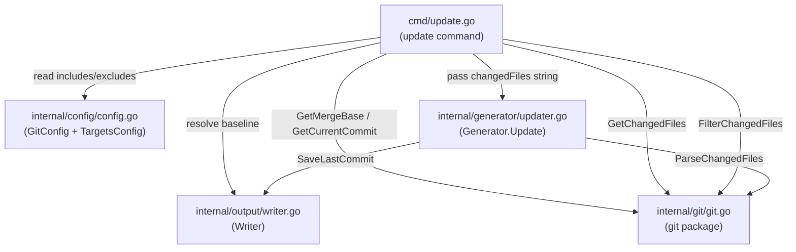
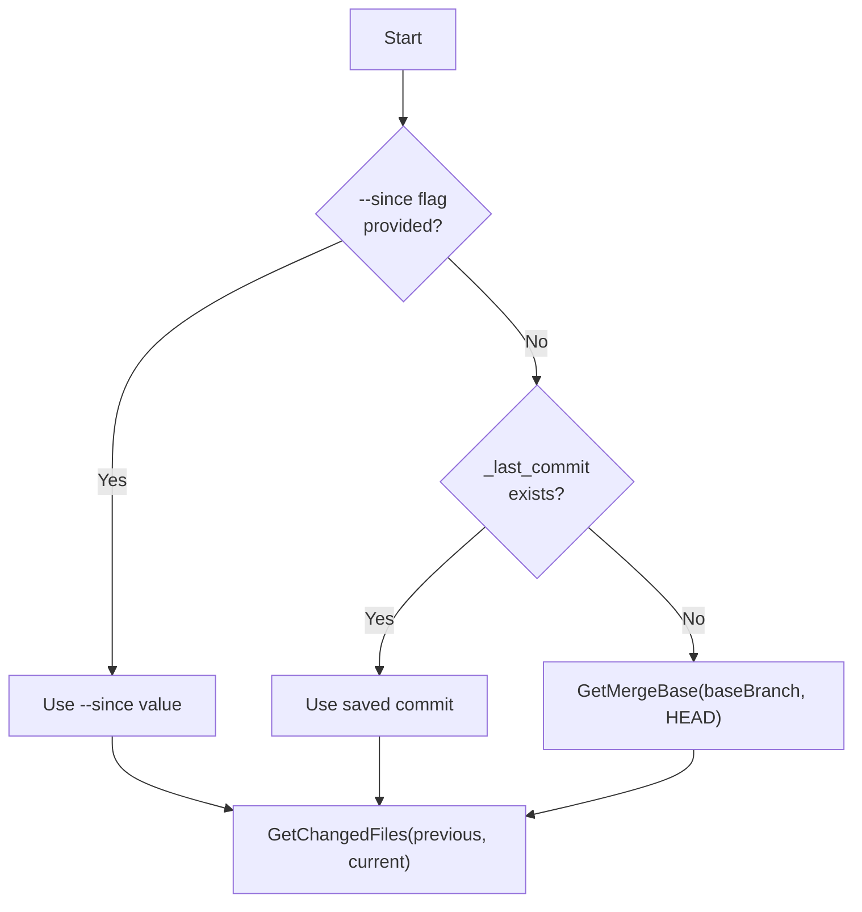
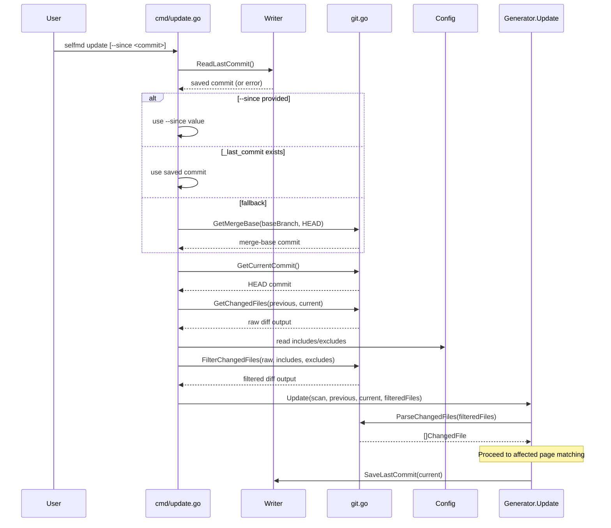

# Change Detection

The change detection subsystem identifies which source files have been modified between two git commits, forming the foundation for incremental documentation updates.

## Overview

Change detection is the first stage of the incremental update pipeline. It answers a single question: **which files changed since the last documentation build?** The `internal/git` package wraps low-level `git diff` commands, parses their output into structured data, and applies configurable include/exclude glob filters. The result is a filtered list of changed files that downstream components use to decide which documentation pages need regeneration.

Key concepts:

- **Comparison baseline** — a commit hash representing the last known documentation state, resolved through a three-tier fallback chain
- **Changed file** — a struct pairing a git status code (`M`, `A`, `D`, `R`) with a file path
- **Glob filtering** — include/exclude patterns (using doublestar syntax) that narrow the diff output to project-relevant source files

## Architecture



## Baseline Commit Resolution

Before computing a diff, the system must determine which commit to compare against. The `update` command implements a three-tier fallback chain:



The resolution logic in `cmd/update.go`:

```go
// Determine comparison commit
previousCommit := sinceCommit
if previousCommit == "" {
    // Try reading saved commit from last generate/update
    saved, readErr := gen.Writer.ReadLastCommit()
    if readErr == nil && saved != "" {
        previousCommit = saved
    } else {
        // Fallback to merge-base
        base, err := git.GetMergeBase(rootDir, cfg.Git.BaseBranch)
        if err != nil {
            return fmt.Errorf("cannot get base commit: %w\nhint: run selfmd generate first or use --since to specify a commit", err)
        }
        previousCommit = base
    }
}
```

> Source: cmd/update.go#L68-L82

| Priority | Source | Description |
|----------|--------|-------------|
| 1 | `--since` CLI flag | Explicit commit hash provided by the user |
| 2 | `_last_commit` file | Persisted by the previous `generate` or `update` run via `Writer.SaveLastCommit()` |
| 3 | `git merge-base` | Computed from `GitConfig.BaseBranch` and `HEAD` |

## Core Git Operations

The `internal/git` package exposes a small set of functions that wrap `git` CLI commands. All functions accept a `dir` parameter to set the working directory for the subprocess.

### Repository Detection

```go
// IsGitRepo checks if the given directory is a git repository.
func IsGitRepo(dir string) bool {
    cmd := exec.Command("git", "rev-parse", "--is-inside-work-tree")
    cmd.Dir = dir
    err := cmd.Run()
    return err == nil
}
```

> Source: internal/git/git.go#L13-L18

### Commit Retrieval

```go
// GetCurrentCommit returns the current HEAD commit hash.
func GetCurrentCommit(dir string) (string, error) {
    return runGit(dir, "rev-parse", "HEAD")
}

// GetMergeBase finds the merge base between the current branch and the given base branch.
func GetMergeBase(dir, baseBranch string) (string, error) {
    return runGit(dir, "merge-base", baseBranch, "HEAD")
}
```

> Source: internal/git/git.go#L21-L28

### Diff Computation

Two functions retrieve changed files. Both use `--relative` so paths are relative to the working directory rather than the git repo root.

```go
// GetChangedFiles returns the list of changed files between two commits.
func GetChangedFiles(dir, fromCommit, toCommit string) (string, error) {
    return runGit(dir, "diff", "--relative", "--name-status", fromCommit+".."+toCommit)
}

// GetChangedFilesSince returns changed files since the given commit.
func GetChangedFilesSince(dir, sinceCommit string) (string, error) {
    return runGit(dir, "diff", "--relative", "--name-status", sinceCommit+"..HEAD")
}
```

> Source: internal/git/git.go#L30-L40

## Parsing Changed Files

The raw `git diff --name-status` output is a newline-separated string of tab-delimited records. `ParseChangedFiles` converts this into a typed `[]ChangedFile` slice.

```go
// ChangedFile represents a single file from git diff --name-status output.
type ChangedFile struct {
    Status string // "M", "A", "D", "R"
    Path   string
}

// ParseChangedFiles parses git diff --name-status output into structured ChangedFile list.
func ParseChangedFiles(changedFiles string) []ChangedFile {
    var result []ChangedFile
    for _, line := range strings.Split(changedFiles, "\n") {
        line = strings.TrimSpace(line)
        if line == "" {
            continue
        }
        parts := strings.SplitN(line, "\t", 3)
        if len(parts) < 2 {
            continue
        }
        status := string(parts[0][0]) // "M", "A", "D", or "R" (R100 → R)
        path := parts[len(parts)-1]   // for renames, use destination path
        result = append(result, ChangedFile{Status: status, Path: path})
    }
    return result
}
```

> Source: internal/git/git.go#L47-L70

| Status Code | Meaning | Path Used |
|-------------|---------|-----------|
| `M` | Modified | File path |
| `A` | Added | File path |
| `D` | Deleted | File path |
| `R` | Renamed | Destination path (last tab-separated field) |

## Glob Filtering

Before changed files are passed to the update engine, they are filtered through the project's `targets.include` and `targets.exclude` glob patterns. This ensures that files outside the documentation scope (e.g., `vendor/`, `node_modules/`, generated code) are excluded.

```go
// FilterChangedFiles filters git diff --name-status output using include/exclude glob patterns.
func FilterChangedFiles(changedFiles string, includes, excludes []string) string {
    lines := strings.Split(changedFiles, "\n")
    var filtered []string

    for _, line := range lines {
        line = strings.TrimSpace(line)
        if line == "" {
            continue
        }

        parts := strings.SplitN(line, "\t", 3)
        if len(parts) < 2 {
            continue
        }

        // For renames, check the destination path (last element)
        filePath := parts[len(parts)-1]

        // Check excludes
        excluded := false
        for _, pattern := range excludes {
            if matched, _ := doublestar.Match(pattern, filePath); matched {
                excluded = true
                break
            }
        }
        if excluded {
            continue
        }

        // Check includes (if configured)
        if len(includes) > 0 {
            included := false
            for _, pattern := range includes {
                if matched, _ := doublestar.Match(pattern, filePath); matched {
                    included = true
                    break
                }
            }
            if !included {
                continue
            }
        }

        filtered = append(filtered, line)
    }

    return strings.Join(filtered, "\n")
}
```

> Source: internal/git/git.go#L72-L122

The filtering logic follows these rules:

1. **Exclude first** — if any exclude pattern matches, the file is dropped immediately
2. **Include second** — if include patterns are configured, the file must match at least one to be kept
3. **Empty includes** — if no include patterns are defined, all non-excluded files pass through

Patterns use the [doublestar](https://github.com/bmatcuk/doublestar) library, which supports `**` for recursive directory matching (e.g., `vendor/**`, `**/*.pb.go`).

## End-to-End Flow



## Commit Persistence

Both the `generate` and `update` pipelines persist the current commit hash after completing their work. This ensures the next `update` run has an accurate baseline.

In the `generate` pipeline:

```go
// Save current commit for incremental updates
if git.IsGitRepo(g.RootDir) {
    if commit, err := git.GetCurrentCommit(g.RootDir); err == nil {
        if err := g.Writer.SaveLastCommit(commit); err != nil {
            g.Logger.Warn("failed to save commit record", "error", err)
        }
    }
}
```

> Source: internal/generator/pipeline.go#L163-L169

In the `update` pipeline:

```go
// Save current commit for next incremental update
if err := g.Writer.SaveLastCommit(currentCommit); err != nil {
    g.Logger.Warn("failed to save commit record", "error", err)
}
```

> Source: internal/generator/updater.go#L160-L162

The commit is written to `_last_commit` inside the output directory:

```go
// SaveLastCommit saves the current commit hash for incremental updates.
func (w *Writer) SaveLastCommit(commit string) error {
    return w.WriteFile("_last_commit", commit)
}

// ReadLastCommit reads the saved commit hash.
func (w *Writer) ReadLastCommit() (string, error) {
    path := filepath.Join(w.BaseDir, "_last_commit")
    data, err := os.ReadFile(path)
    if err != nil {
        return "", fmt.Errorf("failed to read last commit: %w", err)
    }
    return strings.TrimSpace(string(data)), nil
}
```

> Source: internal/output/writer.go#L129-L142

## Configuration

Change detection is controlled by two configuration sections in `selfmd.yaml`:

### Git Settings

```yaml
git:
    enabled: true
    base_branch: develop
```

> Source: selfmd.yaml#L40-L42

The corresponding struct:

```go
type GitConfig struct {
    Enabled    bool   `yaml:"enabled"`
    BaseBranch string `yaml:"base_branch"`
}
```

> Source: internal/config/config.go#L91-L94

| Field | Default | Description |
|-------|---------|-------------|
| `enabled` | `true` | Whether git integration is active |
| `base_branch` | `main` | Branch used for `merge-base` fallback when no saved commit exists |

### Target Filters

The same `targets.include` and `targets.exclude` patterns used for project scanning are reused to filter changed files:

```yaml
targets:
    include:
        - src/**
        - pkg/**
        - cmd/**
        - internal/**
        - lib/**
        - app/**
    exclude:
        - vendor/**
        - node_modules/**
        - .git/**
        - .doc-build/**
        - '**/*.pb.go'
        - '**/generated/**'
        - dist/**
        - build/**
```

> Source: selfmd.yaml#L5-L22

## Related Links

- [Git Integration](../index.md)
- [Affected Page Matching](../affected-pages/index.md)
- [update Command](../../cli/cmd-update/index.md)
- [Git Integration Settings](../../configuration/git-config/index.md)
- [Incremental Update Engine](../../core-modules/incremental-update/index.md)
- [Project Targets](../../configuration/project-targets/index.md)

## Reference Files

| File Path | Description |
|-----------|-------------|
| `internal/git/git.go` | Core git operations: diff, parse, filter, merge-base |
| `cmd/update.go` | Update command with baseline commit resolution logic |
| `internal/generator/updater.go` | Incremental update engine consuming parsed changed files |
| `internal/generator/pipeline.go` | Full generation pipeline with commit persistence |
| `internal/config/config.go` | `GitConfig` and `TargetsConfig` struct definitions |
| `internal/output/writer.go` | `SaveLastCommit` / `ReadLastCommit` for commit hash persistence |
| `selfmd.yaml` | Project configuration with git and target filter settings |