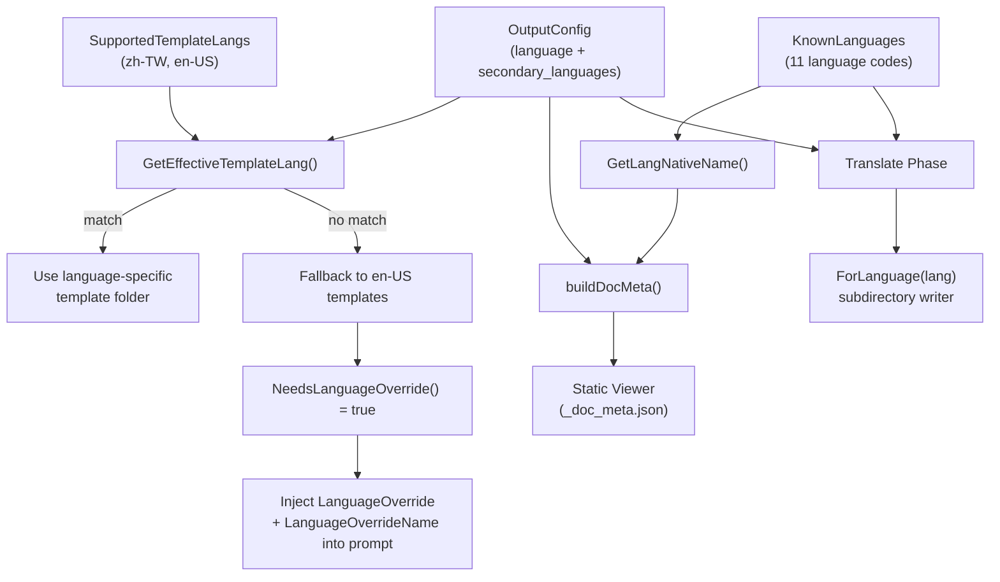
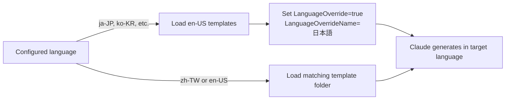
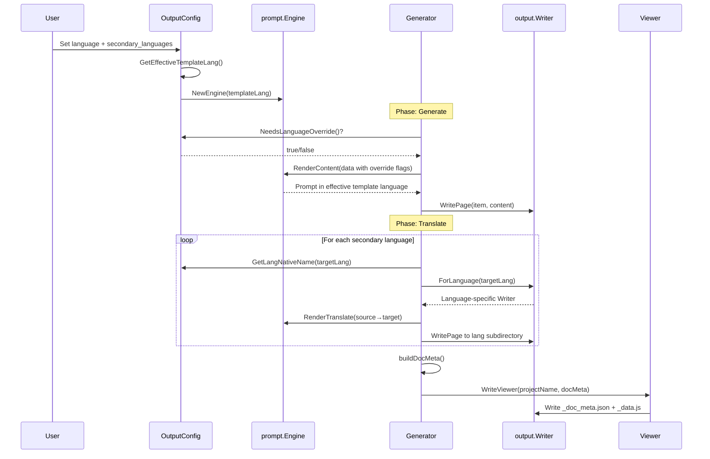

# Supported Languages

selfmd provides built-in support for 11 languages, enabling documentation generation and translation across a wide range of locales through a two-tier language system.

## Overview

The language support system in selfmd is designed around two core concepts:

- **Known Languages** — A fixed set of language codes with their native display names, used for UI rendering, translation workflows, and viewer metadata.
- **Supported Template Languages** — A subset of known languages that have dedicated prompt template folders. Languages outside this subset fall back to English templates with an explicit language override instruction sent to Claude.

This two-tier approach allows selfmd to generate documentation in any of the 11 known languages while only maintaining prompt templates for the two most commonly used ones (Traditional Chinese and English). Other languages are handled by instructing Claude to produce output in the target language while using the English template structure.

## Architecture



## Known Languages

The `KnownLanguages` map defines all language codes recognized by selfmd, each paired with its native display name:

```go
var KnownLanguages = map[string]string{
	"zh-TW": "繁體中文",
	"zh-CN": "简体中文",
	"en-US": "English",
	"ja-JP": "日本語",
	"ko-KR": "한국어",
	"fr-FR": "Français",
	"de-DE": "Deutsch",
	"es-ES": "Español",
	"pt-BR": "Português",
	"th-TH": "ไทย",
	"vi-VN": "Tiếng Việt",
}
```

> Source: internal/config/config.go#L38-L51

The complete list of supported languages:

| Language Code | Native Name | Region |
|---|---|---|
| `zh-TW` | 繁體中文 | Taiwan |
| `zh-CN` | 简体中文 | China |
| `en-US` | English | United States |
| `ja-JP` | 日本語 | Japan |
| `ko-KR` | 한국어 | South Korea |
| `fr-FR` | Français | France |
| `de-DE` | Deutsch | Germany |
| `es-ES` | Español | Spain |
| `pt-BR` | Português | Brazil |
| `th-TH` | ไทย | Thailand |
| `vi-VN` | Tiếng Việt | Vietnam |

The `GetLangNativeName` helper resolves a language code to its native display name, falling back to the code itself for unrecognized values:

```go
func GetLangNativeName(code string) string {
	if name, ok := KnownLanguages[code]; ok {
		return name
	}
	return code
}
```

> Source: internal/config/config.go#L73-L80

## Template Language System

Only two languages have dedicated prompt template folders:

```go
var SupportedTemplateLangs = []string{"zh-TW", "en-US"}
```

> Source: internal/config/config.go#L53-L54

This means the `internal/prompt/templates/` directory contains:

```
templates/
├── zh-TW/          # Traditional Chinese templates
│   ├── catalog.tmpl
│   ├── content.tmpl
│   ├── updater.tmpl
│   ├── update_matched.tmpl
│   └── update_unmatched.tmpl
├── en-US/          # English templates
│   ├── catalog.tmpl
│   ├── content.tmpl
│   ├── updater.tmpl
│   ├── update_matched.tmpl
│   └── update_unmatched.tmpl
├── translate.tmpl        # Shared: page translation
└── translate_titles.tmpl # Shared: category title translation
```

### Effective Template Resolution

When generating documentation, `GetEffectiveTemplateLang` determines which template folder to load:

```go
func (o *OutputConfig) GetEffectiveTemplateLang() string {
	for _, lang := range SupportedTemplateLangs {
		if o.Language == lang {
			return o.Language
		}
	}
	return "en-US"
}
```

> Source: internal/config/config.go#L56-L65

If the configured primary language (e.g., `ja-JP`) does not have a dedicated template folder, the system falls back to `en-US` templates and activates the language override mechanism.

### Language Override Mechanism

`NeedsLanguageOverride` detects when a fallback is occurring:

```go
func (o *OutputConfig) NeedsLanguageOverride() bool {
	return o.GetEffectiveTemplateLang() != o.Language
}
```

> Source: internal/config/config.go#L67-L71

When an override is needed, both `CatalogPromptData` and `ContentPromptData` carry the override flags so the prompt instructs Claude to produce output in the target language:

```go
data := prompt.ContentPromptData{
	RepositoryName:       g.Config.Project.Name,
	Language:             g.Config.Output.Language,
	LanguageName:         langName,
	LanguageOverride:     g.Config.Output.NeedsLanguageOverride(),
	LanguageOverrideName: langName,
	// ...
}
```

> Source: internal/generator/content_phase.go#L91-L97



## Configuration

Languages are configured in `selfmd.yaml` through the `output` section:

```yaml
output:
    dir: docs
    language: en-US
    secondary_languages: ["zh-TW"]
    clean_before_generate: false
```

> Source: selfmd.yaml#L25-L29

The relevant fields in the `OutputConfig` struct:

```go
type OutputConfig struct {
	Dir                 string   `yaml:"dir"`
	Language            string   `yaml:"language"`
	SecondaryLanguages  []string `yaml:"secondary_languages"`
	CleanBeforeGenerate bool     `yaml:"clean_before_generate"`
}
```

> Source: internal/config/config.go#L31-L36

- **`language`** — The primary language for documentation generation. All content is initially produced in this language.
- **`secondary_languages`** — A list of additional languages for translation. The `selfmd translate` command translates primary-language content into each of these.

The default configuration sets the primary language to `zh-TW` with no secondary languages:

```go
Output: OutputConfig{
	Dir:                 ".doc-build",
	Language:            "zh-TW",
	SecondaryLanguages:  []string{},
	CleanBeforeGenerate: false,
},
```

> Source: internal/config/config.go#L110-L115

## UI String Localization

Navigation pages (index, sidebar, category indexes) use localized UI strings. These are defined per-language in the `UIStrings` map:

```go
var UIStrings = map[string]map[string]string{
	"zh-TW": {
		"techDocs":        "技術文件",
		"catalog":         "目錄",
		"home":            "首頁",
		"sectionContains": "本章節包含以下內容：",
		"autoGenerated":   "本文件由 [selfmd](https://github.com/monkenwu/selfmd) 自動產生",
	},
	"en-US": {
		"techDocs":        "Technical Documentation",
		"catalog":         "Table of Contents",
		"home":            "Home",
		"sectionContains": "This section contains the following:",
		"autoGenerated":   "This documentation was automatically generated by [selfmd](https://github.com/monkenwu/selfmd)",
	},
}
```

> Source: internal/output/navigation.go#L12-L27

The `getUIStrings` function resolves UI strings for a given language, falling back to English:

```go
func getUIStrings(lang string) map[string]string {
	if s, ok := UIStrings[lang]; ok {
		return s
	}
	return UIStrings["en-US"]
}
```

> Source: internal/output/navigation.go#L29-L35

Currently only `zh-TW` and `en-US` have dedicated UI strings. All other languages fall back to English navigation labels.

## Viewer Language Metadata

The documentation viewer receives multi-language metadata through the `DocMeta` and `LangInfo` structs:

```go
type DocMeta struct {
	DefaultLanguage    string     `json:"default_language"`
	AvailableLanguages []LangInfo `json:"available_languages"`
}

type LangInfo struct {
	Code       string `json:"code"`
	NativeName string `json:"native_name"`
	IsDefault  bool   `json:"is_default"`
}
```

> Source: internal/output/writer.go#L13-L23

The `buildDocMeta` method in the generator assembles this metadata from the configuration:

```go
func (g *Generator) buildDocMeta() *output.DocMeta {
	meta := &output.DocMeta{
		DefaultLanguage: g.Config.Output.Language,
		AvailableLanguages: []output.LangInfo{
			{
				Code:       g.Config.Output.Language,
				NativeName: config.GetLangNativeName(g.Config.Output.Language),
				IsDefault:  true,
			},
		},
	}
	for _, lang := range g.Config.Output.SecondaryLanguages {
		meta.AvailableLanguages = append(meta.AvailableLanguages, output.LangInfo{
			Code:       lang,
			NativeName: config.GetLangNativeName(lang),
			IsDefault:  false,
		})
	}
	return meta
}
```

> Source: internal/generator/pipeline.go#L189-L208

This metadata is written to `_doc_meta.json` and bundled into `_data.js`, enabling the static viewer to display a language switcher in the UI.

## Core Processes

The following sequence diagram shows how language settings flow through the generation and translation pipeline:



## Output Directory Structure

Translated content is organized in language-specific subdirectories under the output directory:

```
.doc-build/
├── index.html              # Static viewer
├── app.js                  # Viewer application
├── style.css               # Styles
├── _data.js                # Bundled content (all languages)
├── _doc_meta.json          # Language metadata
├── _catalog.json           # Primary language catalog
├── index.md                # Primary language index
├── _sidebar.md             # Primary language sidebar
├── overview/
│   └── index.md            # Primary language content
├── zh-TW/                  # Secondary language subdirectory
│   ├── _catalog.json       # Translated catalog
│   ├── index.md            # Translated index
│   ├── _sidebar.md         # Translated sidebar
│   └── overview/
│       └── index.md        # Translated content
└── ja-JP/                  # Another secondary language
    └── ...
```

The `ForLanguage` method on `Writer` creates a scoped writer for a language subdirectory:

```go
func (w *Writer) ForLanguage(lang string) *Writer {
	return &Writer{
		BaseDir: filepath.Join(w.BaseDir, lang),
	}
}
```

> Source: internal/output/writer.go#L144-L149

## Usage Examples

### Configuring a Japanese primary language with English translation

```yaml
output:
    language: ja-JP
    secondary_languages: ["en-US"]
```

Since `ja-JP` is not in `SupportedTemplateLangs`, the system will:
1. Load English (`en-US`) prompt templates
2. Set `LanguageOverride: true` and `LanguageOverrideName: "日本語"` in prompts
3. Claude generates content in Japanese using English template structure
4. Running `selfmd translate` translates Japanese docs to English

### Running translation for specific languages

```bash
# Translate to all secondary languages
selfmd translate

# Translate to specific language only
selfmd translate --lang zh-TW

# Force re-translate existing files
selfmd translate --force

# Control concurrency
selfmd translate --concurrency 5
```

### Validating target languages

The translate command validates that requested languages exist in the `secondary_languages` configuration:

```go
for _, l := range translateLangs {
	if !validLangs[l] {
		return fmt.Errorf("language %s is not in secondary_languages list (available: %s)",
			l, strings.Join(cfg.Output.SecondaryLanguages, ", "))
	}
}
```

> Source: cmd/translate.go#L61-L64

## Related Links

- [Internationalization](../index.md)
- [Translation Workflow](../translation-workflow/index.md)
- [Output Language](../../configuration/output-language/index.md)
- [translate Command](../../cli/cmd-translate/index.md)
- [Translate Phase](../../core-modules/generator/translate-phase/index.md)
- [Prompt Engine](../../core-modules/prompt-engine/index.md)
- [Static Viewer](../../core-modules/static-viewer/index.md)
- [Configuration Overview](../../configuration/config-overview/index.md)

## Reference Files

| File Path | Description |
|-----------|-------------|
| `internal/config/config.go` | KnownLanguages map, SupportedTemplateLangs, OutputConfig struct, language helper functions |
| `internal/output/navigation.go` | UIStrings map and navigation generation with language-aware UI strings |
| `internal/output/writer.go` | DocMeta/LangInfo structs, ForLanguage method for language-scoped output |
| `internal/output/viewer.go` | Viewer generation and multi-language data bundling into _data.js |
| `internal/prompt/engine.go` | Prompt template engine with language-specific and shared template loading |
| `internal/prompt/templates/translate.tmpl` | Shared translation prompt template |
| `internal/prompt/templates/translate_titles.tmpl` | Shared category title translation prompt |
| `internal/generator/pipeline.go` | buildDocMeta() method and generation pipeline orchestration |
| `internal/generator/translate_phase.go` | Translation pipeline: translatePages, translateCategoryTitles |
| `internal/generator/content_phase.go` | Content generation with language override data injection |
| `internal/generator/catalog_phase.go` | Catalog generation with language override data injection |
| `cmd/translate.go` | Translate command implementation with language validation |
| `selfmd.yaml` | Project configuration example with language settings |