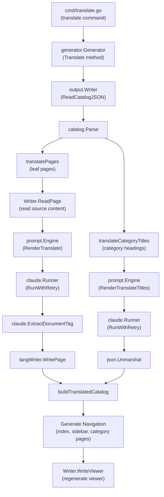
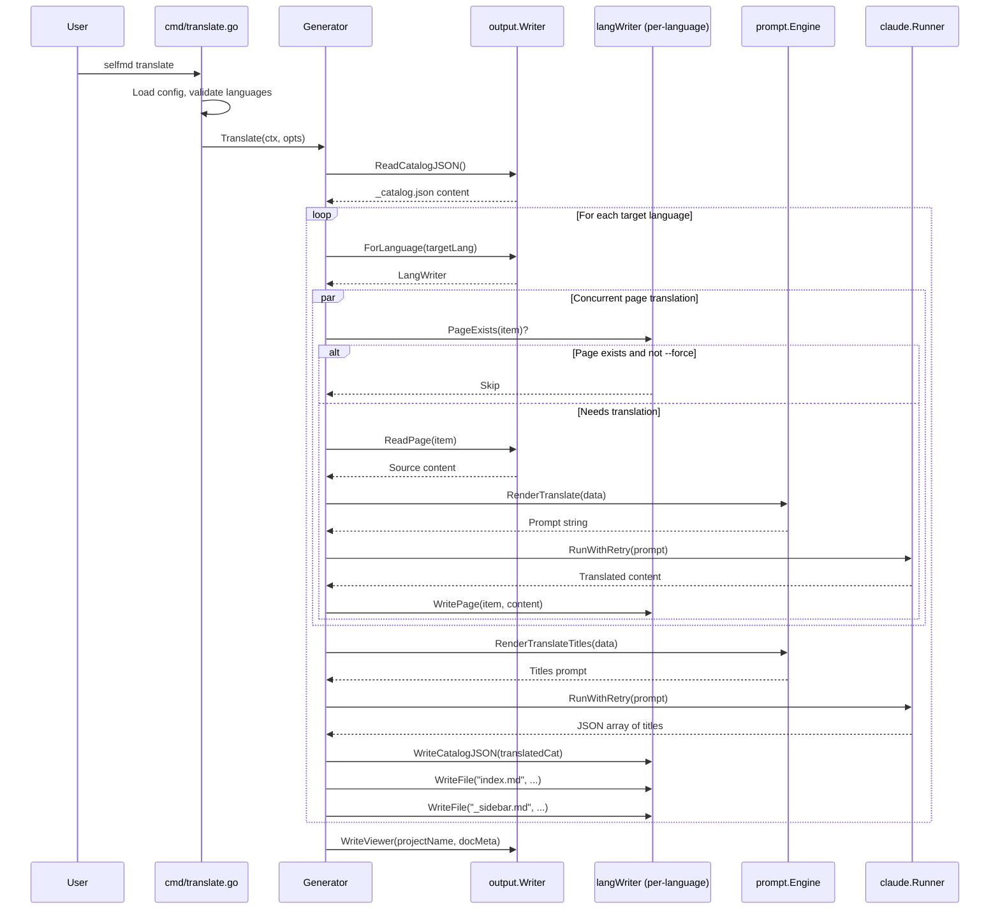

# Translation Workflow

selfmd's translation workflow translates generated documentation from a primary language into one or more secondary languages using Claude AI, producing fully localized documentation sites with translated content, navigation, and catalog structures.

## Overview

The translation workflow is a post-generation phase that takes existing documentation (produced by `selfmd generate`) and translates it into configured secondary languages. It operates independently from the main generation pipeline, allowing translations to be run on-demand or re-run selectively.

Key concepts:

- **Primary language** — The language in which documentation is originally generated, configured via `output.language` in `selfmd.yaml`
- **Secondary languages** — Target languages for translation, configured via `output.secondary_languages`
- **Language-specific Writer** — Each target language gets its own `output.Writer` instance that writes to a subdirectory (e.g., `.doc-build/en-US/`)
- **Incremental translation** — Already-translated pages are skipped by default unless `--force` is specified
- **Concurrent translation** — Multiple pages are translated in parallel using configurable concurrency

## Architecture



## Translation Pipeline

The translation pipeline processes one target language at a time. For each language, it executes the following stages in order:

### Stage 1: Read and Parse Master Catalog

The pipeline begins by reading the master catalog (`_catalog.json`) generated during the primary documentation generation. This catalog defines the complete structure of all documentation pages.

```go
catJSON, err := g.Writer.ReadCatalogJSON()
if err != nil {
    return fmt.Errorf("failed to read catalog (please run selfmd generate first): %w", err)
}

cat, err := catalog.Parse(catJSON)
if err != nil {
    return fmt.Errorf("failed to parse catalog: %w", err)
}

items := cat.Flatten()
sourceLang := g.Config.Output.Language
sourceLangName := config.GetLangNativeName(sourceLang)
```

> Source: internal/generator/translate_phase.go#L33-L46

### Stage 2: Translate Leaf Pages

Leaf pages (pages without children) are translated concurrently using an errgroup with a semaphore-based concurrency limiter. Each page goes through:

1. **Skip check** — If the page already exists and `--force` is not set, the page is skipped
2. **Read source** — The original page content is read from the primary language output
3. **Render prompt** — A translation prompt is rendered using `translate.tmpl`
4. **Call Claude** — The prompt is sent to Claude CLI via `RunWithRetry`
5. **Extract content** — The translated markdown is extracted from `<document>` tags
6. **Write output** — The translated page is written to the language-specific subdirectory

```go
eg, ctx := errgroup.WithContext(ctx)
sem := make(chan struct{}, opts.Concurrency)

for _, item := range leafItems {
    item := item
    eg.Go(func() error {
        // Skip if already translated and not forcing
        if !opts.Force && langWriter.PageExists(item) {
            skipped.Add(1)
            // Try to extract title from existing translation
            if content, err := langWriter.ReadPage(item); err == nil {
                if title := extractTitle(content); title != "" {
                    titlesMu.Lock()
                    translatedTitles[item.Path] = title
                    titlesMu.Unlock()
                }
            }
            fmt.Printf("      [Skip] %s (exists)\n", item.Title)
            return nil
        }

        sem <- struct{}{}
        defer func() { <-sem }()
```

> Source: internal/generator/translate_phase.go#L161-L183

### Stage 3: Translate Category Titles

Category titles (section headings that contain child pages) are translated in a single batch API call for efficiency. The system collects all untranslated category titles, sends them as a list, and receives a JSON array of translations.

```go
rendered, err := g.Engine.RenderTranslateTitles(prompt.TranslateTitlesPromptData{
    SourceLanguage:     sourceLang,
    SourceLanguageName: sourceLangName,
    TargetLanguage:     targetLang,
    TargetLanguageName: targetLangName,
    Titles:             titles,
})
```

> Source: internal/generator/translate_phase.go#L329-L335

The response is parsed as a JSON array and validated to ensure the count matches:

```go
var translated []string
if err := json.Unmarshal([]byte(content), &translated); err != nil {
    fmt.Printf(" Failed (parse response)\n")
    return nil, fmt.Errorf("parse response: %w", err)
}

if len(translated) != len(toTranslate) {
    fmt.Printf(" Failed (count mismatch: expected %d, got %d)\n", len(toTranslate), len(translated))
    return nil, fmt.Errorf("count mismatch: expected %d, got %d", len(toTranslate), len(translated))
}
```

> Source: internal/generator/translate_phase.go#L362-L371

### Stage 4: Build Translated Catalog and Navigation

After all pages and titles are translated, the system constructs a translated catalog and generates the full set of navigation files for the target language:

```go
// Build translated catalog
translatedCat := buildTranslatedCatalog(cat, translatedTitles)
if err := langWriter.WriteCatalogJSON(translatedCat); err != nil {
    g.Logger.Warn("failed to save translated catalog", "lang", targetLang, "error", err)
}

// Generate translated index and sidebar
indexContent := output.GenerateIndex(
    g.Config.Project.Name,
    g.Config.Project.Description,
    translatedCat,
    targetLang,
)
```

> Source: internal/generator/translate_phase.go#L73-L84

Category index pages are also generated for each parent item:

```go
for _, item := range translatedItems {
    if !item.HasChildren {
        continue
    }
    var children []catalog.FlatItem
    for _, child := range translatedItems {
        if child.ParentPath == item.Path && child.Path != item.Path {
            children = append(children, child)
        }
    }
    if len(children) > 0 {
        categoryContent := output.GenerateCategoryIndex(item, children, targetLang)
        if err := langWriter.WritePage(item, categoryContent); err != nil {
            g.Logger.Warn("failed to write translated category index", "path", item.Path, "error", err)
        }
    }
}
```

> Source: internal/generator/translate_phase.go#L95-L112

### Stage 5: Regenerate Documentation Viewer

After all target languages are processed, the documentation viewer is regenerated with updated language metadata, enabling language switching in the static viewer:

```go
docMeta := g.buildDocMeta()
fmt.Println("Regenerating documentation viewer...")
if err := g.Writer.WriteViewer(g.Config.Project.Name, docMeta); err != nil {
    g.Logger.Warn("failed to generate viewer", "error", err)
}
```

> Source: internal/generator/translate_phase.go#L118-L124

## Core Processes



## Translation Prompt Design

selfmd uses two shared prompt templates (language-independent) for translation:

### Page Translation Prompt

The `translate.tmpl` template instructs Claude to translate a full documentation page while preserving Markdown formatting, code blocks, links, Mermaid diagrams, and source annotations.

Key translation rules enforced by the prompt:
- Preserve all Markdown formatting (headings, links, code blocks, tables, Mermaid diagrams)
- Do not translate code identifiers, file paths, or code blocks
- Translate section headings using natural equivalents
- Preserve relative links (translate display text only, keep paths intact)
- Preserve source annotations in their original format

```text
You are a professional technical documentation translator. Your task is to translate the following documentation page from {{.SourceLanguageName}} ({{.SourceLanguage}}) to {{.TargetLanguageName}} ({{.TargetLanguage}}).
```

> Source: internal/prompt/templates/translate.tmpl#L1

### Category Title Translation Prompt

The `translate_titles.tmpl` template handles batch translation of category titles. It returns a JSON array of translated titles, keeping technical terms and proper nouns untranslated.

```text
You are a professional technical documentation translator. Translate the following category titles from {{.SourceLanguageName}} ({{.SourceLanguage}}) to {{.TargetLanguageName}} ({{.TargetLanguage}}).
```

> Source: internal/prompt/templates/translate_titles.tmpl#L1

## Output Directory Structure

Translated documentation is organized in language-specific subdirectories under the output directory:

```
.doc-build/
├── _catalog.json          # Master catalog (primary language)
├── index.md               # Primary language index
├── _sidebar.md            # Primary language sidebar
├── overview/
│   └── index.md           # Primary language page
├── en-US/                 # Translated language subdirectory
│   ├── _catalog.json      # Translated catalog
│   ├── index.md           # Translated index
│   ├── _sidebar.md        # Translated sidebar
│   └── overview/
│       └── index.md       # Translated page
└── zh-TW/                 # Another translated language
    ├── _catalog.json
    ├── index.md
    └── ...
```

The `ForLanguage` method on `output.Writer` creates a language-scoped writer:

```go
func (w *Writer) ForLanguage(lang string) *Writer {
    return &Writer{
        BaseDir: filepath.Join(w.BaseDir, lang),
    }
}
```

> Source: internal/output/writer.go#L145-L149

## Configuration

Translation is configured in `selfmd.yaml` under the `output` section:

```yaml
output:
    dir: docs
    language: en-US
    secondary_languages: ["zh-TW"]
```

> Source: selfmd.yaml#L25-L29

| Field | Type | Description |
|-------|------|-------------|
| `output.language` | `string` | Primary language code for generated documentation |
| `output.secondary_languages` | `[]string` | List of language codes to translate into |

### Supported Languages

The `KnownLanguages` map defines all recognized language codes and their native display names:

```go
var KnownLanguages = map[string]string{
    "zh-TW": "繁體中文",
    "zh-CN": "简体中文",
    "en-US": "English",
    "ja-JP": "日本語",
    "ko-KR": "한국어",
    "fr-FR": "Français",
    "de-DE": "Deutsch",
    "es-ES": "Español",
    "pt-BR": "Português",
    "th-TH": "ไทย",
    "vi-VN": "Tiếng Việt",
}
```

> Source: internal/config/config.go#L39-L51

## Usage Examples

### Basic Translation

Run translation for all configured secondary languages:

```bash
selfmd translate
```

### Translate Specific Languages

Use the `--lang` flag to translate only specific languages:

```bash
selfmd translate --lang zh-TW
selfmd translate --lang zh-TW,ja-JP
```

The specified languages are validated against the configured `secondary_languages` list:

```go
for _, l := range translateLangs {
    if !validLangs[l] {
        return fmt.Errorf("language %s is not in secondary_languages list (available: %s)", l, strings.Join(cfg.Output.SecondaryLanguages, ", "))
    }
}
```

> Source: cmd/translate.go#L61-L64

### Force Re-translation

Re-translate all pages, even if translations already exist:

```bash
selfmd translate --force
```

### Custom Concurrency

Override the configured `max_concurrent` setting:

```bash
selfmd translate --concurrency 5
```

### CLI Flags Summary

| Flag | Type | Default | Description |
|------|------|---------|-------------|
| `--lang` | `[]string` | All secondary languages | Only translate specified languages |
| `--force` | `bool` | `false` | Force re-translate existing files |
| `--concurrency` | `int` | From config `claude.max_concurrent` | Override concurrency level |

## Localized Navigation

The translation workflow generates fully localized navigation elements. The `output.UIStrings` map provides language-specific UI text for index pages, sidebars, and category pages:

```go
var UIStrings = map[string]map[string]string{
    "zh-TW": {
        "techDocs":        "技術文件",
        "catalog":         "目錄",
        "home":            "首頁",
        "sectionContains": "本章節包含以下內容：",
        "autoGenerated":   "本文件由 [selfmd](https://github.com/monkenwu/selfmd) 自動產生",
    },
    "en-US": {
        "techDocs":        "Technical Documentation",
        "catalog":         "Table of Contents",
        "home":            "Home",
        "sectionContains": "This section contains the following:",
        "autoGenerated":   "This documentation was automatically generated by [selfmd](https://github.com/monkenwu/selfmd)",
    },
}
```

> Source: internal/output/navigation.go#L12-L27

For languages not present in `UIStrings`, the system falls back to English:

```go
func getUIStrings(lang string) map[string]string {
    if s, ok := UIStrings[lang]; ok {
        return s
    }
    return UIStrings["en-US"]
}
```

> Source: internal/output/navigation.go#L30-L35

## Multi-Language Viewer Metadata

After translation completes, language metadata is built and passed to the static viewer for language switching support:

```go
func (g *Generator) buildDocMeta() *output.DocMeta {
    meta := &output.DocMeta{
        DefaultLanguage: g.Config.Output.Language,
        AvailableLanguages: []output.LangInfo{
            {
                Code:       g.Config.Output.Language,
                NativeName: config.GetLangNativeName(g.Config.Output.Language),
                IsDefault:  true,
            },
        },
    }
    for _, lang := range g.Config.Output.SecondaryLanguages {
        meta.AvailableLanguages = append(meta.AvailableLanguages, output.LangInfo{
            Code:       lang,
            NativeName: config.GetLangNativeName(lang),
            IsDefault:  false,
        })
    }
    return meta
}
```

> Source: internal/generator/pipeline.go#L189-L208

## Related Links

- [Internationalization](../index.md)
- [Supported Languages](../supported-languages/index.md)
- [translate Command](../../cli/cmd-translate/index.md)
- [Configuration Overview](../../configuration/config-overview/index.md)
- [Output Language](../../configuration/output-language/index.md)
- [Claude Runner](../../core-modules/claude-runner/index.md)
- [Prompt Engine](../../core-modules/prompt-engine/index.md)
- [Translate Phase](../../core-modules/generator/translate-phase/index.md)
- [Output Writer](../../core-modules/output-writer/index.md)
- [Static Viewer](../../core-modules/static-viewer/index.md)

## Reference Files

| File Path | Description |
|-----------|-------------|
| `internal/generator/translate_phase.go` | Core translation pipeline implementation |
| `cmd/translate.go` | CLI translate command definition and flag handling |
| `internal/config/config.go` | Configuration structs, language maps, and validation |
| `internal/generator/pipeline.go` | Generator struct and `buildDocMeta` for multi-language support |
| `internal/prompt/engine.go` | Prompt template engine with translate rendering methods |
| `internal/prompt/templates/translate.tmpl` | Page translation prompt template |
| `internal/prompt/templates/translate_titles.tmpl` | Category title batch translation prompt template |
| `internal/output/writer.go` | Output writer with `ForLanguage` language-scoped writer |
| `internal/output/navigation.go` | Navigation generation with localized UI strings |
| `internal/catalog/catalog.go` | Catalog data structures and flattening logic |
| `internal/claude/runner.go` | Claude CLI runner with retry logic |
| `internal/claude/parser.go` | Response parsing and `ExtractDocumentTag` |
| `selfmd.yaml` | Project configuration with secondary languages example |