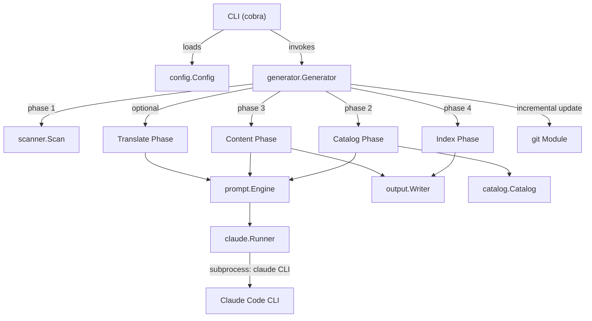
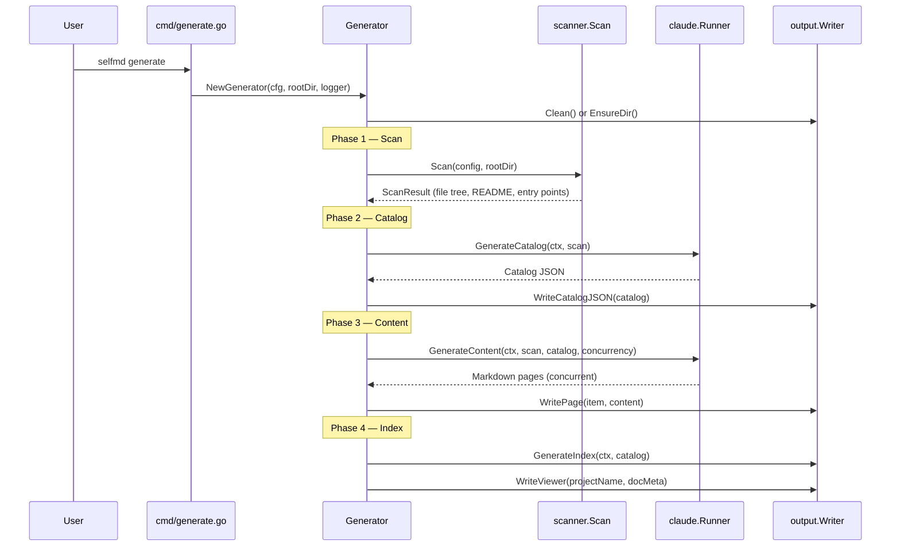

# Introduction

SelfMD is a CLI tool that automatically generates structured, high-quality technical documentation for any codebase — powered by Claude Code CLI.

## Overview

SelfMD analyzes a project's source code, builds a documentation catalog, and generates comprehensive Markdown documentation pages by leveraging Anthropic's Claude AI through the Claude Code CLI. It is designed for developers who want to produce professional-grade project wikis without manual authoring effort.

### Key Concepts

- **Automated Documentation Generation**: SelfMD scans your project structure, sends structured prompts to Claude, and writes complete Markdown documentation pages organized into a navigable hierarchy.
- **Four-Phase Pipeline**: The generation process follows a strict sequence — scan, catalog, content, and index — each building on the previous phase's output.
- **Incremental Updates**: After the initial full generation, SelfMD uses git change detection to identify which documentation pages need updating, avoiding costly full regeneration.
- **Multi-Language Support**: Documentation can be generated in a primary language and then translated to secondary languages, with built-in prompt templates for multiple locales.
- **YAML-Driven Configuration**: A single `selfmd.yaml` file controls all aspects of generation — project targets, output settings, Claude model parameters, and git integration.

### When to Use SelfMD

SelfMD is ideal when you need to:

- Bootstrap a complete documentation wiki for an existing codebase
- Keep documentation in sync with evolving source code via incremental updates
- Produce documentation in multiple languages from a single source of truth
- Standardize documentation structure across projects using AI-generated catalogs

## Architecture



SelfMD is structured as a Go CLI application built with [Cobra](https://github.com/spf13/cobra). The entry point delegates to the `cmd` package, which defines four subcommands: `init`, `generate`, `update`, and `translate`. The core generation logic lives in the `internal/generator` package, which orchestrates scanner, prompt engine, Claude runner, catalog manager, and output writer modules.

## Core Commands

SelfMD provides four CLI commands, each corresponding to a distinct workflow:

| Command | Description |
|---------|-------------|
| `selfmd init` | Scans the current directory, detects project type, and generates a `selfmd.yaml` configuration file |
| `selfmd generate` | Runs the full four-phase documentation generation pipeline |
| `selfmd update` | Performs incremental documentation updates based on git changes |
| `selfmd translate` | Translates primary-language documentation into configured secondary languages |

### Command Hierarchy

```go
var rootCmd = &cobra.Command{
	Use:   "selfmd",
	Short: "selfmd — Auto Documentation Generator for Claude Code CLI",
	Long: banner + `Automatically generate structured, high-quality technical documentation
for any codebase — powered by Claude Code CLI.`,
}
```

> Source: cmd/root.go#L25-L30

## Core Processes

### Full Generation Pipeline

The `generate` command executes a four-phase pipeline:



The pipeline is implemented in the `Generate` method:

```go
func (g *Generator) Generate(ctx context.Context, opts GenerateOptions) error {
	start := time.Now()

	// Phase 0: Setup
	clean := opts.Clean || g.Config.Output.CleanBeforeGenerate
	if clean {
		fmt.Println("[0/4] Cleaning output directory...")
		if !opts.DryRun {
			if err := g.Writer.Clean(); err != nil {
				return err
			}
		}
	} else {
		if err := g.Writer.EnsureDir(); err != nil {
			return err
		}
	}

	// Phase 1: Scan
	fmt.Println("[1/4] Scanning project structure...")
	scan, err := scanner.Scan(g.Config, g.RootDir)
	if err != nil {
		return fmt.Errorf("failed to scan project: %w", err)
	}
```

> Source: internal/generator/pipeline.go#L68-L91

### Incremental Update Flow

The `update` command uses git diff to detect changed source files, matches them against existing documentation pages, and regenerates only the affected pages:

1. **Parse changed files** — Reads the git diff between the previously recorded commit and HEAD
2. **Match to existing docs** — Searches documentation page content for references to changed file paths
3. **Determine updates** — Asks Claude which matched pages actually need regeneration
4. **Handle unmatched files** — Asks Claude if new documentation pages should be created for files not referenced in any existing page
5. **Regenerate** — Re-runs content generation for the identified pages

```go
func (g *Generator) Update(ctx context.Context, scan *scanner.ScanResult, previousCommit, currentCommit, changedFiles string) error {
	// Read existing catalog
	existingCatalogJSON, err := g.Writer.ReadCatalogJSON()
	if err != nil {
		return fmt.Errorf("failed to read existing catalog (please run selfmd generate first): %w", err)
	}
```

> Source: internal/generator/updater.go#L32-L37

## Configuration

SelfMD is configured through a `selfmd.yaml` file that defines five configuration sections:

```yaml
project:
    name: selfmd
    type: cli
    description: ""
targets:
    include:
        - src/**
        - pkg/**
        - cmd/**
        - internal/**
    exclude:
        - vendor/**
        - node_modules/**
        - .git/**
    entry_points:
        - main.go
        - cmd/root.go
output:
    dir: docs
    language: en-US
    secondary_languages: ["zh-TW"]
    clean_before_generate: false
claude:
    model: opus
    max_concurrent: 3
    timeout_seconds: 30000
    max_retries: 2
    allowed_tools:
        - Read
        - Glob
        - Grep
git:
    enabled: true
    base_branch: develop
```

> Source: selfmd.yaml#L1-L33

The configuration is loaded and validated by the `config.Config` struct:

```go
type Config struct {
	Project ProjectConfig `yaml:"project"`
	Targets TargetsConfig `yaml:"targets"`
	Output  OutputConfig  `yaml:"output"`
	Claude  ClaudeConfig  `yaml:"claude"`
	Git     GitConfig     `yaml:"git"`
}
```

> Source: internal/config/config.go#L11-L17

## Key Design Decisions

- **Claude Code CLI as the AI backend**: Rather than calling the Anthropic API directly, SelfMD invokes the `claude` CLI as a subprocess. This leverages Claude Code's built-in tool permissions (Read, Glob, Grep) so the AI can actively explore the codebase while generating documentation.
- **Concurrent content generation**: Content pages are generated in parallel (controlled by `max_concurrent`) to reduce wall-clock time for large projects.
- **Catalog-first approach**: The catalog is generated first as a structured JSON tree, then each content page is generated independently. This ensures a coherent documentation hierarchy before any page content is written.
- **Git-based incremental updates**: By recording the commit hash after each generation, subsequent `update` runs only need to process files changed since the last run, significantly reducing cost and time.

## Usage Examples

### Initializing a Project

The `init` command auto-detects project type and entry points:

```go
func runInit(cmd *cobra.Command, args []string) error {
	if _, err := os.Stat(cfgFile); err == nil && !forceInit {
		return fmt.Errorf("config file %s already exists, use --force to overwrite", cfgFile)
	}

	cfg := config.DefaultConfig()

	projectType, entryPoints := detectProject()
	cfg.Project.Type = projectType
	cfg.Project.Name = filepath.Base(mustCwd())
	cfg.Targets.EntryPoints = entryPoints

	if err := cfg.Save(cfgFile); err != nil {
		return fmt.Errorf("failed to write config file: %w", err)
	}
```

> Source: cmd/init.go#L27-L41

### Running a Full Generation

```go
opts := generator.GenerateOptions{
	Clean:       clean,
	DryRun:      dryRun,
	Concurrency: concurrencyNum,
}

return gen.Generate(ctx, opts)
```

> Source: cmd/generate.go#L89-L95

### Claude CLI Invocation

The `claude.Runner` executes the Claude Code CLI with structured arguments, including model selection, tool permissions, and JSON output format:

```go
func (r *Runner) Run(ctx context.Context, opts RunOptions) (*RunResult, error) {
	args := []string{
		"-p",
		"--output-format", "json",
	}

	model := opts.Model
	if model == "" {
		model = r.config.Model
	}
	if model != "" {
		args = append(args, "--model", model)
	}

	tools := opts.AllowedTools
	if len(tools) == 0 {
		tools = r.config.AllowedTools
	}
	if len(tools) > 0 {
		for _, t := range tools {
			args = append(args, "--allowedTools", t)
		}
	}

	// Explicitly block Write/Edit to prevent content from being lost in denied tool calls
	args = append(args, "--disallowedTools", "Write", "--disallowedTools", "Edit")
```

> Source: internal/claude/runner.go#L30-L56

## Related Links

- [Output Structure](../output-structure/index.md)
- [Tech Stack](../tech-stack/index.md)
- [Installation](../../getting-started/installation/index.md)
- [First Run](../../getting-started/first-run/index.md)
- [Configuration Overview](../../configuration/config-overview/index.md)
- [Generation Pipeline](../../architecture/pipeline/index.md)
- [Module Dependencies](../../architecture/module-dependencies/index.md)

## Reference Files

| File Path | Description |
|-----------|-------------|
| `main.go` | Application entry point |
| `go.mod` | Go module definition and dependencies |
| `selfmd.yaml` | Project configuration file |
| `cmd/root.go` | Root CLI command definition with global flags |
| `cmd/generate.go` | `generate` command implementation |
| `cmd/init.go` | `init` command with project type detection |
| `cmd/update.go` | `update` command for incremental documentation updates |
| `cmd/translate.go` | `translate` command for multi-language support |
| `internal/config/config.go` | Configuration struct definitions, loading, and validation |
| `internal/generator/pipeline.go` | Generator struct and four-phase pipeline orchestration |
| `internal/generator/updater.go` | Incremental update logic with file-to-doc matching |
| `internal/scanner/scanner.go` | Project directory scanning and file filtering |
| `internal/scanner/filetree.go` | File tree data structure and rendering |
| `internal/claude/runner.go` | Claude Code CLI subprocess invocation with retry logic |
| `internal/prompt/engine.go` | Prompt template engine with multi-language support |
| `internal/output/writer.go` | Output file writing, catalog persistence, and page management |
| `internal/catalog/catalog.go` | Catalog data model, parsing, flattening, and serialization |
| `internal/git/git.go` | Git operations for change detection and commit tracking |