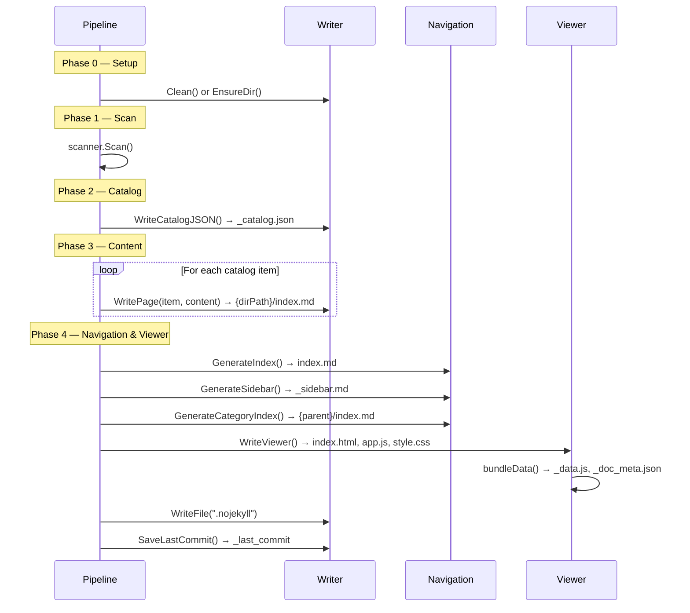

# Output Structure

selfmd generates a self-contained documentation site from your source code, producing a directory of Markdown files, metadata, and a static viewer that can be opened directly in a browser.

## Overview

When selfmd runs the `generate` command, it writes all output into a single configurable directory (default: `.doc-build`). The output includes:

- **Markdown content pages** organized in a hierarchical directory structure mirroring the documentation catalog
- **Metadata files** used for incremental updates and navigation
- **A static HTML/JS/CSS viewer** that bundles all content for offline, serverless browsing
- **Multi-language directories** when secondary languages are configured

The output directory is designed to be served as a static site (e.g., via GitHub Pages) or browsed locally by opening `index.html`.

## Architecture

```mermaid
flowchart TD
    Pipeline["Generator Pipeline"]

    subgraph Output_Dir["Output Directory (.doc-build/)"]
        direction TB
        IndexMD["index.md"]
        Sidebar["_sidebar.md"]
        CatalogJSON["_catalog.json"]
        LastCommit["_last_commit"]
        NoJekyll[".nojekyll"]
        DocMeta["_doc_meta.json"]
        DataJS["_data.js"]
        IndexHTML["index.html"]
        AppJS["app.js"]
        StyleCSS["style.css"]

        subgraph Content_Pages["Content Pages"]
            direction TB
            OverviewDir["overview/index.md"]
            CliDir["cli/cmd-generate/index.md"]
            MorePages["...other pages..."]
        end

        subgraph Lang_Dir["Secondary Language (e.g., zh-TW/)"]
            direction TB
            LangCatalog["_catalog.json"]
            LangSidebar["_sidebar.md"]
            LangPages["overview/index.md, ..."]
        end
    end

    Pipeline --> Output_Dir
    Writer["output.Writer"] --> IndexMD
    Writer --> Sidebar
    Writer --> CatalogJSON
    Writer --> LastCommit
    Navigation["output.Navigation"] --> IndexMD
    Navigation --> Sidebar
    Viewer["output.WriteViewer"] --> IndexHTML
    Viewer --> AppJS
    Viewer --> StyleCSS
    Viewer --> DocMeta
    Viewer --> DataJS
```



## Directory Layout

A complete selfmd output directory looks like this:

```
.doc-build/                          # Output root (configurable via output.dir)
├── index.html                       # Static viewer HTML shell
├── app.js                           # Client-side rendering application
├── style.css                        # Viewer stylesheet
├── _data.js                         # Bundled content for offline viewing
├── _catalog.json                    # Catalog structure (for incremental updates)
├── _doc_meta.json                   # Language metadata
├── _sidebar.md                      # Navigation sidebar
├── _last_commit                     # Git commit hash (for change detection)
├── .nojekyll                        # Prevents GitHub Pages from ignoring _ files
├── index.md                         # Main landing page
├── overview/
│   ├── index.md                     # Category index (auto-generated)
│   ├── introduction/
│   │   └── index.md                 # Content page
│   ├── output-structure/
│   │   └── index.md                 # Content page
│   └── tech-stack/
│       └── index.md                 # Content page
├── cli/
│   ├── index.md                     # Category index
│   ├── cmd-generate/
│   │   └── index.md
│   └── ...
└── zh-TW/                           # Secondary language directory
    ├── _catalog.json                # Translated catalog
    ├── _sidebar.md                  # Translated sidebar
    ├── index.md                     # Translated landing page
    ├── overview/
    │   ├── index.md
    │   ├── introduction/
    │   │   └── index.md             # Translated content
    │   └── ...
    └── ...
```

## Content Page Structure

Every documentation page is stored as an `index.md` file inside a directory path derived from the catalog. The `Writer.WritePage` method maps a catalog item's `DirPath` to the filesystem:

```go
func (w *Writer) WritePage(item catalog.FlatItem, content string) error {
	dir := filepath.Join(w.BaseDir, item.DirPath)
	if err := os.MkdirAll(dir, 0755); err != nil {
		return fmt.Errorf("failed to create directory %s: %w", dir, err)
	}

	path := filepath.Join(dir, "index.md")
	if err := os.WriteFile(path, []byte(content), 0644); err != nil {
		return fmt.Errorf("failed to write %s: %w", path, err)
	}
	return nil
}
```

> Source: internal/output/writer.go#L48-L60

### Path Transformations

The catalog system uses two path representations that map to the filesystem:

| Representation | Example | Usage |
|---|---|---|
| Dot notation (`Path`) | `core-modules.generator.content-phase` | Internal catalog references |
| Directory path (`DirPath`) | `core-modules/generator/content-phase` | Filesystem mapping |
| File path | `{BaseDir}/core-modules/generator/content-phase/index.md` | Actual output file |

The `flattenItem` function in the catalog module handles this conversion:

```go
func flattenItem(items *[]FlatItem, item CatalogItem, parentPath string, depth int) {
	path := item.Path
	dirPath := strings.ReplaceAll(path, ".", "/")

	if parentPath != "" {
		parentDir := strings.ReplaceAll(parentPath, ".", "/")
		if !strings.HasPrefix(dirPath, parentDir+"/") {
			path = parentPath + "." + item.Path
			dirPath = strings.ReplaceAll(path, ".", "/")
		} else {
			path = strings.ReplaceAll(dirPath, "/", ".")
		}
	}

	*items = append(*items, FlatItem{
		Title:       item.Title,
		Path:        path,
		DirPath:     dirPath,
		Depth:       depth,
		ParentPath:  parentPath,
		HasChildren: len(item.Children) > 0,
	})

	for _, child := range item.Children {
		flattenItem(items, child, path, depth+1)
	}
}
```

> Source: internal/catalog/catalog.go#L56-L88

## Metadata Files

### _catalog.json

Stores the catalog tree structure as JSON. Used for incremental updates — when re-running generation without `clean`, the existing catalog is reloaded instead of regenerated.

```go
func (w *Writer) WriteCatalogJSON(cat *catalog.Catalog) error {
	data, err := cat.ToJSON()
	if err != nil {
		return err
	}
	return w.WriteFile("_catalog.json", data)
}
```

> Source: internal/output/writer.go#L76-L83

The catalog JSON follows this schema:

```go
type Catalog struct {
	Items []CatalogItem `json:"items"`
}

type CatalogItem struct {
	Title    string        `json:"title"`
	Path     string        `json:"path"`
	Order    int           `json:"order"`
	Children []CatalogItem `json:"children"`
}
```

> Source: internal/catalog/catalog.go#L10-L21

### _last_commit

A plain text file containing the Git commit hash at the time of generation. The incremental update engine compares this with the current commit to detect changed files.

```go
func (w *Writer) SaveLastCommit(commit string) error {
	return w.WriteFile("_last_commit", commit)
}
```

> Source: internal/output/writer.go#L129-L132

### _doc_meta.json

Language metadata serialized as JSON. Contains the default language and all available languages with their native display names.

```go
type DocMeta struct {
	DefaultLanguage    string     `json:"default_language"`
	AvailableLanguages []LangInfo `json:"available_languages"`
}

type LangInfo struct {
	Code       string `json:"code"`
	NativeName string `json:"native_name"`
	IsDefault  bool   `json:"is_default"`
}
```

> Source: internal/output/writer.go#L12-L23

### _sidebar.md

A Markdown file containing the hierarchical navigation structure. Generated by `GenerateSidebar`:

```go
func GenerateSidebar(projectName string, cat *catalog.Catalog, lang string) string {
	ui := getUIStrings(lang)
	var sb strings.Builder

	sb.WriteString(fmt.Sprintf("# %s\n\n", projectName))
	sb.WriteString(fmt.Sprintf("- [%s](./index.md)\n", ui["home"]))

	for _, item := range cat.Items {
		writeSidebarItem(&sb, item, "", 0)
	}

	return sb.String()
}
```

> Source: internal/output/navigation.go#L73-L86

## Navigation Files

### Main Index Page (index.md)

The root `index.md` serves as the landing page. It lists the project name, description, and a full table of contents with links to every catalog item:

```go
func GenerateIndex(projectName, projectDesc string, cat *catalog.Catalog, lang string) string {
	ui := getUIStrings(lang)
	var sb strings.Builder

	sb.WriteString(fmt.Sprintf("# %s %s\n\n", projectName, ui["techDocs"]))

	if projectDesc != "" {
		sb.WriteString(projectDesc + "\n\n")
	}

	sb.WriteString("---\n\n")
	sb.WriteString(fmt.Sprintf("## %s\n\n", ui["catalog"]))

	for _, item := range cat.Items {
		writeIndexItem(&sb, item, "", 0)
	}

	sb.WriteString("\n---\n\n")
	sb.WriteString(fmt.Sprintf("*%s*\n", ui["autoGenerated"]))

	return sb.String()
}
```

> Source: internal/output/navigation.go#L37-L59

### Category Index Pages

For catalog items that have children (e.g., "Core Modules"), a category index page is auto-generated listing the child pages:

```go
func GenerateCategoryIndex(item catalog.FlatItem, children []catalog.FlatItem, lang string) string {
	ui := getUIStrings(lang)
	var sb strings.Builder

	sb.WriteString(fmt.Sprintf("# %s\n\n", item.Title))
	sb.WriteString(ui["sectionContains"] + "\n\n")

	for _, child := range children {
		relPath := computeRelativePath(item.DirPath, child.DirPath)
		sb.WriteString(fmt.Sprintf("- [%s](%s/index.md)\n", child.Title, relPath))
	}

	return sb.String()
}
```

> Source: internal/output/navigation.go#L100-L114

## Static Viewer

The static viewer is a self-contained HTML/JS/CSS application that renders the documentation client-side. All assets are embedded in the Go binary via `//go:embed` directives:

```go
//go:embed viewer/index.html
var viewerHTML string

//go:embed viewer/app.js
var viewerJS string

//go:embed viewer/style.css
var viewerCSS string
```

> Source: internal/output/viewer.go#L13-L20

### _data.js Bundle

The key to offline viewing is `_data.js`, which bundles all Markdown content, catalog structure, and language data into a single JavaScript file assigned to `window.DOC_DATA`:

```go
// Build data object
data := map[string]interface{}{
	"catalog": catalogObj,
	"pages":   pages,
}

// Add language metadata and secondary language data
if docMeta != nil {
	data["meta"] = docMeta

	languages := make(map[string]interface{})
	for _, lang := range docMeta.AvailableLanguages {
		if lang.IsDefault {
			continue
		}
		// ... collect language-specific catalog and pages
		languages[lang.Code] = langEntry
	}

	if len(languages) > 0 {
		data["languages"] = languages
	}
}

jsonBytes, err := json.Marshal(data)
// ...
content := "window.DOC_DATA = " + string(jsonBytes) + ";\n"
return w.WriteFile("_data.js", content)
```

> Source: internal/output/viewer.go#L126-L194

The resulting JavaScript object has this structure:

```javascript
window.DOC_DATA = {
  "catalog": { "items": [/* catalog tree */] },
  "pages": {
    "index.md": "# Landing page content...",
    "overview/introduction/index.md": "# Introduction...",
    // ... all master-language pages
  },
  "meta": {
    "default_language": "en-US",
    "available_languages": [
      { "code": "en-US", "native_name": "English", "is_default": true },
      { "code": "zh-TW", "native_name": "繁體中文", "is_default": false }
    ]
  },
  "languages": {
    "zh-TW": {
      "catalog": { "items": [/* translated catalog */] },
      "pages": {
        "index.md": "# 翻譯後的內容...",
        // ... translated pages
      }
    }
  }
};
```

The bundling process walks the output directory, collects all `.md` files, and skips files starting with `_` as well as files inside secondary language subdirectories (those are collected separately under the `languages` key).

## Core Processes

### Generation Pipeline Output Sequence



## Multi-Language Output

When `secondary_languages` are configured, selfmd creates a subdirectory for each secondary language. The `Writer.ForLanguage` method returns a new writer scoped to that subdirectory:

```go
func (w *Writer) ForLanguage(lang string) *Writer {
	return &Writer{
		BaseDir: filepath.Join(w.BaseDir, lang),
	}
}
```

> Source: internal/output/writer.go#L144-L149

The master (default) language content lives directly in the output root. Each secondary language gets its own directory containing:
- A translated `_catalog.json` with localized titles
- A translated `_sidebar.md`
- A translated `index.md` (landing page)
- Translated category index pages
- Translated content pages in the same directory hierarchy as the master language

## Link Fixing

Generated content may contain broken or inconsistent internal links. The `LinkFixer` validates and corrects relative links before pages are written. It builds a multi-strategy index from the catalog for fuzzy matching:

```go
func NewLinkFixer(cat *catalog.Catalog) *LinkFixer {
	items := cat.Flatten()
	dirPaths := make(map[string]bool)
	pathIndex := make(map[string]string)

	for _, item := range items {
		dirPaths[item.DirPath] = true

		// index by multiple keys for fuzzy matching
		pathIndex[item.DirPath] = item.DirPath
		pathIndex[item.Path] = item.DirPath                          // dot-notation
		pathIndex[strings.ReplaceAll(item.Path, ".", "/")] = item.DirPath

		// index by last segment (e.g., "scanner" → "core-modules/scanner")
		parts := strings.Split(item.DirPath, "/")
		lastSeg := parts[len(parts)-1]
		if _, exists := pathIndex[lastSeg]; !exists {
			pathIndex[lastSeg] = item.DirPath
		}

		// index by slug-like variations
		pathIndex[strings.ToLower(item.DirPath)] = item.DirPath
	}

	return &LinkFixer{
		allItems:  items,
		dirPaths:  dirPaths,
		pathIndex: pathIndex,
	}
}
```

> Source: internal/output/linkfixer.go#L18-L48

## Configuration

The output directory and language settings are controlled through `selfmd.yaml`:

```go
type OutputConfig struct {
	Dir                 string   `yaml:"dir"`
	Language            string   `yaml:"language"`
	SecondaryLanguages  []string `yaml:"secondary_languages"`
	CleanBeforeGenerate bool     `yaml:"clean_before_generate"`
}
```

> Source: internal/config/config.go#L31-L36

| Setting | Default | Description |
|---|---|---|
| `dir` | `.doc-build` | Output directory path |
| `language` | `zh-TW` | Primary documentation language |
| `secondary_languages` | `[]` | Additional languages to translate into |
| `clean_before_generate` | `false` | Whether to wipe the output directory before generating |

### GitHub Pages Compatibility

selfmd writes a `.nojekyll` file to the output root, which tells GitHub Pages not to process files through Jekyll. This is necessary because several metadata files (e.g., `_catalog.json`, `_sidebar.md`) start with an underscore, which Jekyll would otherwise ignore.

```go
// Write .nojekyll to prevent GitHub Pages from ignoring files starting with _
if err := g.Writer.WriteFile(".nojekyll", ""); err != nil {
	g.Logger.Warn("failed to write .nojekyll", "error", err)
}
```

> Source: internal/generator/pipeline.go#L157-L160

## Related Links

- [Introduction](../introduction/index.md)
- [Tech Stack](../tech-stack/index.md)
- [Generation Pipeline](../../architecture/pipeline/index.md)
- [Output Writer](../../core-modules/output-writer/index.md)
- [Static Viewer](../../core-modules/static-viewer/index.md)
- [Catalog Manager](../../core-modules/catalog/index.md)
- [Configuration Overview](../../configuration/config-overview/index.md)
- [Translation Workflow](../../i18n/translation-workflow/index.md)

## Reference Files

| File Path | Description |
|-----------|-------------|
| `internal/output/writer.go` | Output writer — file/page writing, catalog persistence, language scoping |
| `internal/output/navigation.go` | Navigation generation — index, sidebar, and category index pages |
| `internal/output/viewer.go` | Static viewer generation and content bundling into `_data.js` |
| `internal/output/linkfixer.go` | Link validation and fuzzy-match fixing for internal Markdown links |
| `internal/catalog/catalog.go` | Catalog data structures, JSON parsing, and path flattening |
| `internal/config/config.go` | Configuration structs including `OutputConfig` and language definitions |
| `internal/generator/pipeline.go` | Four-phase generation pipeline orchestrating all output |
| `selfmd.yaml` | Project configuration file showing output settings in practice |