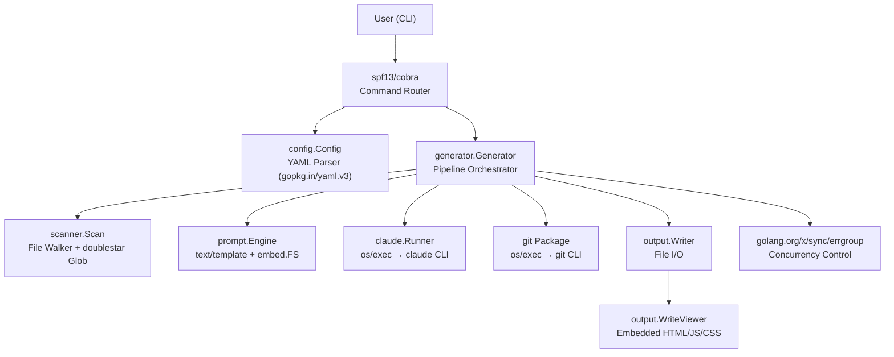

# Tech Stack

SelfMD is built entirely in Go and relies on the Claude Code CLI as its AI backbone. This page details the programming language, frameworks, libraries, and external tools that make up the project.

## Overview

SelfMD is a command-line tool written in **Go (Golang)** that automatically generates structured technical documentation for any codebase. It orchestrates the Claude Code CLI as a subprocess, feeding it rendered prompt templates and parsing the JSON responses. The output is a set of Markdown files plus a self-contained static HTML/JS/CSS viewer that can be opened directly in a browser or deployed to GitHub Pages.

Key technology choices:

- **Go** — statically compiled, single-binary distribution for all major platforms
- **Claude Code CLI** — AI-powered code analysis and documentation generation
- **YAML** — human-friendly project configuration
- **Go `embed`** — prompt templates and viewer assets are embedded into the binary at compile time
- **Go `text/template`** — prompt rendering with language-aware template sets

## Architecture



## Programming Language

SelfMD targets **Go 1.25.7** as declared in its module file. The project compiles to native binaries for six platform targets: Linux (amd64, arm64), macOS (amd64, arm64), and Windows (amd64, arm64).

```go
module github.com/monkenwu/selfmd

go 1.25.7
```

> Source: go.mod#L1-L3

## Dependencies

### Direct Dependencies

| Library | Version | Purpose |
|---------|---------|---------|
| `github.com/spf13/cobra` | v1.10.2 | CLI command framework — defines `generate`, `init`, `update`, `translate` subcommands |
| `gopkg.in/yaml.v3` | v3.0.1 | YAML parsing and serialization for `selfmd.yaml` configuration |
| `github.com/bmatcuk/doublestar/v4` | v4.10.0 | Globstar (`**`) pattern matching for file include/exclude filters |
| `golang.org/x/sync` | v0.19.0 | `errgroup` for bounded concurrent page generation and translation |

### Indirect Dependencies

| Library | Version | Purpose |
|---------|---------|---------|
| `github.com/inconshreveable/mousetrap` | v1.1.0 | Windows shell detection (required by Cobra) |
| `github.com/spf13/pflag` | v1.0.9 | POSIX-compliant flag parsing (required by Cobra) |

```go
require (
	github.com/bmatcuk/doublestar/v4 v4.10.0
	github.com/spf13/cobra v1.10.2
	golang.org/x/sync v0.19.0
	gopkg.in/yaml.v3 v3.0.1
)
```

> Source: go.mod#L5-L10

## Standard Library Usage

SelfMD makes extensive use of Go's standard library, avoiding third-party dependencies where built-in packages suffice:

| Package | Used In | Purpose |
|---------|---------|---------|
| `embed` | `prompt.Engine`, `output.WriteViewer` | Compile-time embedding of prompt templates and viewer assets |
| `text/template` | `prompt.Engine` | Rendering prompt templates with context data |
| `encoding/json` | `claude.Parser`, `catalog.Catalog` | Parsing Claude CLI JSON output and catalog serialization |
| `os/exec` | `claude.Runner`, `git` package | Spawning `claude` and `git` subprocesses |
| `log/slog` | All modules | Structured logging throughout the pipeline |
| `context` | `generator.Generator`, `claude.Runner` | Timeout management and signal-based cancellation |
| `sync/atomic` | `content_phase`, `translate_phase` | Lock-free progress counters for concurrent generation |
| `regexp` | `claude.Parser`, `translate_phase` | Extracting JSON blocks, markdown fences, and headings from Claude responses |
| `path/filepath` | `scanner`, `output`, `catalog` | Cross-platform path manipulation |

### Embed Directives

Prompt templates and viewer assets are embedded into the binary using Go's `//go:embed` directive:

```go
//go:embed templates/*/*.tmpl templates/*.tmpl
var templateFS embed.FS
```

> Source: internal/prompt/engine.go#L10-L11

```go
//go:embed viewer/index.html
var viewerHTML string

//go:embed viewer/app.js
var viewerJS string

//go:embed viewer/style.css
var viewerCSS string
```

> Source: internal/output/viewer.go#L13-L20

## External CLI Tools

SelfMD depends on two external CLI tools available on `$PATH`:

### Claude Code CLI

The Claude Code CLI (`claude`) is the core AI engine. SelfMD invokes it as a subprocess with JSON output mode, piping prompts via stdin:

```go
args := []string{
	"-p",
	"--output-format", "json",
}
// ...
cmd := exec.CommandContext(ctx, "claude", args...)
cmd.Stdin = strings.NewReader(opts.Prompt)
```

> Source: internal/claude/runner.go#L32-L75

The runner supports model selection, tool restrictions (`--allowedTools`, `--disallowedTools`), configurable timeouts, and automatic retry with linear backoff:

```go
func (r *Runner) RunWithRetry(ctx context.Context, opts RunOptions) (*RunResult, error) {
	maxRetries := r.config.MaxRetries
	var lastErr error

	for attempt := 0; attempt <= maxRetries; attempt++ {
		if attempt > 0 {
			backoff := time.Duration(attempt) * 5 * time.Second
			// ...
		}
		result, err := r.Run(ctx, opts)
		if err == nil && !result.IsError {
			return result, nil
		}
		// ...
	}
	return nil, fmt.Errorf("all %d attempts failed: %w", maxRetries+1, lastErr)
}
```

> Source: internal/claude/runner.go#L113-L143

### Git CLI

The `git` CLI is used for change detection in incremental updates. All interactions go through the `internal/git` package:

```go
func GetChangedFilesSince(dir, sinceCommit string) (string, error) {
	return runGit(dir, "diff", "--relative", "--name-status", sinceCommit+"..HEAD")
}
```

> Source: internal/git/git.go#L38-L40

## Concurrency Model

Content generation and translation use `golang.org/x/sync/errgroup` with a semaphore channel to limit concurrency to the configured `max_concurrent` value:

```go
eg, ctx := errgroup.WithContext(ctx)
sem := make(chan struct{}, concurrency)

for _, item := range items {
	item := item
	eg.Go(func() error {
		sem <- struct{}{}
		defer func() { <-sem }()
		// ... generate page ...
		return nil
	})
}

if err := eg.Wait(); err != nil {
	return err
}
```

> Source: internal/generator/content_phase.go#L36-L76

Progress counters (`done`, `failed`, `skipped`) use `sync/atomic.Int32` for lock-free updates across goroutines.

## Configuration Format

Project configuration is stored in `selfmd.yaml` and parsed using `gopkg.in/yaml.v3`. The `Config` struct maps directly to the YAML structure:

```go
type Config struct {
	Project ProjectConfig `yaml:"project"`
	Targets TargetsConfig `yaml:"targets"`
	Output  OutputConfig  `yaml:"output"`
	Claude  ClaudeConfig  `yaml:"claude"`
	Git     GitConfig     `yaml:"git"`
}
```

> Source: internal/config/config.go#L11-L17

## Prompt Template System

Prompts are organized as Go `text/template` files in language-specific directories, embedded at compile time:

```
templates/
├── zh-TW/
│   ├── catalog.tmpl
│   ├── content.tmpl
│   ├── update_matched.tmpl
│   ├── update_unmatched.tmpl
│   └── updater.tmpl
├── en-US/
│   ├── catalog.tmpl
│   ├── content.tmpl
│   ├── update_matched.tmpl
│   ├── update_unmatched.tmpl
│   └── updater.tmpl
├── translate.tmpl
└── translate_titles.tmpl
```

The engine loads language-specific templates on initialization and falls back to `en-US` for unsupported languages:

```go
func (o *OutputConfig) GetEffectiveTemplateLang() string {
	for _, lang := range SupportedTemplateLangs {
		if o.Language == lang {
			return o.Language
		}
	}
	return "en-US"
}
```

> Source: internal/config/config.go#L58-L65

## Static Viewer

The output includes a self-contained documentation viewer built with vanilla HTML, JavaScript, and CSS (no framework dependencies). The viewer assets are embedded into the Go binary and written to the output directory during generation:

- `index.html` — SPA shell with project name and language injected
- `app.js` — client-side Markdown rendering and navigation
- `style.css` — documentation theme
- `_data.js` — bundled JSON containing all catalog data and Markdown page content

This bundle approach enables fully offline/serverless documentation viewing — simply open `index.html` in a browser.

## Build and Distribution

SelfMD compiles to standalone binaries with no runtime dependencies (beyond the `claude` and `git` CLIs). Pre-built binaries are provided for six platforms:

| Platform | Binary |
|----------|--------|
| Linux amd64 | `bin/selfmd-linux-amd64` |
| Linux arm64 | `bin/selfmd-linux-arm64` |
| macOS amd64 | `bin/selfmd-macos-amd64` |
| macOS arm64 | `bin/selfmd-macos-arm64` |
| Windows amd64 | `bin/selfmd-windows-amd64.exe` |
| Windows arm64 | `bin/selfmd-windows-arm64.exe` |

## Related Links

- [Introduction](../introduction/index.md)
- [Output Structure](../output-structure/index.md)
- [Configuration Overview](../../configuration/config-overview/index.md)
- [Claude Settings](../../configuration/claude-config/index.md)
- [System Architecture](../../architecture/index.md)
- [Claude Runner](../../core-modules/claude-runner/index.md)
- [Prompt Engine](../../core-modules/prompt-engine/index.md)

## Reference Files

| File Path | Description |
|-----------|-------------|
| `go.mod` | Go module definition and dependency declarations |
| `go.sum` | Dependency checksums |
| `main.go` | Application entry point |
| `cmd/root.go` | Root Cobra command and global flags |
| `cmd/generate.go` | Generate command implementation with signal handling |
| `internal/config/config.go` | Configuration struct, YAML loading, validation, and defaults |
| `internal/claude/runner.go` | Claude CLI subprocess invocation with retry logic |
| `internal/claude/types.go` | RunOptions, RunResult, and CLIResponse type definitions |
| `internal/claude/parser.go` | JSON/Markdown response parsing and extraction utilities |
| `internal/generator/pipeline.go` | 4-phase generation pipeline orchestrator |
| `internal/generator/catalog_phase.go` | Catalog generation via Claude |
| `internal/generator/content_phase.go` | Concurrent content page generation with errgroup |
| `internal/generator/index_phase.go` | Index and sidebar navigation generation |
| `internal/generator/translate_phase.go` | Translation pipeline with concurrent page translation |
| `internal/generator/updater.go` | Incremental update engine with git change matching |
| `internal/scanner/scanner.go` | Project directory scanner with glob-based filtering |
| `internal/scanner/filetree.go` | File tree data structure and rendering |
| `internal/git/git.go` | Git CLI wrapper for change detection |
| `internal/prompt/engine.go` | Prompt template engine with embedded FS |
| `internal/output/writer.go` | Documentation file writer and catalog persistence |
| `internal/output/viewer.go` | Static viewer generation with embedded HTML/JS/CSS |
| `internal/output/navigation.go` | Index, sidebar, and category page generation |
| `internal/output/linkfixer.go` | Relative link validation and correction |
| `internal/catalog/catalog.go` | Catalog data model, JSON parsing, and tree flattening |
| `selfmd.yaml` | Project configuration file |