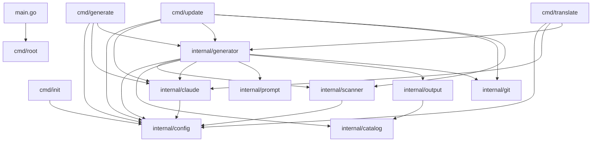
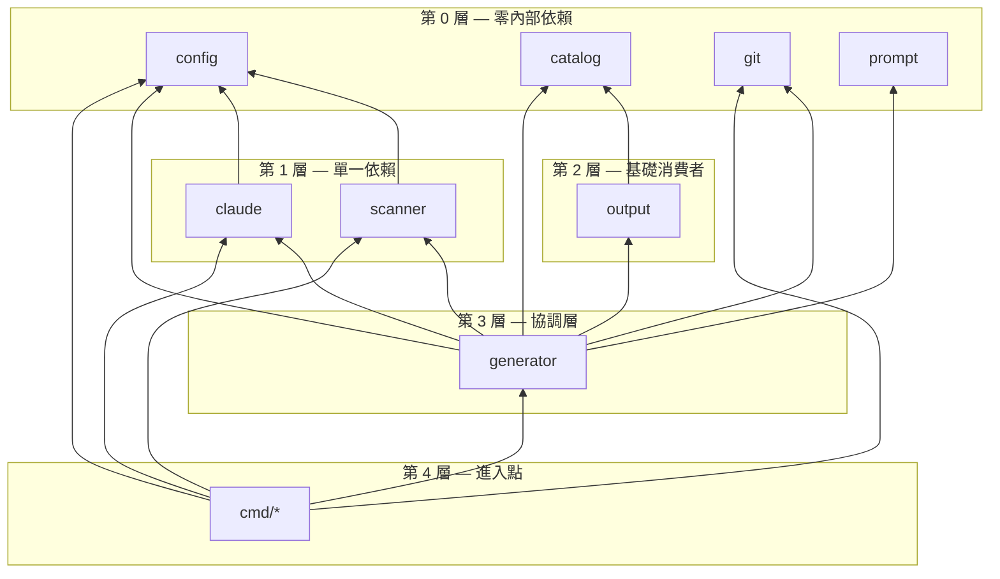
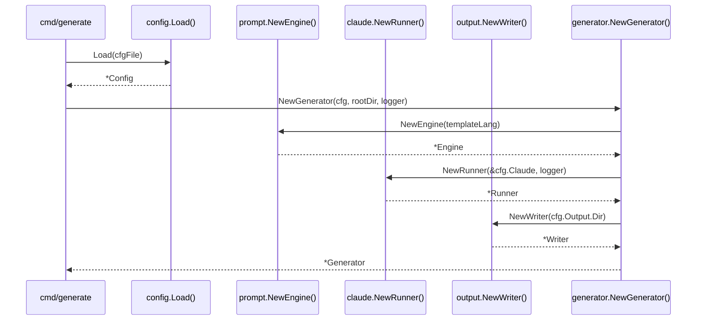
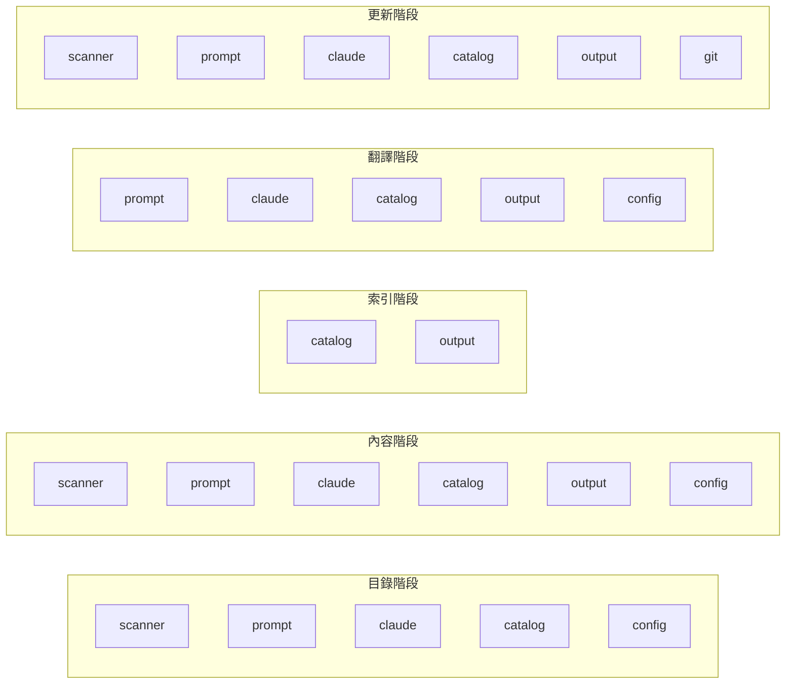

# 模組依賴關係

selfmd 內部模組依賴圖的全面分析，展示每個套件之間的關聯與依賴方式。

## 概述

selfmd 是一個遵循標準 `cmd/` + `internal/` 佈局的 Go 專案。`cmd/` 套件定義 CLI 進入點，而 `internal/` 包含所有核心業務邏輯，分散在八個專門的套件中。理解這些依賴關係對於瀏覽程式碼庫、規劃變更和避免循環匯入至關重要。

此架構遵循分層設計，其中：
- **基礎模組**（`config`、`catalog`、`git`、`prompt`、`scanner`）具有最少的內部依賴
- **基礎設施模組**（`claude`、`output`）依賴基礎模組
- **協調模組**（`generator`）聚合多個基礎與基礎設施模組
- **進入點層**（`cmd`）透過 generator 將所有元件串接起來

## 架構

### 完整模組依賴圖



### 依賴層級



## 模組清單

### 基礎模組（第 0 層）

這些模組對其他 `internal/` 套件**沒有任何依賴**。它們僅依賴 Go 標準函式庫和外部第三方套件。

| 模組 | 套件 | 外部依賴 | 用途 |
|--------|---------|----------------------|---------|
| Config | `internal/config` | `gopkg.in/yaml.v3` | 設定檔載入、驗證和預設值 |
| Catalog | `internal/catalog` | — | 文件目錄樹解析與遍歷 |
| Git | `internal/git` | `doublestar/v4` | Git CLI 封裝，用於變更偵測 |
| Prompt | `internal/prompt` | — | 使用 `embed.FS` 的範本引擎 |

### 基礎設施模組（第 1–2 層）

這些模組依賴一個或多個基礎模組。

| 模組 | 套件 | 內部依賴 | 用途 |
|--------|---------|----------------------|---------|
| Scanner | `internal/scanner` | `config` | 專案檔案樹掃描，支援 glob 過濾 |
| Claude | `internal/claude` | `config` | Claude CLI 子程序管理與重試邏輯 |
| Output | `internal/output` | `catalog` | 檔案寫入、連結修正、導覽生成、檢視器打包 |

### 協調模組（第 3 層）

| 模組 | 套件 | 內部依賴 | 用途 |
|--------|---------|----------------------|---------|
| Generator | `internal/generator` | `config`、`scanner`、`catalog`、`claude`、`prompt`、`output`、`git` | 跨所有生成階段的流水線協調 |

## 各模組依賴詳情

### `internal/config`

config 套件是被依賴最多的模組——它**沒有任何內部依賴**，且被其他五個套件匯入。

```go
package config

import (
	"fmt"
	"os"
	"path/filepath"

	"gopkg.in/yaml.v3"
)
```

> Source: internal/config/config.go#L1-L9

**被以下模組依賴：** `cmd/*`、`internal/scanner`、`internal/claude`、`internal/generator`

### `internal/catalog`

catalog 套件是自包含的，沒有內部匯入。它提供 `Catalog`、`CatalogItem` 和 `FlatItem` 類型，供整個系統使用。

```go
package catalog

import (
	"encoding/json"
	"fmt"
	"strings"
)
```

> Source: internal/catalog/catalog.go#L1-L8

**被以下模組依賴：** `internal/output`、`internal/generator`

### `internal/scanner`

scanner 僅依賴 `config` 來存取用於檔案過濾的 include/exclude glob 模式。

```go
package scanner

import (
	"os"
	"path/filepath"
	"strings"

	"github.com/bmatcuk/doublestar/v4"
	"github.com/monkenwu/selfmd/internal/config"
)
```

> Source: internal/scanner/scanner.go#L1-L10

**被以下模組依賴：** `cmd/update`、`internal/generator`

### `internal/claude`

claude 套件依賴 `config` 來讀取 `ClaudeConfig` 設定（模型、逾時、重試次數、允許的工具）。

```go
// Runner manages Claude CLI subprocess invocations.
type Runner struct {
	config *config.ClaudeConfig
	logger *slog.Logger
}

// NewRunner creates a new Claude CLI runner.
func NewRunner(cfg *config.ClaudeConfig, logger *slog.Logger) *Runner {
	return &Runner{
		config: cfg,
		logger: logger,
	}
}
```

> Source: internal/claude/runner.go#L16-L27

**被以下模組依賴：** `cmd/generate`、`cmd/update`、`cmd/translate`、`internal/generator`

### `internal/prompt`

prompt 套件沒有內部依賴。它使用 Go 的 `embed.FS` 來打包範本，並使用標準 `text/template` 函式庫進行渲染。

```go
//go:embed templates/*/*.tmpl templates/*.tmpl
var templateFS embed.FS

// Engine renders prompt templates with context data.
type Engine struct {
	templates       *template.Template // language-specific templates
	sharedTemplates *template.Template // shared templates (translate.tmpl)
}
```

> Source: internal/prompt/engine.go#L10-L17

**被以下模組依賴：** `internal/generator`

### `internal/output`

output 套件依賴 `catalog` 來取得檔案寫入、連結修正和導覽生成所需的類型定義。

```go
// writer.go
import (
	"github.com/monkenwu/selfmd/internal/catalog"
)

// linkfixer.go
import (
	"github.com/monkenwu/selfmd/internal/catalog"
)

// navigation.go
import (
	"github.com/monkenwu/selfmd/internal/catalog"
)
```

> Source: internal/output/writer.go#L9-L10, internal/output/linkfixer.go#L8-L9, internal/output/navigation.go#L8-L9

`Writer`、`LinkFixer` 和導覽函式都操作 `catalog.FlatItem` 和 `catalog.Catalog` 類型。

**被以下模組依賴：** `internal/generator`

### `internal/git`

git 套件沒有內部依賴。它透過 shell 呼叫 `git` CLI，並使用 `doublestar` 在 `FilterChangedFiles` 中進行檔案模式匹配。

```go
package git

import (
	"bytes"
	"fmt"
	"os/exec"
	"strings"

	"github.com/bmatcuk/doublestar/v4"
)
```

> Source: internal/git/git.go#L1-L10

**被以下模組依賴：** `cmd/update`、`internal/generator`

### `internal/generator`

generator 是依賴最多的**最重量級模組**——它匯入了所有其他七個內部套件。這是刻意的設計，因為它負責協調整個流水線。

```go
package generator

import (
	"github.com/monkenwu/selfmd/internal/catalog"
	"github.com/monkenwu/selfmd/internal/claude"
	"github.com/monkenwu/selfmd/internal/config"
	"github.com/monkenwu/selfmd/internal/git"
	"github.com/monkenwu/selfmd/internal/output"
	"github.com/monkenwu/selfmd/internal/prompt"
	"github.com/monkenwu/selfmd/internal/scanner"
)
```

> Source: internal/generator/pipeline.go#L9-L16

`Generator` 結構體持有對關鍵協作者的引用：

```go
type Generator struct {
	Config  *config.Config
	Runner  *claude.Runner
	Engine  *prompt.Engine
	Writer  *output.Writer
	Logger  *slog.Logger
	RootDir string
}
```

> Source: internal/generator/pipeline.go#L19-L26

## 核心流程

### Generator 建構 — 依賴注入

`NewGenerator` 工廠函式展示了依賴如何流入協調器：



```go
func NewGenerator(cfg *config.Config, rootDir string, logger *slog.Logger) (*Generator, error) {
	templateLang := cfg.Output.GetEffectiveTemplateLang()
	engine, err := prompt.NewEngine(templateLang)
	if err != nil {
		return nil, err
	}

	runner := claude.NewRunner(&cfg.Claude, logger)

	absOutDir := cfg.Output.Dir
	if absOutDir == "" {
		absOutDir = ".doc-build"
	}

	writer := output.NewWriter(absOutDir)

	return &Generator{
		Config:  cfg,
		Runner:  runner,
		Engine:  engine,
		Writer:  writer,
		Logger:  logger,
		RootDir: rootDir,
	}, nil
}
```

> Source: internal/generator/pipeline.go#L34-L58

### 各階段的依賴使用

每個生成階段使用不同的模組子集：



| 階段 | 使用的模組 |
|-------|-------------|
| 目錄階段 | `scanner`、`prompt`、`claude`、`catalog`、`config` |
| 內容階段 | `scanner`、`prompt`、`claude`、`catalog`、`output`、`config` |
| 索引階段 | `catalog`、`output` |
| 翻譯階段 | `prompt`、`claude`、`catalog`、`output`、`config` |
| 更新階段 | `scanner`、`prompt`、`claude`、`catalog`、`output`、`git` |

### CMD 層級依賴

每個 CLI 指令僅匯入它所需的模組：

| 指令 | 匯入 |
|---------|---------|
| `cmd/root.go` | —（僅 `cobra`） |
| `cmd/init.go` | `config` |
| `cmd/generate.go` | `config`、`claude`、`generator` |
| `cmd/update.go` | `config`、`claude`、`generator`、`git`、`scanner` |
| `cmd/translate.go` | `config`、`claude`、`generator` |

`update` 指令是最複雜的進入點，因為它在委派給 generator 之前還會直接呼叫 `git` 和 `scanner`：

```go
func runUpdate(cmd *cobra.Command, args []string) error {
	// ...
	if !git.IsGitRepo(rootDir) {
		return fmt.Errorf("%s", "current directory is not a git repository, cannot perform incremental update")
	}
	// ...
	scan, err := scanner.Scan(cfg, rootDir)
	if err != nil {
		return fmt.Errorf("failed to scan project: %w", err)
	}

	return gen.Update(ctx, scan, previousCommit, currentCommit, changedFiles)
}
```

> Source: cmd/update.go#L34-L111

## 外部依賴

此專案將外部依賴範圍維持在最小限度：

| 依賴 | 版本 | 使用者 | 用途 |
|-----------|---------|---------|---------|
| `github.com/spf13/cobra` | v1.10.2 | `cmd/*` | CLI 框架 |
| `gopkg.in/yaml.v3` | v3.0.1 | `internal/config` | YAML 設定檔解析 |
| `github.com/bmatcuk/doublestar/v4` | v4.10.0 | `internal/scanner`、`internal/git` | Glob 模式匹配（支援 `**`） |
| `golang.org/x/sync` | v0.19.0 | `internal/generator` | `errgroup`，用於並行頁面生成 |

```go
require (
	github.com/bmatcuk/doublestar/v4 v4.10.0
	github.com/spf13/cobra v1.10.2
	golang.org/x/sync v0.19.0
	gopkg.in/yaml.v3 v3.0.1
)
```

> Source: go.mod#L5-L10

## 設計原則

### 無循環依賴

分層架構保證不會出現循環匯入。依賴始終向下流動：

- 第 0 層（基礎）模組絕不匯入其他 `internal/` 套件
- 第 1–2 層模組僅從第 0 層匯入
- generator（第 3 層）聚合所有較低層級
- CLI 指令（第 4 層）可從任何較低層級匯入

### 單一職責

每個模組都有明確的職責邊界：
- `config` — 僅負責設定資料結構和載入
- `catalog` — 僅負責目錄樹資料結構和序列化
- `scanner` — 僅負責使用 glob 過濾的檔案系統遍歷
- `claude` — 僅負責 Claude CLI 程序執行和回應解析
- `prompt` — 僅負責範本渲染
- `output` — 僅負責寫入檔案、修正連結、生成導覽
- `git` — 僅負責 git CLI 互動
- `generator` — 僅負責流水線協調，連接其他模組

### 透過建構函式的依賴注入

`Generator` 透過 `NewGenerator` 接收其所有依賴，使依賴圖明確且可測試：

```go
gen, err := generator.NewGenerator(cfg, rootDir, logger)
```

> Source: cmd/generate.go#L75-L78

此模式避免了隱藏的全域狀態，並使模組之間的連接在呼叫端清晰可見。

## 相關連結

- [系統架構](../index.md)
- [生成流水線](../pipeline/index.md)
- [專案掃描器](../../core-modules/scanner/index.md)
- [目錄管理器](../../core-modules/catalog/index.md)
- [Claude 執行器](../../core-modules/claude-runner/index.md)
- [提示詞引擎](../../core-modules/prompt-engine/index.md)
- [文件生成器](../../core-modules/generator/index.md)
- [輸出寫入器](../../core-modules/output-writer/index.md)
- [技術棧](../../overview/tech-stack/index.md)

## 參考檔案

| 檔案路徑 | 說明 |
|-----------|-------------|
| `main.go` | 應用程式進入點 |
| `go.mod` | Go 模組與外部依賴定義 |
| `cmd/root.go` | 根 CLI 指令與全域旗標 |
| `cmd/generate.go` | Generate 指令，串接 config、claude 和 generator |
| `cmd/init.go` | Init 指令，使用 config 模組 |
| `cmd/update.go` | Update 指令，使用 config、claude、generator、git 和 scanner |
| `cmd/translate.go` | Translate 指令，使用 config、claude 和 generator |
| `internal/config/config.go` | Config 結構體定義、載入、驗證和預設值 |
| `internal/catalog/catalog.go` | Catalog 和 CatalogItem 類型、JSON 解析、樹狀結構扁平化 |
| `internal/scanner/scanner.go` | 專案目錄掃描，支援 include/exclude glob 過濾 |
| `internal/scanner/filetree.go` | FileNode 樹狀結構、ScanResult 類型和樹狀渲染 |
| `internal/claude/runner.go` | Claude CLI 子程序執行器，含重試邏輯 |
| `internal/claude/parser.go` | 從 Claude 回應中擷取 JSON/Markdown/document 標籤 |
| `internal/claude/types.go` | RunOptions、RunResult 和 CLIResponse 類型定義 |
| `internal/prompt/engine.go` | 範本引擎，含嵌入式範本和提示詞資料類型 |
| `internal/generator/pipeline.go` | Generator 結構體、NewGenerator 建構函式、Generate 流水線 |
| `internal/generator/catalog_phase.go` | 目錄生成階段，使用 scanner、prompt 和 claude |
| `internal/generator/content_phase.go` | 內容頁面生成，支援並行處理和連結修正 |
| `internal/generator/index_phase.go` | 索引和側邊欄生成，使用 catalog 和 output |
| `internal/generator/translate_phase.go` | 翻譯流水線，使用 prompt、claude、catalog 和 output |
| `internal/generator/updater.go` | 增量更新邏輯，使用 git、catalog、claude 和 output |
| `internal/output/writer.go` | 檔案寫入、頁面管理和目錄 JSON 持久化 |
| `internal/output/linkfixer.go` | 生成的 Markdown 相對連結驗證與修正 |
| `internal/output/navigation.go` | 從目錄生成索引和側邊欄 Markdown |
| `internal/output/viewer.go` | 靜態 HTML 檢視器打包，含嵌入式資源 |
| `internal/git/git.go` | Git CLI 封裝，用於倉庫偵測、差異比對和檔案過濾 |