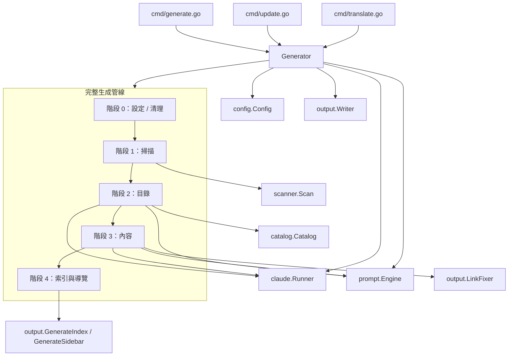
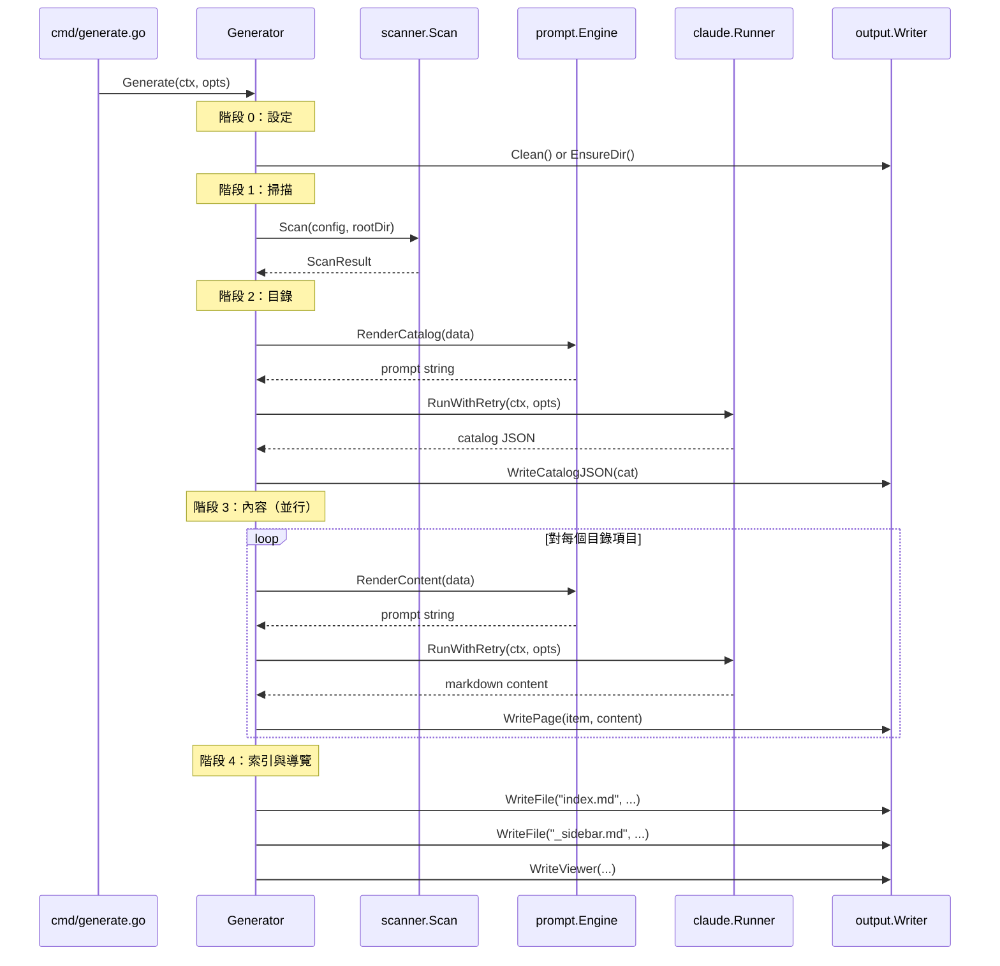
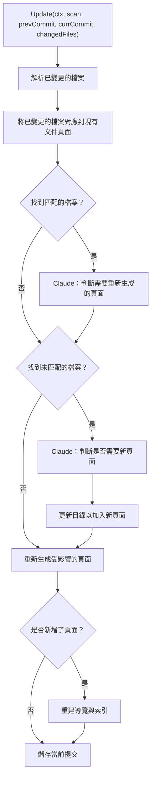
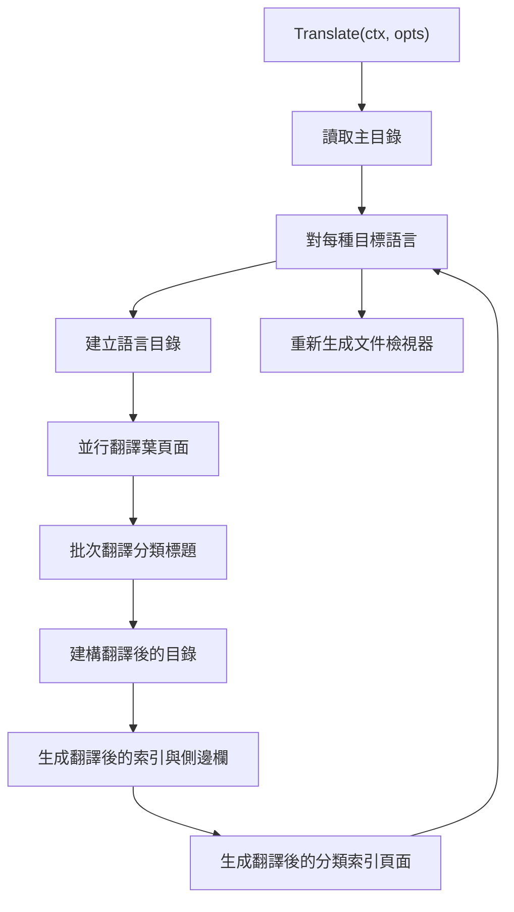

# 生成管線

生成管線是 selfmd 的核心編排系統，協調一個多階段工作流程，透過 Claude AI 將專案原始碼轉換為結構化文件。

## 概述

`internal/generator/pipeline.go` 中的 `Generator` 結構體作為所有文件生成活動的中央編排器。它管理三個獨立的管線：

- **完整生成** (`Generate`) — 一個 4 階段管線，掃描專案、生成文件目錄、並行產生內容頁面，並建構導覽索引。
- **增量更新** (`Update`) — 一個具有 git 感知能力的管線，偵測已變更的原始檔案，將其對應到現有文件頁面，並選擇性地僅重新生成受影響的頁面。
- **翻譯** (`Translate`) — 一個使用並行 Claude API 呼叫，將所有已生成的文件翻譯為一種或多種目標語言的管線。

每個管線依賴一組共享的核心相依元件：`Config` 用於設定、`Runner` 用於 Claude CLI 呼叫、`Engine` 用於提示詞範本渲染，以及 `Writer` 用於檔案輸出。

## 架構



## Generator 結構體

`Generator` 結構體持有所有管線所需的相依元件，並追蹤生成統計資料：

```go
type Generator struct {
	Config  *config.Config
	Runner  *claude.Runner
	Engine  *prompt.Engine
	Writer  *output.Writer
	Logger  *slog.Logger
	RootDir string // target project root directory

	// stats
	TotalCost   float64
	TotalPages  int
	FailedPages int
}
```

> Source: internal/generator/pipeline.go#L19-L31

`NewGenerator` 工廠函式根據組態初始化所有相依元件。`prompt.Engine` 以有效的範本語言建立，`claude.Runner` 接收 Claude 組態，而 `output.Writer` 以輸出目錄初始化（預設為 `.doc-build`）：

```go
func NewGenerator(cfg *config.Config, rootDir string, logger *slog.Logger) (*Generator, error) {
	templateLang := cfg.Output.GetEffectiveTemplateLang()
	engine, err := prompt.NewEngine(templateLang)
	if err != nil {
		return nil, err
	}

	runner := claude.NewRunner(&cfg.Claude, logger)

	absOutDir := cfg.Output.Dir
	if absOutDir == "" {
		absOutDir = ".doc-build"
	}

	writer := output.NewWriter(absOutDir)

	return &Generator{
		Config:  cfg,
		Runner:  runner,
		Engine:  engine,
		Writer:  writer,
		Logger:  logger,
		RootDir: rootDir,
	}, nil
}
```

> Source: internal/generator/pipeline.go#L34-L58

## 完整生成管線

`Generate` 方法執行完整的 4 階段文件生成流程。它由 `selfmd generate` CLI 命令呼叫。



### 階段 0：設定

在生成開始之前，輸出目錄會被清理（如果設定了 `--clean` 旗標或 `clean_before_generate` 組態）或確保其存在：

```go
clean := opts.Clean || g.Config.Output.CleanBeforeGenerate
if clean {
	fmt.Println("[0/4] Cleaning output directory...")
	if !opts.DryRun {
		if err := g.Writer.Clean(); err != nil {
			return err
		}
	}
} else {
	if err := g.Writer.EnsureDir(); err != nil {
		return err
	}
}
```

> Source: internal/generator/pipeline.go#L72-L84

### 階段 1：掃描

專案掃描器遍歷目標專案目錄，遵循組態中的包含/排除模式，並產生包含檔案樹、檔案列表、README 內容和入口點內容的 `ScanResult`：

```go
scan, err := scanner.Scan(g.Config, g.RootDir)
if err != nil {
	return fmt.Errorf("failed to scan project: %w", err)
}
```

> Source: internal/generator/pipeline.go#L88-L91

如果以 `--dry-run` 模式執行，管線會在列印檔案樹後停止。

### 階段 2：目錄生成

目錄階段產生結構化的文件大綱。當輸出目錄未被清理時，管線會先嘗試重用現有的 `_catalog.json` 檔案。如果找不到現有目錄，則呼叫 Claude AI 來生成：

```go
func (g *Generator) GenerateCatalog(ctx context.Context, scan *scanner.ScanResult) (*catalog.Catalog, error) {
	langName := config.GetLangNativeName(g.Config.Output.Language)
	data := prompt.CatalogPromptData{
		RepositoryName:       g.Config.Project.Name,
		ProjectType:          g.Config.Project.Type,
		Language:             g.Config.Output.Language,
		LanguageName:         langName,
		LanguageOverride:     g.Config.Output.NeedsLanguageOverride(),
		LanguageOverrideName: langName,
		KeyFiles:             scan.KeyFiles(),
		EntryPoints:          scan.EntryPointsFormatted(),
		FileTree:             scanner.RenderTree(scan.Tree, 4),
		ReadmeContent:        scan.ReadmeContent,
	}

	rendered, err := g.Engine.RenderCatalog(data)
	if err != nil {
		return nil, err
	}

	result, err := g.Runner.RunWithRetry(ctx, claude.RunOptions{
		Prompt:  rendered,
		WorkDir: g.RootDir,
	})
	// ...
	cat, err := catalog.Parse(jsonStr)
	// ...
	return cat, nil
}
```

> Source: internal/generator/catalog_phase.go#L15-L61

產生的目錄是一個 `CatalogItem` 節點的樹狀結構，每個節點包含標題、路徑別名、順序和可選的子項目。

### 階段 3：內容生成

內容頁面使用基於信號量的並行模式透過 `golang.org/x/sync/errgroup` 並行生成。並行層級可透過組態中的 `max_concurrent` 或 `--concurrency` CLI 旗標設定：

```go
eg, ctx := errgroup.WithContext(ctx)
sem := make(chan struct{}, concurrency)

for _, item := range items {
	item := item
	eg.Go(func() error {
		if skipExisting && g.Writer.PageExists(item) {
			skipped.Add(1)
			return nil
		}

		sem <- struct{}{}
		defer func() { <-sem }()

		err := g.generateSinglePage(ctx, scan, item, catalogTable, linkFixer, "")
		// ...
		return nil
	})
}
```

> Source: internal/generator/content_phase.go#L38-L73

每個頁面由 `generateSinglePage` 生成，它以頁面的目錄路徑、標題、專案檔案樹和完整目錄連結表渲染內容提示詞，然後呼叫 Claude 產生文件 Markdown。結果會經過驗證（必須以 `#` 開頭），通過 `LinkFixer.FixLinks` 修復損壞的內部連結，並寫入磁碟。失敗的頁面會收到佔位符：

```go
func (g *Generator) generateSinglePage(ctx context.Context, scan *scanner.ScanResult, item catalog.FlatItem, catalogTable string, linkFixer *output.LinkFixer, existingContent string) error {
	// ... render prompt ...
	for attempt := 1; attempt <= maxAttempts; attempt++ {
		result, err := g.Runner.RunWithRetry(ctx, claude.RunOptions{
			Prompt:  rendered,
			WorkDir: g.RootDir,
		})
		// ... extract and validate content ...
		content = linkFixer.FixLinks(content, item.DirPath)
		return g.Writer.WritePage(item, content)
	}
	return lastErr
}
```

> Source: internal/generator/content_phase.go#L89-L157

內容生成的關鍵行為：
- **跳過現有頁面** — 未清理時，已生成的頁面會被跳過
- **格式錯誤重試** — 如果 Claude 的輸出未通過驗證，最多嘗試 2 次
- **連結後處理** — `LinkFixer` 透過與目錄比對來解析損壞的相對連結
- **優雅失敗** — 個別頁面的失敗不會中斷整個批次

### 階段 4：索引與導覽

最後階段生成導覽檔案，不需要任何 Claude API 呼叫。它產生三種類型的輸出：

1. **`index.md`** — 列出所有目錄章節的首頁
2. **`_sidebar.md`** — 側邊欄導覽樹
3. **分類索引頁面** — 為有子項目的父項目自動生成的索引頁面

```go
func (g *Generator) GenerateIndex(_ context.Context, cat *catalog.Catalog) error {
	// Generate main index.md
	indexContent := output.GenerateIndex(g.Config.Project.Name, g.Config.Project.Description, cat, lang)
	if err := g.Writer.WriteFile("index.md", indexContent); err != nil {
		return err
	}

	// Generate _sidebar.md
	sidebarContent := output.GenerateSidebar(g.Config.Project.Name, cat, lang)
	if err := g.Writer.WriteFile("_sidebar.md", sidebarContent); err != nil {
		return err
	}

	// Generate category index pages for items with children
	items := cat.Flatten()
	for _, item := range items {
		if !item.HasChildren {
			continue
		}
		// ... find children and generate category index ...
	}
	return nil
}
```

> Source: internal/generator/index_phase.go#L11-L55

導覽完成後，管線還會生成靜態 HTML 檢視器並寫入 `.nojekyll` 檔案以確保 GitHub Pages 相容性。如果專案是一個 git 儲存庫，當前提交雜湊值會儲存到 `_last_commit` 以供未來增量更新使用。

## 增量更新管線

`Update` 方法提供了一種在原始碼變更後高效更新文件的方式。它不會重新生成所有內容，而是使用 git diff 來識別變更內容，並選擇性地僅更新受影響的頁面。



更新管線遵循以下步驟：

1. **解析已變更的檔案** — 從 git diff 中提取已修改檔案的列表
2. **對應到現有文件** — 掃描所有現有文件頁面內容，尋找對已變更檔案路徑的引用
3. **判斷重新生成需求** — 對於已匹配的檔案，Claude 分析頁面內容是否實際受到影響
4. **判斷新頁面需求** — 對於未匹配的檔案，Claude 決定是否需要建立新的文件頁面
5. **重新生成頁面** — 執行與完整管線相同的 `generateSinglePage` 方法，並將現有內容作為上下文傳入
6. **更新導覽** — 如果新增了頁面，重建索引和側邊欄

一個值得注意的功能是**葉節點到父節點的提升**：當在現有葉節點下新增子頁面時，原始葉節點的內容會移至 `overview` 子頁面，而該葉節點變為父節點：

```go
type promotedLeaf struct {
	OriginalPath  string
	OverviewPath  string
	OriginalTitle string
}
```

> Source: internal/generator/updater.go#L360-L367

## 翻譯管線

`Translate` 方法透過將所有已生成的頁面翻譯為目標語言來處理多語言文件。它按語言運作，為每種目標語言建立獨立的輸出目錄。



翻譯管線的關鍵特點：

- **並行頁面翻譯** — 使用與內容生成相同的 `errgroup` + 信號量模式
- **跳過現有翻譯** — 除非指定 `--force`，否則已翻譯的頁面會被跳過
- **批次標題翻譯** — 分類標題在單次 Claude 呼叫中翻譯以提高效率
- **翻譯後的目錄** — 為每種語言產生完整的翻譯目錄副本，實現完整的本地化導覽

```go
func (g *Generator) translatePages(
	ctx context.Context,
	items []catalog.FlatItem,
	langWriter *output.Writer,
	sourceLang, sourceLangName, targetLang, targetLangName string,
	opts TranslateOptions,
) map[string]string {
	// ...
	eg, ctx := errgroup.WithContext(ctx)
	sem := make(chan struct{}, opts.Concurrency)

	for _, item := range leafItems {
		item := item
		eg.Go(func() error {
			if !opts.Force && langWriter.PageExists(item) {
				skipped.Add(1)
				return nil
			}
			// ... translate via Claude ...
			return nil
		})
	}
	// ...
}
```

> Source: internal/generator/translate_phase.go#L139-L275

## 組態選項

`GenerateOptions` 結構體控制管線行為：

```go
type GenerateOptions struct {
	Clean       bool
	DryRun      bool
	Concurrency int // override max_concurrent if > 0
}
```

> Source: internal/generator/pipeline.go#L61-L65

這些選項從 `cmd/generate.go` 中定義的 CLI 旗標設定：

| 旗標 | 說明 |
|------|------|
| `--clean` | 在生成前強制清理輸出目錄 |
| `--no-clean` | 即使組態檔中已設定也不清理 |
| `--dry-run` | 僅顯示專案掃描結果，不呼叫 Claude |
| `--concurrency` | 覆蓋 `max_concurrent` 組態值 |

> Source: cmd/generate.go#L35-L38

## 後處理

內容生成後，會執行兩個後處理步驟：

### 連結修復

`LinkFixer` 元件驗證並修復生成的 Markdown 中損壞的相對連結。它透過多個鍵（點分隔路徑、目錄路徑、最後路徑段、小寫變體）建立所有目錄項目的索引，並使用模糊匹配來解析損壞的目標：

```go
func (lf *LinkFixer) FixLinks(content string, currentDirPath string) string {
	linkRe := regexp.MustCompile(`\[([^\]]+)\]\(([^)]+)\)`)
	return linkRe.ReplaceAllStringFunc(content, func(match string) string {
		// ... extract text and target ...
		fixed := lf.fixSingleLink(target, currentDirPath)
		if fixed != "" && fixed != target {
			return "[" + text + "](" + fixed + ")"
		}
		return match
	})
}
```

> Source: internal/output/linkfixer.go#L52-L82

### 靜態檢視器生成

管線產生完整的靜態 HTML 檢視器（HTML、JavaScript、CSS）以及 `_data.js` 套件。它還會寫入 `.nojekyll` 檔案，以確保 GitHub Pages 不會移除以底線為前綴的檔案。

## 相關連結

- [系統架構](../index.md)
- [模組相依關係](../module-dependencies/index.md)
- [文件生成器](../../core-modules/generator/index.md)
- [目錄階段](../../core-modules/generator/catalog-phase/index.md)
- [內容階段](../../core-modules/generator/content-phase/index.md)
- [索引階段](../../core-modules/generator/index-phase/index.md)
- [翻譯階段](../../core-modules/generator/translate-phase/index.md)
- [增量更新引擎](../../core-modules/incremental-update/index.md)
- [專案掃描器](../../core-modules/scanner/index.md)
- [Claude 執行器](../../core-modules/claude-runner/index.md)
- [提示詞引擎](../../core-modules/prompt-engine/index.md)
- [輸出寫入器](../../core-modules/output-writer/index.md)
- [generate 命令](../../cli/cmd-generate/index.md)
- [update 命令](../../cli/cmd-update/index.md)
- [translate 命令](../../cli/cmd-translate/index.md)

## 參考檔案

| 檔案路徑 | 說明 |
|-----------|------|
| `internal/generator/pipeline.go` | Generator 結構體定義與主要 Generate 管線 |
| `internal/generator/catalog_phase.go` | 透過 Claude AI 生成目錄 |
| `internal/generator/content_phase.go` | 並行內容頁面生成與單頁生成邏輯 |
| `internal/generator/index_phase.go` | 索引、側邊欄與分類索引頁面生成 |
| `internal/generator/translate_phase.go` | 多語言文件的翻譯管線 |
| `internal/generator/updater.go` | 含 git 變更偵測的增量更新管線 |
| `cmd/generate.go` | generate 命令的 CLI 進入點 |
| `cmd/update.go` | update 命令的 CLI 進入點 |
| `internal/scanner/scanner.go` | 專案檔案掃描與樹狀結構建構 |
| `internal/catalog/catalog.go` | 目錄資料結構與解析 |
| `internal/prompt/engine.go` | 提示詞範本引擎與資料型別 |
| `internal/claude/runner.go` | Claude CLI 子程序執行器與重試邏輯 |
| `internal/output/writer.go` | 文件頁面的檔案輸出寫入器 |
| `internal/output/navigation.go` | 導覽檔案生成（索引、側邊欄、分類頁面） |
| `internal/output/linkfixer.go` | 後處理連結驗證與修復 |