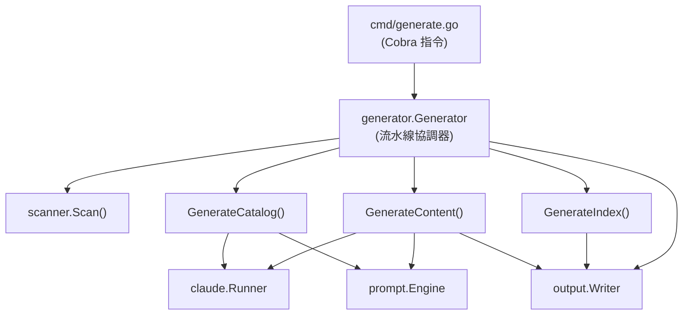
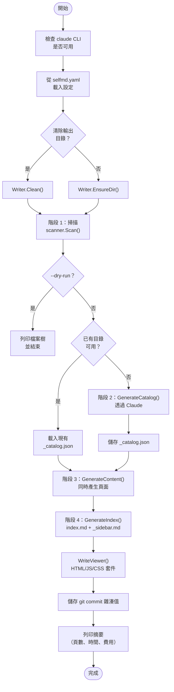

# generate 指令

`generate` 指令是產生完整專案文件的主要進入點。它協調一個四階段流水線，掃描專案結構、透過 Claude 建立文件目錄、同時產生內容頁面，並產生導覽與索引檔案。

## 概述

`generate` 指令從頭到尾執行完整的文件產生流水線。它是 selfmd 中最全面的 CLI 指令，協調多個內部模組，為任何程式碼庫產生一套完整的 Markdown 文件。

主要職責：

- **專案掃描** — 走訪專案目錄，套用設定中的 include/exclude 模式以建立檔案樹
- **目錄產生** — 呼叫 Claude 以決定最佳的文件結構（章節、頁面、層級）
- **內容產生** — 透過 Claude 同時產生個別文件頁面，具備重試與跳過已存在邏輯
- **索引與導覽** — 產生 `index.md`、`_sidebar.md` 以及分類索引頁面以供瀏覽文件
- **靜態檢視器** — 輸出 HTML/JS/CSS 檢視器套件，使文件可在本機瀏覽
- **Git commit 記錄** — 儲存目前的 commit 雜湊值，供未來透過 `update` 指令進行增量更新

## 架構



## 指令語法

```
selfmd generate [flags]
```

### 旗標

| 旗標 | 類型 | 預設值 | 說明 |
|------|------|--------|------|
| `--clean` | `bool` | `false` | 在產生前強制清除輸出目錄 |
| `--no-clean` | `bool` | `false` | 不清除輸出目錄（覆蓋設定） |
| `--dry-run` | `bool` | `false` | 僅顯示掃描結果；不呼叫 Claude |
| `--concurrency` | `int` | `0`（使用設定值） | 覆蓋內容產生的並行數量 |

### 全域旗標（繼承自根指令）

| 旗標 | 縮寫 | 預設值 | 說明 |
|------|------|--------|------|
| `--config` | `-c` | `selfmd.yaml` | 設定檔路徑 |
| `--verbose` | `-v` | `false` | 啟用詳細（debug 等級）輸出 |
| `--quiet` | `-q` | `false` | 僅顯示錯誤 |

```go
var generateCmd = &cobra.Command{
	Use:   "generate",
	Short: "Generate the complete project documentation",
	Long: `Run the four-phase documentation generation flow:
  1. Scan project structure
  2. Generate documentation catalog
  3. Generate content pages (concurrent)
  4. Generate navigation and index`,
	RunE: runGenerate,
}
```

> Source: cmd/generate.go#L23-L32

## 核心流程

`generate` 指令執行一個嚴格的四階段流水線，在此之前有一個可選的清除階段。



### 階段 0：設定

在任何產生開始之前，指令會執行前置檢查與設定：

1. **Claude CLI 檢查** — 透過 `claude.CheckAvailable()` 驗證 `claude` CLI 二進位檔在 `PATH` 中可用
2. **設定載入** — 使用 `config.Load()` 載入 `selfmd.yaml`（或透過 `--config` 指定的自訂路徑）
3. **Logger 設定** — 以適當的等級（`Debug`、`Info` 或 `Error`）設定 `slog`
4. **訊號處理** — 為 `SIGINT` 和 `SIGTERM` 設定 context 取消
5. **輸出目錄** — 清除目錄（`Writer.Clean()`）或確保其存在（`Writer.EnsureDir()`）

```go
func runGenerate(cmd *cobra.Command, args []string) error {
	// Check claude CLI availability
	if err := claude.CheckAvailable(); err != nil {
		return err
	}

	// Load config
	cfg, err := config.Load(cfgFile)
	if err != nil {
		return err
	}

	// Setup logger
	level := slog.LevelInfo
	if verbose {
		level = slog.LevelDebug
	}
	if quiet {
		level = slog.LevelError
	}
	logger := slog.New(slog.NewTextHandler(os.Stderr, &slog.HandlerOptions{Level: level}))

	// Setup context with signal handling
	ctx, cancel := signal.NotifyContext(context.Background(), syscall.SIGINT, syscall.SIGTERM)
	defer cancel()
```

> Source: cmd/generate.go#L42-L66

### 階段 1：專案掃描

掃描器走訪專案目錄樹，套用設定中的 include/exclude glob 模式，並建立包含檔案樹、檔案清單、README 內容與進入點內容的 `ScanResult`。

```go
fmt.Println("[1/4] Scanning project structure...")
scan, err := scanner.Scan(g.Config, g.RootDir)
if err != nil {
	return fmt.Errorf("failed to scan project: %w", err)
}
fmt.Printf("      Found %d files in %d directories\n", scan.TotalFiles, scan.TotalDirs)
```

> Source: internal/generator/pipeline.go#L87-L93

當指定 `--dry-run` 時，指令會列印檔案樹並結束，不會進行任何 Claude API 呼叫：

```go
if opts.DryRun {
	fmt.Println("\n[Dry Run] File tree:")
	fmt.Println(scanner.RenderTree(scan.Tree, 3))
	fmt.Println("[Dry Run] No Claude calls will be made.")
	return nil
}
```

> Source: internal/generator/pipeline.go#L94-L99

### 階段 2：目錄產生

如果輸出目錄未被清除且存在有效的 `_catalog.json`，則會重複使用現有目錄。否則，`GenerateCatalog()` 方法會渲染目錄提示並呼叫 Claude 產生定義文件層級結構的 JSON 目錄。

```go
var cat *catalog.Catalog
if !clean {
	// Try to reuse existing catalog
	catJSON, readErr := g.Writer.ReadCatalogJSON()
	if readErr == nil {
		cat, err = catalog.Parse(catJSON)
	}
	if cat != nil {
		items := cat.Flatten()
		fmt.Printf("[2/4] Loaded existing catalog (%d sections, %d items)\n", len(cat.Items), len(items))
	}
}
if cat == nil {
	fmt.Println("[2/4] Generating catalog...")
	cat, err = g.GenerateCatalog(ctx, scan)
	if err != nil {
		return fmt.Errorf("failed to generate catalog: %w", err)
	}
}
```

> Source: internal/generator/pipeline.go#L101-L127

### 階段 3：內容產生

內容頁面使用 `errgroup` 和信號量 channel 限制並行數量來同時產生。每個頁面由 `generateSinglePage()` 呼叫產生，該方法渲染內容提示、呼叫 Claude、擷取 `<document>` 內容、修正連結並寫入結果。

主要行為：
- **跳過已存在** — 非 `--clean` 模式時，磁碟上已存在的頁面會被跳過
- **格式錯誤重試** — 若 Claude 回傳無效的 Markdown，每個頁面最多嘗試 2 次
- **失敗時使用佔位符** — 失敗的頁面會取得佔位符檔案，以便日後重新產生
- **連結修正** — 透過 `LinkFixer.FixLinks()` 進行後處理以修正相對連結

```go
concurrency := g.Config.Claude.MaxConcurrent
if opts.Concurrency > 0 {
	concurrency = opts.Concurrency
}
fmt.Printf("[3/4] Generating content pages (concurrency: %d)...\n", concurrency)
if err := g.GenerateContent(ctx, scan, cat, concurrency, !clean); err != nil {
	g.Logger.Warn("some pages failed to generate", "error", err)
}
```

> Source: internal/generator/pipeline.go#L130-L137

### 階段 4：索引與導覽

最後階段產生導覽產物，無需 Claude 參與：

- **`index.md`** — 包含完整目錄連結到所有文件頁面的首頁
- **`_sidebar.md`** — 側邊欄導覽檔案
- **分類索引頁面** — 為父章節自動產生的索引頁面，列出其子項目

```go
fmt.Println("[4/4] Generating navigation and index...")
if err := g.GenerateIndex(ctx, cat); err != nil {
	return fmt.Errorf("failed to generate index: %w", err)
}
```

> Source: internal/generator/pipeline.go#L140-L143

導覽產生完成後，流水線還會：
1. 透過 `Writer.WriteViewer()` 產生靜態 HTML/JS/CSS 檢視器
2. 寫入 `.nojekyll` 檔案以相容 GitHub Pages
3. 儲存目前的 git commit 雜湊值以供增量更新使用

## 清除行為

清除/不清除的決定遵循以下優先順序：

1. `--clean` 旗標 → 強制清除
2. `--no-clean` 旗標 → 強制不清除
3. `output.clean_before_generate` 設定值 → 預設行為

```go
clean := cfg.Output.CleanBeforeGenerate
if cleanFlag {
	clean = true
}
if noCleanFlag {
	clean = false
}
```

> Source: cmd/generate.go#L81-L87

當 clean 為 `false` 時，流水線會重複使用現有目錄並跳過已成功產生的頁面。這使得產生過程可以恢復——如果執行被中斷，重新執行 `selfmd generate` 會從上次中斷的地方繼續。

## GenerateOptions

`GenerateOptions` 結構體設定每次產生執行：

```go
type GenerateOptions struct {
	Clean       bool
	DryRun      bool
	Concurrency int // override max_concurrent if > 0
}
```

> Source: internal/generator/pipeline.go#L61-L65

## Generator 初始化

`Generator` 結構體以所有必要的依賴項進行初始化：

```go
type Generator struct {
	Config  *config.Config
	Runner  *claude.Runner
	Engine  *prompt.Engine
	Writer  *output.Writer
	Logger  *slog.Logger
	RootDir string // target project root directory

	// stats
	TotalCost   float64
	TotalPages  int
	FailedPages int
}
```

> Source: internal/generator/pipeline.go#L19-L31

`NewGenerator()` 建構函式設定提示引擎（選擇模板語言）、Claude runner 和輸出 writer：

```go
func NewGenerator(cfg *config.Config, rootDir string, logger *slog.Logger) (*Generator, error) {
	templateLang := cfg.Output.GetEffectiveTemplateLang()
	engine, err := prompt.NewEngine(templateLang)
	if err != nil {
		return nil, err
	}

	runner := claude.NewRunner(&cfg.Claude, logger)

	absOutDir := cfg.Output.Dir
	if absOutDir == "" {
		absOutDir = ".doc-build"
	}

	writer := output.NewWriter(absOutDir)

	return &Generator{
		Config:  cfg,
		Runner:  runner,
		Engine:  engine,
		Writer:  writer,
		Logger:  logger,
		RootDir: rootDir,
	}, nil
}
```

> Source: internal/generator/pipeline.go#L34-L58

## 使用範例

### 基本完整產生

```bash
selfmd generate
```

### 清除產生（全新開始）

```bash
selfmd generate --clean
```

### 預覽而不呼叫 Claude

```bash
selfmd generate --dry-run
```

### 自訂並行數量與詳細日誌

```bash
selfmd generate --concurrency 5 -v
```

### 使用自訂設定檔

```bash
selfmd generate -c my-config.yaml
```

## 輸出摘要

完成後，指令會列印摘要，包括：

```go
fmt.Println("========================================")
fmt.Println("Documentation generation complete!")
fmt.Printf("  Output dir: %s\n", g.Config.Output.Dir)
fmt.Printf("  Pages: %d succeeded", g.TotalPages)
if g.FailedPages > 0 {
	fmt.Printf(", %d failed", g.FailedPages)
}
fmt.Println()
fmt.Printf("  Total time: %s\n", elapsed.Round(time.Second))
fmt.Printf("  Total cost: $%.4f USD\n", g.TotalCost)
fmt.Println("========================================")
```

> Source: internal/generator/pipeline.go#L172-L183

這包括成功與失敗的頁面數量、總耗時，以及以美元計算的 Claude API 總費用。

## 相關連結

- [CLI 指令](../index.md)
- [init 指令](../cmd-init/index.md)
- [update 指令](../cmd-update/index.md)
- [translate 指令](../cmd-translate/index.md)
- [設定概述](../../configuration/config-overview/index.md)
- [產生流水線](../../architecture/pipeline/index.md)
- [文件產生器](../../core-modules/generator/index.md)
- [目錄階段](../../core-modules/generator/catalog-phase/index.md)
- [內容階段](../../core-modules/generator/content-phase/index.md)
- [索引階段](../../core-modules/generator/index-phase/index.md)
- [專案掃描器](../../core-modules/scanner/index.md)
- [Claude Runner](../../core-modules/claude-runner/index.md)
- [輸出 Writer](../../core-modules/output-writer/index.md)

## 參考檔案

| 檔案路徑 | 說明 |
|----------|------|
| `cmd/generate.go` | Cobra 指令定義、旗標註冊與 `runGenerate` 進入點 |
| `cmd/root.go` | 根指令與全域持久旗標（`--config`、`--verbose`、`--quiet`） |
| `internal/generator/pipeline.go` | `Generator` 結構體、`NewGenerator()` 與 `Generate()` 流水線協調器 |
| `internal/generator/catalog_phase.go` | `GenerateCatalog()` — 基於 Claude 的目錄產生 |
| `internal/generator/content_phase.go` | `GenerateContent()` 與 `generateSinglePage()` — 同時頁面產生 |
| `internal/generator/index_phase.go` | `GenerateIndex()` — 索引、側邊欄與分類頁面產生 |
| `internal/generator/translate_phase.go` | `Translate()` — 翻譯流水線（提供檢視器重新產生的上下文） |
| `internal/generator/updater.go` | `Update()` — 增量更新流程（提供 commit 記錄的上下文） |
| `internal/config/config.go` | `Config` 結構體、`Load()`、預設值與驗證 |
| `internal/scanner/scanner.go` | `Scan()` 函式與 `ScanResult` 結構體 |
| `internal/claude/runner.go` | `Runner.Run()`、`RunWithRetry()` 與 `CheckAvailable()` |
| `internal/claude/types.go` | `RunOptions`、`RunResult` 與 `CLIResponse` 類型定義 |
| `internal/output/writer.go` | `Writer` 結構體，負責檔案輸出、頁面存在檢查與目錄 I/O |
| `internal/output/navigation.go` | `GenerateIndex()`、`GenerateSidebar()` 與 `GenerateCategoryIndex()` |
| `selfmd.yaml` | 專案設定檔範例 |