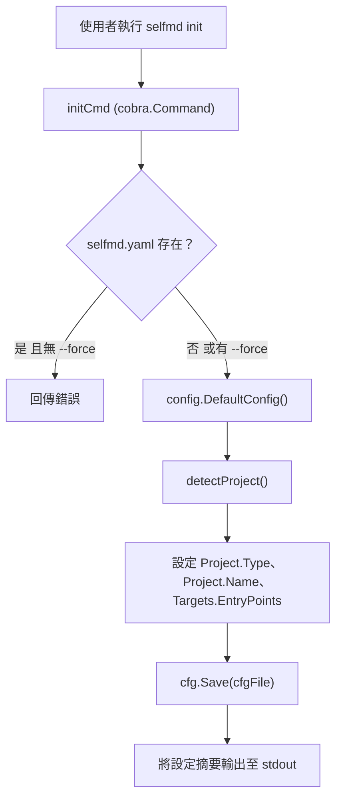
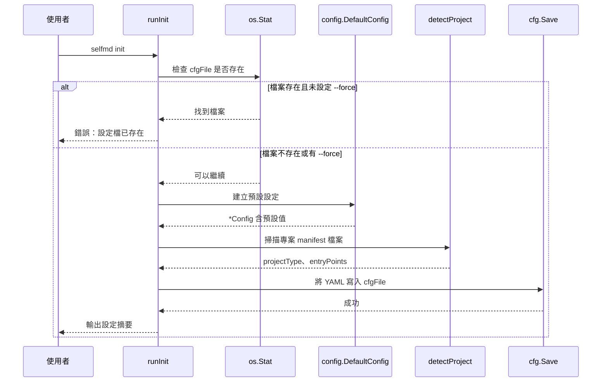

# init 指令

`init` 指令透過自動偵測專案類型並在當前目錄產生 `selfmd.yaml` 設定檔，來初始化一個新的 selfmd 專案。

## 概述

`selfmd init` 是使用者在為新程式碼庫設定 selfmd 時執行的第一個指令。它會執行自動專案偵測——檢查常見的 manifest 檔案（例如 `go.mod`、`package.json`、`Cargo.toml`）來推斷專案類型和可能的進入點——然後寫入一個預先填充的 `selfmd.yaml` 設定檔，作為後續所有文件產生的基礎。

主要職責：

- **專案類型偵測** — 根據語言特定 manifest 檔案的存在，將專案識別為 `backend`、`frontend`、`fullstack` 或 `library`。
- **進入點探索** — 定位磁碟上存在的常見進入點檔案（例如 `main.go`、`src/index.ts`）。
- **預設設定產生** — 產生完整的 `selfmd.yaml`，為 targets、output、Claude 設定和 Git 整合提供合理的預設值。
- **安全防護** — 除非提供 `--force` 旗標，否則拒絕覆寫現有的設定檔。

## 架構



## 指令語法

```
selfmd init [flags]
```

### 旗標

| 旗標 | 類型 | 預設值 | 說明 |
|------|------|--------|------|
| `--force` | `bool` | `false` | 強制覆寫現有的設定檔 |
| `-c, --config` | `string` | `selfmd.yaml` | 設定檔路徑（繼承自根指令） |

`--config` 旗標是定義在根指令上的持久性旗標，用於控制產生的設定檔輸出路徑。

```go
var forceInit bool

var initCmd = &cobra.Command{
	Use:   "init",
	Short: "Initialize selfmd.yaml config file",
	Long:  "Scans the current directory, automatically detects the project type, and generates a selfmd.yaml config file.",
	RunE:  runInit,
}

func init() {
	initCmd.Flags().BoolVar(&forceInit, "force", false, "Force overwrite of existing config file")
	rootCmd.AddCommand(initCmd)
}
```

> Source: cmd/init.go#L13-L25

## 核心流程

### 初始化流程



### 專案偵測邏輯

`detectProject` 函式以固定優先順序檢查語言特定的 manifest 檔案。第一個匹配的結果即為最終結果。

```go
func detectProject() (projectType string, entryPoints []string) {
	checks := []struct {
		file    string
		pType   string
		entries []string
	}{
		{"go.mod", "backend", []string{"main.go", "cmd/root.go"}},
		{"Cargo.toml", "backend", []string{"src/main.rs", "src/lib.rs"}},
		{"package.json", "frontend", []string{"src/index.ts", "src/index.js", "src/main.ts", "src/App.tsx"}},
		{"pom.xml", "backend", []string{"src/main/java"}},
		{"build.gradle", "backend", []string{"src/main/java"}},
		{"requirements.txt", "backend", []string{"main.py", "app.py", "src/main.py"}},
		{"pyproject.toml", "backend", []string{"src/main.py", "main.py"}},
		{"composer.json", "backend", []string{"public/index.php", "src/Kernel.php"}},
		{"Gemfile", "backend", []string{"config/application.rb", "app/"}},
	}

	for _, c := range checks {
		if _, err := os.Stat(c.file); err == nil {
			var found []string
			for _, ep := range c.entries {
				if _, err := os.Stat(ep); err == nil {
					found = append(found, ep)
				}
			}
			if c.pType == "frontend" {
				if _, err := os.Stat("go.mod"); err == nil {
					return "fullstack", found
				}
				if _, err := os.Stat("server"); err == nil {
					return "fullstack", found
				}
			}
			return c.pType, found
		}
	}

	return "library", nil
}
```

> Source: cmd/init.go#L60-L99

偵測表涵蓋以下生態系統：

| Manifest 檔案 | 偵測類型 | 候選進入點 |
|---------------|----------|-----------|
| `go.mod` | `backend` | `main.go`、`cmd/root.go` |
| `Cargo.toml` | `backend` | `src/main.rs`、`src/lib.rs` |
| `package.json` | `frontend` | `src/index.ts`、`src/index.js`、`src/main.ts`、`src/App.tsx` |
| `pom.xml` | `backend` | `src/main/java` |
| `build.gradle` | `backend` | `src/main/java` |
| `requirements.txt` | `backend` | `main.py`、`app.py`、`src/main.py` |
| `pyproject.toml` | `backend` | `src/main.py`、`main.py` |
| `composer.json` | `backend` | `public/index.php`、`src/Kernel.php` |
| `Gemfile` | `backend` | `config/application.rb`、`app/` |

**全端偵測：** 當找到 `package.json`（表示為前端專案）時，函式會執行二次檢查。如果同時存在 `go.mod` 或 `server` 目錄，專案類型會被升級為 `fullstack`。

**後備機制：** 如果沒有任何 manifest 檔案匹配，專案類型預設為 `library`，且不設定任何進入點。

### 預設設定值

當找不到現有設定時，`config.DefaultConfig()` 提供以下預設值：

```go
func DefaultConfig() *Config {
	return &Config{
		Project: ProjectConfig{
			Name: filepath.Base(mustGetwd()),
			Type: "backend",
		},
		Targets: TargetsConfig{
			Include: []string{"src/**", "pkg/**", "cmd/**", "internal/**", "lib/**", "app/**"},
			Exclude: []string{
				"vendor/**", "node_modules/**", ".git/**", ".doc-build/**",
				"**/*.pb.go", "**/generated/**", "dist/**", "build/**",
			},
			EntryPoints: []string{},
		},
		Output: OutputConfig{
			Dir:                 ".doc-build",
			Language:            "zh-TW",
			SecondaryLanguages:  []string{},
			CleanBeforeGenerate: false,
		},
		Claude: ClaudeConfig{
			Model:          "sonnet",
			MaxConcurrent:  3,
			TimeoutSeconds: 1800,
			MaxRetries:     2,
			AllowedTools:   []string{"Read", "Glob", "Grep"},
			ExtraArgs:      []string{},
		},
		Git: GitConfig{
			Enabled:    true,
			BaseBranch: "main",
		},
	}
}
```

> Source: internal/config/config.go#L96-L129

建立預設設定後，`runInit` 會根據偵測結果覆寫三個欄位：

- `Project.Type` — 來自 `detectProject()`
- `Project.Name` — 透過 `filepath.Base(mustCwd())` 設定為當前目錄的基本名稱
- `Targets.EntryPoints` — 僅包含實際存在於磁碟上的候選進入點

## 使用範例

**在 Go 專案中進行基本初始化：**

```bash
$ cd my-go-project
$ selfmd init
Config file created: selfmd.yaml
  Project name: my-go-project
  Project type: backend
  Output dir: .doc-build
  Doc language: zh-TW
  Entry points: main.go, cmd/root.go

Please edit the config file as needed, then run selfmd generate to generate documentation.
```

**強制覆寫現有設定：**

```bash
$ selfmd init --force
Config file created: selfmd.yaml
  ...
```

**使用自訂設定路徑：**

```bash
$ selfmd init --config my-docs.yaml
Config file created: my-docs.yaml
  ...
```

輸出摘要由以下程式碼產生：

```go
fmt.Printf("Config file created: %s\n", cfgFile)
fmt.Printf("  Project name: %s\n", cfg.Project.Name)
fmt.Printf("  Project type: %s\n", cfg.Project.Type)
fmt.Printf("  Output dir: %s\n", cfg.Output.Dir)
fmt.Printf("  Doc language: %s\n", cfg.Output.Language)
if len(cfg.Output.SecondaryLanguages) > 0 {
    fmt.Printf("  Secondary languages: %s\n", strings.Join(cfg.Output.SecondaryLanguages, ", "))
}

if len(cfg.Targets.EntryPoints) > 0 {
    fmt.Printf("  Entry points: %s\n", strings.Join(cfg.Targets.EntryPoints, ", "))
}

fmt.Println("\nPlease edit the config file as needed, then run selfmd generate to generate documentation.")
```

> Source: cmd/init.go#L43-L57

## 相關連結

- [CLI 指令](../index.md)
- [generate 指令](../cmd-generate/index.md)
- [設定概述](../../configuration/config-overview/index.md)
- [專案目標](../../configuration/project-targets/index.md)
- [初始化（快速入門）](../../getting-started/init/index.md)

## 參考檔案

| 檔案路徑 | 說明 |
|----------|------|
| `cmd/init.go` | init 指令實作、專案偵測邏輯 |
| `cmd/root.go` | 根指令定義、持久性旗標（`--config`、`--verbose`、`--quiet`） |
| `internal/config/config.go` | Config 結構定義、`DefaultConfig()`、`Save()` 及驗證 |
| `cmd/generate.go` | generate 指令（為下游工作流程提供上下文參考） |
| `selfmd.yaml` | 產生的設定檔實際範例 |